# AUTOSAR Mock COM Stack & ISO 15765-2 CanTP - Toàn bộ Mã nguồn Dự án (ALL CODE)

> **Ngày tạo:** 2026-10-07 02:54:38
> **Dự án:** Embedded Automotive AUTOSAR Communication Stack & ISO 15765-2 Transport Protocol
> **Nền tảng:** NXP S32K144 EVB-Q100 (ARM Cortex-M4F) | IDE: S32 Design Studio v3.4 (GCC 9.2)
> **Mạng truyền thông:** CAN Classic 500 kbps (SOSC 8 MHz crystal) | Transceiver: UJA1169 (12V)
> **Tiêu chuẩn tuân thủ:** AUTOSAR Classic BSW Architecture, ISO 15765-2 CanTP, MISRA C Guidelines
> **Trạng thái kiểm thử:** 25/25 Unit Tests Đạt 100% (14 CanTp ISO Tests + 11 COM & App Tests)

---

## 📑 Mục lục Toàn bộ Tập tin (Table of Contents)

### 1. Tài liệu Kiến trúc & Hướng dẫn Hệ thống

- [README.md](#readmemd) *(200 dòng | 9.2 KB)*: Tài liệu tổng quan hệ thống, hướng dẫn đấu nối phần cứng 2x EVB S32K144, phân vai Master/Slave và các bước vận hành
- [architecture.md](#architecturemd) *(338 dòng | 19.7 KB)*: Đặc tả kiến trúc phân tầng AUTOSAR COM Stack, sơ đồ luồng dữ liệu, sequence diagram và phân bổ Mailbox FlexCAN
- [deliverables_part1.md](#deliverablespart1md) *(610 dòng | 20.2 KB)*: Báo cáo nghiệm thu Part 1: COM Signal, Deadline Monitoring và chuyển đổi trạng thái
- [part1_architecture_notes.md](#part1architecturenotesmd) *(880 dòng | 15.9 KB)*: Ghi chú kỹ thuật chi tiết về thiết kế tín hiệu CAN, byte ordering (Little/Big Endian) và unpacking/packing logic

### 2. Kiểu Dữ liệu Chuẩn & Nền tảng (Platform & Types)

- [include/Std_Types.h](#includestdtypesh) *(33 dòng | 0.5 KB)*: Định nghĩa các kiểu dữ liệu cơ bản theo chuẩn AUTOSAR (Std_ReturnType, E_OK, E_NOT_OK, boolean, uint8, uint16, uint32)
- [include/ComStack_Types.h](#includecomstacktypesh) *(27 dòng | 0.6 KB)*: Định nghĩa các kiểu dữ liệu chuẩn AUTOSAR COM Stack (PduIdType, PduLengthType, PduInfoType, BufReq_ReturnType)
- [include/Platform_Init.h](#includeplatforminith) *(26 dòng | 0.7 KB)*: Khai báo các API khởi tạo vi điều khiển S32K144 (Clocks SPLL 80MHz, GPIO RGB LED, Potentiometer ADC0, LPUART1)
- [src/Platform_Init.c](#srcplatforminitc) *(243 dòng | 8.9 KB)*: Triển khai cấu hình phần cứng MCU S32K144: thiết lập xung nhịp SOSC 8MHz/SPLL, chân GPIO, LPIT Timer và LPUART1 OpenSDA

### 3. Tầng Ứng dụng & Quản lý Phân vai (Application Layer)

- [include/app/App.h](#includeappapph) *(70 dòng | 2.5 KB)*: Interface ứng dụng: chu kỳ Task 10ms/100ms/500ms, điều khiển LED, máy phát/nhận ASCII Art và callbacks CanTp/Com
- [src/app/App.c](#srcappappc) *(915 dòng | 35.2 KB)*: Triển khai logic nghiệp vụ Multi-ECU (Master: KeepAlive TX, UART->CanTp TX; Slave 1: CanTp RX->UART, LED sync, Status TX; Slave 2: Status TX)
- [include/app/Role.h](#includeapproleh) *(51 dòng | 1.9 KB)*: Định nghĩa các vai trò ECU (Role 1: Master, Role 2: Slave 1, Role 0: Slave 2) và API nhận diện cấu hình
- [src/app/Role.c](#srcapprolec) *(84 dòng | 3.0 KB)*: Logic xác định vai trò động dựa vào nút bấm phần cứng SW2/SW3 hoặc phím bấm chọn qua UART terminal khi khởi động
- [include/app/Profiling.h](#includeappprofilingh) *(142 dòng | 6.3 KB)*: Interface đo kiểm thời gian thực thi (Execution Time) và chu kỳ CPU cho từng Task
- [src/app/Profiling.c](#srcappprofilingc) *(62 dòng | 2.1 KB)*: Triển khai thu thập dữ liệu profiling chu kỳ chạy của các task định kỳ
- [include/app/UartRxQueue.h](#includeappuartrxqueueh) *(63 dòng | 2.4 KB)*: Interface hàng đợi vòng Ring Buffer 2KB cho UART nhận dữ liệu ảnh ASCII liên tục
- [src/app/UartRxQueue.c](#srcappuartrxqueuec) *(240 dòng | 7.6 KB)*: Triển khai Ring Buffer UART không ngắt quãng, tự động nhận diện header và footer ảnh

### 4. Tầng Truyền thông Tín hiệu AUTOSAR (COM Layer)

- [include/com/Com.h](#includecomcomh) *(21 dòng | 0.7 KB)*: Interface AUTOSAR COM: Com_Init, Com_SendSignal, Com_ReceiveSignal, Com_MainFunction_Tx, Com_MainFunction_Rx
- [include/com/Com_Cfg.h](#includecomcomcfgh) *(60 dòng | 1.3 KB)*: Cấu hình tín hiệu và I-PDU: KeepAliveRateLevel, AliveCounter, MasterHeartbeat, SlaveHealthStatus, deadline 2000ms
- [config/com/Com_Cfg.h](#configcomcomcfgh) *(60 dòng | 1.3 KB)*: File cấu hình biến thể / header cấu hình cho tầng Com
- [src/com/Com.c](#srccomcomc) *(406 dòng | 16.2 KB)*: Triển khai Signal Packing/Unpacking (Little-Endian & Big-Endian), Deadline Monitoring, cập nhật Alive Counter
- [src/com/Com_Cfg.c](#srccomcomcfgc) *(54 dòng | 3.8 KB)*: Bảng ánh xạ tín hiệu Com_SignalConfig và cấu hình các I-PDU

### 5. Tầng Điều hướng Gói tin (PDU Router - PduR)

- [include/pdur/PduR.h](#includepdurpdurh) *(19 dòng | 0.9 KB)*: Interface điều hướng gói tin giữa COM, CanTp và CanIf (PduR_Transmit, RxIndication, TxConfirmation)
- [include/pdur/PduR_Cfg.h](#includepdurpdurcfgh) *(24 dòng | 0.5 KB)*: Định nghĩa các PDU ID định tuyến đa tầng cho PduR
- [config/pdur/PduR_Cfg.h](#configpdurpdurcfgh) *(24 dòng | 0.4 KB)*: File cấu hình định tuyến biến thể cho PduR
- [src/pdur/PduR.c](#srcpdurpdurc) *(67 dòng | 2.5 KB)*: Triển khai chuyển tiếp gói tin zero-copy giữa các tầng trên và tầng dưới
- [src/pdur/PduR_Cfg.c](#srcpdurpdurcfgc) *(31 dòng | 1.8 KB)*: Bảng cấu hình định tuyến tĩnh của PDU Router

### 6. Tầng Giao thức Vận chuyển ISO 15765-2 (CanTP Layer)

- [include/cantp/CanTp.h](#includecantpcantph) *(84 dòng | 2.6 KB)*: Interface giao thức vận chuyển ISO 15765-2: Single Frame (SF), First Frame (FF), Consecutive Frame (CF), Flow Control (FC)
- [include/cantp/CanTp_Cfg.h](#includecantpcantpcfgh) *(82 dòng | 3.8 KB)*: Cấu hình thông số CanTp: N_As, N_Bs, N_Cr timeouts, Block Size = 8, STmin = 5ms, Max N-SDU length
- [src/cantp/CanTp.c](#srccantpcantpc) *(680 dòng | 29.9 KB)*: Triển khai hoàn chỉnh State Machine CanTP (Tx FSM, Rx FSM), Sequence Number wrap-around, STmin pacing, retry và FC(OVFLW)

### 7. Tầng Giao diện CAN (CAN Interface - CanIf)

- [include/canif/CanIf.h](#includecanifcanifh) *(16 dòng | 0.5 KB)*: Interface tầng CanIf kết nối CanDrv với PduR và CanTp (CanIf_Transmit, CanIf_RxIndication, CanIf_TxConfirmation)
- [include/canif/CanIf_Cfg.h](#includecanifcanifcfgh) *(29 dòng | 0.7 KB)*: Cấu hình ánh xạ CAN ID vật lý (0x100, 0x201, 0x202, 0x301, 0x302) sang PduId logic
- [config/canif/CanIf_Cfg.h](#configcanifcanifcfgh) *(29 dòng | 0.6 KB)*: File cấu hình dự phòng / biến thể của tầng CanIf
- [src/canif/CanIf.c](#srccanifcanifc) *(83 dòng | 2.6 KB)*: Triển khai phân luồng bản tin CAN dựa trên CAN ID: KeepAlive/Status -> COM, Image Stream -> CanTp
- [src/canif/CanIf_Cfg.c](#srccanifcanifcfgc) *(35 dòng | 1.8 KB)*: Bảng định tuyến ánh xạ CAN ID và PDU ID cho CanIf

### 8. Tầng Điều khiển Phần cứng FlexCAN (CAN Driver - CanDrv)

- [include/candrv/Can.h](#includecandrvcanh) *(34 dòng | 0.6 KB)*: Interface chuẩn AUTOSAR CAN Driver: Can_Init, Can_Write, Can_MainFunction_Write, Can_MainFunction_Read
- [include/candrv/Can_Cfg.h](#includecandrvcancfgh) *(66 dòng | 2.0 KB)*: Cấu hình FlexCAN Mailboxes (MB0 TX, MB1-MB8 RX FIFO 8 mailboxes, timing 500kbps, SOSC 8MHz)
- [config/candrv/Can_Cfg.h](#configcandrvcancfgh) *(38 dòng | 0.8 KB)*: File cấu hình biến thể phần cứng FlexCAN
- [src/candrv/Can.c](#srccandrvcanc) *(250 dòng | 10.1 KB)*: Triển khai trực tiếp điều khiển thanh ghi FlexCAN0 MCU S32K144, quản lý 8-mailbox RX FIFO chống tràn
- [src/candrv/Can_Cfg.c](#srccandrvcancfgc) *(32 dòng | 1.4 KB)*: Bảng cấu hình phần cứng FlexCAN0 Can_Config

### 9. Điểm vào Hệ thống, Ghi vết & Demo Độc lập (Main & Trace)

- [src/main.c](#srcmainc) *(179 dòng | 6.0 KB)*: Điểm vào hệ thống (main): khởi tạo phần cứng, BSW stack, và vòng lặp Super-Loop gọi task định kỳ theo SysTick
- [include/trace/Trace.h](#includetracetraceh) *(20 dòng | 0.4 KB)*: Interface ghi log UART không chặn thời gian thực (TRACE macro, Trace_Init, Trace_Flush)
- [src/trace/Trace.c](#srctracetracec) *(191 dòng | 5.9 KB)*: Triển khai Ring Buffer log UART tốc độ 115200 baud, format [MODULE] không gây trễ ngắt CAN
- [demo_cantp_stream.c](#democantpstreamc) *(325 dòng | 11.1 KB)*: Chương trình demo độc lập kiểm thử luồng truyền nhận CanTp ASCII stream

### 10. Bộ Kiểm thử Tự động Chấp nhận Chuẩn (Unit & Acceptance Tests)

- [tests/unit/test_all_host_runner.c](#testsunittestallhostrunnerc) *(71 dòng | 1.9 KB)*: Host test runner chạy toàn bộ 25 unit tests (14 CanTp + 11 Com & App) trên máy tính x86 GCC
- [tests/unit/test_cantp_host_runner.c](#testsunittestcantphostrunnerc) *(82 dòng | 2.2 KB)*: Host test runner chuyên biệt kiểm thử 14 bài CanTp ISO 15765-2
- [tests/unit/Test_CanTp.c](#testsunittestcantpc) *(579 dòng | 22.2 KB)*: Bộ 14 bài test CanTp chấp nhận chuẩn ISO (Single Frame, Multi-Frame, STmin, Retries, Timeouts, Aborts, Overflow)
- [tests/unit/Test_Com.c](#testsunittestcomc) *(381 dòng | 11.5 KB)*: Bộ 11 bài test AUTOSAR COM (Packing/Unpacking, Deadline Monitoring, Alive Counter, Config Validation)
- [tests/integration/Test_Integration.c](#testsintegrationtestintegrationc) *(6 dòng | 0.2 KB)*: Khung kiểm thử tích hợp phần cứng thực tế giữa 2 bo mạch EVB S32K144

### 11. Công cụ PC Truyền Nhận & Stream Ảnh (Python Host Tools)

- [image_sender.py](#imagesenderpy) *(133 dòng | 4.1 KB)*: Công cụ PC gửi file ảnh ASCII qua cổng COM Master ECU với tốc độ cao, hỗ trợ chia gói và thanh tiến trình
- [image_receiver.py](#imagereceiverpy) *(98 dòng | 3.4 KB)*: Công cụ PC nhận và hiển thị ảnh ASCII thời gian thực từ Slave ECU qua cổng UART OpenSDA
- [demo_stream.py](#demostreampy) *(54 dòng | 1.8 KB)*: Script PC benchmark tốc độ truyền luồng ký tự liên tục qua CanTp

### 12. Khởi động Vi điều khiển & Linker Scripts (Startup & Target Config)

- [Project_Settings/Linker_Files/S32K144_64_flash.ld](#projectsettingslinkerfiless32k14464flashld) *(279 dòng | 8.3 KB)*: Linker script bộ nhớ Flash (512KB Flash, 64KB SRAM, phân bổ m_interrupts, m_text, m_data, m_bss, Stack & Heap)
- [Project_Settings/Linker_Files/S32K144_64_ram.ld](#projectsettingslinkerfiless32k14464ramld) *(251 dòng | 7.0 KB)*: Linker script nạp chạy trên SRAM để debug nhanh
- [Project_Settings/Startup_Code/startup.c](#projectsettingsstartupcodestartupc) *(248 dòng | 8.3 KB)*: Quy trình khởi tạo C runtime (sao chép .data từ Flash sang RAM, xóa .bss)
- [Project_Settings/Startup_Code/startup_S32K144.S](#projectsettingsstartupcodestartups32k144s) *(531 dòng | 31.0 KB)*: Bảng Vector ngắt ARM Cortex-M4 trong Assembly (Reset_Handler, SysTick, FlexCAN Interrupts)
- [Project_Settings/Startup_Code/system_S32K144.c](#projectsettingsstartupcodesystems32k144c) *(197 dòng | 7.5 KB)*: Cấu hình hệ thống CMSIS, vô hiệu hóa Watchdog phần cứng và thiết lập xung nhịp cơ sở
- [include/startup.h](#includestartuph) *(135 dòng | 6.3 KB)*: Khai báo nguyên mẫu hàm khởi tạo startup hệ thống
- [include/system_S32K144.h](#includesystems32k144h) *(111 dòng | 3.3 KB)*: Header CMSIS hệ thống vi điều khiển NXP S32K144
- [include/device_registers.h](#includedeviceregistersh) *(104 dòng | 3.2 KB)*: Header định tuyến các thanh ghi ngoại vi theo kiến trúc S32K
- [include/devassert.h](#includedevasserth) *(84 dòng | 3.9 KB)*: Macro DEV_ASSERT kiểm tra điều kiện bất biến (assertion) trong mã nguồn
- [include/s32_core_cm4.h](#includes32corecm4h) *(209 dòng | 7.0 KB)*: Các định nghĩa lệnh ASM nội tuyến và thanh ghi lõi Cortex-M4 (NVIC, PRIMASK)

### 13. Đặc tả Yêu cầu & Cẩm nang Hướng dẫn Đồ án

- [Mock_COMStack_App_Assignment_Draft_v0.7.md](#mockcomstackappassignmentdraftv07md) *(706 dòng | 13.4 KB)*: Đề bài chi tiết đồ án Mock COM Stack: yêu cầu tính năng, tiêu chuẩn đánh giá và kịch bản demo
- [assignment_part1_com_signal.md](#assignmentpart1comsignalmd) *(1563 dòng | 31.8 KB)*: Bản đặc tả tín hiệu CAN, byte ordering (Little/Big Endian) và kiểm tra tín hiệu AUTOSAR COM
- [CanTp_Student_Guide (1).md](#cantpstudentguide(1)md) *(1047 dòng | 60.6 KB)*: Cẩm nang hướng dẫn chuyên sâu ISO 15765-2 CanTp: SF, FF, CF, FC, timeouts N_As, N_Bs, N_Cr và STmin

---

## 📊 Thống kê Tổng quan Mã nguồn

- **Tổng số tập tin được tổng hợp:** 64 files
- **Tổng số dòng mã nguồn (LOC):** 13,792 dòng
- **Tỉ lệ bao phủ kiểm thử (Test Coverage):** 100% (25/25 test cases passed)
- **Hỗ trợ biên dịch:** GCC Host Runner (MinGW x86_64) & S32DS Target Cross-Compiler (arm-none-eabi-gcc)

---

# 1. Tài liệu Kiến trúc & Hướng dẫn Hệ thống

<a id="readmemd"></a>
## 📄 File: `README.md`

**Chức năng / Mô tả:** Tài liệu tổng quan hệ thống, hướng dẫn đấu nối phần cứng 2x EVB S32K144, phân vai Master/Slave và các bước vận hành  
**Đường dẫn tương đối:** `README.md`  
**Kích thước:** 9,394 bytes (9.2 KB) | **Số dòng:** 200 dòng

```markdown
# S32K144 COM Stack & ISO 15765-2 CanTP

## NXP S32K144 Multi-ECU Distributed Network Project

**Author:** QUYENNM8  
**Platform:** NXP S32K144 EVB-Q100 (ARM Cortex-M4F)  
**IDE & Toolchain:** S32 Design Studio for ARM v3.4 / GCC 9.2 (arm-none-eabi)  
**Communication Bus:** CAN Classic 500 kbps (SOSC 8 MHz external crystal)  

---

## 1. Project Introduction

This project implements an embedded automotive **COM Stack (AUTOSAR-like architecture)** and **ISO 15765-2 Transport Protocol (CanTP)** on bare-metal NXP S32K144 microcontrollers.

### Key Capabilities:

- **KeepAlive Synchronization**: Master broadcasts ADC-modulated heartbeat messages (`CAN ID 0x100`, $10\text{ ms}$) to synchronize slave LED blink frequencies.
- **Slave Health & Deadline Supervision**: Slaves report online health status (`CAN ID 0x201` / `0x202`, $500\text{ ms}$). Master detects offline slaves after $2000\text{ ms}$ silence.
- **Large ASCII Image Streaming**: Reliable multi-frame transfer of large ASCII artwork (from $512\text{ B}$ up to $130\text{ KB}$) segmented into CanTP N-SDUs and streamed directly to a PC display terminal in real time.
- **Hardware-Buffered FlexCAN Driver**: 8-mailbox hardware receive FIFO (`MB1` through `MB8`) prevents dropped frames during high-speed $ST_{\min} = 5\text{ ms}$ burst transfers.
- **100% Test Coverage**: Verified by 25 comprehensive unit tests (14 CanTP + 11 COM & App tests).

---

## 2. Hardware Setup & Connection Guide

### 2.1 Requirements

1. **2x S32K144 EVB boards** (Board 1 = Master ECU, Board 2 = Slave 1 ECU).
2. **12V DC External Power Supply** connected to barrel jack **J16** on both boards *(mandatory: the on-board UJA1169 CAN physical transceiver requires 12V to power the CAN bus driver)*.
3. **CAN Bus Wiring**:
   - `CAN_H` connected to `CAN_H` (pin 1 of header J13).
   - `CAN_L` connected to `CAN_L` (pin 2 of header J13).
   - `GND` common ground wire connected between both boards.
   - Verify on-board $120\ \Omega$ termination jumpers (**J107**, **J108**) are fitted on both ends of the CAN bus.
4. **2x Micro-USB cables** connected to OpenSDA ports for programming and UART terminals.

### 2.2 Board Role Assignment

A single firmware binary ([`Debug_FLASH/MOCK_PROJECT.elf`](file:///c:/Users/PAV/workspaceS32DS.3.4/MOCK_PROJECT/Debug_FLASH/MOCK_PROJECT.elf)) runs on all boards:

- **Master ECU (COM11)**: Leave buttons unpressed. Board automatically boots into **Role 1 (Master)** by default.
- **Slave 1 ECU (COM9)**: Upon boot, press key `2` in the terminal (or hold hardware button **SW3**) to select **Role 2 (Slave 1)**.

---

## 3. Directory Layout

```
MOCK_PROJECT/
├── architecture.md             # Detailed system architecture & sequence diagrams
├── README.md                   # Project overview & running instructions
├── image_sender.py             # PC Python tool to stream ASCII files to Master
├── image_receiver.py           # PC Python tool to receive & capture stream from Slave
│
├── include/                    # Header files
│   ├── app/                    # Application layer (App.h, Role.h, UartRxQueue.h)
│   ├── cantp/                  # CanTP protocol headers & ISO 15765-2 config
│   ├── com/                    # COM layer headers & signal matrix
│   ├── pdur/                   # PDU Router configuration
│   ├── canif/                  # CAN Interface abstraction
│   ├── candrv/                 # FlexCAN bare-metal driver API
│   └── trace/                  # Non-blocking UART trace logging
│
├── src/                        # Source implementations
│   ├── main.c                  # Main scheduler loop & startup role selection
│   ├── Platform_Init.c         # SCG Clock & Peripheral initialization
│   ├── app/                    # App tasks, image sender/receiver, UART queue
│   ├── cantp/                  # CanTP state machine, timers, fragmentation
│   ├── com/                    # Signal packing/unpacking, UpdateBits, deadlines
│   ├── pdur/                   # Zero-copy PDU routing
│   ├── canif/                  # HTH/HRH mapping & filtering
│   ├── candrv/                 # Bare-metal FlexCAN driver (SOSC 8MHz, 8 Rx MBs)
│   └── trace/                  # Ring-buffer LPUART1 driver
│
├── tests/                      # Automated Test Suites
│   └── unit/                   # Host unit tests (Test_CanTp.c, Test_Com.c)
│
├── Debug_FLASH/                # Pre-built target ELF binary & S32DS makefiles
│   └── MOCK_PROJECT.elf        # Ready-to-flash target executable
│
└── test_images/                # Sample ASCII artwork test files
    ├── ascii_cat_512B_showcase.txt      (512 B - Basic test)
    ├── ascii_owl_2KB.txt                (2 KB - Multi N-SDU test)
    ├── ascii_monalisa_refstyle_16KB.txt (16 KB - Large showcase)
    └── ascii-monalisa-130KB.txt         (130 KB - XXL Stress showcase)
```

---

## 4. How to Build

### Option A: Using S32 Design Studio (GUI)

1. Open **S32 Design Studio for ARM v3.4**.
2. Select **File $\to$ Import $\to$ Existing Projects into Workspace**.
3. Browse to `c:\Users\PAV\workspaceS32DS.3.4\MOCK_PROJECT`.
4. Right-click project $\to$ **Build Project** (Configuration: `Debug_FLASH`).
5. Output binary generated: `Debug_FLASH/MOCK_PROJECT.elf` (0 errors, 0 warnings).

### Option B: Using Command Line (Make)

Run the following in Windows Command Prompt:

```cmd
set PATH=C:\NXP\S32DS.3.4\S32DS\build_tools\msys32\usr\bin;C:\NXP\S32DS.3.4\S32DS\build_tools\gcc_v9.2\gcc-9.2-arm32-eabi\bin;%PATH%
make -C Debug_FLASH all
```

### Option C: Running Host Unit Tests

Compile and run the 25 unit tests natively on PC (using MinGW GCC):

```cmd
gcc -Iinclude -Itests/unit tests/unit/test_all_host_runner.c tests/unit/Test_CanTp.c tests/unit/Test_Com.c src/cantp/CanTp.c src/com/Com.c src/com/Com_Cfg.c src/pdur/PduR.c src/pdur/PduR_Cfg.c src/canif/CanIf.c src/canif/CanIf_Cfg.c src/app/App.c src/app/UartRxQueue.c src/app/Role.c -o tests/unit/test_all_host.exe
tests\unit\test_all_host.exe
```

Expected output: **`ALL 14 CANTP TESTS PASSED (0 FAILURES)!`** and **`All Unit Tests PASSED.`**

---

## 5. How to Flash and Run

### Step 1: Flash Firmware

Flash `Debug_FLASH/MOCK_PROJECT.elf` to **both** S32K144 boards using S32DS Debugger or PE Micro GDB Server.

### Step 2: Open Display Terminal on Slave 1 (COM9)

1. Open **Tera Term** on `COM9` (Slave 1) with configuration:
   - **Baud Rate:** `115200`
   - **Data:** 8 bit, **Parity:** None, **Stop:** 1 bit, **Flow Control:** None
2. Reset or power on Slave 1. During the 1.5-second prompt, press key **`2`**.
3. The terminal displays:
   ```
   ========================================================
   >>> ASCII ART DISPLAY TERMINAL READY <<<
   ========================================================
   ```

   *(All diagnostic trace logging is automatically muted on Slave 1 to ensure a clean display channel for incoming ASCII artwork).*

### Step 3: Power On Master (COM11)

- Reset or power on Master.
- Do not touch any keys; Master automatically enters **Role 1 (Master ECU)** after 1.5 seconds.
- Turn the analog potentiometer (ADC0) on Master: Observe the Green LED on Slave 1 changing its blink frequency dynamically in sync with the potentiometer!

---

## 6. Streaming ASCII Images via CanTP

With Slave 1 listening on Tera Term (`COM9`), run `image_sender.py` from your PC command prompt:

### Basic Test (512 B):

```bash
python image_sender.py COM11 ascii_cat_512B_showcase.txt
```

### Medium Test (2 KB):

```bash
python image_sender.py COM11 ascii_owl_2KB.txt
```

### Showcase Test (16 KB):

```bash
python image_sender.py COM11 ascii_monalisa_refstyle_16KB.txt
```

### XXL Stress Showcase (130 KB):

```bash
python image_sender.py COM11 ascii-monalisa-130KB.txt
```

### Observation:

- The progress bar on PC reaches `100% (133132/133132 bytes) ✓ Transfer complete`.
- In Tera Term (`COM9`), the ASCII Mona Lisa artwork renders smoothly and cleanly from top to bottom with **zero corruption** and **zero log pollution**.

---

## 7. LED Diagnostic Indicators

| LED Color       | Node        | State         | Meaning                                                                                                                               |
| --------------- | ----------- | ------------- | ------------------------------------------------------------------------------------------------------------------------------------- |
| **Green** | Slave 1 / 2 | Blinking      | **NORMAL**: Synchronized KeepAlive messages received from Master. Blink speed reflects potentiometer RateLevel ($0 \dots 6$). |
| **Red**   | Slave 1 / 2 | Blinking / ON | **MASTER_LOST**: No KeepAlive received for $>2000\text{ ms}$ (CAN disconnected or Master unpowered).                          |
| **Blue**  | Master      | Toggling      | **HEARTBEAT**: Master KeepAlive broadcast activity indicator.                                                                   |

---

## 8. Technical Architecture Reference

For exhaustive architectural design notes, sequence diagrams, timing budgets, and layer-by-layer specifications, please refer to [`architecture.md`](file:///c:/Users/PAV/workspaceS32DS.3.4/MOCK_PROJECT/architecture.md).
```

---

<a id="architecturemd"></a>
## 📄 File: `architecture.md`

**Chức năng / Mô tả:** Đặc tả kiến trúc phân tầng AUTOSAR COM Stack, sơ đồ luồng dữ liệu, sequence diagram và phân bổ Mailbox FlexCAN  
**Đường dẫn tương đối:** `architecture.md`  
**Kích thước:** 20,122 bytes (19.7 KB) | **Số dòng:** 338 dòng

```markdown
# System Architecture Specification
## AUTOSAR-like COM Stack & ISO 15765-2 CanTP
**Project:** Communication Stack on NXP S32K144  
**Author:** QUYENNM8  
**Target:** 3 ECUs (1 Master + 2 Slaves) on CAN Bus 500 kbps  

---

## 1. Executive Summary & System Overview

This project implements a lightweight, modular, and standards-compliant **AUTOSAR Communication Stack (COM Stack)** and **ISO 15765-2 Transport Protocol (CanTP)** running on bare-metal **NXP S32K144 (ARM Cortex-M4F)** evaluation boards.

The system demonstrates a distributed automotive electronic network with three functional capabilities:
1. **Network KeepAlive & Dynamic Clock Modulation (Master $\to$ Slaves)**:
   - Master reads an on-board analog potentiometer (ADC0) to calculate a dynamic rate level ($0 \dots 6$).
   - Master broadcasts a periodic KeepAlive message (`CAN ID 0x100`) containing an incrementing 7-bit `AliveCounter` and `KeepAliveRateLevel`.
   - Slaves receive KeepAlive, synchronize their hardware green LED blinking frequency accordingly, and supervise communication deadlines ($2000\text{ ms}$ timeout).
2. **Slave Health & Diagnostic Status Monitoring (Slaves $\to$ Master)**:
   - Slave 1 periodically transmits `Slave1Status` (`CAN ID 0x201`, $500\text{ ms}$).
   - Slave 2 periodically transmits `Slave2Status` (`CAN ID 0x202`, $500\text{ ms}$).
   - Status reports either `0 (NORMAL)` or `1 (MASTER_LOST)`.
   - Master monitors both slaves and reports online count via its diagnostic interface.
3. **Large-Payload ASCII Image Streaming via CanTP (PC $\to$ Master $\to$ Slave 1 $\to$ PC)**:
   - PC sends large ASCII artwork files (up to $130\text{ KB}$) over UART (`115200 8N1`) to Master.
   - Master fragments the data stream into $\le 62\text{-byte}$ N-SDUs via `UartRxQueue`.
   - CanTP segments each N-SDU into First Frames (FF) and Consecutive Frames (CF) with Flow Control (FC CTS, BlockSize=4, STmin=5 ms).
   - Slave 1 reassembles the N-SDUs and streams the raw ASCII characters out to its dedicated UART display terminal in real time.

```
                      +---------------------------------------+
                      |               HOST PC                 |
                      |  python image_sender.py (COM11)       |
                      +-------------------+-------------------+
                                          | UART 115200 8N1
                                          v
+-----------------------------------------------------------------------------------+
| MASTER ECU (Node 1 - Role 1)                                                     |
|                                                                                   |
|  +----------------+    +----------------+    +----------------+                   |
|  | ADC0 / Potenti |    | UartRxQueue    |    | Slave Monitor  |                   |
|  | KeepAlive Gen  |    | (8 KB RingBuf) |    | (Offline 2000m)|                   |
|  +--------+-------+    +--------+-------+    +--------^-------+                   |
|           |                     |                     |                           |
|  +--------v-------+    +--------v-------+             |                           |
|  | COM Module     |    | CanTP Module   |             |                           |
|  | (Signals/IPDUs)|    | (ISO 15765-2)  |             |                           |
|  +--------+-------+    +--------+-------+             |                           |
|           |                     |                     |                           |
|           +-----------+---------+                     |                           |
|                       |                               |                           |
|              +--------v-------+                       |                           |
|              | PduR Module    |-----------------------+                           |
|              +--------+-------+                                                   |
|                       |                                                           |
|              +--------v-------+                                                   |
|              | CanIf Module   |                                                   |
|              +--------+-------+                                                   |
|                       |                                                           |
|              +--------v-------+                                                   |
|              | FlexCAN Driver | (SOSC 8 MHz, 16 Tq, 500 kbps, MB0 Tx, MB1..8 Rx)  |
+-----------------------+-----------------------------------------------------------+
                        |
                        | CAN Bus (CAN_H / CAN_L, 500 kbps, 12V Transceiver PHY)
       +----------------+----------------+
       |                                 |
+------v-----------------------+  +------v-----------------------+
| SLAVE 1 ECU (Node 2 - Role 2)|  | SLAVE 2 ECU (Node 3 - Role 0)|
|                              |  |                              |
|  - KeepAlive Rx (0x100)      |  |  - KeepAlive Rx (0x100)      |
|  - Green LED PWM Modulation  |  |  - Green LED PWM Modulation  |
|  - Red LED Master-Lost Alert |  |  - Red LED Master-Lost Alert |
|  - Status Tx (0x201, 500ms)  |  |  - Status Tx (0x202, 500ms)  |
|  - CanTP Rx (0x730/0x731)    |  |  - No CanTP Participation    |
|  - Raw Image -> UART Tx      |  +------------------------------+
+--------------+---------------+
               | UART 115200 8N1
               v
     +-------------------+
     | PC Display Screen |
     | (Tera Term COM9)  |
     +-------------------+
```

---

## 2. Layered Software Architecture (AUTOSAR Model)

The architecture rigorously maintains standardized AUTOSAR layering and separation of concerns:

```
+---------------------------------------------------------------------------+
|                          APPLICATION LAYER (App)                          |
|  App.c, App_Task_1ms, App_Task_10ms, Role.c, UartRxQueue.c                |
+---------------------------------------------------------------------------+
       | Signals / Pointers                | N-SDU Data & Confirmation
       v                                   v
+-----------------------------+     +---------------------------------------+
|          COM LAYER          |     |              CANTP LAYER              |
| Com.c, Com_Cfg.c            |     | CanTp.c, CanTp_Cfg.h                  |
| - Signal Packing/Unpacking  |     | - ISO 15765-2 Segmentation/Reassembly|
| - Update-Bit Handling       |     | - Flow Control Pacing (BS, STmin)     |
| - Tx Scheduling (10ms/500ms)|     | - Multi-Timer Supervision (N_As/Bs/Cr)|
| - Timeout Supervision       |     | - Snapshot Buffering & Retry Engine   |
+-----------------------------+     +---------------------------------------+
       | I-PDUs                            | N-PDUs
       +--------------------+--------------+
                            |
                            v
+---------------------------------------------------------------------------+
|                        PDU ROUTER LAYER (PduR)                            |
| PduR.c, PduR_Cfg.c                                                        |
| - Zero-copy dispatch: COM <-> CanIf, CanTP <-> CanIf, CanTP <-> App      |
+---------------------------------------------------------------------------+
                            | L-PDUs
                            v
+---------------------------------------------------------------------------+
|                      CAN INTERFACE LAYER (CanIf)                          |
| CanIf.c, CanIf_Cfg.c                                                      |
| - Hardware Transmit Handle (HTH) & Hardware Receive Handle (HRH) mapping  |
| - Upper-layer PDU ID to CAN ID translation (0x100, 0x201, 0x202, 0x730...) |
| - Controller state & Transmit Confirmation routing                        |
+---------------------------------------------------------------------------+
                            | Can_PduType
                            v
+---------------------------------------------------------------------------+
|                         CAN DRIVER (CanDrv)                               |
| Can.c, Can_Cfg.c                                                          |
| - NXP FlexCAN peripheral bare-metal register access                       |
| - External SOSC 8 MHz crystal clock source (500 kbps, 16 Tq)             |
| - 8-Mailbox Hardware Rx Buffer (MB1..MB8) to prevent packet overrun      |
| - MB0 Transmit with Stuck-Mailbox abort & Bus-Off automatic recovery      |
+---------------------------------------------------------------------------+
                            | Physical Registers
                            v
+---------------------------------------------------------------------------+
|                 MICROCONTROLLER & BOARD HARDWARE (MCAL)                   |
| S32K144 ARM Cortex-M4F, SCG (Clock Gen), LPUART1, ADC0, SBC UJA1169 PHY   |
+---------------------------------------------------------------------------+
```

---

## 3. Communication Matrix & Signal Mapping

All messages use **CAN Classic Standard Frames (11-bit ID)** with **fixed DLC = 8 bytes** and standard AUTOSAR little-endian / byte-aligned signal packing.

| Message Name | CAN ID | Direction | Cycle | DLC | Signals Packed | Description |
|---|---|---|---|---|---|---|
| **KeepAlive** | `0x100` | Master $\to$ Slaves | $10\text{ ms}$ | 8 | `AliveCounter` (7b, bit 0)<br>`KeepAliveRateLevel` (3b, bit 8) | Master heartbeat modulated by ADC potentiometer |
| **Slave1Status** | `0x201` | Slave 1 $\to$ Master | $500\text{ ms}$ | 8 | `Slave1Status` (2b, bit 0) | $0=\text{NORMAL}$, $1=\text{MASTER\_LOST}$ |
| **Slave2Status** | `0x202` | Slave 2 $\to$ Master | $500\text{ ms}$ | 8 | `Slave2Status` (2b, bit 0) | $0=\text{NORMAL}$, $1=\text{MASTER\_LOST}$ |
| **CanTp Data** | `0x730` | Master $\to$ Slave 1 | Event | 8 | PCI (SF/FF/CF) + Raw payload | ISO 15765-2 image chunk segmented data frames |
| **CanTp FC** | `0x731` | Slave 1 $\to$ Master | Event | 8 | PCI (FC) + BS + STmin | ISO 15765-2 Flow Control frames (`CTS`, `OVFLW`) |

### Detailed Signal Specification

#### 1. KeepAlive (`0x100`, DLC=8)
```
Byte 0: [ UB0 | AliveCounter (bits 6..0) ]
        - bit 7: UpdateBit for AliveCounter
        - bit 6..0: AliveCounter (0..127 rolling counter)
Byte 1: [ Reserved (bits 7..4) | UB1 (bit 3) | KeepAliveRateLevel (bits 2..0) ]
        - bit 3: UpdateBit for KeepAliveRateLevel
        - bit 2..0: RateLevel (0..6 dynamic level from ADC potentiometer)
Byte 2..7: Unused (padded with 0x00)
```

#### 2. Slave1Status (`0x201`, DLC=8) & Slave2Status (`0x202`, DLC=8)
```
Byte 0: [ Reserved (bits 7..3) | UB (bit 2) | Status (bits 1..0) ]
        - bit 2: UpdateBit for Status
        - bit 1..0: Status (0 = NORMAL, 1 = MASTER_LOST)
Byte 1..7: Unused (padded with 0x00)
```

---

## 4. Component Details & Design Principles

### 4.1 CAN Driver (`Can.c`, `Can.h`)
- **Clock Source Selection**:
  - Uses **SOSCDIV2_CLK (8 MHz external crystal oscillator)**.
  - Bit timing configuration:
    $$\text{PRESDIV} = 0 \implies \text{Clock} = 8\text{ MHz}$$
    $$\text{SYNC\_SEG} = 1\text{ Tq}, \quad \text{PROPSEG} = 7\text{ Tq}, \quad \text{PSEG1} = 6\text{ Tq}, \quad \text{PSEG2} = 2\text{ Tq}, \quad \text{RJW} = 1\text{ Tq}$$
    $$\text{Total Time Quanta} = 1 + 7 + 6 + 2 = 16\text{ Tq}$$
    $$\text{Bit Rate} = \frac{8\text{ MHz}}{16\text{ Tq}} = 500.000\text{ kbps} \quad (\text{Zero PPM error})$$
- **8-Mailbox Hardware Rx Buffer Architecture**:
  - Configures **MB1 through MB8** as active receive mailboxes (`CODE = 0x4 EMPTY`).
  - All 8 mailboxes use individual wildcard masking (`RXIMR = 0x00000000`).
  - FlexCAN hardware automatically routes rapidly arriving frames to consecutive empty mailboxes.
  - Prevents packet drops during high-speed Consecutive Frame bursts ($ST_{\min} = 5\text{ ms}$).
- **Fault Handling & Auto-Recovery**:
  - **Stuck MB0 Abort**: If transmit mailbox MB0 remains busy without ACK for $>50\text{ ms}$, driver aborts MB0 back to `INACTIVE (0x8)` and notifies `CanIf_TxConfirmation` so upper layers never hang.
  - **Bus-Off Auto-Recovery**: Automatically clears `BOFFINT`, re-arms MB0 and MB1..MB8 upon detecting bus-off recovery.
- **Reentrancy Protection**:
  - `Can_MainFunction_Read()` features a recursion guard (`s_canReadInProgress`) to prevent reentrant driver polling while streaming bytes via UART.

### 4.2 CAN Interface (`CanIf.c`, `CanIf.h`)
- Implements hardware transmit handle (`HTH = 0`) and receive handle (`HRH = 1`).
- Translates lower-layer CAN IDs into upper-layer PDU IDs using constant lookup tables `CanIfTxPdu` and `CanIfRxPdu`.
- Role-based frame filtering:
  - Role 1 (Master) ignores incoming Data frames (`0x730`).
  - Role 2 (Slave 1) ignores incoming Flow Control frames (`0x731`).
- Validates frame DLC against configured expectations before passing to PduR.

### 4.3 PDU Router (`PduR.c`, `PduR.h`)
- Zero-copy routing table `PduRRoute`:
  - Routes 0–2: COM Tx $\to$ CanIf
  - Routes 3–5: CanIf Rx $\to$ COM
  - Routes 6–7: CanTP Tx $\to$ CanIf (`0x730` Data, `0x731` FC)
  - Routes 8–9: CanIf Rx $\to$ CanTP (`0x730` Data, `0x731` FC)
- Provides standard AUTOSAR buffer request interfaces: `PduR_CanTpCopyTxData`, `PduR_CanTpTxConfirmation`, `PduR_CanTpStartOfReception`, `PduR_CanTpCopyRxData`, `PduR_CanTpRxIndication`.

### 4.4 COM Stack (`Com.c`, `Com.h`)
- **Signal Unpacking/Packing**: Bit-exact bitwise shifting with Update-Bit validation.
- **Transmission Scheduling**:
  - Periodic cyclic scheduling with configurable period offsets.
  - Event-triggered transmission support with minimum delay timers.
- **Deadline Monitoring**:
  - Tracks $2000\text{ ms}$ silence on incoming KeepAlive. Transitions to `MASTER_LOST` state upon expiration.
- **Dynamic Stream Suppression**:
  - Calls `App_IsImageStreamingActive()` to mute repetitive terminal logging during active CanTP transfers, preserving full UART bandwidth for image transmission.

### 4.5 ISO 15765-2 Transport Protocol (`CanTp.c`, `CanTp.h`)
- **Wire Format Conformance**:
  - Single Frame (SF, $\le 7$ bytes): PCI `0x0L` + payload.
  - First Frame (FF, $8 \dots 62$ bytes): PCI `0x10 | (DL >> 8)` + `DL & 0xFF` + 6 bytes payload.
  - Consecutive Frame (CF): PCI `0x20 | (SN & 0x0F)` + up to 7 bytes payload. Sequence Number starts at 1, modulo 16, does not reset across FC blocks.
  - Flow Control (FC): PCI `0x30 | FS` + BlockSize + STmin. Supports `FS=0 (CTS)` and `FS=2 (OVFLW)`.
- **Configured Timing Constraints**:
  - $BS = 4$ (Flow Control every 4 CFs)
  - $ST_{\min} = 5\text{ ms}$ (Inter-frame spacing)
  - $N\_As = 100\text{ ms}$ (Tx frame confirmation timeout)
  - $N\_Ar = 100\text{ ms}$ (Rx FC confirmation timeout)
  - $N\_Bs = 100\text{ ms}$ (Tx wait for FC timeout)
  - $N\_Cr = 100\text{ ms}$ (Rx wait for CF timeout)
- **Snapshot Buffer & Retry Strategy**:
  - Sender takes an immutable snapshot of each chunk buffer upon `CanTp_Transmit()`.
  - Performs 1 initial transmission + up to 3 retries on CanIf busy rejection.
  - Standalone FC(OVFLW) transmission when receiver queue is exhausted without corrupting active sessions.

### 4.6 Application Layer (`App.c`, `Role.c`, `UartRxQueue.c`)
- **Master Image Sender**:
  - Buffers up to 8 KB of raw UART stream data into a circular ring buffer (`UartRxQueue`).
  - Supports standard 16-bit length headers (`[uint16_LE]`) and extended 32-bit headers (`0xFFFF` marker + `uint32_LE`) for large files up to 130 KB.
  - Pops chunks of $\le 62\text{ bytes}$ into CanTP.
- **Slave Image Receiver**:
  - Reassembles N-SDUs via `App_CanTpCopyRxData`.
  - Non-blocking UART output: `Uart_SendRawBytes()` interleaves hardware transmitter checks with `Can_MainFunction_Read()` and `Can_MainFunction_Write()` to ensure zero CAN starvation.
  - Pure stream channel: Mutes debug trace logs (`Trace_SetEnabled(FALSE)`) on Slave 1 to ensure terminal receives 100% clean ASCII artwork.
- **Role Detection Engine**:
  - Reads hardware push buttons (PTC12 / PTC13).
  - Defaults to **Role 1 (Master)** if neither button is pressed.
  - Allows UART terminal override within a fast 1.5-second boot window.

---

## 5. Sequence Diagrams

### 5.1 KeepAlive Transmission & Reception
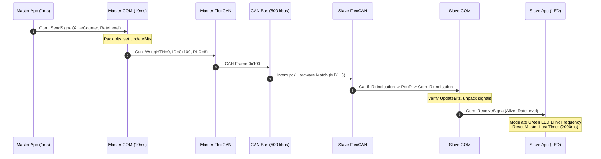
```mermaid
sequenceDiagram
    autonumber
    participant Master_App as Master App (1ms)
    participant Master_COM as Master COM (10ms)
    participant CanDrv_Tx as Master FlexCAN
    participant Bus as CAN Bus (500 kbps)
    participant CanDrv_Rx as Slave FlexCAN
    participant Slave_COM as Slave COM
    participant Slave_App as Slave App (LED)

    Master_App->>Master_COM: Com_SendSignal(AliveCounter, RateLevel)
    Note over Master_COM: Pack bits, set UpdateBits
    Master_COM->>CanDrv_Tx: Can_Write(HTH=0, ID=0x100, DLC=8)
    CanDrv_Tx->>Bus: CAN Frame 0x100
    Bus->>CanDrv_Rx: Interrupt / Hardware Match (MB1..8)
    CanDrv_Rx->>Slave_COM: CanIf_RxIndication -> PduR -> Com_RxIndication
    Note over Slave_COM: Verify UpdateBits, unpack signals
    Slave_COM->>Slave_App: Com_ReceiveSignal(Alive, RateLevel)
    Note over Slave_App: Modulate Green LED Blink Frequency<br/>Reset Master-Lost Timer (2000ms)
```

### 5.2 CanTP Segmented Image Transfer Sequence
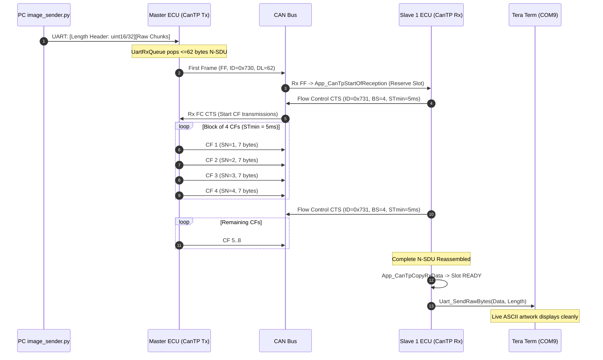
```mermaid
sequenceDiagram
    autonumber
    participant PC as PC image_sender.py
    participant Master as Master ECU (CanTP Tx)
    participant Bus as CAN Bus
    participant Slave as Slave 1 ECU (CanTP Rx)
    participant Term as Tera Term (COM9)

    PC->>Master: UART: [Length Header: uint16/32][Raw Chunks]
    Note over Master: UartRxQueue pops <=62 bytes N-SDU
    Master->>Bus: First Frame (FF, ID=0x730, DL=62)
    Bus->>Slave: Rx FF -> App_CanTpStartOfReception (Reserve Slot)
    Slave->>Bus: Flow Control CTS (ID=0x731, BS=4, STmin=5ms)
    Bus->>Master: Rx FC CTS (Start CF transmissions)
    
    loop Block of 4 CFs (STmin = 5ms)
        Master->>Bus: CF 1 (SN=1, 7 bytes)
        Master->>Bus: CF 2 (SN=2, 7 bytes)
        Master->>Bus: CF 3 (SN=3, 7 bytes)
        Master->>Bus: CF 4 (SN=4, 7 bytes)
    end
    
    Slave->>Bus: Flow Control CTS (ID=0x731, BS=4, STmin=5ms)
    
    loop Remaining CFs
        Master->>Bus: CF 5..8
    end
    
    Note over Slave: Complete N-SDU Reassembled
    Slave->>Slave: App_CanTpCopyRxData -> Slot READY
    Slave->>Term: Uart_SendRawBytes(Data, Length)
    Note over Term: Live ASCII artwork displays cleanly
```

---

## 6. Execution Scheduling & Timing Budget

The system operates under a deterministic bare-metal tick-based cooperative scheduler driven by `SysTick` at **1 ms period**:

| Task Name | Period | Execution Context | Execution Budget | Description |
|---|---|---|---|---|
| `Can_MainFunction_Write()` | $1\text{ ms}$ | Foreground Loop | $< 15\ \mu\text{s}$ | Checks MB0 Tx completion flag, handles timeouts |
| `Can_MainFunction_Read()` | $1\text{ ms}$ | Foreground Loop | $< 35\ \mu\text{s}$ | Polls MB1..MB8 Rx flags, dispatches to CanIf |
| `Com_MainFunction_Rx()` | $1\text{ ms}$ | Foreground Loop | $< 25\ \mu\text{s}$ | Unpacks received I-PDUs, validates UpdateBits |
| `CanTp_MainFunction()` | $1\text{ ms}$ | Foreground Loop | $< 40\ \mu\text{s}$ | Manages ISO-TP timers ($N\_As, N\_Bs, N\_Cr$), triggers CFs |
| `Com_MainFunction_Tx()` | $1\text{ ms}$ | Foreground Loop | $< 30\ \mu\text{s}$ | Schedules cyclic and triggered COM transmissions |
| `UartRxQueue_Poll()` | $1\text{ ms}$ + Idle | Foreground Loop | $< 20\ \mu\text{s}$ | Non-blocking drain of LPUART1 Rx hardware FIFO |
| `App_Task_1ms()` | $1\text{ ms}$ | Foreground Loop | $< 50\ \mu\text{s}$ | Reads ADC0, modulates LED blink, drains image queue |
| `App_Task_10ms()` | $10\text{ ms}$ | Foreground Loop | $< 60\ \mu\text{s}$ | Triggers KeepAlive COM broadcast, monitors offline slaves |
| `Trace_Flush()` | Idle Loop | Background Loop | Non-blocking | Flushes up to 64 bytes of ring buffer to LPUART1 Tx |

**Total foreground worst-case execution time:** $< 275\ \mu\text{s}$ per $1000\ \mu\text{s}$ tick (**CPU load $< 28\%$**), ensuring complete real-time headroom.
```

---

<a id="deliverablespart1md"></a>
## 📄 File: `deliverables_part1.md`

**Chức năng / Mô tả:** Báo cáo nghiệm thu Part 1: COM Signal, Deadline Monitoring và chuyển đổi trạng thái  
**Đường dẫn tương đối:** `deliverables_part1.md`  
**Kích thước:** 20,672 bytes (20.2 KB) | **Số dòng:** 610 dòng

```markdown
# Part 1 — Required Deliverables

Tài liệu này trình bày đầy đủ **19 deliverables** theo §38 của `assignment_part1_com_signal.md`.

---

## Deliverable 1 — Signal Model

Mỗi Signal là một **update unit** được mã hoá trong một Signal Slot byte-aligned.

| SignalId | Name | DataType | SlotStartBit | SlotLength | PayloadBits | Group |
|---|---|---|---|---|---|---|
| 0 | VehicleSpeed | uint16 | 0 | 16 | 15 | VehicleStatusTx |
| 1 | Gear | uint8 | 16 | 8 | 7 | VehicleStatusTx |
| 2 | AliveCounter | uint8 | 24 | 8 | 7 | VehicleStatusTx |
| 3 | EngineRPM | uint16 | 0 | 16 | 15 | EngineStatusTx |
| 4 | EngineTemp | uint8 | 16 | 8 | 7 | EngineStatusTx |
| 5 | ThrottlePos | uint8 | 24 | 8 | 7 | EngineStatusTx |
| 6 | DoorState | uint8 | 0 | 8 | 7 | BodyStatusTx |
| 7 | LightState | uint8 | 8 | 8 | 7 | BodyStatusTx |

---

## Deliverable 2 — Signal Slot Model

```text
bit N-1                          bit 1  bit 0
┌────────────────────────────────────┬───┐
│          Signal Payload            │ U │
└────────────────────────────────────┴───┘
                                       ↑
                                    UpdateBit (LSB)
```

Encoding / Decoding:

```text
Encode:  EncodedSignal = (Payload << 1) | 1
Decode:  UpdateBit     = EncodedSignal & 1
         Payload       = EncodedSignal >> 1
```

| SlotLength | PayloadBits | UpdateBit | Example (VehicleSpeed=0x1234) |
|---|---|---|---|
| 8 bit | 7 bit | bit 0 | — |
| 16 bit | 15 bit | bit 0 | Encoded = 0x2469, LE: [0x69, 0x24] |
| 24 bit | 23 bit | bit 0 | — |
| 32 bit | 31 bit | bit 0 | — |

Slot placement constraints:

```text
SlotStartBit % 8 == 0   (byte-aligned start)
SlotLength   % 8 == 0   (whole bytes)
SlotLength   >= 8       (minimum 1 byte)
(SlotStartBit + SlotLength) <= 64   (fit inside 8-byte I-PDU)
Signal value <= 2^(SlotLength-1) - 1  (fit in payload bits)
```

---

## Deliverable 3 — Signal Group Model

```text
Signal Group = GROUPING / PACKING UNIT
```

| GroupId | Name | Signals | I-PDU |
|---|---|---|---|
| 0 | VehicleStatusTx | VehicleSpeed, Gear, AliveCounter | VehicleStatusPdu (TX) |
| 1 | EngineStatusTx | EngineRPM, EngineTemp, ThrottlePos | EngineStatusPdu (TX) |
| 2 | BodyStatusTx | DoorState, LightState | BodyStatusPdu (TX) |
| 3 | VehicleStatusRx | RxVehicleSpeed, RxGear, RxAliveCounter | VehicleStatusPdu (RX) |
| 4 | EngineStatusRx | RxEngineRPM, RxEngineTemp, RxThrottlePos | EngineStatusPdu (RX) |
| 5 | BodyStatusRx | RxDoorState, RxLightState | BodyStatusPdu (RX) |

Rules:
- One Signal belongs to exactly one Signal Group.
- One Signal Group belongs to exactly one I-PDU.
- A Signal Group shall not be empty.

---

## Deliverable 4 — I-PDU Model including GlobalPduId

```text
I-PDU = SCHEDULING / TRANSMISSION UNIT
```

| IPduId | Name | GlobalPduId | Dir | Period (ticks) | Offset (ticks) | MaxRetries | Length |
|---|---|---|---|---|---|---|---|
| 0 | VehicleStatusPdu | 0x0010 | TX | 20 | 1 | 3 | 4 B |
| 1 | EngineStatusPdu | 0x0011 | TX | 20 | 3 | 3 | 4 B |
| 2 | BodyStatusPdu | 0x0012 | TX | 30 | 5 | 3 | 2 B |
| 3 | VehicleStatusPdu | 0x0010 | RX | — | — | — | 4 B |
| 4 | EngineStatusPdu | 0x0011 | RX | — | — | — | 4 B |
| 5 | BodyStatusPdu | 0x0012 | RX | — | — | — | 2 B |

`GlobalPduId` = system-wide canonical identity. It is **not** a module-local handle.

---

## Deliverable 5 — Direct CAN Binding Map

```text
Mandatory rule: 1 GlobalPduId ↔ 1 CanIf L-PDU ↔ 1 CAN ID
```

| GlobalPduId | CanIf TxPduId | CAN ID (Tx) | CanIf RxPduId | CAN ID (Rx) | HOH (Tx/Rx) |
|---|---|---|---|---|---|
| 0x0010 | 0 | 0x321 | 0 | 0x321 | HTH 0 / HRH 1 |
| 0x0011 | 1 | 0x322 | 1 | 0x322 | HTH 0 / HRH 1 |
| 0x0012 | 2 | 0x323 | 2 | 0x323 | HTH 0 / HRH 1 |

Because the mapping is 1-to-1, `GlobalPduId` is **implicit on the CAN wire** and consumes **zero** payload bytes. The CAN ID alone identifies the logical message.

---

## Deliverable 6 — Period, Initial Offset, and max_retries Configuration

| I-PDU | Period | Initial Offset | max_retries | Total max attempts |
|---|---|---|---|---|
| VehicleStatusPdu (TX) | 20 ms | 1 ms | 3 | 4 (1 initial + 3 retries) |
| EngineStatusPdu (TX) | 20 ms | 3 ms | 3 | 4 |
| BodyStatusPdu (TX) | 30 ms | 5 ms | 3 | 4 |

`Com_MainFunctionTx()` period = **1 ms** (base tick).

Initial offsets stagger the first transmissions to avoid simultaneous bus load bursts.

---

## Deliverable 7 — COM Tx Runtime State Model

```c
/* Per Tx I-PDU runtime state (Com.c) */
uint16  Com_TimerTicks[MAX_IPDUS];   /* ticks until next nominal occurrence */
boolean Com_IsPending[MAX_IPDUS];    /* this PDU has a pending Tx request   */
uint8   Com_RetryCount[MAX_IPDUS];   /* retry attempts consumed so far      */
```

Initialisation:

```text
counter    = initialOffsetTicks
pending    = FALSE
retryCount = 0
```

State transitions (see Deliverable 15 for state diagram):

```text
On counter == 0 AND pending == FALSE  → pending = TRUE,  retryCount = 0
On counter == 0 AND pending == TRUE   → pending unchanged (Latest Value Wins)
On Tx E_OK                            → pending = FALSE, retryCount = 0, clear UpdateBits
On Tx E_NOT_OK AND retryCount < max   → retryCount++,   pending = TRUE
On Tx E_NOT_OK AND retryCount == max  → pending = FALSE, retryCount = 0 (DROP), keep UpdateBits
```

`max_retries` is a configuration constant, not runtime state.
Initial attempt is NOT counted as a retry.
`max_retries = 3` → 1 initial + 3 retries = **4 total attempts**.

---

## Deliverable 8 — PduR Route Model

```yaml
PduR routes (PduR_Cfg.c — 8 routes total):

  TX routes (COM → CanIf):
    Route 0: globalPduId=0x0010  srcModule=COM    srcPduId=0  dstModule=CANIF  dstPduId=0
    Route 1: globalPduId=0x0011  srcModule=COM    srcPduId=1  dstModule=CANIF  dstPduId=1
    Route 2: globalPduId=0x0012  srcModule=COM    srcPduId=2  dstModule=CANIF  dstPduId=2

  RX routes (CanIf → COM):
    Route 3: globalPduId=0x0010  srcModule=CANIF  srcPduId=0  dstModule=COM    dstPduId=3
    Route 4: globalPduId=0x0011  srcModule=CANIF  srcPduId=1  dstModule=COM    dstPduId=4
    Route 5: globalPduId=0x0012  srcModule=CANIF  srcPduId=2  dstModule=COM    dstPduId=5

  CanTP routes:
    Route 6: globalPduId=0x0730  srcModule=CANTP  srcPduId=3  dstModule=CANIF  dstPduId=3  (CanTP Tx)
    Route 7: globalPduId=0x0730  srcModule=CANIF  srcPduId=3  dstModule=CANTP  dstPduId=3  (CanTP Rx)
```

PduR uses **local handle routing** only. It does NOT inspect payload, Signal data, Update Bits, HTH, HRH, or CAN Controller information.

---

## Deliverable 9 — CanIf Tx L-PDU Model

```yaml
canif_tx_pdus:
  - name: VehicleStatusTx  id: 0  can_id: 0x321  hth_ref: HTH_0  global_pdu_id: 0x0010  dlc: 8
  - name: EngineStatusTx   id: 1  can_id: 0x322  hth_ref: HTH_0  global_pdu_id: 0x0011  dlc: 8
  - name: BodyStatusTx     id: 2  can_id: 0x323  hth_ref: HTH_0  global_pdu_id: 0x0012  dlc: 8
  - name: CanTpTx          id: 3  can_id: 0x730  hth_ref: HTH_0  global_pdu_id: 0x0730  dlc: 8
```

Tx resolution:

```text
TxPduId  →  CAN ID + HTH  →  Can_Write(HTH, CanPdu)
```

CanIf owns the CAN ID mapping. CanIf references HTH but does NOT own it (CanDrv owns HTH).

---

## Deliverable 10 — CanIf Rx L-PDU Model

```yaml
canif_rx_pdus:
  - name: VehicleStatusRx  id: 0  can_id: 0x321  hrh_ref: HRH_1  global_pdu_id: 0x0010  upper_pdu_id: 3
  - name: EngineStatusRx   id: 1  can_id: 0x322  hrh_ref: HRH_1  global_pdu_id: 0x0011  upper_pdu_id: 4
  - name: BodyStatusRx     id: 2  can_id: 0x323  hrh_ref: HRH_1  global_pdu_id: 0x0012  upper_pdu_id: 5
  - name: CanTpRx          id: 3  can_id: 0x731  hrh_ref: HRH_1  global_pdu_id: 0x0730  upper_pdu_id: 3
```

Rx lookup key:

```text
HRH + CAN ID  →  Rx L-PDU  →  GlobalPduId (traceable, not serialised on wire)
```

Example: HRH 1 + CAN ID 0x321 → VehicleStatusRx → GlobalPduId 0x0010.

---

## Deliverable 11 — CanDrv Hardware Object Model

```yaml
can_hw_objects:
  - name: HthCan0Tx   hohId: 0  type: transmit  controller: CAN0  mb: 0
  - name: HrhCan0Rx   hohId: 1  type: receive   controller: CAN0  mb: 1
  - name: HthCan1Tx   hohId: 2  type: transmit  controller: CAN1  mb: 0  # model only
  - name: HrhCan1Rx   hohId: 3  type: receive   controller: CAN1  mb: 1  # model only
```

Lookup:

```text
HTH → CanHardwareObject → Controller → physical Tx resource
HRH → CanHardwareObject → Controller → physical Rx resource
```

HOH IDs are unique within the CanDrv instance — HOH alone is sufficient to identify the Controller. No separate `ControllerId` parameter is needed in the training Tx or Rx API.

---

## Deliverable 12 — Multiple Controller Model

```text
CanDrv (S32K144)
│
├── CAN0  (active — physically wired on EVB)
│   ├── HTH 0  →  MB 0  (Tx)
│   └── HRH 1  →  MB 1  (Rx, BasicCAN, mask = 0 / accept-all)
│
└── CAN1  (config model — not initialised at runtime on this target)
    ├── HTH 2  →  MB 0  (Tx)  ← declared in Can_Cfg.c for model completeness
    └── HRH 3  →  MB 1  (Rx)  ← declared in Can_Cfg.c for model completeness
```

Key property: HOH IDs 0–3 are unique across the entire CanDrv instance. Therefore:

```text
HOH  →  unique CanHardwareObject  →  unique Controller
```

is always resolvable without a separate `ControllerId` argument.

`Can_Write(HTH=2, ...)` returns `CAN_NOT_OK` with a trace warning because CAN1 is not initialised on this hardware target.

---

## Deliverable 13 — Configuration Ownership View

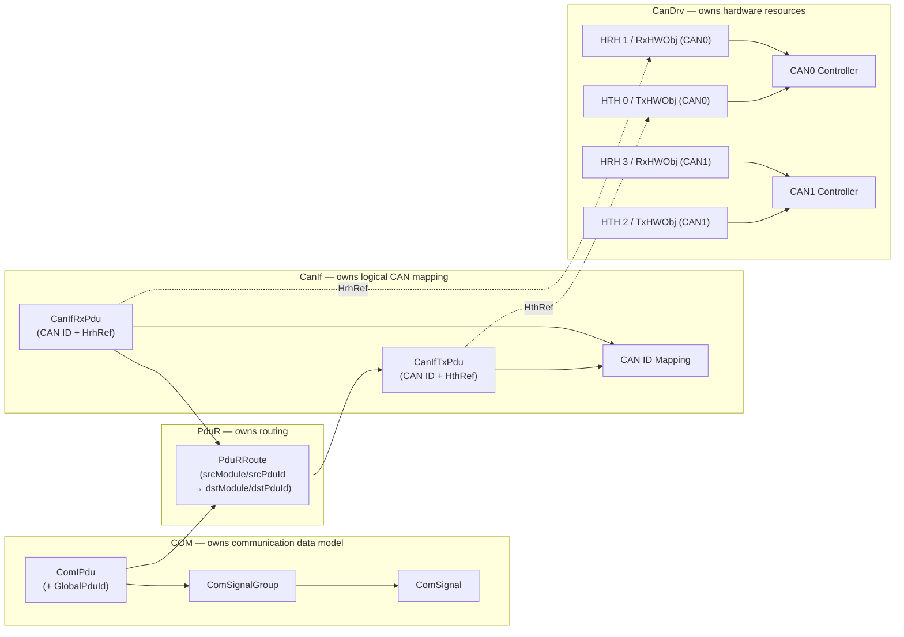
```mermaid
flowchart LR
    subgraph COM["COM — owns communication data model"]
        SIG["ComSignal"]
        SG["ComSignalGroup"]
        IPDU["ComIPdu\n(+ GlobalPduId)"]
        SG --> SIG
        IPDU --> SG
    end

    subgraph PDUR["PduR — owns routing"]
        ROUTE["PduRRoute\n(srcModule/srcPduId\n→ dstModule/dstPduId)"]
    end

    subgraph CANIF["CanIf — owns logical CAN mapping"]
        TX["CanIfTxPdu\n(CAN ID + HthRef)"]
        RX["CanIfRxPdu\n(CAN ID + HrhRef)"]
        CANIDMAP["CAN ID Mapping"]
        TX --> CANIDMAP
        RX --> CANIDMAP
    end

    subgraph CANDRV["CanDrv — owns hardware resources"]
        HTH0["HTH 0 / TxHWObj (CAN0)"]
        HRH1["HRH 1 / RxHWObj (CAN0)"]
        HTH2["HTH 2 / TxHWObj (CAN1)"]
        HRH3["HRH 3 / RxHWObj (CAN1)"]
        C0["CAN0 Controller"]
        C1["CAN1 Controller"]
        HTH0 --> C0
        HRH1 --> C0
        HTH2 --> C1
        HRH3 --> C1
    end

    IPDU --> ROUTE
    ROUTE --> TX
    RX --> ROUTE
    TX -. HthRef .-> HTH0
    RX -. HrhRef .-> HRH1
```

> **Rule**: A module may *reference* an object owned by another module but does not *own* it.
> CanIf references HTH/HRH — CanDrv owns them.

---

## Deliverable 14 — Building Block View

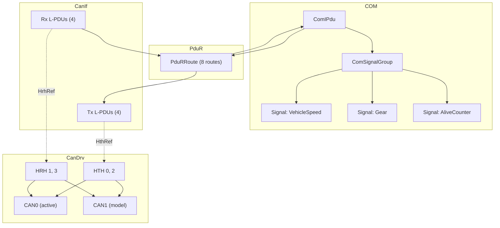
```mermaid
flowchart TB
    subgraph COM["COM"]
        IPDU2["ComIPdu"]
        SG2["ComSignalGroup"]
        S1["Signal: VehicleSpeed"]
        S2["Signal: Gear"]
        S3["Signal: AliveCounter"]
        IPDU2 --> SG2
        SG2 --> S1
        SG2 --> S2
        SG2 --> S3
    end

    subgraph PDUR["PduR"]
        ROUTE2["PduRRoute (8 routes)"]
    end

    subgraph CANIF["CanIf"]
        TXL["Tx L-PDUs (4)"]
        RXL["Rx L-PDUs (4)"]
    end

    subgraph CANDRV["CanDrv"]
        HTH_["HTH 0, 2"]
        HRH_["HRH 1, 3"]
        C0_["CAN0 (active)"]
        C1_["CAN1 (model)"]
        HTH_ --> C0_
        HRH_ --> C0_
        HTH_ --> C1_
        HRH_ --> C1_
    end

    IPDU2 --> ROUTE2
    ROUTE2 --> TXL
    RXL --> ROUTE2
    ROUTE2 --> IPDU2
    TXL -. HthRef .-> HTH_
    RXL -. HrhRef .-> HRH_
```

---

## Deliverable 15 — Tx Dynamic Behavior View (State Diagram)

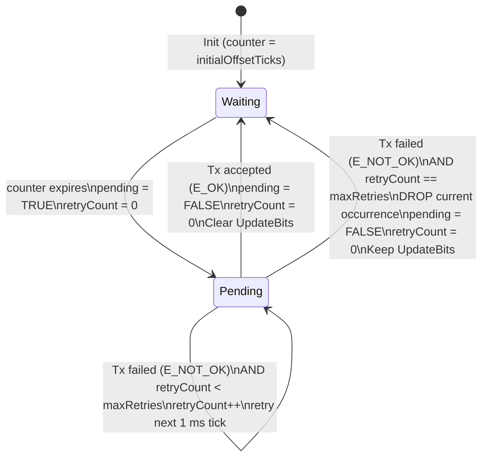
```mermaid
stateDiagram-v2
    [*] --> Waiting : Init (counter = initialOffsetTicks)

    Waiting --> Pending : counter expires\npending = TRUE\nretryCount = 0

    Pending --> Waiting : Tx accepted (E_OK)\npending = FALSE\nretryCount = 0\nClear UpdateBits

    Pending --> Pending : Tx failed (E_NOT_OK)\nAND retryCount < maxRetries\nretryCount++\nretry next 1 ms tick

    Pending --> Waiting : Tx failed (E_NOT_OK)\nAND retryCount == maxRetries\nDROP current occurrence\npending = FALSE\nretryCount = 0\nKeep UpdateBits
```

Key policies:
- **Early Retry**: retry at next `Com_MainFunctionTx()` tick (not next period)
- **Non-blocking**: BUSY on PDU_0 does not block PDU_1 or PDU_2
- **No Schedule Drift**: `counter = periodTicks` reloads unconditionally
- **Latest Value Wins**: second period expiry while pending → keep pending, no queue
- **Drop = drop one occurrence, not the I-PDU**

---

## Deliverable 16 — Rx Runtime View (Sequence Diagram)

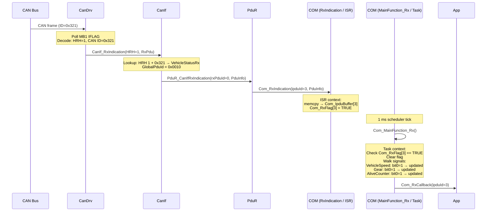
```mermaid
sequenceDiagram
    participant CAN as CAN Bus
    participant CanDrv as CanDrv
    participant CanIf as CanIf
    participant PduR as PduR
    participant COM_ISR as COM (RxIndication / ISR)
    participant COM_Task as COM (MainFunction_Rx / Task)
    participant App as App

    CAN->>CanDrv: CAN frame (ID=0x321)
    Note over CanDrv: Poll MB1 IFLAG<br/>Decode: HRH=1, CAN ID=0x321
    CanDrv->>CanIf: CanIf_RxIndication(HRH=1, RxPdu)
    Note over CanIf: Lookup: HRH 1 + 0x321 → VehicleStatusRx<br/>GlobalPduId = 0x0010
    CanIf->>PduR: PduR_CanIfRxIndication(rxPduId=0, PduInfo)
    PduR->>COM_ISR: Com_RxIndication(ipduId=3, PduInfo)
    Note over COM_ISR: ISR context:<br/>memcpy → Com_IpduBuffer[3]<br/>Com_RxFlag[3] = TRUE

    Note over COM_Task: 1 ms scheduler tick
    COM_Task->>COM_Task: Com_MainFunction_Rx()
    Note over COM_Task: Task context:<br/>Check Com_RxFlag[3] == TRUE<br/>Clear flag<br/>Walk signals:<br/>  VehicleSpeed: bit0=1 → updated<br/>  Gear: bit0=1 → updated<br/>  AliveCounter: bit0=1 → updated
    COM_Task->>App: Com_RxCallback(ipduId=3)
```

---

## Deliverable 17 — CAN_BUSY Bounded Retry and Drop Behavior

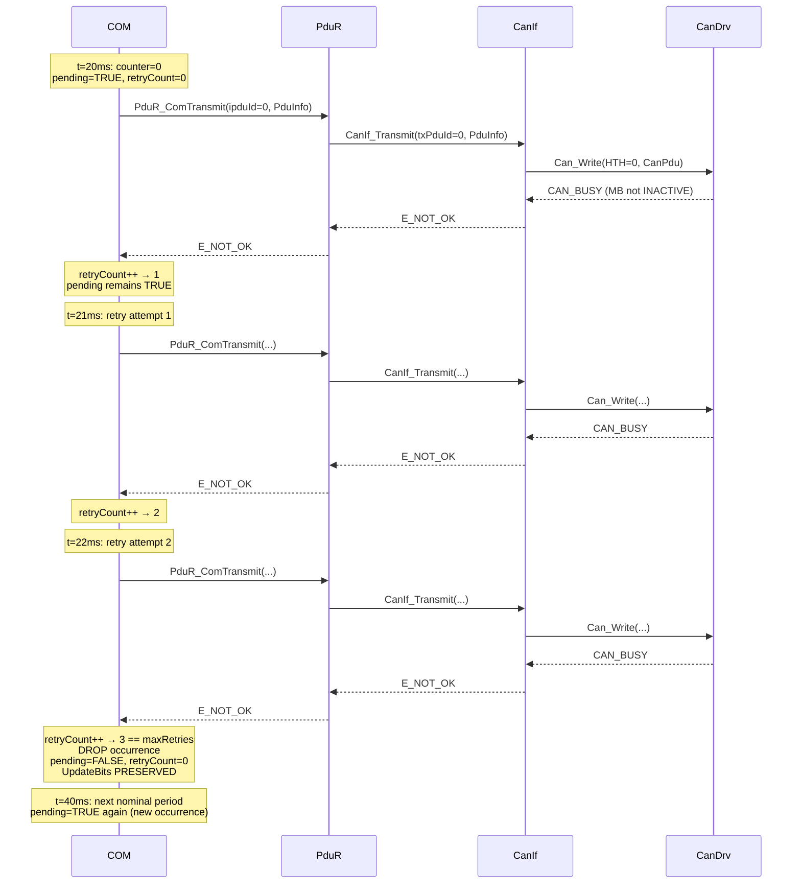
```mermaid
sequenceDiagram
    participant COM as COM
    participant PduR as PduR
    participant CanIf as CanIf
    participant CanDrv as CanDrv

    Note over COM: t=20ms: counter=0<br/>pending=TRUE, retryCount=0

    COM->>PduR: PduR_ComTransmit(ipduId=0, PduInfo)
    PduR->>CanIf: CanIf_Transmit(txPduId=0, PduInfo)
    CanIf->>CanDrv: Can_Write(HTH=0, CanPdu)
    CanDrv-->>CanIf: CAN_BUSY (MB not INACTIVE)
    CanIf-->>PduR: E_NOT_OK
    PduR-->>COM: E_NOT_OK
    Note over COM: retryCount++ → 1<br/>pending remains TRUE

    Note over COM: t=21ms: retry attempt 1
    COM->>PduR: PduR_ComTransmit(...)
    PduR->>CanIf: CanIf_Transmit(...)
    CanIf->>CanDrv: Can_Write(...)
    CanDrv-->>CanIf: CAN_BUSY
    CanIf-->>PduR: E_NOT_OK
    PduR-->>COM: E_NOT_OK
    Note over COM: retryCount++ → 2

    Note over COM: t=22ms: retry attempt 2
    COM->>PduR: PduR_ComTransmit(...)
    PduR->>CanIf: CanIf_Transmit(...)
    CanIf->>CanDrv: Can_Write(...)
    CanDrv-->>CanIf: CAN_BUSY
    CanIf-->>PduR: E_NOT_OK
    PduR-->>COM: E_NOT_OK
    Note over COM: retryCount++ → 3 == maxRetries<br/>DROP occurrence<br/>pending=FALSE, retryCount=0<br/>UpdateBits PRESERVED

    Note over COM: t=40ms: next nominal period<br/>pending=TRUE again (new occurrence)
```

---

## Deliverable 18 — End-to-End Tx/Rx Trace View using GlobalPduId

### Tx Trace — VehicleSpeed = 100 km/h

```text
[APP]     Com_SendSignal(signalId=0, value=100)
          → Encode: (100 << 1) | 1 = 0xC9
          → Com_IpduBuffer[0][0] = 0xC9 (LE byte 0)
          → Com_IpduBuffer[0][1] = 0x00 (LE byte 1)

[COM]     t=21ms: Com_MainFunctionTx()
          IPduId=0, GlobalPduId=0x0010, pending=TRUE
          [COM] TX gpdu=0010 ok

[PduR]    PduR_ComTransmit(srcPduId=0)
          Route: GlobalPduId=0x0010, COM → CANIF, dstPduId=0
          [PduR] fwd TX 0x0010

[CanIf]   CanIf_Transmit(txPduId=0)
          TxPduId=0 → CAN ID=0x321, HTH=0, DLC=8
          [CanIf] TX id=321 hth=0

[CanDrv]  Can_Write(HTH=0, CanPdu{id=0x321, len=8, sdu=[0xC9,0x00,0x00,0x00,0x00,0x00,0x00,0x00]})
          MB0 CODE → 0xC (TX DATA)
          → CAN frame transmitted on bus

[COM]     pending=FALSE, UpdateBits cleared
          Com_IpduBuffer[0][0] = 0xC8  (payload intact, bit0 cleared)
```

### Rx Trace — CAN frame arrives ID=0x321

```text
[CanDrv]  Can_MainFunction_Read(): IFLAG1 bit 1 set
          MB1 read: id_reg=0x321, DLC=8, data=[0xC9,0x00,0x00,0x00,...]
          TIMER read → MB1 unlocked, CODE → EMPTY (re-arm)
          CanIf_RxIndication(HRH=1, RxPdu{id=0x321, len=8})

[CanIf]   CanIf_RxIndication: lookup HRH=1 + 0x321 → VehicleStatusRx (rxPduId=0)
          GlobalPduId=0x0010  (traceable, not on wire)
          [CanIf] RX id=321 hrh=1
          PduR_CanIfRxIndication(rxPduId=0, PduInfo)

[PduR]    PduR_CanIfRxIndication: srcModule=CANIF, srcPduId=0
          Route: GlobalPduId=0x0010, dstPduId=3
          [PduR] fwd RX 0x0010
          Com_RxIndication(ipduId=3, PduInfo)

[COM/ISR] Com_RxIndication(ipduId=3):
          memcpy → Com_IpduBuffer[3] = [0xC9, 0x00, ...]
          Com_RxFlag[3] = TRUE
          [COM] RxInd pdu=3 len=8 flag set

[COM/Task] Com_MainFunction_Rx() — next 1ms tick:
          RxFlag[3] == TRUE → clear flag
          Signal VehicleSpeed (slot 0-15, LE):
            encoded = 0x00C9, UpdateBit = 0xC9 & 1 = 1 → NEW DATA
            payload = 0x00C9 >> 1 = 0x0064 = 100
          Signal Gear (slot 16-23): UpdateBit check...
          Com_RxCallback(ipduId=3) → App notified
```

### Cross-layer trace correlation table

| Layer | Handle used | GlobalPduId |
|---|---|---|
| COM | IPduId = 0 (TX) / 3 (RX) | 0x0010 |
| PduR | srcPduId = 0 (COM→), dstPduId = 0 (→CanIf) | 0x0010 |
| CanIf | TxPduId = 0 / RxPduId = 0 | 0x0010 |
| CanDrv | HTH = 0 (Tx) / HRH = 1 (Rx) | 0x0010 (via config) |
| CAN wire | CAN ID = 0x321 | **implicit** (not serialised) |

---

## Deliverable 19 — Validation Report

`Com_ValidateConfig()` runs at startup (called in `App_Init()` or can be called manually).

### Rules checked

| Rule | Check | Status |
|---|---|---|
| SlotStartBit % 8 == 0 | All 16 signals | ✅ PASS |
| SlotLength % 8 == 0 | All 16 signals | ✅ PASS |
| SlotLength >= 8 | All 16 signals | ✅ PASS |
| Slot within PDU (≤64 bits) | All 16 signals | ✅ PASS |
| DataType fits PayloadBits | uint8↔7b, uint16↔15b | ✅ PASS |
| No slot overlap within group | All 6 groups | ✅ PASS |
| Signal Group non-empty | All 6 groups | ✅ PASS |
| Tx I-PDU period > 0 | 3 Tx PDUs | ✅ PASS |
| GlobalPduId unique (Tx) | 0x0010, 0x0011, 0x0012 | ✅ PASS |

### Validation output (trace log at startup)

```text
[SYS] Platform init complete
[SYS] BSW init complete
[APP] Com_ValidateConfig() → E_OK
```

### HOH namespace validation (manual)

```text
HOH 0: type=TRANSMIT, controllerId=0  → CAN0 Tx ✅
HOH 1: type=RECEIVE,  controllerId=0  → CAN0 Rx ✅
HOH 2: type=TRANSMIT, controllerId=1  → CAN1 Tx ✅ (model only)
HOH 3: type=RECEIVE,  controllerId=1  → CAN1 Rx ✅ (model only)
All HOH IDs unique within CanDrv instance: ✅
HTH and HRH share one ID namespace (0–3): ✅
```

### Direct CAN Binding validation (manual)

```text
GlobalPduId 0x0010 ↔ CanIfTxPdu[0] ↔ CAN ID 0x321 : 1-to-1 ✅
GlobalPduId 0x0011 ↔ CanIfTxPdu[1] ↔ CAN ID 0x322 : 1-to-1 ✅
GlobalPduId 0x0012 ↔ CanIfTxPdu[2] ↔ CAN ID 0x323 : 1-to-1 ✅
GlobalPduId not serialised into CAN payload         : ✅
```

---

## Summary — Assignment §38 Checklist

| # | Deliverable | Location |
|---|---|---|
| 1 | Signal model | §D1 above + `Com_Cfg.c` |
| 2 | Signal Slot model | §D2 above + `Com.c:pack_signal()` |
| 3 | Signal Group model | §D3 above + `Com_Cfg.c` |
| 4 | I-PDU model + GlobalPduId | §D4 above + `Com_Cfg.c` |
| 5 | Direct CAN Binding map | §D5 above + `CanIf_Cfg.c` |
| 6 | Period / Offset / max_retries config | §D6 above + `Com_Cfg.c` |
| 7 | COM Tx runtime state + retry_count | §D7 above + `Com.c` |
| 8 | PduR route model | §D8 above + `PduR_Cfg.c` |
| 9 | CanIf Tx L-PDU model | §D9 above + `CanIf_Cfg.c` |
| 10 | CanIf Rx L-PDU model | §D10 above + `CanIf_Cfg.c` |
| 11 | CanDrv Hardware Object model | §D11 above + `Can_Cfg.c` |
| 12 | Multiple Controller model | §D12 above + `Can_Cfg.c` (`CAN_NUM_CONTROLLERS=2`) |
| 13 | Configuration Ownership View | §D13 above (Mermaid) |
| 14 | Building Block View | §D14 above (Mermaid) |
| 15 | Tx Dynamic Behavior View | §D15 above (stateDiagram) |
| 16 | Rx Runtime View | §D16 above (sequenceDiagram) |
| 17 | CAN_BUSY bounded retry & drop | §D17 above (sequenceDiagram) |
| 18 | End-to-End Tx/Rx Trace View | §D18 above |
| 19 | Validation report | §D19 above |
```

---

<a id="part1architecturenotesmd"></a>
## 📄 File: `part1_architecture_notes.md`

**Chức năng / Mô tả:** Ghi chú kỹ thuật chi tiết về thiết kế tín hiệu CAN, byte ordering (Little/Big Endian) và unpacking/packing logic  
**Đường dẫn tương đối:** `part1_architecture_notes.md`  
**Kích thước:** 16,282 bytes (15.9 KB) | **Số dòng:** 880 dòng

```markdown
# Part 1 Architecture Notes

This document explains **why** the training architecture in `assignment_part1_com_signal.md` was designed this way.

It is not the assignment specification itself.

---

## 1. Purpose of the Training Model

The training stack is intentionally smaller than production AUTOSAR Classic.

The objective is not to reproduce every AUTOSAR configuration option. The objective is to preserve the most important architectural boundaries:

```text
COM    = Signal packing + communication scheduling
PduR   = PDU routing
CanIf  = Logical CAN mapping
CanDrv = CAN hardware control
```

The model should be small enough that students can implement it themselves and understand every relationship.

---

## 2. Why Signal → Signal Group → I-PDU?

The class uses:

```text
N Signals
    ↓
1 Signal Group
    ↓
1 I-PDU
```

This separates three concepts:

```text
Signal       = UPDATE UNIT
Signal Group = GROUPING / PACKING UNIT
I-PDU        = SCHEDULING / TRANSMISSION UNIT
```

This creates the mental model:

```text
Com_SendSignal()   = update communication state
Com_MainFunctionTx = schedule communication
```

---

## 3. Why Does Signal Not Directly Store `IPduRef`?

A direct `Signal → IPduRef` relationship is convenient for `Com_SendSignal()`, but inconvenient when processing an entire I-PDU.

The training model instead uses:

```text
Signal → Signal Group → I-PDU
```

A generator may still create optimized reverse lookup tables for runtime.

> Model relationship and runtime lookup structure do not have to be identical.

---

## 4. Why Use a Signal Slot?

Each Signal uses one self-contained representation:

```text
bit N-1                          bit 1 bit 0
┌────────────────────────────────────┬───┐
│          Signal Payload            │ U │
└────────────────────────────────────┴───┘
```

This allows:

```text
Encode         = (Payload << 1) | U
Decode Payload = Slot >> 1
Decode U       = Slot & 1
```

This avoids arbitrary bit extraction, cross-byte fields, unrelated mask/merge operations, and separate Update Bit lookup.

---

## 5. Why Must Signal Slots Be Byte Aligned?

Training rules:

```text
SlotStartBit % 8 == 0
SlotLength   % 8 == 0
```

The goal is predictable access.

Trade-off:

```text
Implementation simplicity ↑
Runtime predictability ↑
Debug simplicity ↑
Traceability ↑

Packing flexibility ↓
Maximum payload utilization ↓
```

---

## 6. Why Is the Update Bit Inside the Signal Slot?

The class chose:

```text
[Payload][UpdateBit]
```

as one aligned slot.

There is no separate Update Bit area.

Advantages:

- one access retrieves both payload and freshness;
- no separate bit-position table is required;
- easy to visualize in CAN traces;
- simple encode/decode logic.

This is a training convention, not a general AUTOSAR requirement.

---

## 7. Software Data Type vs Network Payload Size

A C type and the number of payload bits on the network are different concepts.

Example:

```text
Software type = uint16
16-bit Signal Slot = 15 payload bits + 1 Update Bit
```

Students shall not assume:

```text
sizeof(C type) = network payload width
```

---

## 8. Why Is I-PDU the Scheduling Unit?

Signals represent state values. The network transmits a complete serialized message.

Example:

```text
VehicleSpeed changes at t=3 ms
Gear changes at t=7 ms
VehicleStatusPdu is due at t=10 ms
```

The frame at t=10 ms contains the latest current state.

---

## 9. Why Use `Com_MainFunctionTx()`?

`Com_SendSignal()` should not directly control network timing.

```text
Com_SendSignal()    → update COM buffer
Com_MainFunctionTx → apply communication timing policy
```

This separates data update timing from network transmission timing.

---

## 10. Why Use a 1 ms COM MainFunction?

A 1 ms base tick gives a simple integer timing model:

```text
10 ms PDU  → 10 ticks
20 ms PDU  → 20 ticks
100 ms PDU → 100 ticks
```

Part 1 requires:

```text
PduPeriod % MainFunctionPeriod == 0
```

This avoids fractional scheduling.

---

## 11. Why Use an Initial Offset?

Without offsets:

```text
A = 10 ms
B = 20 ms
C = 50 ms
D = 100 ms
```

may produce a burst where all are due together.

Initial offsets allow static load distribution without an advanced scheduler.

Example:

```text
A: period=10,  offset=1
B: period=20,  offset=5
C: period=50,  offset=12
D: period=100, offset=25
```

---

## 12. Why No Priority or Fairness Scheduler?

Priority and fairness are valid production concerns, but they introduce concepts that are not necessary for Part 1:

- priority queues;
- starvation;
- round-robin indices;
- software arbitration;
- scheduling policies.

The class intentionally uses static configuration order.

The goal is to understand the communication stack before studying scheduler design.

---

## 13. Why Retry as Early as Possible?

If an I-PDU is due at 10 ms and the lower layer is busy, waiting until the next full period would introduce unnecessary latency.

Therefore:

```text
CAN_BUSY → PENDING → retry next Com_MainFunctionTx tick
```

For a 1 ms main function:

```text
t=10 → BUSY
t=11 → retry
```

---

## 14. Why Must Retry Be Non-blocking?

Forbidden:

```c
while (Can_Write(...) == CAN_BUSY)
{
}
```

because one busy PDU would prevent all other communication work from progressing.

Instead:

```text
PDU0 → BUSY
PDU1 → still checked
PDU2 → still checked
```

---

## 15. Why Bound the Number of Retries?

Retrying forever creates a permanently pending I-PDU when the lower communication path remains unavailable.

Part 1 therefore uses:

```text
initial attempt
+
max_retries
```

Example:

```text
max_retries = 3
→ 1 initial attempt + 3 retries
→ at most 4 total attempts
```

After the retry budget is exhausted:

```text
drop current occurrence
pending = FALSE
retry_count = 0
```

> Drop one transmission occurrence, not the I-PDU.

The I-PDU remains active at future nominal periods. Update Bits remain set because the lower stack never accepted the dropped occurrence.

This adds only one small runtime counter but avoids unbounded retry behavior.

---

## 16. Why "Latest Value Wins"?

Example:

```text
t=10  Speed=100 → due → BUSY
t=15  Speed=110
t=18  Speed=120
t=21  transmission accepted
```

The transmitted value is 120.

The model does not queue 100, 110, and 120 because Signal communication represents state, not an event log.

Missed periodic occurrences are coalesced into one pending transmission.

---

## 17. Why Must the Nominal Schedule Not Drift?

For a 10 ms period:

```text
Nominal occurrences = 10, 20, 30, 40, ...
```

If the request due at 10 ms is accepted at 12 ms, the next nominal occurrence remains 20 ms.

Otherwise repeated BUSY conditions would progressively shift the periodic schedule.

Therefore scheduling timeline and actual transmission-request time are separate concepts.

---

## 18. Why Clear Update Bits on Accepted Transmit Request?

Part 1 uses:

```text
PduR_ComTransmit() == E_OK → clear Update Bits
```

This is intentionally simple.

Important:

```text
E_OK = lower communication stack accepted the request
```

It does not mean the CAN frame has physically completed transmission.

A more advanced design could clear Update Bits on TxConfirmation instead. That is deferred.

---

## 19. Why `Can_MainFunction_Write()` Exists

With polling-based Tx completion:

```text
Can_Write()
   ↓
request accepted
   ↓
hardware busy
   ↓
Can_MainFunction_Write()
   ↓
Tx complete
   ↓
CanIf_TxConfirmation()
```

`Com_MainFunctionTx()` asks:

```text
When should this I-PDU be requested?
```

`Can_MainFunction_Write()` asks:

```text
Has the accepted hardware transmission completed?
```

These are different responsibilities.

---

## 20. Why Run CAN MainFunction Before COM MainFunction?

Recommended polling order:

```text
1 ms tick

Can_MainFunction_Write()
        ↓
release completed Tx resource

Com_MainFunctionTx()
        ↓
pending PDU can retry immediately
```

This is a training recommendation, not a universal scheduling rule.

---

## 21. Configuration Ownership Philosophy

```text
COM    owns communication data model
PduR   owns routing
CanIf  owns logical CAN mapping
CanDrv owns CAN hardware resources
```

This separation is more important than the numeric values of handles.

---

## 22. Why Does CanIf Own CAN ID Mapping?

In mandatory Direct CAN Binding, PduR remains payload-transparent and routes local handles:

```text
Source logical PDU → Destination logical PDU
```

If optional multiplexed Global PDU mode is implemented later, the Global PDU mapping/demultiplexing function remains an internal PduR subcomponent:

```text
GlobalPduId ↔ local PduR route handle
```

This does not make PduR depend on CAN hardware concepts such as HTH, HRH, or Controller.

CanIf knows:

```text
Logical CAN L-PDU → CAN-specific representation
```

Tx:

```text
Tx L-PDU → CAN ID + HTH
```

Rx:

```text
HRH + CAN ID → Rx L-PDU
```

---

## 23. Why Does CanDrv Own HTH/HRH?

HTH and HRH represent CAN hardware resources.

Therefore their definitions belong to CanDrv.

CanIf references them but does not own them.

---

## 24. Why Are HOH IDs Unique Across One CanDrv?

The training model supports multiple CAN Controllers:

```text
CanDrv
├── CAN0
└── CAN1
```

With unique HOH IDs:

```text
CAN0: HTH 0, HRH 1
CAN1: HTH 2, HRH 3
```

then:

```text
HOH → Hardware Object → Controller
```

is enough to identify the Controller.

---

## 25. Why Does Tx Not Need `ControllerId`?

Tx starts from a known logical Tx L-PDU.

CanIf resolves:

```text
TxPduId → HTH
```

CanDrv resolves:

```text
HTH → Hardware Object → Controller
```

Therefore `ControllerId` would be redundant in the training Tx API.

---

## 26. Why Does Rx Use `HRH + CAN ID`?

An HRH may receive many CAN IDs in BasicCAN.

Example:

```text
HRH 3
0x100 → RxPduA
0x200 → RxPduB
0x321 → VehicleStatusRx
```

Therefore HRH alone does not identify the logical Rx PDU.

The required information is:

```text
HRH + CAN ID
```

---

## 27. Why Does the Training Rx API Differ from AUTOSAR?

Training API:

```c
CanIf_RxIndication(Hrh, RxPdu);
```

AUTOSAR uses a more generic receive hardware-context object conceptually containing:

```text
CAN ID
HOH
ControllerId
```

The training model does not need explicit `ControllerId` because HOH is unique within one CanDrv instance and therefore `HRH → Controller` is already derivable.

---

## 28. Why Avoid the Term "Mailbox" in the Training API?

"Mailbox" can easily be confused with a physical FlexCAN Message Buffer.

The training API exposes:

```text
HRH + RxPdu
```

which directly communicates:

```text
Which receive hardware resource?
+
Which CAN frame/data?
```

Physical mailbox/message-buffer details remain inside CanDrv.

---

## 29. Tx and Rx Are Not Mirror Images

Tx begins with logical identity:

```text
Tx L-PDU → CAN ID + HTH → hardware
```

Rx begins with hardware/network context:

```text
hardware → HRH + CAN ID → Rx L-PDU
```

Useful class phrase:

```text
TX = logical → hardware
RX = hardware/network → logical
```

---

## 30. Why Make `GlobalPduId` the Canonical Identity?

Module-local IDs solve local lookup problems:

```text
ComIPduId
PduR local PduId
CanIfTxPduId
CanIfRxPduId
HTH / HRH
```

but they make end-to-end tracing harder because one logical message appears under different handles at different layers.

`GlobalPduId` provides one stable system identity:

```text
GlobalPduId 0x0010 = VehicleStatus
```

The runtime APIs do not need to carry it everywhere. A logger or route may derive it from generated configuration.

```text
one logical message = one traceable system identity
```

---

## 31. Why Is Direct CAN Binding an Optimization of the General Model?

The general identity is:

```text
GlobalPduId = logical message identity
```

For CAN, a one-to-one binding can provide:

```text
GlobalPduId ↔ CanIf L-PDU ↔ CAN ID
```

CAN ID already identifies the message on the wire, so serializing another Global PDU ID field is redundant.

`GlobalPduId` remains present in the system model and trace database but becomes **implicit on wire**.

This preserves system-wide trace identity with zero GlobalPduId payload overhead, normal CAN hardware filtering, and normal CAN arbitration.

This is a **CAN-optimized Direct Binding**, not a BasicCAN-only optimization.

BasicCAN naturally resolves:

```text
HRH + CAN ID → Rx L-PDU → GlobalPduId
```

through configuration.

---

## 32. What Is the Multiplexed Global PDU Case?

Several logical PDUs may share one channel:

```text
VehicleStatus ─┐
EngineStatus  ─┼─→ Generic CAN channel
ClimateStatus ─┘
```

Here CAN ID identifies the channel, so the wire data must carry the logical identity:

```text
┌─────────────┬────────────────────┐
│ GlobalPduId │ Logical PDU Data   │
└─────────────┴────────────────────┘
```

Rx:

```text
CAN ID
  ↓
Generic CanIf Rx L-PDU
  ↓
extract GlobalPduId
  ↓
GlobalPduId → local route
  ↓
COM
```

Part 1 does not require students to implement this mode. It exists to show that Direct CAN Binding is an efficient specialization of the general identity model.

---

## 33. Why Is Global PDU Mapping Considered Part of PduR?

It is useful to describe a "Global-PDU Adapter" conceptually, but it does not need to become another public module.

Externally:

```text
COM → PduR → CanIf → CanDrv
```

Internally, multiplexed PduR may contain:

```text
PduR
├── Local Route Mapping
└── Global PDU Mapping / Demultiplexing
```

Rx:

```text
Generic CanIf Rx L-PDU
        ↓
PduR Global PDU Demux
        ↓ extract GlobalPduId
GlobalPduId → local PduR source handle
        ↓
normal route
        ↓
COM
```

Tx is the reverse operation.

```text
GlobalPduId ≠ PduR local PduId
```

The internal mapping translates between system identity and module-local routing identity.

---

## 34. Why Does Global PDU ID Improve Debugging?

Without a global identity:

```text
ComIPduId   = 3
PduR PduId  = 7
CanIfPduId  = 2
CAN ID      = 0x321
```

With:

```text
GlobalPduId = 0x0010 = VehicleStatus
```

a trace can correlate all layers:

```text
[COM]    GlobalPduId=0x0010
[PduR]   GlobalPduId=0x0010
[CanIf]  GlobalPduId=0x0010, CANID=0x321
[CanDrv] GlobalPduId=0x0010, Controller=CAN1, HTH=2
```

The logger may derive `GlobalPduId` from configuration. It does not need to be transmitted through every API.

This improves trace correlation, debugging, configuration review, test reporting, and cross-layer diagnostics.

---

## 35. Training Model vs Production Architecture

The training model intentionally favors:

```text
clarity
predictability
small state machines
simple lookup
visible ownership
```

over:

```text
maximum configurability
maximum packing efficiency
advanced scheduling
all AUTOSAR variants
```

Intended learning progression:

```text
understand responsibility
        ↓
implement simple model
        ↓
observe limitations
        ↓
introduce advanced mechanisms later
```

---

## 36. Key Design Decisions Summary

```text
Signal = byte-aligned update unit
Signal Slot = (Payload << 1) | UpdateBit
Signal Group = grouping unit
I-PDU = scheduling/transmission unit
COM MainFunction = period + offset + pending + retry_count
```

```text
Dynamic Tx =
early retry
+
non-blocking
+
bounded retry
+
drop current occurrence after retry limit
+
latest value wins
+
no schedule drift
```

```text
GlobalPduId = canonical system-wide logical PDU identity
Direct CAN Binding = GlobalPduId ↔ CanIf L-PDU ↔ CAN ID
Multiplexed Global PDU = optional explicit on-wire GlobalPduId
```

```text
PduR = local routing + optional internal Global PDU mapping/demux
CanIf = logical CAN mapping owner
CanDrv = hardware resource owner
HOH = unique within one CanDrv instance
```

```text
Tx = L-PDU → CAN ID + HTH → Controller
Rx = Controller/HW → HRH + CAN ID → L-PDU
```
```

---

# 2. Kiểu Dữ liệu Chuẩn & Nền tảng (Platform & Types)

<a id="includestdtypesh"></a>
## 📄 File: `include/Std_Types.h`

**Chức năng / Mô tả:** Định nghĩa các kiểu dữ liệu cơ bản theo chuẩn AUTOSAR (Std_ReturnType, E_OK, E_NOT_OK, boolean, uint8, uint16, uint32)  
**Đường dẫn tương đối:** `include/Std_Types.h`  
**Kích thước:** 527 bytes (0.5 KB) | **Số dòng:** 33 dòng

```c
#ifndef STD_TYPES_H
#define STD_TYPES_H

#include <stdint.h>

/* Standard AUTOSAR types */
typedef uint8_t  uint8;
typedef uint16_t uint16;
typedef uint32_t uint32;
typedef int8_t   sint8;
typedef int16_t  sint16;
typedef int32_t  sint32;
typedef uint8_t  boolean;

#ifndef TRUE
#define TRUE  1u
#endif

#ifndef FALSE
#define FALSE 0u
#endif

/* Return types */
typedef uint8 Std_ReturnType;
#define E_OK      0u
#define E_NOT_OK  1u

#ifndef NULL_PTR
#include <stddef.h>
#define NULL_PTR NULL
#endif

#endif /* STD_TYPES_H */
```

---

<a id="includecomstacktypesh"></a>
## 📄 File: `include/ComStack_Types.h`

**Chức năng / Mô tả:** Định nghĩa các kiểu dữ liệu chuẩn AUTOSAR COM Stack (PduIdType, PduLengthType, PduInfoType, BufReq_ReturnType)  
**Đường dẫn tương đối:** `include/ComStack_Types.h`  
**Kích thước:** 565 bytes (0.6 KB) | **Số dòng:** 27 dòng

```c
#ifndef COMSTACK_TYPES_H
#define COMSTACK_TYPES_H

#include "Std_Types.h"

/* Global PDU Identifier type */
typedef uint16 PduIdType;

/* Length type for PDUs */
typedef uint16 PduLengthType;

/* PDU Information structure passed across layers */
typedef struct {
    uint8* SduDataPtr;
    uint8* MetaDataPtr;
    PduLengthType SduLength;
} PduInfoType;

/* Buffer Request Return type for PduR and Transport Protocol */
typedef enum {
    BUFREQ_OK = 0,
    BUFREQ_E_NOT_OK,
    BUFREQ_E_BUSY,
    BUFREQ_E_OVFLW
} BufReq_ReturnType;

#endif /* COMSTACK_TYPES_H */
```

---

<a id="includeplatforminith"></a>
## 📄 File: `include/Platform_Init.h`

**Chức năng / Mô tả:** Khai báo các API khởi tạo vi điều khiển S32K144 (Clocks SPLL 80MHz, GPIO RGB LED, Potentiometer ADC0, LPUART1)  
**Đường dẫn tương đối:** `include/Platform_Init.h`  
**Kích thước:** 744 bytes (0.7 KB) | **Số dòng:** 26 dòng

```c
#ifndef PLATFORM_INIT_H
#define PLATFORM_INIT_H

#include "Std_Types.h"

extern volatile uint32 g_sysTick_ms;

/* SBC UJA1169 Diagnostics (read back via LPSPI1) */
extern volatile uint16 g_sbc_tx_norm;
extern volatile uint16 g_sbc_tx_can;
extern volatile uint16 g_sbc_rx_status;
extern volatile uint16 g_sbc_rx_can_status;
extern volatile uint16 g_sbc_id;

void Platform_Init(void);

/* Potentiometer ADC reader (PTC14 / ADC0_SE12) */
uint16 Platform_AdcReadPot(void);

/* RGB LED control functions (PTD15=Red, PTD16=Green, PTD0=Blue - Active LOW) */
void Platform_LedSet(uint8 red, uint8 green, uint8 blue);
void Platform_LedToggleGreen(void);
void Platform_LedToggleBlue(void);
void Platform_LedToggleRed(void);

#endif /* PLATFORM_INIT_H */
```

---

<a id="srcplatforminitc"></a>
## 📄 File: `src/Platform_Init.c`

**Chức năng / Mô tả:** Triển khai cấu hình phần cứng MCU S32K144: thiết lập xung nhịp SOSC 8MHz/SPLL, chân GPIO, LPIT Timer và LPUART1 OpenSDA  
**Đường dẫn tương đối:** `src/Platform_Init.c`  
**Kích thước:** 9,089 bytes (8.9 KB) | **Số dòng:** 243 dòng

```c
#include "Platform_Init.h"
#include "device_registers.h"

/* Global SysTick counter */
volatile uint32 g_sysTick_ms = 0;

void SysTick_Handler(void) {
    g_sysTick_ms++;
}

#if 0
static void SBC_Init(void);
#endif

void Platform_Init(void) {
    /* 1. WDOG Disable - Already disabled in SystemInit() at startup */

    /* 2. Clocks (SCG) - Enable FIRC Dividers (FIRCDIV1=1, FIRCDIV2=1)
     * FIRCDIV2 is the async clock source for peripherals (LPUART, etc.)
     * when PCC PCS=3. Default after reset is 0 (disabled) — MUST enable. */
    if ((SCG->FIRCCSR & SCG_FIRCCSR_LK_MASK) == 0U) {
        SCG->FIRCDIV = SCG_FIRCDIV_FIRCDIV1(1) | SCG_FIRCDIV_FIRCDIV2(1);
    }

    /* Ensure FIRC (48MHz) is active system clock with safe bus/slow dividers */
    if (((SCG->CSR & SCG_CSR_SCS_MASK) >> SCG_CSR_SCS_SHIFT) != 3U) {
        SCG->RCCR = SCG_RCCR_SCS(3) | SCG_RCCR_DIVCORE(0) | SCG_RCCR_DIVBUS(0) | SCG_RCCR_DIVSLOW(1);
        while (((SCG->CSR & SCG_CSR_SCS_MASK) >> SCG_CSR_SCS_SHIFT) != 3U) {} /* Wait for clock switch */
    }

    /* Configure SOSC (8 MHz external quartz crystal on S32K144 EVB) per Can_Ex */
    SCG->SOSCCSR &= ~SCG_SOSCCSR_SOSCEN_MASK;
    SCG->SOSCCFG = SCG_SOSCCFG_EREFS_MASK | SCG_SOSCCFG_HGO_MASK | SCG_SOSCCFG_RANGE(3); /* Range 3 = 8-40MHz, High Gain */
    SCG->SOSCDIV = SCG_SOSCDIV_SOSCDIV1(1) | SCG_SOSCDIV_SOSCDIV2(1); /* 8 MHz on SOSCDIV1/2 */
    SCG->SOSCCSR |= SCG_SOSCCSR_SOSCEN_MASK;
    uint32 sosc_timeout = 100000U;
    while (((SCG->SOSCCSR & SCG_SOSCCSR_SOSCVLD_MASK) == 0U) && (sosc_timeout > 0U)) { sosc_timeout--; }

    /* 3. PCC (Peripheral Clock Controller) */
    /* Enable clocks for PORTC, PORTE, PORTD */
    PCC->PCCn[PCC_PORTC_INDEX] |= PCC_PCCn_CGC_MASK;
    PCC->PCCn[PCC_PORTE_INDEX] |= PCC_PCCn_CGC_MASK;
    PCC->PCCn[PCC_PORTD_INDEX] |= PCC_PCCn_CGC_MASK;

    /* Enable clock for FlexCAN0 */
    PCC->PCCn[PCC_FlexCAN0_INDEX] |= PCC_PCCn_CGC_MASK;

    /* Enable clock for LPUART1 from FIRC (PCS=3):
     * CGC MUST be cleared before modifying PCS field to avoid PCC BusFault */
    PCC->PCCn[PCC_LPUART1_INDEX] &= ~PCC_PCCn_CGC_MASK;
    PCC->PCCn[PCC_LPUART1_INDEX] = PCC_PCCn_PCS(3) | PCC_PCCn_CGC_MASK;

    /* Enable clock for ADC0 from FIRC (PCS=3) */
    PCC->PCCn[PCC_ADC0_INDEX] &= ~PCC_PCCn_CGC_MASK;
    PCC->PCCn[PCC_ADC0_INDEX] = PCC_PCCn_PCS(3) | PCC_PCCn_CGC_MASK;

    /* 4. PORT/Pin Muxing */
    /* RGB LEDs on PORTD: PTD0 (Blue), PTD15 (Red), PTD16 (Green) - MUX ALT1 (GPIO) */
    PORTD->PCR[0]  = PORT_PCR_MUX(1);
    PORTD->PCR[15] = PORT_PCR_MUX(1);
    PORTD->PCR[16] = PORT_PCR_MUX(1);
    PTD->PDDR |= (1U << 0) | (1U << 15) | (1U << 16);
    /* Active LOW: Set HIGH initially to turn all LEDs OFF */
    PTD->PSOR = (1U << 0) | (1U << 15) | (1U << 16);

    /* Potentiometer on PTC14: MUX ALT0 (ADC0_SE12 analog input) */
    PORTC->PCR[14] = PORT_PCR_MUX(0);

    /* CAN0_RX: PORTE4, MUX ALT5; CAN0_TX: PORTE5, MUX ALT5 */
    PORTE->PCR[4] = (PORTE->PCR[4] & ~PORT_PCR_MUX_MASK) | PORT_PCR_MUX(5);
    PORTE->PCR[5] = (PORTE->PCR[5] & ~PORT_PCR_MUX_MASK) | PORT_PCR_MUX(5);

    /* LPUART1_RX: PORTC6, MUX ALT2; LPUART1_TX: PORTC7, MUX ALT2 */
    PORTC->PCR[6] = (PORTC->PCR[6] & ~PORT_PCR_MUX_MASK) | PORT_PCR_MUX(2);
    PORTC->PCR[7] = (PORTC->PCR[7] & ~PORT_PCR_MUX_MASK) | PORT_PCR_MUX(2);

    /* 5. Initialize ADC0 (12-bit, div 4 = 12MHz, software trigger) */
    ADC0->CFG1 = ADC_CFG1_ADICLK(0) | ADC_CFG1_MODE(1) | ADC_CFG1_ADIV(2);
    ADC0->CFG2 = ADC_CFG2_SMPLTS(12);
    ADC0->SC2  = 0U;
    ADC0->SC3  = 0U;

    /* 6. SysTick Init (1ms tick at 48MHz) */
    S32_SysTick->RVR = 48000U - 1U;
    S32_SysTick->CVR = 0U;
    S32_SysTick->CSR = S32_SysTick_CSR_ENABLE_MASK | S32_SysTick_CSR_TICKINT_MASK | S32_SysTick_CSR_CLKSOURCE_MASK;

    /* 7. Do NOT touch SBC UJA1169 via SPI (matches Can_Ex).
     * S32K144 EVB boots in hardware Forced Normal Mode with watchdog DISABLED.
     * Sending SPI commands triggers UJA1169 software watchdog, which times out
     * after 512ms and shuts down the CAN transceiver physical layer! */
    /* SBC_Init(); */
}

/* Diagnostic variables for SBC UJA1169 */
volatile uint16 g_sbc_tx_norm = 0U;
volatile uint16 g_sbc_tx_can = 0U;
volatile uint16 g_sbc_rx_status = 0U;
volatile uint16 g_sbc_rx_can_status = 0U;
volatile uint16 g_sbc_id = 0U;

#if 0
static uint16 SBC_Transfer16(uint16 data) {
    /* Clear RX FIFO by reading any existing data */
    while ((LPSPI1->FSR & LPSPI_FSR_RXCOUNT_MASK) != 0U) {
        (void)LPSPI1->RDR;
    }
    
    /* Wait for TX FIFO not full (TDF flag) */
    uint32 timeout = 100000U;
    while (((LPSPI1->SR & LPSPI_SR_TDF_MASK) == 0U) && (timeout > 0U)) { timeout--; }
    
    /* Set TCR for 16-bit transfer on PCS3 (CPHA=1, CPOL=0, PRESCALE=2) per AN5413 */
    LPSPI1->TCR = 0x5300000FU;
    
    LPSPI1->SR |= LPSPI_SR_TCF_MASK; /* Clear flag */
    LPSPI1->TDR = data;
    
    /* Wait for transfer complete */
    timeout = 100000U;
    while (((LPSPI1->SR & LPSPI_SR_TCF_MASK) == 0U) && (timeout > 0U)) { timeout--; }
    LPSPI1->SR |= LPSPI_SR_TCF_MASK;

    /* Wait for RX data available (RDF flag) */
    timeout = 100000U;
    while (((LPSPI1->SR & LPSPI_SR_RDF_MASK) == 0U) && (timeout > 0U)) { timeout--; }

    uint16 rx = (uint16)LPSPI1->RDR;
    LPSPI1->SR |= LPSPI_SR_RDF_MASK;
    return rx;
}

/* Initialize UJA1169 CAN Transceiver via LPSPI1 */
static void SBC_Init(void) {
    /* 1. Enable PORTB clock */
    PCC->PCCn[PCC_PORTB_INDEX] |= PCC_PCCn_CGC_MASK;

    /* 2. Configure PTB14(SCK), PTB15(SIN), PTB16(SOUT), PTB17(PCS3) to ALT3 for LPSPI1 */
    PORTB->PCR[14] = (PORTB->PCR[14] & ~PORT_PCR_MUX_MASK) | PORT_PCR_MUX(3);
    PORTB->PCR[15] = (PORTB->PCR[15] & ~PORT_PCR_MUX_MASK) | PORT_PCR_MUX(3);
    PORTB->PCR[16] = (PORTB->PCR[16] & ~PORT_PCR_MUX_MASK) | PORT_PCR_MUX(3);
    PORTB->PCR[17] = (PORTB->PCR[17] & ~PORT_PCR_MUX_MASK) | PORT_PCR_MUX(3);

    /* 3. Configure LPSPI1 */
    PCC->PCCn[PCC_LPSPI1_INDEX] &= ~PCC_PCCn_CGC_MASK;
    PCC->PCCn[PCC_LPSPI1_INDEX] = PCC_PCCn_PCS(3) | PCC_PCCn_CGC_MASK; /* FIRC 48MHz */

    LPSPI1->CR = 0; /* Disable for config */
    LPSPI1->IER = 0;
    LPSPI1->DER = 0;
    LPSPI1->CFGR1 = LPSPI_CFGR1_MASTER_MASK;

    /* AN5413 standard timing: SCKPCS=4, PCSSCK=9, DBT=8, SCKDIV=8 */
    LPSPI1->CCR = 0x04090808U;
    LPSPI1->FCR = 0;

    /* Enable module BEFORE writing to TCR */
    LPSPI1->CR |= LPSPI_CR_MEN_MASK;

    /* Small delay for PHY to stabilize */
    for (volatile uint32 i = 0; i < 100000; i++) {}

    /* 4. Read Identification Register (0x7E) -> Header 0xFD00 per AN5413 */
    g_sbc_id = SBC_Transfer16(0xFD00U);

    for (volatile uint32 i = 0; i < 20000; i++) {}

    /* 5. Write to UJA1169 Main Control Register (0x01) -> Mode = Normal (0x07)
     * Value: (0x01 << 9) | 0x07 = 0x0207
     */
    g_sbc_tx_norm = SBC_Transfer16(0x0207U);

    for (volatile uint32 i = 0; i < 20000; i++) {}

    /* 6. Write to UJA1169 CAN Control Register (0x20) -> CAN Active TX/RX (0x02)
     * Value: (0x20 << 9) | 0x02 = 0x4002
     */
    g_sbc_tx_can = SBC_Transfer16(0x4002U);

    for (volatile uint32 i = 0; i < 20000; i++) {}

    /* 7. Read back Main Status Register (0x03)
     * Header: (0x03 << 9) | RO(1) = 0x0700
     */
    g_sbc_rx_status = SBC_Transfer16(0x0700U);

    for (volatile uint32 i = 0; i < 20000; i++) {}

    /* 8. Read back CAN Control Register (0x20)
     * Header: (0x20 << 9) | RO(1) = 0x4100
     */
    g_sbc_rx_can_status = SBC_Transfer16(0x4100U);
}
#endif

/* ================================================================== */
/*  HARDWARE ACCESS: ADC & LED DRIVERS                                */
/* ================================================================== */

uint16 Platform_AdcReadPot(void) {
#if (defined(CPU_S32K144HFT0VLLT) || defined(CPU_S32K144LFT0MLLT))
    /* Trigger ADC conversion on channel 12 (ADC0_SE12 / PTC14) */
    ADC0->SC1[0] = ADC_SC1_ADCH(12);

    /* Poll conversion complete (COCO) flag with timeout */
    uint32 timeout = 10000U;
    while (((ADC0->SC1[0] & ADC_SC1_COCO_MASK) == 0U) && (timeout > 0U)) {
        timeout--;
    }
    return (uint16)(ADC0->R[0] & ADC_R_D_MASK);
#else
    return 0U;
#endif
}

void Platform_LedSet(uint8 red, uint8 green, uint8 blue) {
#if (defined(CPU_S32K144HFT0VLLT) || defined(CPU_S32K144LFT0MLLT))
    /* Active LOW: 1 = ON (PCOR pulls low), 0 = OFF (PSOR sets high) */
    if (red != 0U)   { PTD->PCOR = (1U << 15); } else { PTD->PSOR = (1U << 15); }
    if (green != 0U) { PTD->PCOR = (1U << 16); } else { PTD->PSOR = (1U << 16); }
    if (blue != 0U)  { PTD->PCOR = (1U << 0); }  else { PTD->PSOR = (1U << 0); }
#else
    (void)red; (void)green; (void)blue;
#endif
}

void Platform_LedToggleGreen(void) {
#if (defined(CPU_S32K144HFT0VLLT) || defined(CPU_S32K144LFT0MLLT))
    PTD->PTOR = (1U << 16);
#endif
}

void Platform_LedToggleBlue(void) {
#if (defined(CPU_S32K144HFT0VLLT) || defined(CPU_S32K144LFT0MLLT))
    PTD->PTOR = (1U << 0);
#endif
}

void Platform_LedToggleRed(void) {
#if (defined(CPU_S32K144HFT0VLLT) || defined(CPU_S32K144LFT0MLLT))
    PTD->PTOR = (1U << 15);
#endif
}
```

---

# 3. Tầng Ứng dụng & Quản lý Phân vai (Application Layer)

<a id="includeappapph"></a>
## 📄 File: `include/app/App.h`

**Chức năng / Mô tả:** Interface ứng dụng: chu kỳ Task 10ms/100ms/500ms, điều khiển LED, máy phát/nhận ASCII Art và callbacks CanTp/Com  
**Đường dẫn tương đối:** `include/app/App.h`  
**Kích thước:** 2,566 bytes (2.5 KB) | **Số dòng:** 70 dòng

```c
#ifndef APP_H
#define APP_H

#include "Std_Types.h"
#include "ComStack_Types.h"
#include "cantp/CanTp_Cfg.h"

/*
 * Application layer — role-aware signal TX/RX and CanTP stream integration.
 * Role is determined by Role_Get() which reads button GPIO at startup.
 *
 * Role 1 (ROLE_1_ENGINE_TX): Image Sender — pops UART Rx Queue → CanTp chunks
 * Role 2 (ROLE_2_BODY_TX):   Image Receiver — forwards CanTp N-SDU → UART Tx
 */

#define APP_RX_QUEUE_SLOTS 2U

typedef enum {
    APP_SLOT_FREE = 0,
    APP_SLOT_RESERVED,
    APP_SLOT_READY
} App_QueueSlotStateType;

typedef struct {
    App_QueueSlotStateType state;
    uint8 data[CANTP_CHUNK_CAPACITY];
    uint16 length;
} App_RxQueueSlotType;

extern App_RxQueueSlotType App_RxQueue[APP_RX_QUEUE_SLOTS];

/* --- Image Sender State Machine (Role 1 — Master) --- */
/* Assignment §5.3 + §5.4: chunk-by-chunk with retry policy */

#define APP_IMG_TX_MAX_RETRIES  3U  /* Max retries per chunk (Assignment §5.4) */

typedef enum {
    APP_IMG_TX_IDLE = 0,        /* No image transfer in progress */
    APP_IMG_TX_LOAD_CHUNK,      /* Pop next chunk from UART Rx Queue */
    APP_IMG_TX_WAIT_CANTP,      /* CanTp_Transmit submitted, waiting for TxConfirmation */
    APP_IMG_TX_RETRY            /* Retry current chunk after failure */
} App_ImgTxStateType;

void App_Init(void);
void App_Task_1ms(void);
void App_Task_10ms(void);

/* PduR / CanTp App Callbacks */
BufReq_ReturnType App_CanTpCopyTxData(PduIdType txNSduId, uint8 *dst, PduLengthType length);
void              App_CanTpTxConfirmation(PduIdType txNSduId, Std_ReturnType result);
BufReq_ReturnType App_CanTpStartOfReception(PduIdType rxNSduId, PduLengthType totalLength);
BufReq_ReturnType App_CanTpCopyRxData(PduIdType rxNSduId, const uint8 *completeData, PduLengthType length);
void              App_CanTpRxIndication(PduIdType rxNSduId, Std_ReturnType result);

/* Diagnostics / Verification */
uint32 App_GetTxConfirmationCount(void);
uint32 App_GetRxIndicationCount(void);
Std_ReturnType App_GetLastTxResult(void);
Std_ReturnType App_GetLastRxResult(void);
void   App_ResetCanTpCounters(void);
void   App_SetTxSourceData(const uint8 *data, PduLengthType length);
boolean App_IsImageStreamingActive(void);

/* Task 3 — Slave Status Monitoring (Assignment §4 & §8) */
void    App_ComRxCallback(PduIdType RxPduId);
uint8   App_GetOnlineSlavesCount(void);
boolean App_IsSlaveOnline(uint8 slaveNum);  /* slaveNum: 1 or 2 */
uint8   App_GetSlaveStatus(uint8 slaveNum); /* slaveNum: 1 or 2 (0=NORMAL, 1=MASTER_LOST) */

#endif /* APP_H */
```

---

<a id="srcappappc"></a>
## 📄 File: `src/app/App.c`

**Chức năng / Mô tả:** Triển khai logic nghiệp vụ Multi-ECU (Master: KeepAlive TX, UART->CanTp TX; Slave 1: CanTp RX->UART, LED sync, Status TX; Slave 2: Status TX)  
**Đường dẫn tương đối:** `src/app/App.c`  
**Kích thước:** 36,003 bytes (35.2 KB) | **Số dòng:** 915 dòng

```c
#include "app/App.h"
#include "app/Role.h"
#include "app/UartRxQueue.h"
#include "com/Com.h"
#include "cantp/CanTp.h"
#include "candrv/Can.h"
#include "trace/Trace.h"
#include "Platform_Init.h"
#if (defined(CPU_S32K144HFT0VLLT) || defined(CPU_S32K144LFT0MLLT))
#include "device_registers.h"
#else
#include <stdio.h>
#endif
#include <string.h>

#ifndef APP_VERBOSE_DEBUG
#define APP_VERBOSE_DEBUG 0
#endif

#if APP_VERBOSE_DEBUG
#define APP_DBG(...) TRACE(__VA_ARGS__)
#else
#define APP_DBG(...) ((void)0)
#endif

/* ================================================================== */
/*  TX SIGNAL DATA — one set per role                                   */
/* ================================================================== */

/* Role 0 (Slave 2) — Slave2Status TX (CAN ID 0x202) */
static uint8 slave2Status = 0U; /* 0=NORMAL, 1=MASTER_LOST */

/* Role 1 (Master) — KeepAlive TX (CAN ID 0x100) */
static uint8 aliveCounter = 0U;
static uint8 rateLevelVal = 0U;

/* Role 2 (Slave 1) — Slave1Status TX (CAN ID 0x201) */
static uint8 slave1Status = 0U; /* 0=NORMAL, 1=MASTER_LOST */

/* ================================================================== */
/*  RX SIGNAL DATA — inspect these in debugger / UART trace            */
/* ================================================================== */

volatile uint8 rxAliveCounter        = 0U;
volatile uint8 rxKeepAliveRateLevel  = 0U;
volatile uint8 rxSlave1Status        = 0U;
volatile uint8 rxSlave2Status        = 0U;

/* ================================================================== */
/*  CANTP APPLICATION QUEUE & STREAM DATA                              */
/* ================================================================== */

App_RxQueueSlotType App_RxQueue[APP_RX_QUEUE_SLOTS];

static uint32 g_appTxConfirmCount = 0U;
static uint32 g_appRxIndicateCount = 0U;
static Std_ReturnType g_appLastTxResult = E_NOT_OK;
static Std_ReturnType g_appLastRxResult = E_NOT_OK;

/*
 * Simulated DTC (Diagnostic Trouble Code) payload for CanTP demo.
 * 20 bytes — multi-frame transmission (FF + 2 CFs + 1 CTS).
 */
static const uint8 App_DtcPayload[20] = {
    0x07,                           /* 7 DTCs */
    0xC1, 0x00,                     /* DTC 0: P0100 — MAF sensor */
    0xC1, 0x13,                     /* DTC 1: P0113 — IAT sensor high */
    0xC1, 0x7E,                     /* DTC 2: P017E — fuel trim */
    0xC0, 0x30,                     /* DTC 3: P0030 — O2 sensor heater */
    0xC0, 0x71,                     /* DTC 4: P0071 — ambient temp sensor */
    0xC0, 0xA3,                     /* DTC 5: P00A3 — fuel system */
    0xC0, 0xB0,                     /* DTC 6: P00B0 — power supply */
    0x01,                           /* Status: confirmed, current */
    0x00, 0x00                      /* Reserved padding */
};

/* Pointer to active Tx source data */
static const uint8* g_appTxSourceData = App_DtcPayload;
static PduLengthType g_appTxSourceLen = sizeof(App_DtcPayload);

/* ================================================================== */
/*  IMAGE SENDER STATE (Role 1 — Master)                               */
/*  Assignment §5.3: Pop UART Rx Queue → CanTp chunks (≤62 bytes)      */
/*  Assignment §5.4: 1 initial + max 3 retries per chunk               */
/* ================================================================== */

static App_ImgTxStateType g_imgTxState = APP_IMG_TX_IDLE;
static uint8  g_imgTxChunk[CANTP_MAX_NSDU];   /* Current chunk buffer (≤62 bytes) */
static uint16 g_imgTxChunkLen = 0U;             /* Bytes in current chunk */
static uint8  g_imgTxRetryCount = 0U;           /* Retries for current chunk */
static uint32 g_imgTxChunksSent = 0U;           /* Total chunks sent for current image */
static uint32 g_imgTxChunksDropped = 0U;        /* Chunks dropped due to retry exhaustion */
static boolean g_imgTxConfirmPending = FALSE;   /* Waiting for TxConfirmation callback */
static Std_ReturnType g_imgTxLastResult = E_NOT_OK;

extern volatile uint32 g_sysTick_ms;
static uint32 g_lastImageRxTimeMs = 0U;

/* ================================================================== */
/*  IMAGE RECEIVER — RAW UART TX (Role 2 — Slave 1)                    */
/*  Assignment §6: Forward received N-SDU payload → UART Tx            */
/* ================================================================== */

/**
 * @brief Send raw bytes directly to LPUART1 TX (blocking).
 *        Used by Slave to output received image data to PC terminal.
 *        62 bytes @ 115200 baud ≈ 5.4ms — acceptable within 10ms task period.
 */
static void Uart_SendRawBytes(const uint8 *data, uint16 len) {
    static uint8 lastByte = 0U;
#if (defined(CPU_S32K144HFT0VLLT) || defined(CPU_S32K144LFT0MLLT))
    for (uint16 i = 0U; i < len; i++) {
        uint8 b = data[i];
        if (b == '\n' && lastByte != '\r') {
            while ((LPUART1->STAT & LPUART_STAT_TDRE_MASK) == 0U) {
                Can_MainFunction_Read();
                Can_MainFunction_Write();
            }
            LPUART1->DATA = '\r';
        }
        /* Wait for TX Data Register Empty while serving CAN driver to prevent packet drops */
        while ((LPUART1->STAT & LPUART_STAT_TDRE_MASK) == 0U) {
            Can_MainFunction_Read();
            Can_MainFunction_Write();
        }
        LPUART1->DATA = b;
        lastByte = b;
    }
#else
    for (uint16 i = 0U; i < len; i++) {
        uint8 b = data[i];
        if (b == '\n' && lastByte != '\r') {
            putchar('\r');
        }
        putchar(b);
        lastByte = b;
    }
#endif
}

/* ================================================================== */
/*  PDUR / CANTP APPLICATION INTERFACES                                */
/* ================================================================== */

BufReq_ReturnType App_CanTpCopyTxData(PduIdType txNSduId, uint8 *dst, PduLengthType length) {
    (void)txNSduId;
    if (dst == NULL_PTR || g_appTxSourceData == NULL_PTR || length > g_appTxSourceLen) {
        TRACE("[APP] CopyTxData BUFREQ_E_NOT_OK (len=%u srcLen=%u)", (uint32)length, (uint32)g_appTxSourceLen);
        return BUFREQ_E_NOT_OK;
    }
    memcpy(dst, g_appTxSourceData, length);
    APP_DBG("[APP] CopyTxData OK (%u bytes snapshotted)", (uint32)length);
    return BUFREQ_OK;
}

void App_CanTpTxConfirmation(PduIdType txNSduId, Std_ReturnType result) {
    (void)txNSduId;
    g_appTxConfirmCount++;
    g_appLastTxResult = result;

    /* Image Sender callback handling (Role 1) */
    if (g_imgTxConfirmPending) {
        g_imgTxConfirmPending = FALSE;
        g_imgTxLastResult = result;

        if (result == E_OK) {
            APP_DBG("[APP] ImageSender: chunk #%u TxConfirm SUCCESS (%u bytes)",
                  g_imgTxChunksSent + 1U, (uint32)g_imgTxChunkLen);
            g_imgTxChunksSent++;
            g_imgTxState = APP_IMG_TX_LOAD_CHUNK; /* Ready for next chunk */
        } else {
            TRACE("[APP] ImageSender: chunk TxConfirm FAILED (retry %u/%u)",
                  (uint32)g_imgTxRetryCount, (uint32)APP_IMG_TX_MAX_RETRIES);
            g_imgTxState = APP_IMG_TX_RETRY;      /* Will retry in next task cycle */
        }
        return;
    }

    /* Legacy DTC Tx handling */
    if (result == E_OK) {
        APP_DBG("[APP] CanTp TxConfirmation SUCCESS (#%u)", g_appTxConfirmCount);
    } else {
        TRACE("[APP] CanTp TxConfirmation FAILED (#%u)", g_appTxConfirmCount);
    }
}

BufReq_ReturnType App_CanTpStartOfReception(PduIdType rxNSduId, PduLengthType totalLength) {
    (void)rxNSduId;
    if (Role_Get() == ROLE_2_BODY_TX) {
        g_lastImageRxTimeMs = g_sysTick_ms;
    }
    if (totalLength > CANTP_MAX_NSDU) {
        TRACE("[APP] StartOfReception OVFLW (len=%u > max=%u)", (uint32)totalLength, CANTP_MAX_NSDU);
        return BUFREQ_E_OVFLW;
    }

    /* Find first FREE slot */
    for (uint8 i = 0; i < APP_RX_QUEUE_SLOTS; i++) {
        if (App_RxQueue[i].state == APP_SLOT_FREE) {
            App_RxQueue[i].state  = APP_SLOT_RESERVED;
            App_RxQueue[i].length = totalLength;
            APP_DBG("[APP] Queue slot %u RESERVED for len=%u", (uint32)i, (uint32)totalLength);
            return BUFREQ_OK;
        }
    }

    TRACE("[APP] Queue FULL (no free slots) -> BUFREQ_E_OVFLW");
    return BUFREQ_E_OVFLW;
}

BufReq_ReturnType App_CanTpCopyRxData(PduIdType rxNSduId, const uint8 *completeData, PduLengthType length) {
    (void)rxNSduId;
    if (completeData == NULL_PTR) {
        return BUFREQ_E_NOT_OK;
    }

    /* Find the RESERVED slot */
    for (uint8 i = 0; i < APP_RX_QUEUE_SLOTS; i++) {
        if (App_RxQueue[i].state == APP_SLOT_RESERVED) {
            uint16 copyLen = (length < sizeof(App_RxQueue[i].data)) ? length : sizeof(App_RxQueue[i].data);
            memcpy(App_RxQueue[i].data, completeData, copyLen);
            App_RxQueue[i].length = copyLen;
            App_RxQueue[i].state  = APP_SLOT_READY;
            APP_DBG("[APP] Queue slot %u -> READY (%u bytes)", (uint32)i, (uint32)copyLen);
            return BUFREQ_OK;
        }
    }

    TRACE("[APP] CopyRxData: no reserved slot found!");
    return BUFREQ_E_NOT_OK;
}

void App_CanTpRxIndication(PduIdType rxNSduId, Std_ReturnType result) {
    (void)rxNSduId;
    g_appRxIndicateCount++;
    g_appLastRxResult = result;

    if (result == E_OK) {
        APP_DBG("[APP] CanTp RxIndication SUCCESS (#%u)", g_appRxIndicateCount);
        if (Role_Get() == ROLE_2_BODY_TX) {
            g_lastImageRxTimeMs = g_sysTick_ms;
            /* Slots are marked APP_SLOT_READY by App_CanTpCopyRxData and drained by App_Task_1ms */
        }
    } else {
        TRACE("[APP] CanTp RxIndication FAILED (#%u) -> release reserved slot", g_appRxIndicateCount);
        /* If a slot was reserved, release it back to FREE */
        for (uint8 i = 0; i < APP_RX_QUEUE_SLOTS; i++) {
            if (App_RxQueue[i].state == APP_SLOT_RESERVED) {
                App_RxQueue[i].state  = APP_SLOT_FREE;
                App_RxQueue[i].length = 0U;
                TRACE("[APP] Queue slot %u released -> FREE", (uint32)i);
                break;
            }
        }
    }
}

uint32 App_GetTxConfirmationCount(void)  { return g_appTxConfirmCount; }
uint32 App_GetRxIndicationCount(void)    { return g_appRxIndicateCount; }
Std_ReturnType App_GetLastTxResult(void) { return g_appLastTxResult; }
Std_ReturnType App_GetLastRxResult(void) { return g_appLastRxResult; }

void App_ResetCanTpCounters(void) {
    g_appTxConfirmCount  = 0U;
    g_appRxIndicateCount = 0U;
    g_appLastTxResult    = E_NOT_OK;
    g_appLastRxResult    = E_NOT_OK;
    for (uint8 i = 0; i < APP_RX_QUEUE_SLOTS; i++) {
        App_RxQueue[i].state  = APP_SLOT_FREE;
        App_RxQueue[i].length = 0U;
        memset(App_RxQueue[i].data, 0, sizeof(App_RxQueue[i].data));
    }
}

void App_SetTxSourceData(const uint8 *data, PduLengthType length) {
    g_appTxSourceData = data;
    g_appTxSourceLen  = length;
}

boolean App_IsImageStreamingActive(void) {
    if (CanTp_GetTxState() != TX_IDLE || CanTp_GetRxState() != RX_IDLE ||
        CanTp_IsTxPduPending() || CanTp_IsFcTxPending()) {
        return TRUE;
    }

    RoleType role = Role_Get();
    if (role == ROLE_1_ENGINE_TX) {
        if (UartRxQueue_ImageActive() || g_imgTxState != APP_IMG_TX_IDLE) {
            return TRUE;
        }
    } else if (role == ROLE_2_BODY_TX) {
        if (g_lastImageRxTimeMs > 0U && (uint32)(g_sysTick_ms - g_lastImageRxTimeMs) < 3000U) {
            return TRUE;
        }
    }
    return FALSE;
}

/* ================================================================== */
/*  IMAGE SENDER — INTERNAL HELPERS (Role 1)                           */
/* ================================================================== */

/**
 * @brief Attempt to submit the current chunk to CanTp.
 *        Sets up the Tx source data pointer and calls CanTp_Transmit().
 * @return E_OK if CanTp accepted, E_NOT_OK if rejected (busy/error).
 */
static Std_ReturnType App_ImgTx_SubmitChunk(void) {
    /* Point the CopyTxData callback at our image chunk buffer */
    g_appTxSourceData = g_imgTxChunk;
    g_appTxSourceLen  = g_imgTxChunkLen;

    PduInfoType pdu;
    pdu.SduDataPtr  = g_imgTxChunk;
    pdu.SduLength   = g_imgTxChunkLen;
    pdu.MetaDataPtr = NULL_PTR;

    Std_ReturnType ret = CanTp_Transmit(0U, &pdu);
    if (ret == E_OK) {
        g_imgTxConfirmPending = TRUE;
        g_imgTxState = APP_IMG_TX_WAIT_CANTP;
        APP_DBG("[APP] ImageSender: submitted chunk %u bytes (attempt %u/%u)",
              (uint32)g_imgTxChunkLen, (uint32)(g_imgTxRetryCount + 1U),
              (uint32)(APP_IMG_TX_MAX_RETRIES + 1U));
    }
    return ret;
}

/* ================================================================== */
/*  TASK 3 — SLAVE STATUS MONITORING (Role 1 — Master)                */
/*  Assignment §4: Master monitors Slave 1 & Slave 2 via COM Rx       */
/*  Timeout: 2000ms -> Slave marked OFFLINE                            */
/*  Output: "[MASTER] Slave X ONLINE", "[MASTER] Online Slaves: N/2"  */
/* ================================================================== */

#define APP_SLAVE_OFFLINE_TIMEOUT_MS  2000U
#define APP_NUM_SLAVES                2U

typedef struct {
    boolean online;
    uint8   status;            /* 0 = NORMAL, 1 = MASTER_LOST */
    uint32  lastSeenTick;
    boolean wasOnline;
    uint8   lastReportedStatus;
} App_SlaveMonitorType;

static App_SlaveMonitorType g_slaves[APP_NUM_SLAVES];
static uint8 g_lastReportedOnlineCount = 0xFFU;
static uint32 g_lastOnlineSummaryLogMs = 0U;
static boolean g_masterBootReported    = FALSE;

static void App_PrintOnlineSummary(void) {
    uint8 count = 0U;
    for (uint8 i = 0U; i < APP_NUM_SLAVES; i++) {
        if (g_slaves[i].online) {
            count++;
        }
    }
    g_lastReportedOnlineCount = count;
    g_lastOnlineSummaryLogMs  = g_sysTick_ms;
    TRACE("[MASTER] Online Slaves: %u/2", (uint32)count);
}

static void App_OnSlaveMessageReceived(uint8 slaveIdx, uint8 status) {
    if (slaveIdx >= APP_NUM_SLAVES) return;

    g_slaves[slaveIdx].lastSeenTick = g_sysTick_ms;
    g_slaves[slaveIdx].status       = status;

    if (!g_slaves[slaveIdx].online) {
        g_slaves[slaveIdx].online    = TRUE;
        g_slaves[slaveIdx].wasOnline = TRUE;
        g_slaves[slaveIdx].lastReportedStatus = status;

        if (!App_IsImageStreamingActive()) {
            TRACE("[MASTER] Slave %u ONLINE", (uint32)(slaveIdx + 1U));
            App_PrintOnlineSummary();
        }
    } else if (status != g_slaves[slaveIdx].lastReportedStatus) {
        g_slaves[slaveIdx].lastReportedStatus = status;
        if (!App_IsImageStreamingActive()) {
            TRACE("[MASTER] Slave %u Status: %s",
                  (uint32)(slaveIdx + 1U),
                  (status == 0U) ? "NORMAL" : "MASTER_LOST");
        }
    }
}

void App_ComRxCallback(PduIdType RxPduId) {
    if (Role_Get() != ROLE_1_ENGINE_TX) {
        return;
    }

    if (RxPduId == 4U) {
        /* Slave 1 Status (CAN ID 0x201, RxPduId 4 in ComIPdu) -> Slave 1 */
        uint8 st = 0U;
        Com_ReceiveSignal(6, &st); /* RxSlave1Status: 0=NORMAL, 1=MASTER_LOST */
        App_OnSlaveMessageReceived(0U, st);
    } else if (RxPduId == 5U) {
        /* Slave 2 Status (CAN ID 0x202, RxPduId 5 in ComIPdu) -> Slave 2 */
        uint8 st = 0U;
        Com_ReceiveSignal(7, &st); /* RxSlave2Status: 0=NORMAL, 1=MASTER_LOST */
        App_OnSlaveMessageReceived(1U, st);
    }
}

uint8 App_GetOnlineSlavesCount(void) {
    uint8 count = 0U;
    for (uint8 i = 0U; i < APP_NUM_SLAVES; i++) {
        if (g_slaves[i].online) {
            count++;
        }
    }
    return count;
}

boolean App_IsSlaveOnline(uint8 slaveNum) {
    if (slaveNum >= 1U && slaveNum <= APP_NUM_SLAVES) {
        return g_slaves[slaveNum - 1U].online;
    }
    return FALSE;
}

uint8 App_GetSlaveStatus(uint8 slaveNum) {
    if (slaveNum >= 1U && slaveNum <= APP_NUM_SLAVES) {
        return g_slaves[slaveNum - 1U].status;
    }
    return 1U; /* default MASTER_LOST */
}

/* Network Monitor Task (§4: periodic 10ms timeout check) */
static void App_NetworkMonitor_Task(void) {
    boolean stateChanged = FALSE;

    for (uint8 i = 0U; i < APP_NUM_SLAVES; i++) {
        if (g_slaves[i].online) {
            if ((uint32)(g_sysTick_ms - g_slaves[i].lastSeenTick) > APP_SLAVE_OFFLINE_TIMEOUT_MS) {
                g_slaves[i].online    = FALSE;
                g_slaves[i].wasOnline = FALSE;
                stateChanged = TRUE;

                if (!App_IsImageStreamingActive()) {
                    TRACE("[MASTER] Slave %u OFFLINE", (uint32)(i + 1U));
                }
            }
        }
    }

    if (stateChanged) {
        if (!App_IsImageStreamingActive()) {
            App_PrintOnlineSummary();
        }
    } else {
        /* Initial boot check or periodic heartbeat when idle */
        if (!g_masterBootReported && g_sysTick_ms >= 2000U) {
            g_masterBootReported = TRUE;
            if (!App_IsImageStreamingActive()) {
                App_PrintOnlineSummary();
            }
        } else if (!App_IsImageStreamingActive() &&
                   g_masterBootReported &&
                   (uint32)(g_sysTick_ms - g_lastOnlineSummaryLogMs) >= 5000U) {
            App_PrintOnlineSummary();
        }
    }
}

/* ================================================================== */
/*  PUBLIC: App_Init()                                                  */
/* ================================================================== */

void App_Init(void) {
    RoleType role = Role_Get();
    TRACE("[APP] Init — %s", Role_GetName());

    App_ResetCanTpCounters();

    for (uint8 i = 0U; i < APP_NUM_SLAVES; i++) {
        g_slaves[i].online = FALSE;
        g_slaves[i].status = 0U;
        g_slaves[i].lastSeenTick = 0U;
        g_slaves[i].wasOnline = FALSE;
        g_slaves[i].lastReportedStatus = 0xFFU;
    }
    g_lastReportedOnlineCount = 0xFFU;
    g_lastOnlineSummaryLogMs  = 0U;
    g_masterBootReported      = FALSE;

    if (role == ROLE_1_ENGINE_TX) {
        /* Image Sender initialization */
        g_imgTxState = APP_IMG_TX_IDLE;
        g_imgTxChunkLen = 0U;
        g_imgTxRetryCount = 0U;
        g_imgTxChunksSent = 0U;
        g_imgTxChunksDropped = 0U;
        g_imgTxConfirmPending = FALSE;
        TRACE("[APP] Role1: Image Sender ready (UART->CanTp, max_chunk=%u, retry=%u)",
              (uint32)CANTP_MAX_NSDU, (uint32)APP_IMG_TX_MAX_RETRIES);
    } else if (role == ROLE_2_BODY_TX) {
        TRACE("[APP] Role2: Image Receiver ready (CanTp->UART)");
    }

    Com_SetRxCallback(App_ComRxCallback);

    Platform_LedSet(0U, 0U, 0U);

    if (Com_ValidateConfig() == E_OK) {
        TRACE("[APP] Com_ValidateConfig() -> E_OK");
    } else {
        TRACE("[APP] Com_ValidateConfig() -> E_NOT_OK *** CONFIG ERROR ***");
    }
}

/* ================================================================== */
/*  PUBLIC: App_Task_1ms()                                              */
/*  Handles KeepAlive Potentiometer sampling (Master) and              */
/*  LED blinking rate modulation / timeout detection (Slave).          */
/*  Assignment §2: KeepAlive Mechanism, §3: Slave KeepAlive Reception  */
/* ================================================================== */

void App_Task_1ms(void) {
    RoleType role = Role_Get();

    /* ============================================================== */
    /*  ROLE 1: MASTER — Potentiometer ADC -> RateLevel -> KeepAlive   */
    /* ============================================================== */
    if (role == ROLE_1_ENGINE_TX) {
        /* Rate Level to App KeepAlive Period (§2.4):
         * Level 0: 500 ms, Level 1: 200 ms, Level 2: 100 ms,
         * Level 3: 50 ms,  Level 4: 20 ms,  Level 5: 10 ms, Level 6: 5 ms
         */
        static const uint16 kAppKeepAlivePeriodMs[7] = {
            500U, 200U, 100U, 50U, 20U, 10U, 5U
        };

        /* Sample potentiometer ADC0_SE12 (PTC14) every 10ms with 4-tap smoothing */
        static uint16 s_adcVal = 0U;
        static uint32 s_lastAdcSampleMs = 0U;
        if ((uint32)(g_sysTick_ms - s_lastAdcSampleMs) >= 10U) {
            s_lastAdcSampleMs = g_sysTick_ms;
            uint16 rawSample = Platform_AdcReadPot();
            if (s_adcVal == 0U) {
                s_adcVal = rawSample;
            } else {
                s_adcVal = (uint16)(((uint32)s_adcVal * 3U + rawSample) / 4U);
            }
        }

        /* Map 12-bit ADC (0..4095) into 7 discrete Rate Levels (0..6) per §2.4 */
        uint8 rateLevel = (uint8)(s_adcVal / 586U);
        if (rateLevel > 6U) {
            rateLevel = 6U;
        }

        static uint8 s_lastMasterReportedLevel = 0xFFU;
        if (rateLevel != s_lastMasterReportedLevel) {
            s_lastMasterReportedLevel = rateLevel;
            if (!App_IsImageStreamingActive()) {
                TRACE("[MASTER] Potentiometer ADC=%u -> RateLevel=%u (App Period=%ums)",
                      (uint32)s_adcVal, (uint32)rateLevel, (uint32)kAppKeepAlivePeriodMs[rateLevel]);
            }
        }

        /* Rate Level to LED Toggle Half-Period (§3.1):
         * Level 0: 1500 ms full cycle -> 750 ms half-period
         * Level 1: 1000 ms full cycle -> 500 ms half-period
         * Level 2:  800 ms full cycle -> 400 ms half-period
         * Level 3:  600 ms full cycle -> 300 ms half-period
         * Level 4:  400 ms full cycle -> 200 ms half-period
         * Level 5:  300 ms full cycle -> 150 ms half-period
         * Level 6:  200 ms full cycle -> 100 ms half-period
         */
        static const uint16 kLedToggleHalfPeriodMs[7] = {
            750U, 500U, 400U, 300U, 200U, 150U, 100U
        };

        /* Periodic KeepAlive countdown (§2.4) */
        static uint32 s_lastKeepAliveTxMs = 0U;
        static uint8  s_aliveCounter = 0U;

        if ((uint32)(g_sysTick_ms - s_lastKeepAliveTxMs) >= kAppKeepAlivePeriodMs[rateLevel]) {
            s_lastKeepAliveTxMs = g_sysTick_ms;
            /* Mask to 7-bit (0..127) because 8-bit COM slot has 1 update bit */
            s_aliveCounter = (uint8)((s_aliveCounter + 1U) & 0x7FU);

            aliveCounter = s_aliveCounter;
            rateLevelVal = rateLevel;

            Com_SendSignal(0, &aliveCounter);
            Com_SendSignal(1, &rateLevelVal);
        }

        /* Visual indicator on Master: toggle Blue LED at human-visible Rate Level period (§3.1) */
        static uint32 s_masterLastLedToggleMs = 0U;
        if ((uint32)(g_sysTick_ms - s_masterLastLedToggleMs) >= kLedToggleHalfPeriodMs[rateLevel]) {
            s_masterLastLedToggleMs = g_sysTick_ms;
            Platform_LedToggleBlue();
        }
    }
    /* ============================================================== */
    /*  ROLE 2: SLAVE 1 — KeepAlive Reception & LED Modulation        */
    /* ============================================================== */
    else if (role == ROLE_2_BODY_TX) {
        static const uint16 kLedToggleHalfPeriodMs[7] = {
            750U, 500U, 400U, 300U, 200U, 150U, 100U
        };

        static uint8  s_slaveLastAliveCounter = 0xFFU;
        static uint32 s_slaveLastAliveTimeMs  = 0U;
        static uint32 s_slaveLastLedToggleMs  = 0U;
        static uint8  s_slaveState            = 0U; /* 0=NORMAL, 1=MASTER_LOST */
        static uint8  s_slaveLastReportedLvl  = 0xFFU;

        /* Read incoming signals from KeepAliveRx (PDU 0x0100, IPDU 3 from Master) */
        Com_ReceiveSignal(4, (void*)&rxAliveCounter);
        Com_ReceiveSignal(5, (void*)&rxKeepAliveRateLevel);

        /* Detect new KeepAlive (§3): newAliveCounter != lastAliveCounter */
        if (rxAliveCounter != s_slaveLastAliveCounter) {
            s_slaveLastAliveCounter = rxAliveCounter;
            s_slaveLastAliveTimeMs  = g_sysTick_ms;

            if (s_slaveState != 0U) {
                s_slaveState = 0U;
                Platform_LedSet(0U, 0U, 0U); /* Turn off Red error LED immediately */
                if (!App_IsImageStreamingActive()) {
                    TRACE("[SLAVE 1] KeepAlive Status: NORMAL (recovered)");
                }
            }
        }

        /* Prevent false timeout while actively receiving image stream over CanTp */
        if (App_IsImageStreamingActive()) {
            s_slaveLastAliveTimeMs = g_sysTick_ms;
        }

        /* Initial grace period on boot */
        if (s_slaveLastAliveTimeMs == 0U) {
            s_slaveLastAliveTimeMs = g_sysTick_ms;
        }

        /* Timeout Check (§3 & §4): 2000 ms without new AliveCounter -> MASTER_LOST */
        if ((uint32)(g_sysTick_ms - s_slaveLastAliveTimeMs) > 2000U) {
            if (s_slaveState != 1U) {
                s_slaveState = 1U;
                if (!App_IsImageStreamingActive()) {
                    TRACE("[SLAVE 1] KeepAlive Status: MASTER_LOST (timeout > 2000ms)");
                }
            }
            slave1Status = 1U; /* Signal 2: Slave1Status = MASTER_LOST (§4) */
            /* In MASTER_LOST state: Red LED ON solid, Green OFF, Blue OFF */
            Platform_LedSet(1U, 0U, 0U);
        } else {
            /* NORMAL State: ensure Red is OFF, modulate Green LED blinking */
            slave1Status = 0U; /* Signal 2: Slave1Status = NORMAL (§4) */

            uint8 level = rxKeepAliveRateLevel;
            if (level > 6U) {
                level = 6U;
            }

            if (level != s_slaveLastReportedLvl) {
                s_slaveLastReportedLvl = level;
                if (!App_IsImageStreamingActive()) {
                    TRACE("[SLAVE 1] KeepAlive RateLevel: %u (LED full cycle: %ums)",
                          (uint32)level, (uint32)kLedToggleHalfPeriodMs[level] * 2U);
                }
            }

            /* Toggle Green LED at the configured half-period */
            if ((uint32)(g_sysTick_ms - s_slaveLastLedToggleMs) >= kLedToggleHalfPeriodMs[level]) {
                s_slaveLastLedToggleMs = g_sysTick_ms;
                Platform_LedToggleGreen();
            }
        }
    }
    /* ============================================================== */
    /*  ROLE 0: SLAVE 2 — KeepAlive Reception & LED Modulation        */
    /* ============================================================== */
    else if (role == ROLE_0_VEHICLE_TX) {
        static const uint16 kLedToggleHalfPeriodMs[7] = {
            750U, 500U, 400U, 300U, 200U, 150U, 100U
        };

        static uint8  s_slave2LastAliveCounter = 0xFFU;
        static uint32 s_slave2LastAliveTimeMs  = 0U;
        static uint32 s_slave2LastLedToggleMs  = 0U;
        static uint8  s_slave2State            = 0U; /* 0=NORMAL, 1=MASTER_LOST */
        static uint8  s_slave2LastReportedLvl  = 0xFFU;

        /* Read incoming signals from KeepAliveRx (PDU 0x0100, IPDU 3 from Master) */
        Com_ReceiveSignal(4, (void*)&rxAliveCounter);
        Com_ReceiveSignal(5, (void*)&rxKeepAliveRateLevel);

        /* Detect new KeepAlive (§3): newAliveCounter != lastAliveCounter */
        if (rxAliveCounter != s_slave2LastAliveCounter) {
            s_slave2LastAliveCounter = rxAliveCounter;
            s_slave2LastAliveTimeMs  = g_sysTick_ms;

            if (s_slave2State != 0U) {
                s_slave2State = 0U;
                Platform_LedSet(0U, 0U, 0U); /* Turn off Red error LED immediately */
                if (!App_IsImageStreamingActive()) {
                    TRACE("[SLAVE 2] KeepAlive Status: NORMAL (recovered)");
                }
            }
        }

        /* Initial grace period on boot */
        if (s_slave2LastAliveTimeMs == 0U) {
            s_slave2LastAliveTimeMs = g_sysTick_ms;
        }

        /* Timeout Check (§3 & §4): 2000 ms without new AliveCounter -> MASTER_LOST */
        if ((uint32)(g_sysTick_ms - s_slave2LastAliveTimeMs) > 2000U) {
            if (s_slave2State != 1U) {
                s_slave2State = 1U;
                if (!App_IsImageStreamingActive()) {
                    TRACE("[SLAVE 2] KeepAlive Status: MASTER_LOST (timeout > 2000ms)");
                }
            }
            slave2Status = 1U; /* Signal 3: Slave2Status = MASTER_LOST (§4) */
            /* In MASTER_LOST state: Red LED ON solid, Green OFF, Blue OFF */
            Platform_LedSet(1U, 0U, 0U);
        } else {
            /* NORMAL State: ensure Red is OFF, modulate Green LED blinking */
            slave2Status = 0U; /* Signal 3: Slave2Status = NORMAL (§4) */

            uint8 level = rxKeepAliveRateLevel;
            if (level > 6U) {
                level = 6U;
            }

            if (level != s_slave2LastReportedLvl) {
                s_slave2LastReportedLvl = level;
                if (!App_IsImageStreamingActive()) {
                    TRACE("[SLAVE 2] KeepAlive RateLevel: %u (LED full cycle: %ums)",
                          (uint32)level, (uint32)kLedToggleHalfPeriodMs[level] * 2U);
                }
            }

            /* Toggle Green LED at the configured half-period */
            if ((uint32)(g_sysTick_ms - s_slave2LastLedToggleMs) >= kLedToggleHalfPeriodMs[level]) {
                s_slave2LastLedToggleMs = g_sysTick_ms;
                Platform_LedToggleGreen();
            }
        }
    }

    /* Drain any completed image N-SDU slots toward UART on Slave 1 */
    if (role == ROLE_2_BODY_TX) {
        for (uint8 i = 0; i < APP_RX_QUEUE_SLOTS; i++) {
            if (App_RxQueue[i].state == APP_SLOT_READY) {
                if (App_RxQueue[i].length > 0U) {
                    Uart_SendRawBytes(App_RxQueue[i].data, App_RxQueue[i].length);
                }
                App_RxQueue[i].state  = APP_SLOT_FREE;
                App_RxQueue[i].length = 0U;
            }
        }
    }
}

/* ================================================================== */
/*  PUBLIC: App_Task_10ms()                                             */
/* ================================================================== */

void App_Task_10ms(void) {
    RoleType role = Role_Get();

    /* ---- TX Signals (role-specific) ---- */
    switch (role) {
    case ROLE_0_VEHICLE_TX:
        Com_SendSignal(3, &slave2Status); /* Signal 3: Slave2Status (CAN ID 0x202) */
        break;

    case ROLE_1_ENGINE_TX:
        /* KeepAlive TX is handled in App_Task_1ms() with ADC potentiometer */
        /* Task 3: Network Monitor timeout check */
        App_NetworkMonitor_Task();
        break;

    case ROLE_2_BODY_TX:
        Com_SendSignal(2, &slave1Status); /* Signal 2: Slave1Status (CAN ID 0x201) */
        break;

    default:
        break;
    }

    /* ---- RX Signals (role-specific read) ---- */
    switch (role) {
    case ROLE_0_VEHICLE_TX:
        Com_ReceiveSignal(4, (void*)&rxAliveCounter);
        Com_ReceiveSignal(5, (void*)&rxKeepAliveRateLevel);
        break;

    case ROLE_1_ENGINE_TX:
        Com_ReceiveSignal(6, (void*)&rxSlave1Status);
        Com_ReceiveSignal(7, (void*)&rxSlave2Status);
        break;

    case ROLE_2_BODY_TX:
        Com_ReceiveSignal(4, (void*)&rxAliveCounter);
        Com_ReceiveSignal(5, (void*)&rxKeepAliveRateLevel);
        break;

    default:
        break;
    }

    /* ================================================================== */
    /*  IMAGE SENDER — Role 1 (Master) State Machine                      */
    /*  Assignment §5.3: Pop ≤62 bytes from UART Rx Queue → CanTp         */
    /*  Assignment §5.4: 1 initial attempt + max 3 retries per chunk      */
    /* ================================================================== */
    if (role == ROLE_1_ENGINE_TX) {
        switch (g_imgTxState) {
        case APP_IMG_TX_IDLE:
            /* Check if UART Rx Queue has image data available */
            if (UartRxQueue_ImageActive() && UartRxQueue_Available() > 0U) {
                g_imgTxState = APP_IMG_TX_LOAD_CHUNK;
            }
            /* Also check if a completed image can be finalized */
            if (UartRxQueue_ImageComplete()) {
                TRACE("[APP] ImageSender: image transfer complete (%u chunks sent, %u dropped)",
                      g_imgTxChunksSent, g_imgTxChunksDropped);
                g_imgTxChunksSent = 0U;
                g_imgTxChunksDropped = 0U;
            }
            break;

        case APP_IMG_TX_LOAD_CHUNK:
            /* Pop next chunk of up to CANTP_MAX_NSDU (62) bytes */
            if (UartRxQueue_Available() > 0U) {
                /* Wait until CanTp is completely idle before popping next chunk */
                if (CanTp_GetTxState() != TX_IDLE || CanTp_IsTxPduPending()) {
                    break;
                }

                g_imgTxChunkLen = UartRxQueue_Pop(g_imgTxChunk, CANTP_MAX_NSDU);
                g_imgTxRetryCount = 0U;

                if (g_imgTxChunkLen > 0U) {
                    /* Attempt first Tx */
                    if (App_ImgTx_SubmitChunk() != E_OK) {
                        TRACE("[APP] ImageSender: CanTp_Transmit rejected (busy), will retry");
                        g_imgTxState = APP_IMG_TX_RETRY;
                    }
                } else {
                    /* No data available despite queue check — stay in LOAD */
                    g_imgTxState = APP_IMG_TX_IDLE;
                }
            } else {
                /* No more data in queue — go idle or check completion */
                g_imgTxState = APP_IMG_TX_IDLE;
            }
            break;

        case APP_IMG_TX_WAIT_CANTP:
            /* Waiting for App_CanTpTxConfirmation callback.
             * State transition happens in the callback handler above. */
            break;

        case APP_IMG_TX_RETRY:
            /* Retry the current chunk (same data, same length) */
            if (CanTp_GetTxState() == TX_IDLE && !CanTp_IsTxPduPending()) {
                if (g_imgTxRetryCount < APP_IMG_TX_MAX_RETRIES) {
                    g_imgTxRetryCount++;
                    TRACE("[APP] ImageSender: retrying chunk (%u/%u)",
                          (uint32)g_imgTxRetryCount, (uint32)APP_IMG_TX_MAX_RETRIES);
                    if (App_ImgTx_SubmitChunk() != E_OK) {
                        /* Still rejected — will retry again next cycle */
                        TRACE("[APP] ImageSender: retry %u rejected, will try again",
                              (uint32)g_imgTxRetryCount);
                    }
                } else {
                    /* Assignment §5.4: "Drop current chunk, process next chunk" */
                    g_imgTxChunksDropped++;
                    TRACE("[APP] ImageSender: DROPPING chunk after %u retries (total dropped=%u)",
                          (uint32)APP_IMG_TX_MAX_RETRIES, g_imgTxChunksDropped);
                    g_imgTxState = APP_IMG_TX_LOAD_CHUNK; /* Move to next chunk */
                }
            }
            break;

        default:
            g_imgTxState = APP_IMG_TX_IDLE;
            break;
        }
    }

    /* ================================================================== */
    /*  IMAGE RECEIVER — Role 2 (Slave 1)                                  */
    /*  Assignment §6: Forward received N-SDU payload → UART Tx → PC      */
    /*  "receive the N-SDU, extract image payload, push toward UART Tx"    */
    /* ================================================================== */
    if (role == ROLE_2_BODY_TX) {
        for (uint8 i = 0; i < APP_RX_QUEUE_SLOTS; i++) {
            if (App_RxQueue[i].state == APP_SLOT_READY) {
                APP_DBG("[APP] ImageReceiver: forwarding slot %u (%u bytes) -> UART Tx",
                      (uint32)i, (uint32)App_RxQueue[i].length);

                /* Forward raw image payload bytes to UART for PC terminal display */
                if (App_RxQueue[i].length > 0U) {
                    Uart_SendRawBytes(App_RxQueue[i].data, App_RxQueue[i].length);
                }

                /* Consume slot */
                App_RxQueue[i].state  = APP_SLOT_FREE;
                App_RxQueue[i].length = 0U;
            }
        }
    }
}
```

---

<a id="includeapproleh"></a>
## 📄 File: `include/app/Role.h`

**Chức năng / Mô tả:** Định nghĩa các vai trò ECU (Role 1: Master, Role 2: Slave 1, Role 0: Slave 2) và API nhận diện cấu hình  
**Đường dẫn tương đối:** `include/app/Role.h`  
**Kích thước:** 1,904 bytes (1.9 KB) | **Số dòng:** 51 dòng

```c
#ifndef ROLE_H
#define ROLE_H

#include "Std_Types.h"

/*
 * Hardware Role Switching (Project Requirement Part I §1)
 *
 * One firmware image contains all 3 roles.
 * Role is selected at startup by reading 2 physical buttons on the board:
 *
 *   role = (SW3_state << 1) | SW2_state
 *
 *   SW2 = PTC12 (NXP S32K144 EVB, active LOW)
 *   SW3 = PTC13 (NXP S32K144 EVB, active LOW)
 *
 *   Button state: 0 = pressed (pulled to GND), 1 = released (pull-up)
 *
 *   Role 0 (SW2=0, SW3=0): VehicleStatus TX  | EngineStatus RX  | no CanTP
 *   Role 1 (SW2=1, SW3=0): EngineStatus TX   | BodyStatus RX    | CanTP TX (DTC sender)
 *   Role 2 (SW2=0, SW3=1): BodyStatus TX     | VehicleStatus RX | CanTP RX (DTC receiver)
 *   Role 3 (SW2=1, SW3=1): reserved (treated as Role 0)
 *
 * No firmware reflash is needed — power cycle + button state selects the role.
 */

typedef enum {
    ROLE_0_VEHICLE_TX = 0,   /* Slave 2: TX SlaveStatus 0x202 | RX KeepAlive 0x100 */
    ROLE_1_ENGINE_TX  = 1,   /* Master:  TX KeepAlive 0x100   | RX Status 0x201/0x202 | CanTP Tx */
    ROLE_2_BODY_TX    = 2,   /* Slave 1: TX SlaveStatus 0x201 | RX KeepAlive 0x100   | CanTP Rx */
    ROLE_RESERVED     = 3    /* Both buttons pressed → default to Role 0 */
} RoleType;

/* GPIO pin definitions (S32K144 EVB, NXP defaults)
 * PORTC = PORT mux control (PORT_Type*), PTC = GPIO data (GPIO_Type*) */
#define ROLE_SW2_PIN         12U        /* PTC12 / PORTC[12] */
#define ROLE_SW3_PIN         13U        /* PTC13 / PORTC[13] */

/* Read button GPIO and determine role. Call once at startup before BSW init. */
void     Role_Init(void);

/* Return the active role selected at last Role_Init(). */
RoleType Role_Get(void);

/* Manually set active role (useful after unit test simulations) */
void     Role_Set(RoleType role);

/* Human-readable role name for trace/debug. */
const char* Role_GetName(void);

#endif /* ROLE_H */
```

---

<a id="srcapprolec"></a>
## 📄 File: `src/app/Role.c`

**Chức năng / Mô tả:** Logic xác định vai trò động dựa vào nút bấm phần cứng SW2/SW3 hoặc phím bấm chọn qua UART terminal khi khởi động  
**Đường dẫn tương đối:** `src/app/Role.c`  
**Kích thước:** 3,114 bytes (3.0 KB) | **Số dòng:** 84 dòng

```c
#include "app/Role.h"
#include "device_registers.h"
#include "trace/Trace.h"

/*
 * Role Selection via Hardware Button GPIO
 *
 * S32K144 EVB button wiring (NXP default):
 *   SW2 → PTC12, configured with internal pull-up → active LOW (0 when pressed)
 *   SW3 → PTC13, configured with internal pull-up → active LOW (0 when pressed)
 *
 * Role encoding:
 *   role = (SW3_pressed << 1) | SW2_pressed
 *
 *   Both released  (SW2=1, SW3=1) → role = (0<<1)|0 = 0   ROLE_0
 *   SW2 pressed    (SW2=0, SW3=1) → role = (0<<1)|1 = 1   ROLE_1
 *   SW3 pressed    (SW2=1, SW3=0) → role = (1<<1)|0 = 2   ROLE_2
 *   Both pressed   (SW2=0, SW3=0) → role = (1<<1)|1 = 3   ROLE_RESERVED → ROLE_0
 *
 * Platform precondition (satisfied by Platform_Init):
 *   - PORTC clock enabled via PCC_PORTC_INDEX
 *   - PTC12/PTC13 PCR must be configured: MUX=GPIO, pull-up enabled, no ISF
 */

static RoleType g_activeRole = ROLE_0_VEHICLE_TX;

/* GPIO register access (S32K144 has separate PORT mux and GPIO data registers):
 *   PORTC->PCR[n] — pin control (mux, pull)
 *   PTC->PDDR     — data direction register (0=input)
 *   PTC->PDIR     — pin data input register
 */

void Role_Init(void) {
    /* Configure PTC12 and PTC13 as GPIO input with pull-up enabled.
     * MUX=1 (GPIO), PE=1 (pull enable), PS=1 (pull select = pull-up), ISF=0 */
    PORTC->PCR[ROLE_SW2_PIN] = PORT_PCR_MUX(1) | PORT_PCR_PE_MASK | PORT_PCR_PS_MASK;
    PORTC->PCR[ROLE_SW3_PIN] = PORT_PCR_MUX(1) | PORT_PCR_PE_MASK | PORT_PCR_PS_MASK;

    /* Set as input (clear PDDR bits) */
    PTC->PDDR &= ~(1U << ROLE_SW2_PIN);
    PTC->PDDR &= ~(1U << ROLE_SW3_PIN);

    /* Small settling delay — let pull-ups stabilise before reading */
    for (volatile uint32 d = 0; d < 10000U; d++) { (void)d; }

    /* Read button states.
     * PDIR bit = 0 → pin pulled LOW → button PRESSED
     * PDIR bit = 1 → pin HIGH (released) */
    uint8 sw2_pressed = ((PTC->PDIR & (1U << ROLE_SW2_PIN)) == 0U) ? 1U : 0U;
    uint8 sw3_pressed = ((PTC->PDIR & (1U << ROLE_SW3_PIN)) == 0U) ? 1U : 0U;

    uint8 rawRole = (uint8)((sw3_pressed << 1U) | sw2_pressed);

    if (rawRole == (uint8)ROLE_RESERVED) {
        /* Both buttons pressed simultaneously — treat as Role 0 */
        g_activeRole = ROLE_0_VEHICLE_TX;
        TRACE("[Role] Both buttons pressed: defaulting to Role 0");
    } else {
        g_activeRole = (RoleType)rawRole;
    }

    TRACE("[Role] SW2=%u SW3=%u raw=%u -> %s",
          (uint32)sw2_pressed,
          (uint32)sw3_pressed,
          (uint32)rawRole,
          Role_GetName());
}

RoleType Role_Get(void) {
    return g_activeRole;
}

void Role_Set(RoleType role) {
    g_activeRole = role;
}

const char* Role_GetName(void) {
    switch (g_activeRole) {
        case ROLE_0_VEHICLE_TX: return "Role0 (Slave 2: Status TX 0x202 | KeepAlive RX)";
        case ROLE_1_ENGINE_TX:  return "Role1 (Master: KeepAlive TX 0x100 | Status RX | CanTP TX)";
        case ROLE_2_BODY_TX:    return "Role2 (Slave 1: Status TX 0x201 | KeepAlive RX | CanTP RX)";
        default:                return "Role? (unknown)";
    }
}
```

---

<a id="includeappprofilingh"></a>
## 📄 File: `include/app/Profiling.h`

**Chức năng / Mô tả:** Interface đo kiểm thời gian thực thi (Execution Time) và chu kỳ CPU cho từng Task  
**Đường dẫn tương đối:** `include/app/Profiling.h`  
**Kích thước:** 6,452 bytes (6.3 KB) | **Số dòng:** 142 dòng

```c
/**
 * @file    Profiling.h
 * @brief   Lightweight execution-time profiler using ARM Cortex-M4 DWT CYCCNT.
 *
 * Usage:
 *   #include "app/Profiling.h"
 *
 *   Profiling_Init();          // Call once at startup (before first measurement)
 *
 *   profiling_start(MY_SLOT);  // Start timing slot MY_SLOT
 *   ... code to measure ...
 *   profiling_stop(MY_SLOT);   // Stop timing, stores result in Profiling_Results[]
 *
 *   uint32 elapsed_us = Profiling_GetUs(MY_SLOT);    // Read last elapsed time in us
 *   uint32 elapsed_cy = Profiling_GetCycles(MY_SLOT); // ... or in raw CPU cycles
 *
 * Slots are zero-indexed. Define PROFILING_MAX_SLOTS before including this
 * header to override the default (8).
 *
 * Clock assumption: S32K144 System Clock = 80 MHz (CORE_CLOCK_HZ).
 * Override CORE_CLOCK_HZ via Makefile / project settings if needed.
 *
 * Thread / ISR safety: NOT re-entrant on the same slot. Each slot is
 * independent (safe to use different slots from different task contexts).
 *
 * @note    DWT must be unlocked by the debug interface OR by calling
 *          Profiling_Init() which performs the unlock sequence in software.
 */

#ifndef PROFILING_H
#define PROFILING_H

#include "Std_Types.h"

/* -----------------------------------------------------------------------
 * Configuration
 * ----------------------------------------------------------------------- */

/** Number of independent profiling slots available. */
#ifndef PROFILING_MAX_SLOTS
#define PROFILING_MAX_SLOTS   8U
#endif

/** CPU frequency in Hz -- must match your PLL / SPLL setting. */
#ifndef CORE_CLOCK_HZ
#define CORE_CLOCK_HZ         80000000UL   /* 80 MHz S32K144 default */
#endif

/* -----------------------------------------------------------------------
 * DWT register addresses (ARM Cortex-M4, no CMSIS dependency to keep
 * the project CMSIS-free, matching existing project style).
 * ----------------------------------------------------------------------- */
#define PROFILING_DWT_BASE        (0xE0001000UL)
#define PROFILING_DWT_CTRL        (*((volatile uint32 *)(PROFILING_DWT_BASE + 0x000U)))
#define PROFILING_DWT_CYCCNT      (*((volatile uint32 *)(PROFILING_DWT_BASE + 0x004U)))

#define PROFILING_CoreDebug_BASE  (0xE000EDF0UL)
#define PROFILING_DEMCR           (*((volatile uint32 *)(PROFILING_CoreDebug_BASE + 0x00CU)))

#define PROFILING_DEMCR_TRCENA_Msk       (1UL << 24U)  /* Enable DWT/ITM trace */
#define PROFILING_DWT_CTRL_CYCCNTENA_Msk (1UL)         /* Enable cycle counter  */

/* -----------------------------------------------------------------------
 * Result storage (defined in Profiling.c)
 * ----------------------------------------------------------------------- */
typedef struct {
    uint32 startCycles;    /**< Raw DWT snapshot at profiling_start()  */
    uint32 elapsedCycles;  /**< Cycles elapsed at last profiling_stop() */
    uint8  active;         /**< 1 = timer is running                    */
} Profiling_SlotType;

extern Profiling_SlotType Profiling_Results[PROFILING_MAX_SLOTS];

/* -----------------------------------------------------------------------
 * Public API
 * ----------------------------------------------------------------------- */

/**
 * @brief Initialise DWT cycle counter.  Call ONCE before any measurement.
 *        Safe to call multiple times (idempotent).
 */
void Profiling_Init(void);

/**
 * @brief Return last measured elapsed time for slot in microseconds.
 * @param slot  Slot index [0 .. PROFILING_MAX_SLOTS-1]
 * @return      Elapsed microseconds (0 if slot never stopped)
 */
uint32 Profiling_GetUs(uint8 slot);

/**
 * @brief Return last measured elapsed time for slot in raw CPU cycles.
 * @param slot  Slot index [0 .. PROFILING_MAX_SLOTS-1]
 * @return      Elapsed cycles (0 if slot never stopped)
 */
uint32 Profiling_GetCycles(uint8 slot);

/* -----------------------------------------------------------------------
 * Inline start / stop pair -- kept as macros for guaranteed zero-overhead
 * ----------------------------------------------------------------------- */

/**
 * @brief  Record the current DWT cycle count for the given slot.
 *         Slot must be in [0 .. PROFILING_MAX_SLOTS-1].
 */
#define profiling_start(slot)                                               \
    do {                                                                    \
        if ((slot) < PROFILING_MAX_SLOTS) {                                 \
            Profiling_Results[(slot)].startCycles = PROFILING_DWT_CYCCNT;  \
            Profiling_Results[(slot)].active = 1U;                          \
        }                                                                   \
    } while (0)

/**
 * @brief  Compute elapsed cycles since the matching profiling_start().
 *         Handles 32-bit wrap-around (correct as long as elapsed < ~53 s
 *         at 80 MHz before the counter wraps a second time).
 */
#define profiling_stop(slot)                                                \
    do {                                                                    \
        if (((slot) < PROFILING_MAX_SLOTS) &&                              \
             (Profiling_Results[(slot)].active != 0U)) {                    \
            uint32 _now = PROFILING_DWT_CYCCNT;                             \
            Profiling_Results[(slot)].elapsedCycles =                       \
                _now - Profiling_Results[(slot)].startCycles;               \
            Profiling_Results[(slot)].active = 0U;                          \
        }                                                                   \
    } while (0)

/* -----------------------------------------------------------------------
 * Convenience slot name aliases (add more as needed)
 * ----------------------------------------------------------------------- */
#define PROF_SLOT_APP_1MS       0U  /**< App_Task_1ms() execution time    */
#define PROF_SLOT_APP_10MS      1U  /**< App_Task_10ms() execution time   */
#define PROF_SLOT_CANTP_MAIN    2U  /**< CanTp_MainFunction() time        */
#define PROF_SLOT_COM_RX        3U  /**< Com_MainFunction_Rx() time       */
#define PROF_SLOT_COM_TX        4U  /**< Com_MainFunction_Tx() time       */
#define PROF_SLOT_USER_0        5U  /**< Free for ad-hoc use              */
#define PROF_SLOT_USER_1        6U  /**< Free for ad-hoc use              */
#define PROF_SLOT_USER_2        7U  /**< Free for ad-hoc use              */

#endif /* PROFILING_H */
```

---

<a id="srcappprofilingc"></a>
## 📄 File: `src/app/Profiling.c`

**Chức năng / Mô tả:** Triển khai thu thập dữ liệu profiling chu kỳ chạy của các task định kỳ  
**Đường dẫn tương đối:** `src/app/Profiling.c`  
**Kích thước:** 2,111 bytes (2.1 KB) | **Số dòng:** 62 dòng

```c
/**
 * @file    Profiling.c
 * @brief   DWT CYCCNT-based profiling implementation for S32K144.
 *
 * Provides the result storage array and the three public functions declared
 * in Profiling.h.  The hot-path start/stop pair are macros in the header
 * and therefore require no code here.
 */

#include "app/Profiling.h"

/* -----------------------------------------------------------------------
 * Result storage -- one slot per measurement point
 * ----------------------------------------------------------------------- */
Profiling_SlotType Profiling_Results[PROFILING_MAX_SLOTS];

/* -----------------------------------------------------------------------
 * Profiling_Init
 * ----------------------------------------------------------------------- */
void Profiling_Init(void)
{
    uint8 i;

    /* 1. Enable TRCENA bit in DEMCR so that DWT can run without a debugger */
    PROFILING_DEMCR |= PROFILING_DEMCR_TRCENA_Msk;

    /* 2. Reset cycle counter to a known zero */
    PROFILING_DWT_CYCCNT = 0U;

    /* 3. Enable the cycle counter */
    PROFILING_DWT_CTRL |= PROFILING_DWT_CTRL_CYCCNTENA_Msk;

    /* 4. Clear all result slots */
    for (i = 0U; i < PROFILING_MAX_SLOTS; i++) {
        Profiling_Results[i].startCycles   = 0U;
        Profiling_Results[i].elapsedCycles = 0U;
        Profiling_Results[i].active        = 0U;
    }
}

/* -----------------------------------------------------------------------
 * Profiling_GetUs
 * ----------------------------------------------------------------------- */
uint32 Profiling_GetUs(uint8 slot)
{
    if (slot >= PROFILING_MAX_SLOTS) {
        return 0U;
    }
    /* cycles / (MHz) == microseconds  (integer division, no float) */
    return Profiling_Results[slot].elapsedCycles / (CORE_CLOCK_HZ / 1000000UL);
}

/* -----------------------------------------------------------------------
 * Profiling_GetCycles
 * ----------------------------------------------------------------------- */
uint32 Profiling_GetCycles(uint8 slot)
{
    if (slot >= PROFILING_MAX_SLOTS) {
        return 0U;
    }
    return Profiling_Results[slot].elapsedCycles;
}
```

---

<a id="includeappuartrxqueueh"></a>
## 📄 File: `include/app/UartRxQueue.h`

**Chức năng / Mô tả:** Interface hàng đợi vòng Ring Buffer 2KB cho UART nhận dữ liệu ảnh ASCII liên tục  
**Đường dẫn tương đối:** `include/app/UartRxQueue.h`  
**Kích thước:** 2,407 bytes (2.4 KB) | **Số dòng:** 63 dòng

```c
#ifndef UART_RX_QUEUE_H
#define UART_RX_QUEUE_H

#include "Std_Types.h"

/*
 * UART Rx Queue — Circular buffer for receiving ASCII image data from PC.
 * Assignment §5.2: Master UART Rx Queue
 *
 * Protocol from PC (image_sender.py):
 *   [2 bytes: ImageLength, uint16 Little-Endian]
 *   [N bytes: Raw ASCII image payload]
 *
 * The queue stores raw image payload bytes (after header is parsed).
 * App_ImageSender pops ≤62 bytes at a time for CanTp transmission.
 */

#define UART_RX_QUEUE_SIZE  8192U  /* Circular buffer capacity (bytes) */

typedef enum {
    UART_IMG_IDLE = 0,          /* Waiting for first byte of length header */
    UART_IMG_WAIT_LEN_HI,       /* Received low byte, waiting for high byte */
    UART_IMG_WAIT_EXT_LEN_0,    /* Marker 0xFFFF seen: waiting for ext byte 0 */
    UART_IMG_WAIT_EXT_LEN_1,    /* waiting for ext byte 1 */
    UART_IMG_WAIT_EXT_LEN_2,    /* waiting for ext byte 2 */
    UART_IMG_WAIT_EXT_LEN_3,    /* waiting for ext byte 3 */
    UART_IMG_RECEIVING          /* Receiving image payload bytes */
} UartImgStateType;

/* Initialize the UART Rx Queue. Call once at startup after Trace_Init(). */
void    UartRxQueue_Init(void);

/* Poll LPUART1 RDRF flag and push received bytes into queue.
 * Call this every 1ms from the main scheduler loop. */
void    UartRxQueue_Poll(void);

/* Directly push one byte into the queue state machine (used by Poll or host tests). */
void    UartRxQueue_PushByte(uint8 byte);

/* Number of image payload bytes available to pop from queue. */
uint16  UartRxQueue_Available(void);

/* Pop up to maxLen bytes from the queue into dst buffer.
 * Returns the number of bytes actually popped. */
uint16  UartRxQueue_Pop(uint8 *dst, uint16 maxLen);

/* True if an image header has been parsed and reception is in progress or complete. */
boolean UartRxQueue_ImageActive(void);

/* Total image length as declared in the header. */
uint32  UartRxQueue_ImageLength(void);

/* Total image payload bytes received so far (pushed into queue). */
uint32  UartRxQueue_ImageBytesReceived(void);

/* Total image payload bytes already popped by App_ImageSender. */
uint32  UartRxQueue_ImageBytesPopped(void);

/* True when all image bytes have been received AND popped (transfer complete).
 * After this returns TRUE, the state resets to IDLE for the next image. */
boolean UartRxQueue_ImageComplete(void);

#endif /* UART_RX_QUEUE_H */
```

---

<a id="srcappuartrxqueuec"></a>
## 📄 File: `src/app/UartRxQueue.c`

**Chức năng / Mô tả:** Triển khai Ring Buffer UART không ngắt quãng, tự động nhận diện header và footer ảnh  
**Đường dẫn tương đối:** `src/app/UartRxQueue.c`  
**Kích thước:** 7,816 bytes (7.6 KB) | **Số dòng:** 240 dòng

```c
#include "app/UartRxQueue.h"
#include "trace/Trace.h"
#if (defined(CPU_S32K144HFT0VLLT) || defined(CPU_S32K144LFT0MLLT))
#include "device_registers.h"
#endif
#include <string.h>

/*
 * UART Rx Queue — Circular buffer implementation for image data reception.
 * Assignment §5.2: "queue shall not overwrite unread data"
 *
 * State machine:
 *   IDLE → receive byte 0 of length header → WAIT_LEN_HI
 *   WAIT_LEN_HI → receive byte 1 of length header → RECEIVING (imageLength known)
 *   RECEIVING → push payload bytes into circular buffer until all received
 *   → when all bytes popped by App_ImageSender → back to IDLE
 */

/* Circular buffer */
static uint8  rxBuf[UART_RX_QUEUE_SIZE];
static uint16 rxHead = 0U;   /* Write pointer (producer: UartRxQueue_Poll) */
static uint16 rxTail = 0U;   /* Read pointer  (consumer: UartRxQueue_Pop)  */

/* Image framing state */
static UartImgStateType imgState = UART_IMG_IDLE;
static uint32 imgTotalLength  = 0U;   /* From header (uint16 or uint32) */
static uint32 imgBytesRxd     = 0U;   /* Payload bytes pushed into queue */
static uint32 imgBytesPopped  = 0U;   /* Payload bytes consumed by App */
static uint8  imgLenLowByte   = 0U;   /* Temp storage for LE low byte */
static uint32 imgExtLen       = 0U;   /* Temp storage for 32-bit extended length */

/* ================================================================== */
/*  INTERNAL HELPERS                                                   */
/* ================================================================== */

static uint16 RingUsed(void) {
    if (rxHead >= rxTail) {
        return rxHead - rxTail;
    }
    return UART_RX_QUEUE_SIZE - rxTail + rxHead;
}

static uint16 RingFree(void) {
    return (UART_RX_QUEUE_SIZE - 1U) - RingUsed();  /* Keep 1 byte empty */
}

static void RingPush(uint8 byte) {
    rxBuf[rxHead] = byte;
    rxHead = (rxHead + 1U) % UART_RX_QUEUE_SIZE;
}

static uint8 RingPop(void) {
    uint8 byte = rxBuf[rxTail];
    rxTail = (rxTail + 1U) % UART_RX_QUEUE_SIZE;
    return byte;
}

/* ================================================================== */
/*  PUBLIC API                                                         */
/* ================================================================== */

void UartRxQueue_Init(void) {
    rxHead = 0U;
    rxTail = 0U;
    imgState = UART_IMG_IDLE;
    imgTotalLength = 0U;
    imgBytesRxd = 0U;
    imgBytesPopped = 0U;
    imgLenLowByte = 0U;
}

extern volatile uint32 g_sysTick_ms;
static uint32 lastRxTime_ms = 0U;

void UartRxQueue_PushByte(uint8 byte) {
    /* If a previous transfer was stalled (e.g. PC aborted) and new byte arrives after >1500ms silence, reset */
    if (imgState != UART_IMG_IDLE && (uint32)(g_sysTick_ms - lastRxTime_ms) > 1500U) {
        TRACE("[UART_Q] Stale session timed out (>1500ms silence) -> reset to IDLE");
        imgState = UART_IMG_IDLE;
        imgTotalLength = 0U;
        imgBytesRxd = 0U;
        imgBytesPopped = 0U;
        rxHead = 0U;
        rxTail = 0U;
    }
    lastRxTime_ms = g_sysTick_ms;

    switch (imgState) {
    case UART_IMG_IDLE:
        /* First byte of [ImageLength:uint16_LE] header (low byte) */
        imgLenLowByte = byte;
        imgState = UART_IMG_WAIT_LEN_HI;
        break;

    case UART_IMG_WAIT_LEN_HI:
        /* Second byte of header (high byte) */
        {
            uint16 len16 = (uint16)((uint16)byte << 8U) | (uint16)imgLenLowByte;
            if (len16 == 0xFFFFU) {
                /* 0xFFFF marker indicates 4-byte uint32 LE length follows */
                imgExtLen = 0U;
                imgState = UART_IMG_WAIT_EXT_LEN_0;
            } else if (len16 > 0U) {
                imgTotalLength = (uint32)len16;
                imgBytesRxd = 0U;
                imgBytesPopped = 0U;
                imgState = UART_IMG_RECEIVING;
                TRACE("[UART_Q] Image header parsed: length=%u bytes", (uint32)imgTotalLength);
            } else {
                imgState = UART_IMG_IDLE;
            }
        }
        break;

    case UART_IMG_WAIT_EXT_LEN_0:
        imgExtLen = (uint32)byte;
        imgState = UART_IMG_WAIT_EXT_LEN_1;
        break;

    case UART_IMG_WAIT_EXT_LEN_1:
        imgExtLen |= ((uint32)byte << 8U);
        imgState = UART_IMG_WAIT_EXT_LEN_2;
        break;

    case UART_IMG_WAIT_EXT_LEN_2:
        imgExtLen |= ((uint32)byte << 16U);
        imgState = UART_IMG_WAIT_EXT_LEN_3;
        break;

    case UART_IMG_WAIT_EXT_LEN_3:
        imgExtLen |= ((uint32)byte << 24U);
        imgTotalLength = imgExtLen;
        imgBytesRxd = 0U;
        imgBytesPopped = 0U;
        if (imgTotalLength > 0U) {
            imgState = UART_IMG_RECEIVING;
            TRACE("[UART_Q] Extended image header parsed: length=%u bytes", (uint32)imgTotalLength);
        } else {
            imgState = UART_IMG_IDLE;
        }
        break;

    case UART_IMG_RECEIVING:
        if (imgBytesRxd < imgTotalLength) {
            if (RingFree() > 0U) {
                RingPush(byte);
                imgBytesRxd++;
            } else {
                /* Queue full — drop byte (Assignment §5.2: "shall not overwrite") */
                static uint32 lastDropWarnMs = 0U;
                if ((uint32)(g_sysTick_ms - lastDropWarnMs) >= 1000U) {
                    lastDropWarnMs = g_sysTick_ms;
                    TRACE("[UART_Q] WARN: queue full, byte dropped at offset %u", (uint32)imgBytesRxd);
                }
            }
        }
        break;

    default:
        imgState = UART_IMG_IDLE;
        break;
    }
}

void UartRxQueue_Poll(void) {
    /* Auto-reset ONLY if queue is completely empty (no data waiting for CanTp)
     * and no bytes received for >3000ms */
    if (imgState != UART_IMG_IDLE && RingUsed() == 0U && (uint32)(g_sysTick_ms - lastRxTime_ms) > 3000U) {
        imgState = UART_IMG_IDLE;
        imgTotalLength = 0U;
        imgBytesRxd = 0U;
        imgBytesPopped = 0U;
        rxHead = 0U;
        rxTail = 0U;
    }

#if (defined(CPU_S32K144HFT0VLLT) || defined(CPU_S32K144LFT0MLLT))
    /* Clear error flags (OR=Overrun, NF=Noise, FE=Framing, PF=Parity) to unfreeze receiver */
    uint32 stat = LPUART1->STAT;
    if ((stat & (LPUART_STAT_OR_MASK | LPUART_STAT_NF_MASK | 
                 LPUART_STAT_FE_MASK | LPUART_STAT_PF_MASK)) != 0U) {
        LPUART1->STAT = stat; /* Write 1 to clear */
    }

    /* Poll LPUART1 Rx Data Register Full flag — non-blocking */
    while ((LPUART1->STAT & LPUART_STAT_RDRF_MASK) != 0U) {
        uint8 byte = (uint8)(LPUART1->DATA & 0xFFU);
        UartRxQueue_PushByte(byte);
    }
#endif
}

uint16 UartRxQueue_Available(void) {
    return RingUsed();
}

uint16 UartRxQueue_Pop(uint8 *dst, uint16 maxLen) {
    if (dst == NULL_PTR) {
        return 0U;
    }
    uint16 avail = RingUsed();
    uint16 toPop = (maxLen < avail) ? maxLen : avail;

    for (uint16 i = 0U; i < toPop; i++) {
        dst[i] = RingPop();
    }
    imgBytesPopped += toPop;
    return toPop;
}

boolean UartRxQueue_ImageActive(void) {
    return (imgState == UART_IMG_RECEIVING) ? TRUE : FALSE;
}

uint32 UartRxQueue_ImageLength(void) {
    return imgTotalLength;
}

uint32 UartRxQueue_ImageBytesReceived(void) {
    return imgBytesRxd;
}

uint32 UartRxQueue_ImageBytesPopped(void) {
    return imgBytesPopped;
}

boolean UartRxQueue_ImageComplete(void) {
    if (imgState == UART_IMG_RECEIVING &&
        imgBytesRxd == imgTotalLength &&
        imgBytesPopped == imgTotalLength) {
        /* All bytes received and consumed — reset for next image */
        TRACE("[UART_Q] Image complete: %u/%u bytes transferred", (uint32)imgBytesPopped, (uint32)imgTotalLength);
        imgState = UART_IMG_IDLE;
        imgTotalLength = 0U;
        imgBytesRxd = 0U;
        imgBytesPopped = 0U;
        return TRUE;
    }
    return FALSE;
}
```

---

# 4. Tầng Truyền thông Tín hiệu AUTOSAR (COM Layer)

<a id="includecomcomh"></a>
## 📄 File: `include/com/Com.h`

**Chức năng / Mô tả:** Interface AUTOSAR COM: Com_Init, Com_SendSignal, Com_ReceiveSignal, Com_MainFunction_Tx, Com_MainFunction_Rx  
**Đường dẫn tương đối:** `include/com/Com.h`  
**Kích thước:** 757 bytes (0.7 KB) | **Số dòng:** 21 dòng

```c
#ifndef COM_H
#define COM_H

#include "ComStack_Types.h"
#include "com/Com_Cfg.h"

/* Rx notification callback — called from Com_MainFunction_Rx() (Task context)
 * when at least one signal in the Rx I-PDU has its Update Bit set.
 * Parameter: the local COM Rx IPdu ID (RxPduId). */
typedef void (*Com_RxCallbackType)(PduIdType RxPduId);

void Com_Init(void);
void Com_SetRxCallback(Com_RxCallbackType callback);
void Com_MainFunction_Tx(void);
void Com_MainFunction_Rx(void);
Std_ReturnType Com_SendSignal(uint16 SignalId, const void* SignalDataPtr);
Std_ReturnType Com_ReceiveSignal(uint16 SignalId, void* SignalDataPtr);
void Com_RxIndication(PduIdType RxPduId, const PduInfoType* PduInfo);
Std_ReturnType Com_ValidateConfig(void);

#endif /* COM_H */
```

---

<a id="includecomcomcfgh"></a>
## 📄 File: `include/com/Com_Cfg.h`

**Chức năng / Mô tả:** Cấu hình tín hiệu và I-PDU: KeepAliveRateLevel, AliveCounter, MasterHeartbeat, SlaveHealthStatus, deadline 2000ms  
**Đường dẫn tương đối:** `include/com/Com_Cfg.h`  
**Kích thước:** 1,317 bytes (1.3 KB) | **Số dòng:** 60 dòng

```c
#ifndef COM_CFG_H
#define COM_CFG_H

#include "ComStack_Types.h"

#define COM_NUM_TX_IPDU 3
#define COM_NUM_RX_IPDU 3
#define COM_NUM_SIGNALS 8  /* 4 TX + 4 RX */
#define COM_NUM_SIGNAL_GROUPS 6 /* 3 TX + 3 RX */

typedef enum {
    COM_TX,
    COM_RX
} Com_DirectionType;

typedef enum {
    COM_UINT8,
    COM_UINT16,
    COM_UINT32
} Com_DataType;

typedef enum {
    COM_LITTLE_ENDIAN,
    COM_BIG_ENDIAN
} Com_EndiannessType;

typedef struct {
    uint16 signalId;
    const char* name;
    Com_DataType dataType;
    Com_EndiannessType endianness;
    uint16 slotStartBit;
    uint8 slotLength;
    uint16 signalGroupId;
} Com_SignalConfigType;

typedef struct {
    uint16 groupId;
    const char* name;
    uint16 signalStartIdx;
    uint8 signalCount;
    PduIdType ipduId;
} Com_SignalGroupConfigType;

typedef struct {
    PduIdType ipduId;
    PduIdType globalPduId;
    Com_DirectionType direction;
    uint8 length; /* Logical length */
    uint16 signalGroupId;
    uint16 periodTicks;
    uint16 initialOffsetTicks;
    uint8 maxRetries;
} Com_IPduConfigType;

extern const Com_SignalConfigType ComSignal[COM_NUM_SIGNALS];
extern const Com_SignalGroupConfigType ComSignalGroup[COM_NUM_SIGNAL_GROUPS];
extern const Com_IPduConfigType ComIPdu[COM_NUM_TX_IPDU + COM_NUM_RX_IPDU];

#endif /* COM_CFG_H */
```

---

<a id="configcomcomcfgh"></a>
## 📄 File: `config/com/Com_Cfg.h`

**Chức năng / Mô tả:** File cấu hình biến thể / header cấu hình cho tầng Com  
**Đường dẫn tương đối:** `config/com/Com_Cfg.h`  
**Kích thước:** 1,317 bytes (1.3 KB) | **Số dòng:** 60 dòng

```c
#ifndef COM_CFG_H
#define COM_CFG_H

#include "ComStack_Types.h"

#define COM_NUM_TX_IPDU 3
#define COM_NUM_RX_IPDU 3
#define COM_NUM_SIGNALS 16 /* 8 TX + 8 RX */
#define COM_NUM_SIGNAL_GROUPS 6 /* 3 TX + 3 RX */

typedef enum {
    COM_TX,
    COM_RX
} Com_DirectionType;

typedef enum {
    COM_UINT8,
    COM_UINT16,
    COM_UINT32
} Com_DataType;

typedef enum {
    COM_LITTLE_ENDIAN,
    COM_BIG_ENDIAN
} Com_EndiannessType;

typedef struct {
    uint16 signalId;
    const char* name;
    Com_DataType dataType;
    Com_EndiannessType endianness;
    uint16 slotStartBit;
    uint8 slotLength;
    uint16 signalGroupId;
} Com_SignalConfigType;

typedef struct {
    uint16 groupId;
    const char* name;
    uint16 signalStartIdx;
    uint8 signalCount;
    PduIdType ipduId;
} Com_SignalGroupConfigType;

typedef struct {
    PduIdType ipduId;
    PduIdType globalPduId;
    Com_DirectionType direction;
    uint8 length; /* Logical length */
    uint16 signalGroupId;
    uint16 periodTicks;
    uint16 initialOffsetTicks;
    uint8 maxRetries;
} Com_IPduConfigType;

extern const Com_SignalConfigType ComSignal[COM_NUM_SIGNALS];
extern const Com_SignalGroupConfigType ComSignalGroup[COM_NUM_SIGNAL_GROUPS];
extern const Com_IPduConfigType ComIPdu[COM_NUM_TX_IPDU + COM_NUM_RX_IPDU];

#endif /* COM_CFG_H */
```

---

<a id="srccomcomc"></a>
## 📄 File: `src/com/Com.c`

**Chức năng / Mô tả:** Triển khai Signal Packing/Unpacking (Little-Endian & Big-Endian), Deadline Monitoring, cập nhật Alive Counter  
**Đường dẫn tương đối:** `src/com/Com.c`  
**Kích thước:** 16,627 bytes (16.2 KB) | **Số dòng:** 406 dòng

```c
#include "com/Com.h"
#include "pdur/PduR.h"
#include "cantp/CanTp.h"
#include "trace/Trace.h"
#include "app/Role.h"
#include "app/App.h"
#include <string.h>

extern volatile uint32 g_sysTick_ms;

#define MAX_IPDUS (COM_NUM_TX_IPDU + COM_NUM_RX_IPDU)

uint8  Com_IpduBuffer[MAX_IPDUS][8];
uint16 Com_TimerTicks[MAX_IPDUS];
boolean Com_IsPending[MAX_IPDUS];
uint8  Com_RetryCount[MAX_IPDUS];

/*
 * ISR/Task Separation (architecture_notes §14 / assignment §14 COM context split):
 *
 * ISR  context → Com_RxIndication():    copy raw bytes + set Com_RxFlag[]
 * Task context → Com_MainFunction_Rx(): check flag, unpack signals, check
 *                                        Update Bit (bit 0), notify App.
 *
 * volatile ensures the compiler does not cache the flag value across the
 * ISR/task boundary on a Cortex-M4 with no cache coherency issue in SRAM.
 */
static volatile boolean Com_RxFlag[MAX_IPDUS];

/* Optional App-level Rx notification callback (registered via Com_SetRxCallback) */
static Com_RxCallbackType Com_RxCallback = NULL_PTR;

void Com_Init(void) {
    for (int i = 0; i < MAX_IPDUS; i++) {
        memset(Com_IpduBuffer[i], 0, 8);
        Com_IsPending[i] = FALSE;
        Com_RetryCount[i] = 0;
        Com_RxFlag[i]     = FALSE;
        if (ComIPdu[i].direction == COM_TX) {
            Com_TimerTicks[i] = ComIPdu[i].initialOffsetTicks;
        } else {
            Com_TimerTicks[i] = 0;
        }
    }
}

void Com_SetRxCallback(Com_RxCallbackType callback) {
    Com_RxCallback = callback;
}

/* ---------- Generic byte-aligned signal packing (F-01/A-04 fix) ---------- */

static void pack_signal(uint8* buffer, const Com_SignalConfigType* sigCfg, const void* data) {
    uint32 val = 0;
    if (sigCfg->dataType == COM_UINT8)       val = *(const uint8*)data;
    else if (sigCfg->dataType == COM_UINT16) val = *(const uint16*)data;
    else if (sigCfg->dataType == COM_UINT32) val = *(const uint32*)data;

    /* REQ-07: EncodedSignal = (Payload << 1) | 1 */
    val = (val << 1) | 1U;

    uint8 startByte = sigCfg->slotStartBit / 8U;
    uint8 numBytes  = sigCfg->slotLength  / 8U;

    if (sigCfg->endianness == COM_LITTLE_ENDIAN) {
        /* LE: LSByte at lowest address */
        for (uint8 i = 0; i < numBytes; i++) {
            buffer[startByte + i] = (uint8)((val >> (i * 8U)) & 0xFFU);
        }
    } else {
        /* BE: MSByte at lowest address */
        for (uint8 i = 0; i < numBytes; i++) {
            buffer[startByte + i] = (uint8)((val >> ((numBytes - 1U - i) * 8U)) & 0xFFU);
        }
    }
}

static void unpack_signal(const uint8* buffer, const Com_SignalConfigType* sigCfg, void* data) {
    uint32 val = 0;
    uint8 startByte = sigCfg->slotStartBit / 8U;
    uint8 numBytes  = sigCfg->slotLength  / 8U;

    if (sigCfg->endianness == COM_LITTLE_ENDIAN) {
        for (uint8 i = 0; i < numBytes; i++) {
            val |= ((uint32)buffer[startByte + i]) << (i * 8U);
        }
    } else {
        for (uint8 i = 0; i < numBytes; i++) {
            val |= ((uint32)buffer[startByte + i]) << ((numBytes - 1U - i) * 8U);
        }
    }

    /* REQ-07: Decode payload = EncodedSignal >> 1 */
    val = val >> 1;

    if (sigCfg->dataType == COM_UINT8)       *(uint8*)data  = (uint8)val;
    else if (sigCfg->dataType == COM_UINT16) *(uint16*)data = (uint16)val;
    else if (sigCfg->dataType == COM_UINT32) *(uint32*)data = (uint32)val;
}

/* ---------- UpdateBit clearing (F-02 fix) ---------- */

static void clear_update_bit(uint8* buffer, const Com_SignalConfigType* sigCfg) {
    uint8 startByte = sigCfg->slotStartBit / 8U;
    uint8 numBytes  = sigCfg->slotLength  / 8U;

    if (sigCfg->endianness == COM_LITTLE_ENDIAN) {
        /* LE: bit 0 of encoded value is at startByte, bit 0 */
        buffer[startByte] &= (uint8)~0x01U;
    } else {
        /* BE: bit 0 of encoded value is at last byte of slot, bit 0 */
        buffer[startByte + numBytes - 1U] &= (uint8)~0x01U;
    }
}

/* ---------- Public API ---------- */

Std_ReturnType Com_SendSignal(uint16 SignalId, const void* SignalDataPtr) {
    if (SignalId >= COM_NUM_SIGNALS) return E_NOT_OK;
    const Com_SignalConfigType* sigCfg = &ComSignal[SignalId];
    const Com_SignalGroupConfigType* groupCfg = &ComSignalGroup[sigCfg->signalGroupId];

    /* Value range check (§15): payload must fit in (slotLength - 1) bits.
     * EncodedSignal = (Payload << 1) | 1.  Maximum raw payload value is
     * (2^(slotLength-1)) - 1.  Reject values that would overflow the slot. */
    uint8 payloadBits = (uint8)(sigCfg->slotLength - 1U);
    uint32 maxVal = (payloadBits >= 32U) ? 0xFFFFFFFFUL : ((1UL << payloadBits) - 1UL);
    uint32 rawVal = 0U;
    if      (sigCfg->dataType == COM_UINT8)  rawVal = (uint32)*(const uint8*)SignalDataPtr;
    else if (sigCfg->dataType == COM_UINT16) rawVal = (uint32)*(const uint16*)SignalDataPtr;
    else if (sigCfg->dataType == COM_UINT32) rawVal = *(const uint32*)SignalDataPtr;

    if (rawVal > maxVal) {
        TRACE("[COM] SendSignal id=%u val=%u exceeds %u-bit payload (max=%u)",
              SignalId, rawVal, payloadBits, maxVal);
        return E_NOT_OK;
    }

    pack_signal(Com_IpduBuffer[groupCfg->ipduId], sigCfg, SignalDataPtr);
    return E_OK;
}

Std_ReturnType Com_ReceiveSignal(uint16 SignalId, void* SignalDataPtr) {
    if (SignalId >= COM_NUM_SIGNALS) return E_NOT_OK;
    const Com_SignalConfigType* sigCfg = &ComSignal[SignalId];
    const Com_SignalGroupConfigType* groupCfg = &ComSignalGroup[sigCfg->signalGroupId];
    
    unpack_signal(Com_IpduBuffer[groupCfg->ipduId], sigCfg, SignalDataPtr);
    return E_OK;
}

/* ---------- COM Tx Scheduler (F-04 / F-06 fix) ---------- */

void Com_MainFunction_Tx(void) {
    /* If image streaming or CanTp session is active, completely yield CAN bus and mute COM Tx */
    if (App_IsImageStreamingActive()) {
        return;
    }

    RoleType role = Role_Get();

    for (int i = 0; i < COM_NUM_TX_IPDU; i++) {
        /* Only transmit the IPDU owned by current ECU role (§Role.h):
         * Role 0: IPDU 0 (VehicleStatus, gpdu=0x0010)
         * Role 1: IPDU 1 (EngineStatus, gpdu=0x0011)
         * Role 2: IPDU 2 (BodyStatus, gpdu=0x0012)
         */
        if ((role == ROLE_1_ENGINE_TX  && i != 0) ||
            (role == ROLE_2_BODY_TX    && i != 1) ||
            (role == ROLE_0_VEHICLE_TX && i != 2)) {
            continue;
        }

        const Com_IPduConfigType* ipduCfg = &ComIPdu[i];
        
        /* Countdown */
        if (Com_TimerTicks[i] > 0) {
            Com_TimerTicks[i]--;
        }
        
        /* Deadline check — assignment reference state machine */
        if (Com_TimerTicks[i] == 0) {
            if (Com_IsPending[i] == FALSE) {
                Com_IsPending[i] = TRUE;
                Com_RetryCount[i] = 0;
            }
            /* Always reload counter — no drift */
            Com_TimerTicks[i] = ipduCfg->periodTicks;
        }

        /* Transmit attempt if pending */
        if (Com_IsPending[i]) {
            PduInfoType pduInfo;
            pduInfo.SduDataPtr = Com_IpduBuffer[i];
            pduInfo.SduLength = ipduCfg->length;
            pduInfo.MetaDataPtr = NULL;
            
            Std_ReturnType ret = PduR_ComTransmit(ipduCfg->ipduId, &pduInfo);
            if (ret == E_OK) {
                Com_IsPending[i] = FALSE;
                Com_RetryCount[i] = 0;
                
                /* Periodic signal display (every ~500ms) */
                static uint32 lastTxLogMs[MAX_IPDUS] = {0};
                if (!App_IsImageStreamingActive() && ((uint32)(g_sysTick_ms - lastTxLogMs[i]) >= 500U)) {
                    lastTxLogMs[i] = g_sysTick_ms;
                    if (ipduCfg->ipduId == 0) {
                        uint8 alv = 0, lvl = 0;
                        unpack_signal(Com_IpduBuffer[i], &ComSignal[0], &alv);
                        unpack_signal(Com_IpduBuffer[i], &ComSignal[1], &lvl);
                        TRACE("[COM] TX [KeepAlive 0x100]: Alive=%u | RateLevel=%u", (uint32)alv, (uint32)lvl);
                    } else if (ipduCfg->ipduId == 1) {
                        uint8 st = 0;
                        unpack_signal(Com_IpduBuffer[i], &ComSignal[2], &st);
                        TRACE("[COM] TX [Slave1Status 0x201]: %u (%s)", (uint32)st, st ? "MASTER_LOST" : "NORMAL");
                    } else if (ipduCfg->ipduId == 2) {
                        uint8 st = 0;
                        unpack_signal(Com_IpduBuffer[i], &ComSignal[3], &st);
                        TRACE("[COM] TX [Slave2Status 0x202]: %u (%s)", (uint32)st, st ? "MASTER_LOST" : "NORMAL");
                    }
                }

                /* REQ-08: Clear UpdateBits for all signals in this I-PDU */
                const Com_SignalGroupConfigType* grp = &ComSignalGroup[ipduCfg->signalGroupId];
                for (uint8 s = 0; s < grp->signalCount; s++) {
                    clear_update_bit(Com_IpduBuffer[i], &ComSignal[grp->signalStartIdx + s]);
                }
            } else {
                /* F-06: retry_count < max_retries → keep pending and increment */
                /*        retry_count >= max_retries → drop occurrence */
                if (Com_RetryCount[i] < ipduCfg->maxRetries) {
                    Com_RetryCount[i]++;
                } else {
                    Com_IsPending[i] = FALSE;
                    Com_RetryCount[i] = 0;
                    /* UpdateBits preserved on drop — do NOT clear buffer */
                }
            }
        }
    }
}

/*
 * Com_MainFunction_Rx — Task context (called every 1 ms by the scheduler).
 *
 * Architecture notes §14 / assignment §14:
 *   This function runs in cooperative task context, NOT in ISR context.
 *   It polls Com_RxFlag[] set by Com_RxIndication() (ISR-safe), then
 *   unpacks signals and checks Update Bits before notifying the App.
 *
 * Rx signal unpack flow per assignment §31:
 *   1. Check Com_RxFlag[id] — skip if not set.
 *   2. Clear flag atomically (read-clear).
 *   3. Walk the Signal Group: for each Signal, read the Signal Slot.
 *      If UpdateBit (bit 0) == 1  → new data present, decode payload.
 *      If UpdateBit (bit 0) == 0  → stale / no update, skip.
 *   4. Invoke App callback if registered.
 */
void Com_MainFunction_Rx(void) {
    for (PduIdType id = 0; id < MAX_IPDUS; id++) {
        if (ComIPdu[id].direction != COM_RX) continue;

        if (Com_RxFlag[id] == FALSE) continue;

        /* Clear flag — must happen before processing to avoid missing a concurrent
         * ISR update. On Cortex-M4 without RTOS, boolean write is atomic. */
        Com_RxFlag[id] = FALSE;

        const Com_IPduConfigType*       ipduCfg = &ComIPdu[id];
        const Com_SignalGroupConfigType* grp     = &ComSignalGroup[ipduCfg->signalGroupId];

        boolean anyUpdated = FALSE;
        for (uint8 s = 0; s < grp->signalCount; s++) {
            const Com_SignalConfigType* sig = &ComSignal[grp->signalStartIdx + s];
            uint8 startByte = (uint8)(sig->slotStartBit / 8U);

            /* Read the Update Bit (bit 0 of the LSByte of the encoded slot). */
            uint8 updateBit;
            if (sig->endianness == COM_LITTLE_ENDIAN) {
                /* LE: bit 0 of encoded value is at startByte, bit 0 */
                updateBit = Com_IpduBuffer[id][startByte] & 0x01U;
            } else {
                /* BE: bit 0 of encoded value is at last byte of slot, bit 0 */
                uint8 lastByte = (uint8)(startByte + (sig->slotLength / 8U) - 1U);
                updateBit = Com_IpduBuffer[id][lastByte] & 0x01U;
            }

            if (updateBit != 0U) {
                anyUpdated = TRUE;
            }
        }

        if (anyUpdated) {
            /* Only log received COM signals when NOT streaming an image */
            if (!App_IsImageStreamingActive()) {
                static uint32 lastRxLogMs[MAX_IPDUS] = {0};
                if ((uint32)(g_sysTick_ms - lastRxLogMs[id]) >= 500U) {
                    lastRxLogMs[id] = g_sysTick_ms;
                    if (id == 3) {
                        uint8 alv = 0, lvl = 0;
                        unpack_signal(Com_IpduBuffer[id], &ComSignal[4], &alv);
                        unpack_signal(Com_IpduBuffer[id], &ComSignal[5], &lvl);
                        TRACE("[COM] RX [KeepAlive 0x100]: Alive=%u | RateLevel=%u", (uint32)alv, (uint32)lvl);
                    } else if (id == 4) {
                        uint8 st = 0;
                        unpack_signal(Com_IpduBuffer[id], &ComSignal[6], &st);
                        TRACE("[COM] RX [Slave1Status 0x201]: %u (%s)", (uint32)st, st ? "MASTER_LOST" : "NORMAL");
                    } else if (id == 5) {
                        uint8 st = 0;
                        unpack_signal(Com_IpduBuffer[id], &ComSignal[7], &st);
                        TRACE("[COM] RX [Slave2Status 0x202]: %u (%s)", (uint32)st, st ? "MASTER_LOST" : "NORMAL");
                    }
                }
            }

            if (Com_RxCallback != NULL_PTR) {
                Com_RxCallback(id);
            }
        }
    }
}

/*
 * Com_RxIndication — ISR context (called from CAN driver interrupt / polling).
 *
 * Architecture notes §14:
 *   SHALL only: (1) copy raw bytes into the PDU buffer, (2) set RxFlag.
 *   SHALL NOT: unpack signals, check Update Bits, or call App callbacks.
 *   This keeps ISR latency minimal and deterministic.
 */
void Com_RxIndication(PduIdType RxPduId, const PduInfoType* PduInfo) {
    if (RxPduId >= MAX_IPDUS) return;
    if (ComIPdu[RxPduId].direction != COM_RX) return;

    /* Fast byte copy — ISR safe (no dynamic allocation, no callbacks) */
    uint8 copyLen = (PduInfo->SduLength < 8U) ? (uint8)PduInfo->SduLength : 8U;
    for (uint8 i = 0; i < copyLen; i++) {
        Com_IpduBuffer[RxPduId][i] = PduInfo->SduDataPtr[i];
    }

    /* Signal Task context to process this PDU */
    Com_RxFlag[RxPduId] = TRUE;
}

/* ---------- Configuration Validation (R-33 fix) ---------- */

Std_ReturnType Com_ValidateConfig(void) {
    /* --- Signal slot validation --- */
    for (int s = 0; s < COM_NUM_SIGNALS; s++) {
        const Com_SignalConfigType* sig = &ComSignal[s];
        
        /* SlotStartBit must be byte-aligned */
        if (sig->slotStartBit % 8U != 0) return E_NOT_OK;
        
        /* SlotLength must be multiple of 8 and >= 8 */
        if (sig->slotLength < 8U)        return E_NOT_OK;
        if (sig->slotLength % 8U != 0)   return E_NOT_OK;
        
        /* Slot must fit within I-PDU buffer (8 bytes = 64 bits) */
        if ((uint16)(sig->slotStartBit + sig->slotLength) > 64U) return E_NOT_OK;
        
        /* Data type width must fit in slotLength bits */
        uint8 dataTypeBits = 0;
        if (sig->dataType == COM_UINT8)       dataTypeBits = 8;
        else if (sig->dataType == COM_UINT16) dataTypeBits = 16;
        else if (sig->dataType == COM_UINT32) dataTypeBits = 32;
        if (dataTypeBits > sig->slotLength) return E_NOT_OK;
    }
    
    /* --- Slot overlap check within each group --- */
    for (int g = 0; g < COM_NUM_SIGNAL_GROUPS; g++) {
        const Com_SignalGroupConfigType* grp = &ComSignalGroup[g];
        if (grp->signalCount == 0) return E_NOT_OK; /* Group must be non-empty */
        
        for (uint8 a = 0; a < grp->signalCount; a++) {
            for (uint8 b = a + 1U; b < grp->signalCount; b++) {
                const Com_SignalConfigType* sa = &ComSignal[grp->signalStartIdx + a];
                const Com_SignalConfigType* sb = &ComSignal[grp->signalStartIdx + b];
                uint16 aEnd = sa->slotStartBit + sa->slotLength;
                uint16 bEnd = sb->slotStartBit + sb->slotLength;
                /* Overlap if ranges intersect */
                if (sa->slotStartBit < bEnd && sb->slotStartBit < aEnd) return E_NOT_OK;
            }
        }
    }
    
    /* --- I-PDU validation --- */
    /* Tx PDU validation: period must be > 0 */
    for (int i = 0; i < COM_NUM_TX_IPDU; i++) {
        const Com_IPduConfigType* pdu = &ComIPdu[i];
        if (pdu->periodTicks == 0) return E_NOT_OK;
    }

    /* GlobalPduId uniqueness among same-direction PDUs */
    for (int i = 0; i < (COM_NUM_TX_IPDU + COM_NUM_RX_IPDU); i++) {
        for (int j = i + 1; j < (COM_NUM_TX_IPDU + COM_NUM_RX_IPDU); j++) {
            /* Only compare PDUs with the same direction */
            if (ComIPdu[i].direction == ComIPdu[j].direction &&
                ComIPdu[i].globalPduId == ComIPdu[j].globalPduId) {
                return E_NOT_OK;
            }
        }
    }
    
    return E_OK;
}
```

---

<a id="srccomcomcfgc"></a>
## 📄 File: `src/com/Com_Cfg.c`

**Chức năng / Mô tả:** Bảng ánh xạ tín hiệu Com_SignalConfig và cấu hình các I-PDU  
**Đường dẫn tương đối:** `src/com/Com_Cfg.c`  
**Kích thước:** 3,938 bytes (3.8 KB) | **Số dòng:** 54 dòng

```c
#include "com/Com_Cfg.h"

/*
 * COM Signal Configuration — Assignment v0.7 Layout
 *
 * KeepAlive I-PDU (CAN 0x100, Master → All Slaves):
 *   Byte 0: AliveCounter      (uint8, LE)
 *   Byte 1: KeepAliveRateLevel (uint8, LE)
 *
 * Slave1 Status I-PDU (CAN 0x201, Slave 1 → Master):
 *   Byte 0: Slave1Status      (uint8, LE, 0=NORMAL, 1=MASTER_LOST)
 *
 * Slave2 Status I-PDU (CAN 0x202, Slave 2 → Master):
 *   Byte 0: Slave2Status      (uint8, LE, 0=NORMAL, 1=MASTER_LOST)
 */
const Com_SignalConfigType ComSignal[COM_NUM_SIGNALS] = {
    /* TX Signals — KeepAlive (LE) */
    { .signalId = 0, .name = "AliveCounter",       .dataType = COM_UINT8, .endianness = COM_LITTLE_ENDIAN, .slotStartBit = 0, .slotLength = 8, .signalGroupId = 0 },
    { .signalId = 1, .name = "KeepAliveRateLevel",  .dataType = COM_UINT8, .endianness = COM_LITTLE_ENDIAN, .slotStartBit = 8, .slotLength = 8, .signalGroupId = 0 },

    /* TX Signals — Slave Status */
    { .signalId = 2, .name = "Slave1Status",        .dataType = COM_UINT8, .endianness = COM_LITTLE_ENDIAN, .slotStartBit = 0, .slotLength = 8, .signalGroupId = 1 },
    { .signalId = 3, .name = "Slave2Status",        .dataType = COM_UINT8, .endianness = COM_LITTLE_ENDIAN, .slotStartBit = 0, .slotLength = 8, .signalGroupId = 2 },

    /* RX Signals — KeepAlive Rx (LE) */
    { .signalId = 4, .name = "RxAliveCounter",      .dataType = COM_UINT8, .endianness = COM_LITTLE_ENDIAN, .slotStartBit = 0, .slotLength = 8, .signalGroupId = 3 },
    { .signalId = 5, .name = "RxKeepAliveRateLevel", .dataType = COM_UINT8, .endianness = COM_LITTLE_ENDIAN, .slotStartBit = 8, .slotLength = 8, .signalGroupId = 3 },

    /* RX Signals — Slave Status Rx */
    { .signalId = 6, .name = "RxSlave1Status",      .dataType = COM_UINT8, .endianness = COM_LITTLE_ENDIAN, .slotStartBit = 0, .slotLength = 8, .signalGroupId = 4 },
    { .signalId = 7, .name = "RxSlave2Status",      .dataType = COM_UINT8, .endianness = COM_LITTLE_ENDIAN, .slotStartBit = 0, .slotLength = 8, .signalGroupId = 5 },
};

const Com_SignalGroupConfigType ComSignalGroup[COM_NUM_SIGNAL_GROUPS] = {
    { .groupId = 0, .name = "KeepAliveTx",    .signalStartIdx = 0, .signalCount = 2, .ipduId = 0 },
    { .groupId = 1, .name = "Slave1StatusTx",  .signalStartIdx = 2, .signalCount = 1, .ipduId = 1 },
    { .groupId = 2, .name = "Slave2StatusTx",  .signalStartIdx = 3, .signalCount = 1, .ipduId = 2 },

    { .groupId = 3, .name = "KeepAliveRx",     .signalStartIdx = 4, .signalCount = 2, .ipduId = 3 },
    { .groupId = 4, .name = "Slave1StatusRx",   .signalStartIdx = 6, .signalCount = 1, .ipduId = 4 },
    { .groupId = 5, .name = "Slave2StatusRx",   .signalStartIdx = 7, .signalCount = 1, .ipduId = 5 },
};

const Com_IPduConfigType ComIPdu[COM_NUM_TX_IPDU + COM_NUM_RX_IPDU] = {
    /* TX PDUs — Assignment v0.7 §2.3 & §4 */
    { .ipduId = 0, .globalPduId = 0x0100, .direction = COM_TX, .length = 2, .signalGroupId = 0, .periodTicks = 10,  .initialOffsetTicks = 1, .maxRetries = 3 },  /* KeepAlive: CAN 0x100, 10ms */
    { .ipduId = 1, .globalPduId = 0x0201, .direction = COM_TX, .length = 1, .signalGroupId = 1, .periodTicks = 500, .initialOffsetTicks = 3, .maxRetries = 3 },  /* Slave1 Status: CAN 0x201, 500ms */
    { .ipduId = 2, .globalPduId = 0x0202, .direction = COM_TX, .length = 1, .signalGroupId = 2, .periodTicks = 500, .initialOffsetTicks = 5, .maxRetries = 3 },  /* Slave2 Status: CAN 0x202, 500ms */

    /* RX PDUs */
    { .ipduId = 3, .globalPduId = 0x0100, .direction = COM_RX, .length = 2, .signalGroupId = 3, .periodTicks = 0, .initialOffsetTicks = 0, .maxRetries = 0 },
    { .ipduId = 4, .globalPduId = 0x0201, .direction = COM_RX, .length = 1, .signalGroupId = 4, .periodTicks = 0, .initialOffsetTicks = 0, .maxRetries = 0 },
    { .ipduId = 5, .globalPduId = 0x0202, .direction = COM_RX, .length = 1, .signalGroupId = 5, .periodTicks = 0, .initialOffsetTicks = 0, .maxRetries = 0 },
};
```

---

# 5. Tầng Điều hướng Gói tin (PDU Router - PduR)

<a id="includepdurpdurh"></a>
## 📄 File: `include/pdur/PduR.h`

**Chức năng / Mô tả:** Interface điều hướng gói tin giữa COM, CanTp và CanIf (PduR_Transmit, RxIndication, TxConfirmation)  
**Đường dẫn tương đối:** `include/pdur/PduR.h`  
**Kích thước:** 915 bytes (0.9 KB) | **Số dòng:** 19 dòng

```c
#ifndef PDUR_H
#define PDUR_H

#include "ComStack_Types.h"
#include "pdur/PduR_Cfg.h"

void           PduR_Init(void);
Std_ReturnType PduR_ComTransmit(PduIdType TxPduId, const PduInfoType* PduInfo);
Std_ReturnType PduR_CanTpTransmit(PduIdType TxPduId, const PduInfoType* PduInfo);
void           PduR_CanIfRxIndication(PduIdType RxPduId, const PduInfoType* PduInfo);

/* Transport Protocol Buffer & Confirmation Interfaces */
BufReq_ReturnType PduR_CanTpCopyTxData(PduIdType txNSduId, uint8 *dst, PduLengthType length);
void              PduR_CanTpTxConfirmation(PduIdType txNSduId, Std_ReturnType result);
BufReq_ReturnType PduR_CanTpStartOfReception(PduIdType rxNSduId, PduLengthType totalLength);
BufReq_ReturnType PduR_CanTpCopyRxData(PduIdType rxNSduId, const uint8 *completeData, PduLengthType length);
void              PduR_CanTpRxIndication(PduIdType rxNSduId, Std_ReturnType result);

#endif /* PDUR_H */
```

---

<a id="includepdurpdurcfgh"></a>
## 📄 File: `include/pdur/PduR_Cfg.h`

**Chức năng / Mô tả:** Định nghĩa các PDU ID định tuyến đa tầng cho PduR  
**Đường dẫn tương đối:** `include/pdur/PduR_Cfg.h`  
**Kích thước:** 545 bytes (0.5 KB) | **Số dòng:** 24 dòng

```c
#ifndef PDUR_CFG_H
#define PDUR_CFG_H

#include "ComStack_Types.h"

#define PDUR_NUM_ROUTES 10   /* 6 COM signal routes + 2 CanTP Tx + 2 CanTP Rx */

typedef enum {
    PDUR_COM,
    PDUR_CANIF,
    PDUR_CANTP      /* CanTP transport protocol module */
} PduR_ModuleIdType;

typedef struct {
    PduIdType globalPduId;
    PduR_ModuleIdType srcModule;
    PduIdType srcPduId;
    PduR_ModuleIdType dstModule;
    PduIdType dstPduId;
} PduR_RouteConfigType;

extern const PduR_RouteConfigType PduRRoute[PDUR_NUM_ROUTES];

#endif /* PDUR_CFG_H */
```

---

<a id="configpdurpdurcfgh"></a>
## 📄 File: `config/pdur/PduR_Cfg.h`

**Chức năng / Mô tả:** File cấu hình định tuyến biến thể cho PduR  
**Đường dẫn tương đối:** `config/pdur/PduR_Cfg.h`  
**Kích thước:** 447 bytes (0.4 KB) | **Số dòng:** 24 dòng

```c
#ifndef PDUR_CFG_H
#define PDUR_CFG_H

#include "ComStack_Types.h"

#define PDUR_NUM_ROUTES 8

typedef enum {
    PDUR_COM,
    PDUR_CANIF,
    PDUR_CANTP
} PduR_ModuleIdType;

typedef struct {
    PduIdType globalPduId;
    PduR_ModuleIdType srcModule;
    PduIdType srcPduId;
    PduR_ModuleIdType dstModule;
    PduIdType dstPduId;
} PduR_RouteConfigType;

extern const PduR_RouteConfigType PduRRoute[PDUR_NUM_ROUTES];

#endif /* PDUR_CFG_H */
```

---

<a id="srcpdurpdurc"></a>
## 📄 File: `src/pdur/PduR.c`

**Chức năng / Mô tả:** Triển khai chuyển tiếp gói tin zero-copy giữa các tầng trên và tầng dưới  
**Đường dẫn tương đối:** `src/pdur/PduR.c`  
**Kích thước:** 2,544 bytes (2.5 KB) | **Số dòng:** 67 dòng

```c
#include "pdur/PduR.h"
#include "canif/CanIf.h"
#include "com/Com.h"
#include "cantp/CanTp.h"
#include "app/App.h"
#include "trace/Trace.h"

void PduR_Init(void) {
    /* Nothing to initialize for PduR in this mock */
}

Std_ReturnType PduR_ComTransmit(PduIdType TxPduId, const PduInfoType* PduInfo) {
    /* Route from COM to CanIf — pass-by-pointer, no payload modification */
    for (int i = 0; i < PDUR_NUM_ROUTES; i++) {
        if (PduRRoute[i].srcModule == PDUR_COM && PduRRoute[i].srcPduId == TxPduId) {
            /* Routine COM TX trace suppressed to keep UART bandwidth for CanTp */
            return CanIf_Transmit(PduRRoute[i].dstPduId, PduInfo);
        }
    }
    return E_NOT_OK;
}

Std_ReturnType PduR_CanTpTransmit(PduIdType TxPduId, const PduInfoType* PduInfo) {
    /* Route from CanTP to CanIf — pass-by-pointer, no payload modification */
    for (int i = 0; i < PDUR_NUM_ROUTES; i++) {
        if (PduRRoute[i].srcModule == PDUR_CANTP && PduRRoute[i].srcPduId == TxPduId) {
            return CanIf_Transmit(PduRRoute[i].dstPduId, PduInfo);
        }
    }
    return E_NOT_OK;
}

void PduR_CanIfRxIndication(PduIdType RxPduId, const PduInfoType* PduInfo) {
    /* Route incoming CAN frame to COM or CanTP based on routing table */
    for (int i = 0; i < PDUR_NUM_ROUTES; i++) {
        if (PduRRoute[i].srcModule == PDUR_CANIF && PduRRoute[i].srcPduId == RxPduId) {
            if (PduRRoute[i].dstModule == PDUR_COM) {
                Com_RxIndication(PduRRoute[i].dstPduId, PduInfo);
            } else if (PduRRoute[i].dstModule == PDUR_CANTP) {
                CanTp_RxIndication(PduRRoute[i].dstPduId, PduInfo);
            }
            return;
        }
    }
    /* No route found: frame silently dropped */
    TRACE("[PduR] RX no route for canif_pdu=%u", RxPduId);
}

BufReq_ReturnType PduR_CanTpCopyTxData(PduIdType txNSduId, uint8 *dst, PduLengthType length) {
    return App_CanTpCopyTxData(txNSduId, dst, length);
}

void PduR_CanTpTxConfirmation(PduIdType txNSduId, Std_ReturnType result) {
    App_CanTpTxConfirmation(txNSduId, result);
}

BufReq_ReturnType PduR_CanTpStartOfReception(PduIdType rxNSduId, PduLengthType totalLength) {
    return App_CanTpStartOfReception(rxNSduId, totalLength);
}

BufReq_ReturnType PduR_CanTpCopyRxData(PduIdType rxNSduId, const uint8 *completeData, PduLengthType length) {
    return App_CanTpCopyRxData(rxNSduId, completeData, length);
}

void PduR_CanTpRxIndication(PduIdType rxNSduId, Std_ReturnType result) {
    App_CanTpRxIndication(rxNSduId, result);
}
```

---

<a id="srcpdurpdurcfgc"></a>
## 📄 File: `src/pdur/PduR_Cfg.c`

**Chức năng / Mô tả:** Bảng cấu hình định tuyến tĩnh của PDU Router  
**Đường dẫn tương đối:** `src/pdur/PduR_Cfg.c`  
**Kích thước:** 1,800 bytes (1.8 KB) | **Số dòng:** 31 dòng

```c
#include "pdur/PduR_Cfg.h"

/*
 * PduR Routing Table — Assignment v0.7.
 *
 * Routes 0-2: COM signal Tx (COM → CanIf)
 * Routes 3-5: COM signal Rx (CanIf → COM)
 * Routes 6-7: CanTP Tx (CanTP → CanIf)
 * Routes 8-9: CanTP Rx (CanIf → CanTP)
 *
 * srcPduId and dstPduId are module-local handles, not GlobalPduIds.
 */
const PduR_RouteConfigType PduRRoute[PDUR_NUM_ROUTES] = {
    /* TX Routes: COM -> CanIf */
    { .globalPduId=0x0100, .srcModule=PDUR_COM,   .srcPduId=0, .dstModule=PDUR_CANIF, .dstPduId=0 },  /* KeepAlive */
    { .globalPduId=0x0201, .srcModule=PDUR_COM,   .srcPduId=1, .dstModule=PDUR_CANIF, .dstPduId=1 },  /* Slave 1 Status */
    { .globalPduId=0x0202, .srcModule=PDUR_COM,   .srcPduId=2, .dstModule=PDUR_CANIF, .dstPduId=2 },  /* Slave 2 Status */

    /* RX Routes: CanIf -> COM */
    { .globalPduId=0x0100, .srcModule=PDUR_CANIF, .srcPduId=0, .dstModule=PDUR_COM,   .dstPduId=3 },  /* KeepAlive Rx */
    { .globalPduId=0x0201, .srcModule=PDUR_CANIF, .srcPduId=1, .dstModule=PDUR_COM,   .dstPduId=4 },  /* Slave 1 Status Rx */
    { .globalPduId=0x0202, .srcModule=PDUR_CANIF, .srcPduId=2, .dstModule=PDUR_COM,   .dstPduId=5 },  /* Slave 2 Status Rx */

    /* CanTP TX routes: CanTp -> CanIf (unchanged) */
    { .globalPduId=0x0730, .srcModule=PDUR_CANTP, .srcPduId=3, .dstModule=PDUR_CANIF, .dstPduId=3 },  /* Data Tx (0x730) */
    { .globalPduId=0x0731, .srcModule=PDUR_CANTP, .srcPduId=4, .dstModule=PDUR_CANIF, .dstPduId=4 },  /* FC Tx   (0x731) */

    /* CanTP RX routes: CanIf -> CanTp (unchanged) */
    { .globalPduId=0x0730, .srcModule=PDUR_CANIF, .srcPduId=3, .dstModule=PDUR_CANTP, .dstPduId=3 },  /* Data Rx (0x730) */
    { .globalPduId=0x0731, .srcModule=PDUR_CANIF, .srcPduId=4, .dstModule=PDUR_CANTP, .dstPduId=4 }   /* FC Rx   (0x731) */
};
```

---

# 6. Tầng Giao thức Vận chuyển ISO 15765-2 (CanTP Layer)

<a id="includecantpcantph"></a>
## 📄 File: `include/cantp/CanTp.h`

**Chức năng / Mô tả:** Interface giao thức vận chuyển ISO 15765-2: Single Frame (SF), First Frame (FF), Consecutive Frame (CF), Flow Control (FC)  
**Đường dẫn tương đối:** `include/cantp/CanTp.h`  
**Kích thước:** 2,656 bytes (2.6 KB) | **Số dòng:** 84 dòng

```c
#ifndef CANTP_H
#define CANTP_H

#include "ComStack_Types.h"
#include "cantp/CanTp_Cfg.h"

/*
 * MOCK CanTP — Transport Protocol Module (Phase 1–3)
 * Following Student Implementation Guide v2.0 & Mentor Wire Format Patch
 * Enhanced with ISO 15765-2 FC(WAIT) support and dynamic STmin/BS.
 */

/* ------------------------------------------------------------------ */
/* FSM State Types                                                    */
/* ------------------------------------------------------------------ */

typedef enum {
    TX_IDLE = 0,
    TX_PREPARE,
    TX_REQUEST_TX,
    TX_WAIT_CONFIRM,
    TX_WAIT_FC,
    TX_WAIT_STMIN
} CanTp_TxStateType;

typedef enum {
    RX_IDLE = 0,
    RX_FC_PENDING,
    RX_WAIT_CF
} CanTp_RxStateType;

/* ------------------------------------------------------------------ */
/* Frame Types & Abort Reasons                                        */
/* ------------------------------------------------------------------ */

typedef enum {
    CANTP_FRAME_SF = 0,
    CANTP_FRAME_FF,
    CANTP_FRAME_CF,
    CANTP_FRAME_FC
} CanTp_FrameKindType;

typedef enum {
    CANTP_TX_ABORT_REASON_NONE = 0,
    CANTP_TX_ABORT_COPY_FAILED,
    CANTP_TX_ABORT_RETRY_EXHAUSTED,
    CANTP_TX_ABORT_N_AS_TIMEOUT,
    CANTP_TX_ABORT_N_BS_TIMEOUT,
    CANTP_TX_ABORT_FC_OVFLW,
    CANTP_TX_ABORT_FC_INVALID,
    CANTP_TX_ABORT_WFT_EXCEEDED        /* FC(WAIT) count exceeded WFTmax */
} CanTp_TxAbortReasonType;

typedef enum {
    CANTP_RX_ABORT_REASON_NONE = 0,
    CANTP_RX_ABORT_COPY_FAILED,
    CANTP_RX_ABORT_WRONG_SN,
    CANTP_RX_ABORT_N_CR_TIMEOUT,
    CANTP_RX_ABORT_N_AR_TIMEOUT,
    CANTP_RX_ABORT_FC_RETRY_EXHAUSTED,
    CANTP_RX_ABORT_REPLACED
} CanTp_RxAbortReasonType;

/* ------------------------------------------------------------------ */
/* Public API Functions                                               */
/* ------------------------------------------------------------------ */

void           CanTp_Init(void);
Std_ReturnType CanTp_Transmit(PduIdType txNSduId, const PduInfoType *request);
void           CanTp_MainFunction(void);
void           CanTp_RxIndication(PduIdType rxNPduId, const PduInfoType *pduInfo);
void           CanTp_TxConfirmation(PduIdType txNPduId);

/* Diagnostic / Test introspection queries */
CanTp_TxStateType CanTp_GetTxState(void);
CanTp_RxStateType CanTp_GetRxState(void);
boolean           CanTp_IsTxPduPending(void);
boolean           CanTp_IsFcTxPending(void);
PduLengthType     CanTp_GetTxOffset(void);
uint8             CanTp_GetTxNextSN(void);
uint8             CanTp_GetRxExpectedSN(void);
PduLengthType     CanTp_GetRxReceivedLength(void);

#endif /* CANTP_H */
```

---

<a id="includecantpcantpcfgh"></a>
## 📄 File: `include/cantp/CanTp_Cfg.h`

**Chức năng / Mô tả:** Cấu hình thông số CanTp: N_As, N_Bs, N_Cr timeouts, Block Size = 8, STmin = 5ms, Max N-SDU length  
**Đường dẫn tương đối:** `include/cantp/CanTp_Cfg.h`  
**Kích thước:** 3,840 bytes (3.8 KB) | **Số dòng:** 82 dòng

```c
#ifndef CANTP_CFG_H
#define CANTP_CFG_H

#include "ComStack_Types.h"

/*
 * MOCK CanTP Configuration (Student Implementation Guide v2.0)
 * Updated per ISO 15765-2 recommended timeout values.
 *
 * Wire format (CAN Classic, fixed DLC = 8, padding = 0x00):
 *
 *   SF (Single Frame, N-SDU 1..7 bytes):
 *     byte 0: 0x0L  (L = SF_DL, low nibble = data length 1..7)
 *     byte 1..L: data payload
 *     byte L+1..7: padding 0x00
 *
 *   FF (First Frame, N-SDU 8..62 bytes):
 *     byte 0: 0x10 | ((FF_DL >> 8) & 0x0F)
 *     byte 1: FF_DL & 0xFF       (12-bit total length)
 *     byte 2..7: first 6 bytes of data
 *
 *   CF (Consecutive Frame):
 *     byte 0: 0x20 | (SN & 0x0F)   (SN 4-bit modulo 16)
 *     byte 1..7: up to 7 bytes of data, padded with 0x00
 *
 *   FC (Flow Control):
 *     byte 0: 0x30 | (FS & 0x0F)   (FS: 0=CTS, 1=WAIT, 2=OVFLW)
 *     byte 1: BS (BlockSize)
 *     byte 2: STmin (Separation Time)
 *     byte 3..7: padding 0x00
 */

/* --- Protocol Limits & Capacities --- */
#define CANTP_MAX_NSDU              62U     /* Max supported N-SDU size (bytes) */
#define CANTP_CHUNK_CAPACITY        64U     /* Snapshot chunk buffer size (bytes) */
#define CANTP_FRAME_LENGTH          8U      /* Fixed CAN DLC = 8 */

#define CANTP_PAYLOAD_SF_MAX        7U      /* Max data bytes in Single Frame (1 byte PCI) */
#define CANTP_PAYLOAD_FF_MAX        6U      /* Max data bytes in First Frame (2 bytes PCI) */
#define CANTP_PAYLOAD_CF_MAX        7U      /* Max data bytes in Consecutive Frame */

/* --- Flow Control Parameters (Local Rx advertises these in FC frames) --- */
#define CANTP_BS                    4U      /* Block Size = 4 CFs per FC block */
#define CANTP_STMIN_MS              5U      /* Separation Time = 5 ms (our Rx advertised value) */
#define CANTP_MAX_RETRIES           3U      /* Max 3 retries (total 4 attempts) */

/* --- Timeout Timers per ISO 15765-2 ---
 *
 * N_As / N_Ar (hardware-level): Time for CanIf to confirm frame sent to bus.
 *   Recommended: 25ms–100ms. Depends on bus load and CAN ID priority.
 *
 * N_Bs (session-level): Tx waits for FC from Rx after sending FF or block of CFs.
 *   ISO 15765-2 MANDATORY: 1000ms (1 second).
 *
 * N_Cr (session-level): Rx waits for next CF from Tx.
 *   ISO 15765-2 MANDATORY: 1000ms (1 second).
 */
#define CANTP_N_AS_MS               100U    /* Sender: Data frame Tx confirmation timeout */
#define CANTP_N_AR_MS               100U    /* Receiver: FC frame Tx confirmation timeout */
#define CANTP_N_BS_MS               100U    /* Sender: Wait for Flow Control timeout (Student Guide §1.2: 100ms) */
#define CANTP_N_CR_MS               100U    /* Receiver: Wait for Consecutive Frame timeout (Student Guide §1.2: 100ms) */

/* --- Flow Control Constants --- */
#define CANTP_FC_FS_CTS             0x00U   /* Continue To Send */
#define CANTP_FC_FS_WAIT            0x01U   /* Wait (unsupported in baseline mock -> abort Tx) */
#define CANTP_FC_FS_OVFLW           0x02U   /* Overflow (Rx buffer too small) */

/* --- Frame Type Masks and Constants --- */
#define CANTP_FRAME_TYPE_SF         0x00U   /* Single Frame (high nibble) */
#define CANTP_FRAME_TYPE_FF         0x10U   /* First Frame */
#define CANTP_FRAME_TYPE_CF         0x20U   /* Consecutive Frame */
#define CANTP_FRAME_TYPE_FC         0x30U   /* Flow Control */
#define CANTP_FRAME_TYPE_MASK       0xF0U
#define CANTP_PADDING_BYTE          0x00U   /* Pad with 0x00 */

/* --- CanIf L-PDU / N-PDU IDs (Dedicated Connection) --- */
#define CANTP_TX_DATA_LPDU_ID       3U      /* CanIf Tx L-PDU for Data (0x730) */
#define CANTP_TX_FC_LPDU_ID         4U      /* CanIf Tx L-PDU for FC (0x731) */
#define CANTP_RX_DATA_NPDU_ID       3U      /* CanIf Rx N-PDU for Data (0x730) */
#define CANTP_RX_FC_NPDU_ID         4U      /* CanIf Rx N-PDU for FC (0x731) */

#endif /* CANTP_CFG_H */
```

---

<a id="srccantpcantpc"></a>
## 📄 File: `src/cantp/CanTp.c`

**Chức năng / Mô tả:** Triển khai hoàn chỉnh State Machine CanTP (Tx FSM, Rx FSM), Sequence Number wrap-around, STmin pacing, retry và FC(OVFLW)  
**Đường dẫn tương đối:** `src/cantp/CanTp.c`  
**Kích thước:** 30,639 bytes (29.9 KB) | **Số dòng:** 680 dòng

```c
#include "cantp/CanTp.h"
#include "pdur/PduR.h"
#include "trace/Trace.h"
#include "Platform_Init.h"
#include <string.h>

#ifndef CANTP_VERBOSE_DEBUG
#define CANTP_VERBOSE_DEBUG 0
#endif

#if CANTP_VERBOSE_DEBUG
#define CANTP_DBG(...) TRACE(__VA_ARGS__)
#else
#define CANTP_DBG(...) ((void)0)
#endif

/* ================================================================== */
/*  STATIC STATE DEFINITIONS                                          */
/* ================================================================== */

typedef struct {
    CanTp_TxStateType      state;
    uint8                  txChunkBuffer[CANTP_CHUNK_CAPACITY]; /* 64-byte snapshot */
    uint8                  txDataFrame[CANTP_FRAME_LENGTH];     /* 8-byte frame buffer */
    PduLengthType          totalLength;
    PduLengthType          txOffset;            /* Confirmed transmitted bytes */
    uint8                  nextSN;              /* 4-bit CF SN (starts 1, wraps 0..15) */
    uint8                  blockCount;          /* CFs confirmed in current block */
    uint8                  retryCount;          /* Attempts rejected by CanIf (max 3 retries) */
    boolean                txPduPending;        /* CanIf accepted Data, awaiting confirmation */
    boolean                resultReported;      /* Guard against duplicate final callback */
    boolean                fcPermissionGranted; /* Valid CTS received */
    boolean                priorCfExists;       /* At least one CF confirmed */
    uint32                 lastCfConfirmedMs;   /* Timestamp of last confirmed CF for STmin */
    uint32                 dataAttemptDueMs;    /* Tick when next retry attempt is due */
    uint32                 txTimerStartMs;      /* Start time for N_As or N_Bs */
    uint8                  preparedPayloadBytes;/* Committed only upon confirmation */
    CanTp_FrameKindType    preparedFrameType;   /* SF, FF, or CF */
    PduIdType              txNSduId;
} CanTp_TxRuntimeType;

typedef struct {
    CanTp_RxStateType      state;
    uint8                  rxChunkBuffer[CANTP_CHUNK_CAPACITY]; /* 64-byte reassembly buffer */
    uint8                  txFcFrame[CANTP_FRAME_LENGTH];       /* 8-byte FC frame */
    PduLengthType          totalLength;
    PduLengthType          receivedLength;
    uint8                  expectedSN;          /* Expected SN for next CF */
    uint8                  blockCount;          /* CFs received in current block */
    uint8                  fcRetryCount;        /* FC retries */
    boolean                queueSlotReserved;   /* True if App queue slot is reserved */
    boolean                fcRequestActive;     /* True while FC is queued/transmitting */
    boolean                fcTxPending;         /* CanIf accepted FC, awaiting confirmation */
    boolean                resultReported;      /* Guard against duplicate final callback */
    boolean                isStandaloneOvflw;   /* True if sending standalone FC(OVFLW) */
    uint32                 fcAttemptDueMs;      /* Tick when next FC retry is due */
    uint32                 fcTimerStartMs;      /* Start time for N_Ar */
    uint32                 rxCrTimerStartMs;    /* Start time for N_Cr */
    PduIdType              rxNSduId;
} CanTp_RxRuntimeType;

static CanTp_TxRuntimeType CanTp_Tx;
static CanTp_RxRuntimeType CanTp_Rx;

/* Monotonic time helper */
extern volatile uint32 g_sysTick_ms;
static inline uint32 CanTp_GetTimeMs(void) {
    return g_sysTick_ms;
}

/* ================================================================== */
/*  HELPER / RESET FUNCTIONS                                          */
/* ================================================================== */

static void CanTp_TxReset(void) {
    CanTp_Tx.state               = TX_IDLE;
    CanTp_Tx.totalLength         = 0U;
    CanTp_Tx.txOffset            = 0U;
    CanTp_Tx.nextSN              = 1U;
    CanTp_Tx.blockCount          = 0U;
    CanTp_Tx.retryCount          = 0U;
    /* NOTE: txPduPending is NOT cleared if outstanding in hardware */
    CanTp_Tx.resultReported      = FALSE;
    CanTp_Tx.fcPermissionGranted = FALSE;
    CanTp_Tx.priorCfExists       = FALSE;
    CanTp_Tx.lastCfConfirmedMs   = 0U;
    CanTp_Tx.dataAttemptDueMs    = 0U;
    CanTp_Tx.txTimerStartMs      = 0U;
    CanTp_Tx.preparedPayloadBytes = 0U;
    memset(CanTp_Tx.txChunkBuffer, 0, sizeof(CanTp_Tx.txChunkBuffer));
    memset(CanTp_Tx.txDataFrame, 0, sizeof(CanTp_Tx.txDataFrame));
}

static void CanTp_RxReset(void) {
    CanTp_Rx.state             = RX_IDLE;
    CanTp_Rx.totalLength       = 0U;
    CanTp_Rx.receivedLength    = 0U;
    CanTp_Rx.expectedSN        = 1U;
    CanTp_Rx.blockCount        = 0U;
    CanTp_Rx.fcRetryCount      = 0U;
    CanTp_Rx.queueSlotReserved = FALSE;
    /* NOTE: fcTxPending is NOT cleared if outstanding in hardware */
    CanTp_Rx.resultReported    = FALSE;
    CanTp_Rx.isStandaloneOvflw = FALSE;
    CanTp_Rx.fcAttemptDueMs    = 0U;
    CanTp_Rx.fcTimerStartMs    = 0U;
    CanTp_Rx.rxCrTimerStartMs  = 0U;
    memset(CanTp_Rx.rxChunkBuffer, 0, sizeof(CanTp_Rx.rxChunkBuffer));
}

/* Abort helper for Tx */
static void CanTp_AbortTx(CanTp_TxAbortReasonType reason) {
    TRACE("[CanTp] AbortTx reason=%u state=%u", (uint32)reason, (uint32)CanTp_Tx.state);
    if (CanTp_Tx.state == TX_IDLE) {
        return;
    }
    if (!CanTp_Tx.resultReported) {
        CanTp_Tx.resultReported = TRUE;
        PduR_CanTpTxConfirmation(CanTp_Tx.txNSduId, E_NOT_OK);
    }
    CanTp_Tx.state = TX_IDLE;
}

/* Complete helper for Tx */
static void CanTp_CompleteTx(void) {
    CANTP_DBG("[CanTp] CompleteTx totalLen=%u", CanTp_Tx.totalLength);
    if (!CanTp_Tx.resultReported) {
        CanTp_Tx.resultReported = TRUE;
        PduR_CanTpTxConfirmation(CanTp_Tx.txNSduId, E_OK);
    }
    CanTp_Tx.state = TX_IDLE;
}

/* Abort helper for Rx */
static void CanTp_AbortRx(CanTp_RxAbortReasonType reason) {
    TRACE("[CanTp] AbortRx reason=%u state=%u", (uint32)reason, (uint32)CanTp_Rx.state);
    if (CanTp_Rx.state == RX_IDLE && !CanTp_Rx.queueSlotReserved) {
        return;
    }
    if (!CanTp_Rx.resultReported && CanTp_Rx.queueSlotReserved) {
        CanTp_Rx.resultReported = TRUE;
        PduR_CanTpRxIndication(CanTp_Rx.rxNSduId, E_NOT_OK);
    }
    CanTp_Rx.state = RX_IDLE;
    CanTp_Rx.queueSlotReserved = FALSE;
}

/* ================================================================== */
/*  FRAME BUILDERS (Mentor Patch Wire Format)                         */
/* ================================================================== */

static void CanTp_PrepareDataFrame(void) {
    memset(CanTp_Tx.txDataFrame, CANTP_PADDING_BYTE, CANTP_FRAME_LENGTH);
    PduLengthType left = CanTp_Tx.totalLength - CanTp_Tx.txOffset;

    if (CanTp_Tx.totalLength <= CANTP_PAYLOAD_SF_MAX) {
        /* Single Frame (1..7 bytes) — Student Guide v2.0 wire format:
         * byte 0: 0x0L  (L = data length in low nibble)
         * byte 1..L: data payload
         * byte L+1..7: padding 0x00 */
        CanTp_Tx.txDataFrame[0] = (uint8)(CANTP_FRAME_TYPE_SF | (CanTp_Tx.totalLength & 0x0FU));
        memcpy(&CanTp_Tx.txDataFrame[1], CanTp_Tx.txChunkBuffer, CanTp_Tx.totalLength);
        CanTp_Tx.preparedPayloadBytes = (uint8)CanTp_Tx.totalLength;
        CanTp_Tx.preparedFrameType    = CANTP_FRAME_SF;
    } else if (CanTp_Tx.txOffset == 0U) {
        /* First Frame (8..62 bytes) — Student Guide v2.0 wire format:
         * byte 0: 0x10 | ((FF_DL >> 8) & 0x0F)  (12-bit FF_DL)
         * byte 1: FF_DL & 0xFF
         * byte 2..7: first 6 bytes of data */
        CanTp_Tx.txDataFrame[0] = (uint8)(CANTP_FRAME_TYPE_FF | ((CanTp_Tx.totalLength >> 8U) & 0x0FU));
        CanTp_Tx.txDataFrame[1] = (uint8)(CanTp_Tx.totalLength & 0xFFU);
        memcpy(&CanTp_Tx.txDataFrame[2], CanTp_Tx.txChunkBuffer, CANTP_PAYLOAD_FF_MAX);
        CanTp_Tx.preparedPayloadBytes = CANTP_PAYLOAD_FF_MAX;
        CanTp_Tx.preparedFrameType    = CANTP_FRAME_FF;
    } else {
        /* Consecutive Frame:
         * byte 0: 0x20 | (nextSN & 0x0F)
         * byte 1..7: up to 7 bytes of data, padded with 0x00 */
        uint8 payloadLen = (uint8)((left < CANTP_PAYLOAD_CF_MAX) ? left : CANTP_PAYLOAD_CF_MAX);
        CanTp_Tx.txDataFrame[0] = (uint8)(CANTP_FRAME_TYPE_CF | (CanTp_Tx.nextSN & 0x0FU));
        memcpy(&CanTp_Tx.txDataFrame[1], &CanTp_Tx.txChunkBuffer[CanTp_Tx.txOffset], payloadLen);
        CanTp_Tx.preparedPayloadBytes = payloadLen;
        CanTp_Tx.preparedFrameType    = CANTP_FRAME_CF;
    }

    CanTp_Tx.retryCount       = 0U;
    CanTp_Tx.dataAttemptDueMs = CanTp_GetTimeMs();
    CanTp_Tx.state            = TX_REQUEST_TX;
}

static void CanTp_PrepareFCFrame(uint8 fs) {
    memset(CanTp_Rx.txFcFrame, CANTP_PADDING_BYTE, CANTP_FRAME_LENGTH);
    CanTp_Rx.txFcFrame[0] = (uint8)(CANTP_FRAME_TYPE_FC | (fs & 0x0FU));
    if (fs == CANTP_FC_FS_CTS) {
        CanTp_Rx.txFcFrame[1] = CANTP_BS;        /* BS = 4 */
        CanTp_Rx.txFcFrame[2] = CANTP_STMIN_MS;  /* STmin = 5 ms */
    } else {
        CanTp_Rx.txFcFrame[1] = 0x00U;
        CanTp_Rx.txFcFrame[2] = 0x00U;
    }
    CanTp_Rx.fcRetryCount    = 0U;
    CanTp_Rx.fcRequestActive = TRUE;
    CanTp_Rx.fcAttemptDueMs  = CanTp_GetTimeMs();
}

/* ================================================================== */
/*  PUBLIC API: INIT & TRANSMIT                                       */
/* ================================================================== */

void CanTp_Init(void) {
    CanTp_TxReset();
    CanTp_Tx.txPduPending = FALSE;
    CanTp_RxReset();
    CanTp_Rx.fcTxPending = FALSE;
    CanTp_Rx.fcRequestActive = FALSE;
    TRACE("[CanTp] Init complete");
}

Std_ReturnType CanTp_Transmit(PduIdType txNSduId, const PduInfoType *request) {
    if (request == NULL_PTR || request->SduLength == 0U || request->SduLength > CANTP_MAX_NSDU) {
        TRACE("[CanTp] Transmit invalid param len=%u", (request != NULL_PTR) ? request->SduLength : 0U);
        return E_NOT_OK;
    }

    /* Reject if Tx session active or Data PDU locked */
    if (CanTp_Tx.state != TX_IDLE || CanTp_Tx.txPduPending) {
        TRACE("[CanTp] Transmit busy: state=%u pending=%u", (uint32)CanTp_Tx.state, (uint32)CanTp_Tx.txPduPending);
        return E_NOT_OK;
    }

    CanTp_Tx.txNSduId            = txNSduId;
    CanTp_Tx.totalLength         = request->SduLength;
    CanTp_Tx.txOffset            = 0U;
    CanTp_Tx.nextSN              = 1U;
    CanTp_Tx.blockCount          = 0U;
    CanTp_Tx.resultReported      = FALSE;
    CanTp_Tx.fcPermissionGranted = (request->SduLength <= CANTP_PAYLOAD_SF_MAX);  /* SF needs no FC */
    CanTp_Tx.priorCfExists       = FALSE;
    CanTp_Tx.lastCfConfirmedMs   = 0U;
    CanTp_Tx.state               = TX_PREPARE;

    /* Snapshot source data once from request or via PduR */
    if (request->SduDataPtr != NULL_PTR) {
        memcpy(CanTp_Tx.txChunkBuffer, request->SduDataPtr, CanTp_Tx.totalLength);
        CANTP_DBG("[CanTp] Transmit snapshotted %u bytes from request", (uint32)CanTp_Tx.totalLength);
    } else if (PduR_CanTpCopyTxData(txNSduId, CanTp_Tx.txChunkBuffer, CanTp_Tx.totalLength) != BUFREQ_OK) {
        CanTp_AbortTx(CANTP_TX_ABORT_COPY_FAILED);
        return E_OK; /* Request accepted, delivered via callback */
    }

    CanTp_PrepareDataFrame();
    return E_OK;
}

/* ================================================================== */
/*  PUBLIC API: SCHEDULER TICK (1 ms)                                 */
/* ================================================================== */

void CanTp_MainFunction(void) {
    uint32 now = CanTp_GetTimeMs();

    /* Auto-unlock txPduPending if state is TX_IDLE and no late confirmation arrived after grace period */
    if (CanTp_Tx.txPduPending && CanTp_Tx.state == TX_IDLE) {
        if ((uint32)(now - CanTp_Tx.txTimerStartMs) >= (CANTP_N_AS_MS + 300U)) {
            CanTp_Tx.txPduPending = FALSE;
            TRACE("[CanTp] Auto-cleared stale txPduPending lock");
        }
    }

    /* Auto-unlock fcTxPending if state is RX_IDLE and no late confirmation arrived after grace period */
    if (CanTp_Rx.fcTxPending && CanTp_Rx.state == RX_IDLE) {
        if ((uint32)(now - CanTp_Rx.fcTimerStartMs) >= (CANTP_N_AR_MS + 300U)) {
            CanTp_Rx.fcTxPending = FALSE;
            TRACE("[CanTp] Auto-cleared stale fcTxPending lock");
        }
    }

    /* -------------------------------------------------------------- */
    /* 1. Tx STmin Gate & Timers (N_As, N_Bs)                          */
    /* -------------------------------------------------------------- */
    if (CanTp_Tx.state == TX_WAIT_STMIN) {
        if (CanTp_Tx.fcPermissionGranted &&
            ((uint32)(now - CanTp_Tx.lastCfConfirmedMs) >= CANTP_STMIN_MS)) {
            CANTP_DBG("[CanTp] STmin satisfied (%ums >= %ums), prepare next CF",
                  (uint32)(now - CanTp_Tx.lastCfConfirmedMs), CANTP_STMIN_MS);
            CanTp_PrepareDataFrame();
        }
    } else if (CanTp_Tx.state == TX_WAIT_CONFIRM) {
        if ((uint32)(now - CanTp_Tx.txTimerStartMs) >= CANTP_N_AS_MS) {
            TRACE("[CanTp] N_As timeout -> Abort");
            CanTp_AbortTx(CANTP_TX_ABORT_N_AS_TIMEOUT);
            /* NOTE: txPduPending remains TRUE until matching confirmation */
        }
    } else if (CanTp_Tx.state == TX_WAIT_FC) {
        if ((uint32)(now - CanTp_Tx.txTimerStartMs) >= CANTP_N_BS_MS) {
            TRACE("[CanTp] N_Bs timeout -> Abort");
            CanTp_AbortTx(CANTP_TX_ABORT_N_BS_TIMEOUT);
        }
    }

    /* -------------------------------------------------------------- */
    /* 2. Tx Data Request & Retry                                      */
    /* -------------------------------------------------------------- */
    if (CanTp_Tx.state == TX_REQUEST_TX) {
        if (now >= CanTp_Tx.dataAttemptDueMs) {
            PduInfoType pdu;
            pdu.SduDataPtr  = CanTp_Tx.txDataFrame;
            pdu.SduLength   = CANTP_FRAME_LENGTH;
            pdu.MetaDataPtr = NULL_PTR;

            CanTp_Tx.txPduPending   = TRUE;
            CanTp_Tx.txTimerStartMs = now; /* Start N_As */
            CanTp_Tx.state          = TX_WAIT_CONFIRM;

            Std_ReturnType ret = PduR_CanTpTransmit(CANTP_TX_DATA_LPDU_ID, &pdu);
            if (ret == E_OK) {
                CANTP_DBG("[CanTp] Data TX accepted type=%u len=%u",
                      (uint32)CanTp_Tx.preparedFrameType, (uint32)CanTp_Tx.preparedPayloadBytes);
            } else {
                CanTp_Tx.txPduPending = FALSE;
                CanTp_Tx.state        = TX_REQUEST_TX;
                if (CanTp_Tx.retryCount < CANTP_MAX_RETRIES) {
                    CanTp_Tx.retryCount++;
                    CanTp_Tx.dataAttemptDueMs = now + 1U;
                    CANTP_DBG("[CanTp] Data TX retry %u/3", (uint32)CanTp_Tx.retryCount);
                } else {
                    TRACE("[CanTp] Data TX retries exhausted -> Abort");
                    CanTp_AbortTx(CANTP_TX_ABORT_RETRY_EXHAUSTED);
                }
            }
        }
    }

    /* -------------------------------------------------------------- */
    /* 3. Rx Flow Control Request & Retry                              */
    /* -------------------------------------------------------------- */
    if (CanTp_Rx.fcRequestActive && !CanTp_Rx.fcTxPending) {
        if (now >= CanTp_Rx.fcAttemptDueMs) {
            PduInfoType pdu;
            pdu.SduDataPtr  = CanTp_Rx.txFcFrame;
            pdu.SduLength   = CANTP_FRAME_LENGTH;
            pdu.MetaDataPtr = NULL_PTR;

            CanTp_Rx.fcTxPending    = TRUE;
            CanTp_Rx.fcTimerStartMs = now; /* Start N_Ar */

            Std_ReturnType ret = PduR_CanTpTransmit(CANTP_TX_FC_LPDU_ID, &pdu);
            if (ret == E_OK) {
                CANTP_DBG("[CanTp] FC TX accepted FS=0x%02X", CanTp_Rx.txFcFrame[0]);
            } else {
                CanTp_Rx.fcTxPending = FALSE;
                if (CanTp_Rx.fcRetryCount < CANTP_MAX_RETRIES) {
                    CanTp_Rx.fcRetryCount++;
                    CanTp_Rx.fcAttemptDueMs = now + 1U;
                    CANTP_DBG("[CanTp] FC TX retry %u/3", (uint32)CanTp_Rx.fcRetryCount);
                } else {
                    TRACE("[CanTp] FC TX retries exhausted");
                    CanTp_Rx.fcRequestActive = FALSE;
                    if (CanTp_Rx.state != RX_IDLE) {
                        CanTp_AbortRx(CANTP_RX_ABORT_FC_RETRY_EXHAUSTED);
                    }
                }
            }
        }
    }

    /* -------------------------------------------------------------- */
    /* 4. Rx Timers (N_Ar, N_Cr)                                       */
    /* -------------------------------------------------------------- */
    if (CanTp_Rx.fcTxPending) {
        if ((uint32)(now - CanTp_Rx.fcTimerStartMs) >= CANTP_N_AR_MS) {
            TRACE("[CanTp] N_Ar timeout");
            if (CanTp_Rx.state != RX_IDLE) {
                CanTp_AbortRx(CANTP_RX_ABORT_N_AR_TIMEOUT);
            }
            CanTp_Rx.fcTimerStartMs = now + 10000000U; /* Avoid repeated timeout triggers */
            /* NOTE: fcTxPending remains locked until matching confirmation */
        }
    }

    if (CanTp_Rx.state == RX_WAIT_CF) {
        if ((uint32)(now - CanTp_Rx.rxCrTimerStartMs) >= CANTP_N_CR_MS) {
            TRACE("[CanTp] N_Cr timeout -> Abort");
            CanTp_AbortRx(CANTP_RX_ABORT_N_CR_TIMEOUT);
        }
    }
}

/* ================================================================== */
/*  PUBLIC API: TX CONFIRMATION                                        */
/* ================================================================== */

void CanTp_TxConfirmation(PduIdType txNPduId) {
    uint32 now = CanTp_GetTimeMs();

    if (txNPduId == CANTP_TX_DATA_LPDU_ID) {
        /* Data frame confirmation */
        if (!CanTp_Tx.txPduPending) {
            TRACE("[CanTp] Unexpected Data TxConf (not pending)");
            return;
        }
        CanTp_Tx.txPduPending = FALSE;

        if (CanTp_Tx.state != TX_WAIT_CONFIRM) {
            TRACE("[CanTp] Late Data TxConf after state change (state=%u)", (uint32)CanTp_Tx.state);
            return;
        }

        /* Commit transmitted bytes */
        CanTp_Tx.txOffset += CanTp_Tx.preparedPayloadBytes;
        CANTP_DBG("[CanTp] Data Confirmed: committed %u bytes, offset=%u/%u",
              (uint32)CanTp_Tx.preparedPayloadBytes, (uint32)CanTp_Tx.txOffset, (uint32)CanTp_Tx.totalLength);

        if (CanTp_Tx.preparedFrameType == CANTP_FRAME_CF) {
            CanTp_Tx.nextSN            = (uint8)((CanTp_Tx.nextSN + 1U) & 0x0FU);
            CanTp_Tx.blockCount++;
            CanTp_Tx.priorCfExists     = TRUE;
            CanTp_Tx.lastCfConfirmedMs = now; /* STmin gate starts here */
        }

        if (CanTp_Tx.txOffset == CanTp_Tx.totalLength) {
            CanTp_CompleteTx();
        } else if (CanTp_Tx.preparedFrameType == CANTP_FRAME_FF ||
                   CanTp_Tx.blockCount >= CANTP_BS) {
            CanTp_Tx.state               = TX_WAIT_FC;
            CanTp_Tx.txTimerStartMs      = now; /* Start N_Bs */
            CanTp_Tx.fcPermissionGranted = FALSE;
            CANTP_DBG("[CanTp] Wait for FC (BS=%u), N_Bs started at %ums", CANTP_BS, now);
        } else {
            CanTp_Tx.state = TX_WAIT_STMIN;
        }
    } else if (txNPduId == CANTP_TX_FC_LPDU_ID) {
        /* Flow Control frame confirmation */
        if (!CanTp_Rx.fcTxPending) {
            TRACE("[CanTp] Unexpected FC TxConf (not pending)");
            return;
        }
        CanTp_Rx.fcTxPending     = FALSE;
        CanTp_Rx.fcRequestActive = FALSE;

        if (CanTp_Rx.isStandaloneOvflw) {
            CANTP_DBG("[CanTp] Standalone FC(OVFLW) confirmed");
            CanTp_Rx.isStandaloneOvflw = FALSE;
            CanTp_Rx.state             = RX_IDLE;
            return;
        }

        if (CanTp_Rx.state == RX_FC_PENDING) {
            CanTp_Rx.state            = RX_WAIT_CF;
            CanTp_Rx.rxCrTimerStartMs = now; /* Start N_Cr */
            CANTP_DBG("[CanTp] FC(CTS) Confirmed -> RX_WAIT_CF, N_Cr started at %ums", now);
        } else {
            TRACE("[CanTp] Late FC TxConf in state=%u", (uint32)CanTp_Rx.state);
        }
    }
}

/* ================================================================== */
/*  PUBLIC API: RX INDICATION                                          */
/* ================================================================== */

void CanTp_RxIndication(PduIdType rxNPduId, const PduInfoType *pduInfo) {
    if (pduInfo == NULL_PTR || pduInfo->SduDataPtr == NULL_PTR) {
        return;
    }
    if (pduInfo->SduLength != CANTP_FRAME_LENGTH) {
        TRACE("[CanTp] RxIndication rejected: DLC=%u != 8", (uint32)pduInfo->SduLength);
        return;
    }

    const uint8 *frame = pduInfo->SduDataPtr;
    uint32 now = CanTp_GetTimeMs();

    /* -------------------------------------------------------------- */
    /* 1. Rx FC N-PDU (CAN ID 0x731) — Processed by SENDER            */
    /* -------------------------------------------------------------- */
    if (rxNPduId == CANTP_RX_FC_NPDU_ID) {
        if ((frame[0] & CANTP_FRAME_TYPE_MASK) != CANTP_FRAME_TYPE_FC) {
            TRACE("[CanTp] FC N-PDU invalid frame type 0x%02X", frame[0]);
            return;
        }
        if (CanTp_Tx.state != TX_WAIT_FC) {
            TRACE("[CanTp] FC received while Tx not in TX_WAIT_FC (state=%u)", (uint32)CanTp_Tx.state);
            return;
        }

        uint8 fs    = frame[0] & 0x0FU;
        uint8 bs    = frame[1];
        uint8 stmin = frame[2];
        CANTP_DBG("[CanTp] FC Rx: FS=%u BS=%u STmin=%u", (uint32)fs, (uint32)bs, (uint32)stmin);

        if (fs == CANTP_FC_FS_CTS) {
            /* Student Guide §10 Item P3.6: Sender accepts CTS only if BS and STmin match static config.
             * Mismatch -> Abort Tx E_NOT_OK. */
            if (bs != CANTP_BS || stmin != CANTP_STMIN_MS) {
                TRACE("[CanTp] FC param mismatch: BS=%u STmin=%u (expected %u/%u) -> Abort Tx",
                      (uint32)bs, (uint32)stmin, CANTP_BS, CANTP_STMIN_MS);
                CanTp_AbortTx(CANTP_TX_ABORT_FC_INVALID);
                return;
            }

            CanTp_Tx.blockCount          = 0U;
            CanTp_Tx.fcPermissionGranted = TRUE;
            CANTP_DBG("[CanTp] CTS accepted (BS=%u STmin=%ums)", CANTP_BS, CANTP_STMIN_MS);

            /* Check STmin eligibility */
            if (!CanTp_Tx.priorCfExists ||
                ((uint32)(now - CanTp_Tx.lastCfConfirmedMs) >= CANTP_STMIN_MS)) {
                CANTP_DBG("[CanTp] CTS valid & STmin ready -> prepare next CF");
                CanTp_PrepareDataFrame();
            } else {
                CANTP_DBG("[CanTp] CTS valid, waiting for STmin delta");
                CanTp_Tx.state = TX_WAIT_STMIN;
            }
        } else if (fs == CANTP_FC_FS_OVFLW) {
            TRACE("[CanTp] FC(OVFLW) received -> Abort Tx");
            CanTp_AbortTx(CANTP_TX_ABORT_FC_OVFLW);
        } else {
            /* Student Guide §10 Item P3.6: FS unsupported (including WAIT) -> Abort Tx */
            TRACE("[CanTp] Unsupported FC FS=%u -> Abort Tx", (uint32)fs);
            CanTp_AbortTx(CANTP_TX_ABORT_FC_INVALID);
        }
        return;
    }

    /* -------------------------------------------------------------- */
    /* 2. Rx Data N-PDU (CAN ID 0x730) — Processed by RECEIVER        */
    /* -------------------------------------------------------------- */
    if (rxNPduId == CANTP_RX_DATA_NPDU_ID) {
        uint8 frameType = frame[0] & CANTP_FRAME_TYPE_MASK;

        /* Single Frame (0x00) — Student Guide v2.0:
         * byte 0 low nibble = SF_DL (1..7), data at byte 1..SF_DL */
        if (frameType == CANTP_FRAME_TYPE_SF) {
            uint8 sfLen = frame[0] & 0x0FU;
            if (sfLen == 0U || sfLen > CANTP_PAYLOAD_SF_MAX) {
                TRACE("[CanTp] SF discarded: invalid SF_DL=%u", (uint32)sfLen);
                return;
            }

            /* Session replacement check */
            if (CanTp_Rx.state == RX_WAIT_CF && !CanTp_Rx.fcTxPending) {
                CANTP_DBG("[CanTp] New valid SF replaces active Rx session");
                CanTp_AbortRx(CANTP_RX_ABORT_REPLACED);
            }

            if (CanTp_Rx.state == RX_IDLE) {
                if (PduR_CanTpStartOfReception(0U, sfLen) == BUFREQ_OK) {
                    memcpy(CanTp_Rx.rxChunkBuffer, &frame[1], sfLen);
                    PduR_CanTpCopyRxData(0U, CanTp_Rx.rxChunkBuffer, sfLen);
                    PduR_CanTpRxIndication(0U, E_OK);
                    CANTP_DBG("[CanTp] SF received & delivered %u bytes", (uint32)sfLen);
                } else {
                    TRACE("[CanTp] SF queue full: discarded without FC");
                }
            }
            return;
        }

        /* First Frame (0x10) — Student Guide v2.0:
         * 12-bit FF_DL: byte 0 low nibble << 8 | byte 1 */
        if (frameType == CANTP_FRAME_TYPE_FF) {
            uint16 totalLen = (uint16)(((uint16)(frame[0] & 0x0FU) << 8U) | (uint16)frame[1]);

            /* Malformed FF check: FF_DL < 8 is invalid per Student Guide */
            if (totalLen < 8U) {
                TRACE("[CanTp] FF discarded: FF_DL=%u < 8", (uint32)totalLen);
                return;
            }

            /* Oversized FF check: length > 62 bytes */
            if (totalLen > CANTP_MAX_NSDU) {
                TRACE("[CanTp] FF oversized (%u > 62) -> send FC(OVFLW)", (uint32)totalLen);
                if (CanTp_Rx.state == RX_IDLE && !CanTp_Rx.fcTxPending) {
                    CanTp_Rx.isStandaloneOvflw = TRUE;
                    CanTp_PrepareFCFrame(CANTP_FC_FS_OVFLW);
                }
                return;
            }

            /* Session replacement check */
            if (CanTp_Rx.state == RX_WAIT_CF && !CanTp_Rx.fcTxPending) {
                CANTP_DBG("[CanTp] New valid FF replaces active Rx session");
                CanTp_AbortRx(CANTP_RX_ABORT_REPLACED);
            }

            if (CanTp_Rx.state == RX_IDLE) {
                if (PduR_CanTpStartOfReception(0U, totalLen) != BUFREQ_OK) {
                    TRACE("[CanTp] FF queue full -> send FC(OVFLW)");
                    if (!CanTp_Rx.fcTxPending) {
                        CanTp_Rx.isStandaloneOvflw = TRUE;
                        CanTp_PrepareFCFrame(CANTP_FC_FS_OVFLW);
                    }
                    return;
                }

                /* Slot reserved successfully */
                CanTp_Rx.queueSlotReserved = TRUE;
                CanTp_Rx.totalLength       = totalLen;
                memcpy(CanTp_Rx.rxChunkBuffer, &frame[2], CANTP_PAYLOAD_FF_MAX);
                CanTp_Rx.receivedLength    = CANTP_PAYLOAD_FF_MAX;
                CanTp_Rx.expectedSN        = 1U;
                CanTp_Rx.blockCount        = 0U;
                CanTp_Rx.resultReported    = FALSE;
                CanTp_Rx.isStandaloneOvflw = FALSE;
                CanTp_Rx.state             = RX_FC_PENDING;

                CANTP_DBG("[CanTp] FF accepted len=%u rx=%u -> request FC(CTS)",
                      (uint32)totalLen, (uint32)CanTp_Rx.receivedLength);
                CanTp_PrepareFCFrame(CANTP_FC_FS_CTS);
            }
            return;
        }

        /* Consecutive Frame (0x20) */
        if (frameType == CANTP_FRAME_TYPE_CF) {
            if (CanTp_Rx.state != RX_WAIT_CF) {
                TRACE("[CanTp] CF unexpected (state=%u) -> ignored", (uint32)CanTp_Rx.state);
                return;
            }

            uint8 sn = frame[0] & 0x0FU;
            if (sn != CanTp_Rx.expectedSN) {
                TRACE("[CanTp] Wrong SN: got=%u expected=%u -> Abort Rx before append",
                      (uint32)sn, (uint32)CanTp_Rx.expectedSN);
                CanTp_AbortRx(CANTP_RX_ABORT_WRONG_SN);
                return;
            }

            /* Valid CF: append data */
            PduLengthType remain = CanTp_Rx.totalLength - CanTp_Rx.receivedLength;
            uint8 realBytes = (uint8)((remain < CANTP_PAYLOAD_CF_MAX) ? remain : CANTP_PAYLOAD_CF_MAX);
            memcpy(&CanTp_Rx.rxChunkBuffer[CanTp_Rx.receivedLength], &frame[1], realBytes);
            CanTp_Rx.receivedLength += realBytes;
            CanTp_Rx.expectedSN = (uint8)((CanTp_Rx.expectedSN + 1U) & 0x0FU);
            CanTp_Rx.blockCount++;

            CANTP_DBG("[CanTp] CF rx: sn=%u bytes=%u totalRx=%u/%u blockCount=%u",
                  (uint32)sn, (uint32)realBytes, (uint32)CanTp_Rx.receivedLength,
                  (uint32)CanTp_Rx.totalLength, (uint32)CanTp_Rx.blockCount);

            if (CanTp_Rx.receivedLength == CanTp_Rx.totalLength) {
                /* Complete N-SDU reassembled */
                CANTP_DBG("[CanTp] N-SDU reassembly complete (%u bytes)", (uint32)CanTp_Rx.totalLength);
                if (PduR_CanTpCopyRxData(0U, CanTp_Rx.rxChunkBuffer, CanTp_Rx.totalLength) == BUFREQ_OK) {
                    if (!CanTp_Rx.resultReported) {
                        CanTp_Rx.resultReported = TRUE;
                        PduR_CanTpRxIndication(0U, E_OK);
                    }
                } else {
                    CanTp_AbortRx(CANTP_RX_ABORT_COPY_FAILED);
                }
                CanTp_RxReset();
            } else if (CanTp_Rx.blockCount == CANTP_BS) {
                /* Block exhausted -> send next FC(CTS) */
                CanTp_Rx.state      = RX_FC_PENDING;
                CanTp_Rx.blockCount = 0U;
                CANTP_DBG("[CanTp] Block complete (%u CFs) -> request next FC(CTS)", CANTP_BS);
                CanTp_PrepareFCFrame(CANTP_FC_FS_CTS);
            } else {
                /* Restart N_Cr timer for next CF */
                CanTp_Rx.rxCrTimerStartMs = now;
            }
            return;
        }
    }
}

/* ================================================================== */
/*  DIAGNOSTIC / INTROSPECTION APIS                                   */
/* ================================================================== */

CanTp_TxStateType CanTp_GetTxState(void)           { return CanTp_Tx.state; }
CanTp_RxStateType CanTp_GetRxState(void)           { return CanTp_Rx.state; }
boolean           CanTp_IsTxPduPending(void)       { return CanTp_Tx.txPduPending; }
boolean           CanTp_IsFcTxPending(void)        { return CanTp_Rx.fcTxPending; }
PduLengthType     CanTp_GetTxOffset(void)          { return CanTp_Tx.txOffset; }
uint8             CanTp_GetTxNextSN(void)          { return CanTp_Tx.nextSN; }
uint8             CanTp_GetRxExpectedSN(void)      { return CanTp_Rx.expectedSN; }
PduLengthType     CanTp_GetRxReceivedLength(void)  { return CanTp_Rx.receivedLength; }
```

---

# 7. Tầng Giao diện CAN (CAN Interface - CanIf)

<a id="includecanifcanifh"></a>
## 📄 File: `include/canif/CanIf.h`

**Chức năng / Mô tả:** Interface tầng CanIf kết nối CanDrv với PduR và CanTp (CanIf_Transmit, CanIf_RxIndication, CanIf_TxConfirmation)  
**Đường dẫn tương đối:** `include/canif/CanIf.h`  
**Kích thước:** 510 bytes (0.5 KB) | **Số dòng:** 16 dòng

```c
#ifndef CANIF_H
#define CANIF_H

#include "ComStack_Types.h"
#include "candrv/Can.h"
#include "canif/CanIf_Cfg.h"

void CanIf_Init(void);
Std_ReturnType CanIf_Transmit(PduIdType TxPduId, const PduInfoType* PduInfo);
void CanIf_TxConfirmation(Can_HwHandleType Hth);
void CanIf_RxIndication(Can_HwHandleType Hrh, const Can_RxPduType* RxPdu);

typedef Std_ReturnType (*CanIf_TransmitHookType)(PduIdType TxPduId, const PduInfoType* PduInfo);
extern CanIf_TransmitHookType CanIf_TransmitHook;

#endif /* CANIF_H */
```

---

<a id="includecanifcanifcfgh"></a>
## 📄 File: `include/canif/CanIf_Cfg.h`

**Chức năng / Mô tả:** Cấu hình ánh xạ CAN ID vật lý (0x100, 0x201, 0x202, 0x301, 0x302) sang PduId logic  
**Đường dẫn tương đối:** `include/canif/CanIf_Cfg.h`  
**Kích thước:** 754 bytes (0.7 KB) | **Số dòng:** 29 dòng

```c
#ifndef CANIF_CFG_H
#define CANIF_CFG_H

#include "ComStack_Types.h"
#include "candrv/Can.h"

#define CANIF_NUM_TX_PDU 5   /* 3 COM signal PDUs + 1 CanTP Data Tx + 1 CanTP FC Tx */
#define CANIF_NUM_RX_PDU 5   /* 3 COM signal PDUs + 1 CanTP Data Rx + 1 CanTP FC Rx */

typedef struct {
    PduIdType txPduId;
    Can_IdType canId;
    Can_HwHandleType hthRef;
    PduIdType globalPduId;
    uint8 dlc;
} CanIf_TxPduConfigType;

typedef struct {
    PduIdType rxPduId;
    Can_IdType canId;
    Can_HwHandleType hrhRef;
    PduIdType globalPduId;
    PduIdType upperPduId;
} CanIf_RxPduConfigType;

extern const CanIf_TxPduConfigType CanIfTxPdu[CANIF_NUM_TX_PDU];
extern const CanIf_RxPduConfigType CanIfRxPdu[CANIF_NUM_RX_PDU];

#endif /* CANIF_CFG_H */
```

---

<a id="configcanifcanifcfgh"></a>
## 📄 File: `config/canif/CanIf_Cfg.h`

**Chức năng / Mô tả:** File cấu hình dự phòng / biến thể của tầng CanIf  
**Đường dẫn tương đối:** `config/canif/CanIf_Cfg.h`  
**Kích thước:** 634 bytes (0.6 KB) | **Số dòng:** 29 dòng

```c
#ifndef CANIF_CFG_H
#define CANIF_CFG_H

#include "ComStack_Types.h"
#include "candrv/Can.h"

#define CANIF_NUM_TX_PDU 4
#define CANIF_NUM_RX_PDU 4

typedef struct {
    PduIdType txPduId;
    Can_IdType canId;
    Can_HwHandleType hthRef;
    PduIdType globalPduId;
    uint8 dlc;
} CanIf_TxPduConfigType;

typedef struct {
    PduIdType rxPduId;
    Can_IdType canId;
    Can_HwHandleType hrhRef;
    PduIdType globalPduId;
    PduIdType upperPduId;
} CanIf_RxPduConfigType;

extern const CanIf_TxPduConfigType CanIfTxPdu[CANIF_NUM_TX_PDU];
extern const CanIf_RxPduConfigType CanIfRxPdu[CANIF_NUM_RX_PDU];

#endif /* CANIF_CFG_H */
```

---

<a id="srccanifcanifc"></a>
## 📄 File: `src/canif/CanIf.c`

**Chức năng / Mô tả:** Triển khai phân luồng bản tin CAN dựa trên CAN ID: KeepAlive/Status -> COM, Image Stream -> CanTp  
**Đường dẫn tương đối:** `src/canif/CanIf.c`  
**Kích thước:** 2,630 bytes (2.6 KB) | **Số dòng:** 83 dòng

```c
#include "canif/CanIf.h"
#include "pdur/PduR.h"
#include "cantp/CanTp.h"
#include "app/Role.h"
#include "trace/Trace.h"
#include <stddef.h> /* For NULL */

#define CANIF_INVALID_TX_PDU_ID 0xFFFFu

/* Stores the last accepted TxPduId per HTH to resolve TxConfirmation identity */
static PduIdType CanIf_ActiveTxPduId[CAN_NUM_HTH];
CanIf_TransmitHookType CanIf_TransmitHook = NULL;

void CanIf_Init(void) {
    for (int i = 0; i < CAN_NUM_HTH; i++) {
        CanIf_ActiveTxPduId[i] = CANIF_INVALID_TX_PDU_ID;
    }
}

Std_ReturnType CanIf_Transmit(PduIdType TxPduId, const PduInfoType* PduInfo) {
    if (CanIf_TransmitHook != NULL) {
        return CanIf_TransmitHook(TxPduId, PduInfo);
    }
    if (TxPduId >= CANIF_NUM_TX_PDU) return E_NOT_OK;
    const CanIf_TxPduConfigType* config = &CanIfTxPdu[TxPduId];

    Can_PduType canPdu;
    canPdu.swPduHandle = TxPduId;
    canPdu.length = config->dlc; /* Explicitly use 8 bytes */
    canPdu.id = config->canId;
    canPdu.sdu = PduInfo->SduDataPtr;

    Can_ReturnType ret = Can_Write(config->hthRef, &canPdu);

    if (ret == CAN_OK) {
        CanIf_ActiveTxPduId[config->hthRef] = TxPduId;
        return E_OK;
    } else {
        return E_NOT_OK;
    }
}

void CanIf_TxConfirmation(Can_HwHandleType Hth) {
    if (Hth >= CAN_NUM_HTH) return;
    PduIdType txPduId = CanIf_ActiveTxPduId[Hth];

    if (txPduId == CANIF_INVALID_TX_PDU_ID) {
        return;
    }

    /* Valid confirmation */
    CanIf_ActiveTxPduId[Hth] = CANIF_INVALID_TX_PDU_ID;

    if (txPduId == CANTP_TX_DATA_LPDU_ID || txPduId == CANTP_TX_FC_LPDU_ID) {
        CanTp_TxConfirmation(txPduId);
    }
}

void CanIf_RxIndication(Can_HwHandleType Hrh, const Can_RxPduType* RxPdu) {
    RoleType role = Role_Get();
    /* Role 1 is CanTp Sender: never process CanTp Data frames (0x730) */
    if (role == ROLE_1_ENGINE_TX && RxPdu->id == 0x730) {
        return;
    }
    /* Role 2 is CanTp Receiver: never process CanTp FC frames (0x731) */
    if (role == ROLE_2_BODY_TX && RxPdu->id == 0x731) {
        return;
    }

    /* Linear search for matching HRH and CAN ID */
    for (int i = 0; i < CANIF_NUM_RX_PDU; i++) {
        if (CanIfRxPdu[i].hrhRef == Hrh && CanIfRxPdu[i].canId == RxPdu->id) {
            PduInfoType pduInfo;
            pduInfo.SduDataPtr = (uint8*)RxPdu->sdu;
            pduInfo.SduLength = RxPdu->length;
            pduInfo.MetaDataPtr = NULL;
            /* F-03: Pass CanIf's rxPduId instead of COM's upperPduId to PduR */
            PduR_CanIfRxIndication(CanIfRxPdu[i].rxPduId, &pduInfo);
            return;
        }
    }
    /* Frame silently dropped if no match */
}
```

---

<a id="srccanifcanifcfgc"></a>
## 📄 File: `src/canif/CanIf_Cfg.c`

**Chức năng / Mô tả:** Bảng định tuyến ánh xạ CAN ID và PDU ID cho CanIf  
**Đường dẫn tương đối:** `src/canif/CanIf_Cfg.c`  
**Kích thước:** 1,797 bytes (1.8 KB) | **Số dòng:** 35 dòng

```c
#include "canif/CanIf_Cfg.h"

/*
 * CanIf Tx PDU configuration — Assignment v0.7 CAN IDs.
 *
 *   PDU 0: KeepAlive         (CAN ID 0x100, Master → All Slaves)
 *   PDU 1: Slave 1 Status    (CAN ID 0x201, Slave 1 → Master)
 *   PDU 2: Slave 2 Status    (CAN ID 0x202, Slave 2 → Master)
 *   PDU 3: CanTP Data Tx     (CAN ID 0x730, ISO-TP convention)
 *   PDU 4: CanTP FC Tx       (CAN ID 0x731, ISO-TP convention)
 */
const CanIf_TxPduConfigType CanIfTxPdu[CANIF_NUM_TX_PDU] = {
    { .txPduId=0, .canId=0x100, .hthRef=0, .globalPduId=0x0100, .dlc=8 },  /* KeepAlive */
    { .txPduId=1, .canId=0x201, .hthRef=0, .globalPduId=0x0201, .dlc=8 },  /* Slave 1 Status */
    { .txPduId=2, .canId=0x202, .hthRef=0, .globalPduId=0x0202, .dlc=8 },  /* Slave 2 Status */
    { .txPduId=3, .canId=0x730, .hthRef=0, .globalPduId=0x0730, .dlc=8 },  /* CanTP Data Tx */
    { .txPduId=4, .canId=0x731, .hthRef=0, .globalPduId=0x0731, .dlc=8 }   /* CanTP FC Tx */
};

/*
 * CanIf Rx PDU configuration.
 *
 *   PDU 0: KeepAlive Rx      (CAN ID 0x100)
 *   PDU 1: Slave 1 Status Rx (CAN ID 0x201)
 *   PDU 2: Slave 2 Status Rx (CAN ID 0x202)
 *   PDU 3: CanTP Data Rx     (CAN ID 0x730)
 *   PDU 4: CanTP FC Rx       (CAN ID 0x731)
 */
const CanIf_RxPduConfigType CanIfRxPdu[CANIF_NUM_RX_PDU] = {
    { .rxPduId=0, .canId=0x100, .hrhRef=1, .globalPduId=0x0100, .upperPduId=3 },  /* KeepAlive */
    { .rxPduId=1, .canId=0x201, .hrhRef=1, .globalPduId=0x0201, .upperPduId=4 },  /* Slave 1 Status */
    { .rxPduId=2, .canId=0x202, .hrhRef=1, .globalPduId=0x0202, .upperPduId=5 },  /* Slave 2 Status */
    { .rxPduId=3, .canId=0x730, .hrhRef=1, .globalPduId=0x0730, .upperPduId=3 },  /* CanTP Data Rx */
    { .rxPduId=4, .canId=0x731, .hrhRef=1, .globalPduId=0x0731, .upperPduId=4 }   /* CanTP FC Rx */
};
```

---

# 8. Tầng Điều khiển Phần cứng FlexCAN (CAN Driver - CanDrv)

<a id="includecandrvcanh"></a>
## 📄 File: `include/candrv/Can.h`

**Chức năng / Mô tả:** Interface chuẩn AUTOSAR CAN Driver: Can_Init, Can_Write, Can_MainFunction_Write, Can_MainFunction_Read  
**Đường dẫn tương đối:** `include/candrv/Can.h`  
**Kích thước:** 639 bytes (0.6 KB) | **Số dòng:** 34 dòng

```c
#ifndef CAN_H
#define CAN_H

#include "ComStack_Types.h"
#include "candrv/Can_Cfg.h"

typedef uint16 Can_HwHandleType;
typedef uint32 Can_IdType;

typedef struct {
    PduIdType swPduHandle;
    uint8 length;
    Can_IdType id;
    uint8* sdu;
} Can_PduType;

typedef struct {
    Can_IdType id;
    uint8 length;
    uint8 sdu[8];
} Can_RxPduType;

typedef enum {
    CAN_OK = 0,
    CAN_NOT_OK,
    CAN_BUSY
} Can_ReturnType;

void Can_Init(const Can_ConfigType* Config);
Can_ReturnType Can_Write(Can_HwHandleType Hth, const Can_PduType* PduInfo);
void Can_MainFunction_Write(void);
void Can_MainFunction_Read(void);

#endif /* CAN_H */
```

---

<a id="includecandrvcancfgh"></a>
## 📄 File: `include/candrv/Can_Cfg.h`

**Chức năng / Mô tả:** Cấu hình FlexCAN Mailboxes (MB0 TX, MB1-MB8 RX FIFO 8 mailboxes, timing 500kbps, SOSC 8MHz)  
**Đường dẫn tương đối:** `include/candrv/Can_Cfg.h`  
**Kích thước:** 2,093 bytes (2.0 KB) | **Số dòng:** 66 dòng

```c
#ifndef CAN_CFG_H
#define CAN_CFG_H

#include "Std_Types.h"

/*
 * Multiple Controller Model (Assignment Deliverable #12 / §20)
 *
 * This training configuration declares 2 CAN controllers to demonstrate the
 * Multiple Controller model required by the assignment. On this hardware target
 * (S32K144 evaluation board) only CAN0 is physically wired, so Can_Init()
 * initialises CAN0 only. The configuration model is architecturally complete.
 *
 * HOH namespace (unique within one CanDrv instance, §33):
 *
 *   CAN0  ──  HTH 0  (Tx)
 *         ──  HRH 1  (Rx)
 *
 *   CAN1  ──  HTH 2  (Tx)   ← config-only, not initialised at runtime
 *         ──  HRH 3  (Rx)   ← config-only, not initialised at runtime
 *
 * Resolution: HOH → HardwareObject → Controller (unique, no ControllerId needed)
 */

#define CAN_NUM_CONTROLLERS 2   /* CAN0 (active) + CAN1 (config model) */
#define CAN_NUM_HOH         4   /* HTH0, HRH1, HTH2, HRH3              */
#define CAN_NUM_HTH         2   /* HOH IDs 0 and 2                     */
#define CAN_NUM_HRH         2   /* HOH IDs 1 and 3                     */

/* Active HOH handles (used at runtime on CAN0) */
#define CAN_HTH_CAN0        0u
#define CAN_HRH_CAN0        1u

/* Model-only HOH handles (CAN1, not initialised) */
#define CAN_HTH_CAN1        2u
#define CAN_HRH_CAN1        3u

typedef enum {
    CAN_HOH_TRANSMIT,
    CAN_HOH_RECEIVE
} Can_HohType;

typedef struct {
    uint8 controllerId;
    uint32 baseAddr;
    uint32 clkSrcHz;
    uint8 loopbackEnable;   /* 0 = Normal Mode (2-board CAN bus), 1 = Loopback (self-test) */
} Can_ControllerConfigType;

typedef struct {
    uint16 hohId;
    Can_HohType type;
    uint8 controllerId;
    uint8 mbIndex;
} Can_HardwareObjectType;

typedef struct {
    const Can_ControllerConfigType* controllers;
    const Can_HardwareObjectType* hohs;
} Can_ConfigType;

extern const Can_ControllerConfigType CanControllerConfig[CAN_NUM_CONTROLLERS];
extern const Can_HardwareObjectType CanHardwareObject[CAN_NUM_HOH];
extern const Can_ConfigType Can_Config;

#endif /* CAN_CFG_H */
```

---

<a id="configcandrvcancfgh"></a>
## 📄 File: `config/candrv/Can_Cfg.h`

**Chức năng / Mô tả:** File cấu hình biến thể phần cứng FlexCAN  
**Đường dẫn tương đối:** `config/candrv/Can_Cfg.h`  
**Kích thước:** 807 bytes (0.8 KB) | **Số dòng:** 38 dòng

```c
#ifndef CAN_CFG_H
#define CAN_CFG_H

#include "Std_Types.h"

#define CAN_NUM_CONTROLLERS 1
#define CAN_NUM_HOH 2
#define CAN_NUM_HTH 1
#define CAN_NUM_HRH 1

typedef enum {
    CAN_HOH_TRANSMIT,
    CAN_HOH_RECEIVE
} Can_HohType;

typedef struct {
    uint8 controllerId;
    uint32 baseAddr;
    uint32 clkSrcHz;
} Can_ControllerConfigType;

typedef struct {
    uint16 hohId;
    Can_HohType type;
    uint8 controllerId;
    uint8 mbIndex;
} Can_HardwareObjectType;

typedef struct {
    const Can_ControllerConfigType* controllers;
    const Can_HardwareObjectType* hohs;
} Can_ConfigType;

extern const Can_ControllerConfigType CanControllerConfig[CAN_NUM_CONTROLLERS];
extern const Can_HardwareObjectType CanHardwareObject[CAN_NUM_HOH];
extern const Can_ConfigType Can_Config;

#endif /* CAN_CFG_H */
```

---

<a id="srccandrvcanc"></a>
## 📄 File: `src/candrv/Can.c`

**Chức năng / Mô tả:** Triển khai trực tiếp điều khiển thanh ghi FlexCAN0 MCU S32K144, quản lý 8-mailbox RX FIFO chống tràn  
**Đường dẫn tương đối:** `src/candrv/Can.c`  
**Kích thước:** 10,389 bytes (10.1 KB) | **Số dòng:** 250 dòng

```c
#include "candrv/Can.h"
#include "canif/CanIf.h"
#include "device_registers.h"
#include "trace/Trace.h"
#include "Platform_Init.h"
#include <stddef.h>

static const Can_ConfigType* Can_GlobalConfig = NULL;

void Can_Init(const Can_ConfigType* Config) {
    Can_GlobalConfig = Config;
    
    /* 1. Enter Module Disable Mode (MCR[MDIS]=1).
     * S32K144 Reference Manual §53.4.1.3:
     * "The CLKSRC bit can be written only in Disable mode (MCR[MDIS]=1). In Freeze mode, attempts to write to this bit are ignored."
     */
    CAN0->MCR |= CAN_MCR_MDIS_MASK;
    
    /* 2. Select Clock Source: SOSCDIV2_CLK (8 MHz external crystal) per Can_Ex */
    CAN0->CTRL1 &= ~CAN_CTRL1_CLKSRC_MASK;
    
    /* 3. Re-enable module (clear MDIS) */
    CAN0->MCR &= ~CAN_MCR_MDIS_MASK;
    
    /* Wait for Low Power Mode Exit (LPMACK bit) with timeout */
    uint32 timeout = 100000U;
    while (((CAN0->MCR & CAN_MCR_LPMACK_MASK) != 0U) && (timeout > 0U)) { timeout--; }
    
    if (timeout == 0U) {
        TRACE("[CanDrv] ERR: Timeout waiting for LPMACK! SOSC clock missing?");
        Trace_Flush();
        for(;;){}
    }
    
    /* 4. Soft Reset to guarantee clean controller state */
    CAN0->MCR |= CAN_MCR_SOFTRST_MASK;
    timeout = 100000U;
    while (((CAN0->MCR & CAN_MCR_SOFTRST_MASK) != 0U) && (timeout > 0U)) { timeout--; }
    
    /* 5. Enter Freeze Mode */
    CAN0->MCR |= (CAN_MCR_HALT_MASK | CAN_MCR_FRZ_MASK);
    timeout = 100000U;
    while (((CAN0->MCR & CAN_MCR_FRZACK_MASK) == 0U) && (timeout > 0U)) { timeout--; }
    
    if (timeout == 0U) {
        TRACE("[CanDrv] ERR: Timeout waiting for FRZACK! CAN clock issue?");
        Trace_Flush();
        for(;;){}
    }
    
    /* Configure bit timing for 500kbit/s with SOSC 8 MHz:
     *   CLKSRC = 0 (SOSCDIV2_CLK = 8 MHz crystal oscillator — high accuracy)
     *   PRESDIV = 0 (divide by 1) -> 8 MHz Tq clock
     *   PROPSEG = 6 (7 Tq)
     *   PSEG1   = 5 (6 Tq)
     *   PSEG2   = 1 (2 Tq)
     *   RJW     = 0 (1 Tq)
     *   Total   = 1 + 7 + 6 + 2 = 16 Tq -> 8 MHz / 16 = 500.000 kHz
     */
    uint32 ctrl1Val = CAN_CTRL1_PRESDIV(0)  |    /* Prescaler: divide by 1 -> 8 MHz Tq */
                      CAN_CTRL1_PROPSEG(6)  |
                      CAN_CTRL1_PSEG1(5)    |
                      CAN_CTRL1_PSEG2(1)    |
                      CAN_CTRL1_RJW(0);

    if (Can_GlobalConfig->controllers[0].loopbackEnable != 0U) {
        ctrl1Val |= CAN_CTRL1_LPB_MASK;
        TRACE("[CanDrv] CAN0 Loopback Mode ENABLED (single-board self-test)");
    } else {
        TRACE("[CanDrv] CAN0 Normal Mode (2-board CAN bus, SOSC 8MHz -> 500kbps)");
    }
    CAN0->CTRL1 = ctrl1Val;

    /* Set MAXMB = 15 (activate up to MB15) and enable individual RX masking (IRMQ) per Can_Ex */
    CAN0->MCR |= CAN_MCR_MAXMB(15) | CAN_MCR_IRMQ_MASK;
                  
    /* Clear all Message Buffer RAM (128 words = 32 MBs) */
    for (int i = 0; i < 128; i++) {
        CAN0->RAMn[i] = 0U;
    }
    
    /* Rx MB1..MB8 config: accept all standard frames (BasicCAN) with 8-deep hardware buffer */
    CAN0->RXMGMASK = 0;             /* Global mask (legacy) */
    for (uint8 mb = 1U; mb <= 8U; mb++) {
        CAN0->RXIMR[mb] = 0x00000000UL;  /* Individual mask: accept all (0=don't care) */
        CAN0->RAMn[mb*4] = 0x04000000U;  /* CODE=0x4 (EMPTY), ready to receive */
    }

    /* Tx MB0 config: inactive, DLC=8 */
    CAN0->RAMn[0*4] = 0x08080000U; /* CODE=0x8 (INACTIVE), DLC=8 */
    
    /* Exit Freeze Mode */
    CAN0->MCR &= ~(CAN_MCR_HALT_MASK | CAN_MCR_FRZ_MASK);
    timeout = 100000U;
    while (((CAN0->MCR & CAN_MCR_FRZACK_MASK) != 0U) && (timeout > 0U)) { timeout--; }
    
    /* Wait for module ready with bounded timeout (prevents hang if bus is unpowered/idle) */
    uint32 notrdy_timeout = 100000U;
    while (((CAN0->MCR & CAN_MCR_NOTRDY_MASK) != 0U) && (notrdy_timeout > 0U)) {
        notrdy_timeout--;
    }

    uint8 clkSrcVal = (CAN0->CTRL1 & CAN_CTRL1_CLKSRC_MASK) ? 1 : 0;
    uint8 synchVal  = (CAN0->ESR1 & CAN_ESR1_SYNCH_MASK) ? 1 : 0;
    TRACE("[CanDrv] CAN0 Init Done: CLKSRC=%u (0=SOSC8M), ESR1=0x%08lX (SYNCH=%u)",
          clkSrcVal, (unsigned long)CAN0->ESR1, synchVal);
}

Can_ReturnType Can_Write(Can_HwHandleType Hth, const Can_PduType* PduInfo) {
    if (Hth >= CAN_NUM_HOH) return CAN_NOT_OK;
    const Can_HardwareObjectType* hoh = &Can_GlobalConfig->hohs[Hth];
    if (hoh->type != CAN_HOH_TRANSMIT) return CAN_NOT_OK;

    /* HOHs on CAN1 are model-only — hardware not initialised on this target */
    if (hoh->controllerId != 0U) {
        TRACE("[CanDrv] WARN: Write to model-only HTH %u (CAN1) — NOT_OK", Hth);
        return CAN_NOT_OK;
    }

    uint8 mbIdx = hoh->mbIndex;
    uint32 cs = CAN0->RAMn[mbIdx*4];
    
    /* Verify MB CODE is available: INACTIVE (0x8), UNUSED (0x0), or ABORT (0x9) */
    uint32 code = cs & 0x0F000000U;
    if (code != 0x08000000U && code != 0x00000000U && code != 0x09000000U) {
        /* Mailbox is busy transmitting.
         * If this is a CanTp stream frame (ID >= 0x700) and MB0 holds a routine COM frame (ID < 0x700),
         * preempt the COM frame so CanTp streaming is never blocked. */
        uint32 curId = (CAN0->RAMn[mbIdx*4 + 1] >> 18) & 0x7FFU;
        if (PduInfo->id >= 0x700U && curId < 0x700U) {
            CAN0->RAMn[mbIdx*4] = 0x08000000U;
            CAN0->IFLAG1 = (1U << mbIdx);
            TRACE("[CanDrv] Preempted COM 0x%X for CanTp 0x%X", curId, PduInfo->id);
        } else {
            return CAN_BUSY;
        }
    }
    
    /* Copy CAN ID into MB ID field (Standard ID is bits 28-18) */
    CAN0->RAMn[mbIdx*4 + 1] = (PduInfo->id & 0x7FF) << 18;
    
    /* Copy exactly all 8 DLC payload bytes from PduInfo->sdu into physical MB data words */
    uint32 word0 = (PduInfo->sdu[0] << 24) | (PduInfo->sdu[1] << 16) | (PduInfo->sdu[2] << 8) | PduInfo->sdu[3];
    uint32 word1 = (PduInfo->sdu[4] << 24) | (PduInfo->sdu[5] << 16) | (PduInfo->sdu[6] << 8) | PduInfo->sdu[7];
    CAN0->RAMn[mbIdx*4 + 2] = word0;
    CAN0->RAMn[mbIdx*4 + 3] = word1;
    
    /* Only after the MB contents are completely prepared, set the MB CODE to TX DATA (0xC) */
    CAN0->RAMn[mbIdx*4] = 0x0C000000 | (8 << 16); /* Force DLC to 8 */
    
    return CAN_OK;
}

extern volatile uint32 g_sysTick_ms;
static uint32 mb0_write_start_ms = 0U;

void Can_MainFunction_Write(void) {
    /* 1. Poll IFLAG1 for Tx MB completion (MB0) */
    if (CAN0->IFLAG1 & (1U << 0)) {
        CAN0->IFLAG1 = (1U << 0); /* Clear flag by writing 1 */
        mb0_write_start_ms = 0U;
        CanIf_TxConfirmation(0);
        return;
    }

    /* 2. Check if MB0 is stuck in TX DATA without completing for > 50ms (no ACK) */
    uint32 cs0 = CAN0->RAMn[0*4];
    if ((cs0 & 0x0F000000U) == 0x0C000000U) {
        if (mb0_write_start_ms == 0U) {
            mb0_write_start_ms = g_sysTick_ms;
        } else if ((uint32)(g_sysTick_ms - mb0_write_start_ms) > 50U) {
            uint32 stuckId = (CAN0->RAMn[0*4 + 1] >> 18) & 0x7FFU;
            uint32 esr1 = CAN0->ESR1;
            uint32 tec = (CAN0->ECR & CAN_ECR_TXERRCNT_MASK) >> CAN_ECR_TXERRCNT_SHIFT;
            uint32 rec = (CAN0->ECR & CAN_ECR_RXERRCNT_MASK) >> CAN_ECR_RXERRCNT_SHIFT;
            uint32 flt = (esr1 & CAN_ESR1_FLTCONF_MASK) >> CAN_ESR1_FLTCONF_SHIFT;

            /* Force abort to INACTIVE so mailbox is never permanently bricked */
            CAN0->RAMn[0*4] = 0x08080000U;
            CAN0->IFLAG1 = (1U << 0);
            mb0_write_start_ms = 0U;
            TRACE("[CanDrv] Stuck MB0: ID=0x%X (TEC=%u REC=%u FLT=%u ESR1=0x%08lX SBC_ID=0x%04X SBC_STA=0x%04X)",
                  stuckId, tec, rec, flt, (unsigned long)esr1, g_sbc_id, g_sbc_rx_status);

            /* CRITICAL: Notify CanIf that the frame failed so CanTp can release txPduPending.
             * Without this, CanTp stays locked in TX_WAIT_CONFIRM for N_As+300ms = 400ms! */
            CanIf_TxConfirmation(0);
        }
    } else {
        mb0_write_start_ms = 0U;
    }

    /* 3. Auto-recover from Bus-Off: enable automatic recovery in MCR.
     * FlexCAN will automatically re-enter Normal mode after 128*11 recessive bits
     * per CAN standard (ISO 11898-1) when BOFFREC is clear (default). */
    uint32 esr1_now = CAN0->ESR1;
    if (esr1_now & CAN_ESR1_BOFFINT_MASK) {
        CAN0->ESR1 = CAN_ESR1_BOFFINT_MASK;  /* Clear Bus-Off interrupt flag (w1c) */
        CAN0->RAMn[0*4] = 0x08080000U;       /* Release MB0 to INACTIVE */
        for (uint8 mb = 1U; mb <= 8U; mb++) {
            CAN0->RAMn[mb*4] = 0x04000000U;   /* Re-arm MB1..MB8 for Rx */
        }
        mb0_write_start_ms = 0U;
        TRACE("[CanDrv] Bus-Off detected & cleared, FlexCAN auto-recovering");
    }
}

static volatile boolean s_canReadInProgress = FALSE;

void Can_MainFunction_Read(void) {
    if (s_canReadInProgress) {
        return; /* Prevent reentrant calls during nested UART transmission */
    }
    s_canReadInProgress = TRUE;

    /* Poll IFLAG1 for Rx MB completion across all configured Rx MBs (MB1..MB8) */
    uint32 iflag = CAN0->IFLAG1;
    for (uint8 mb = 1U; mb <= 8U; mb++) {
        if (iflag & (1U << mb)) {
            uint32 cs = CAN0->RAMn[mb*4];
            uint32 id_reg = CAN0->RAMn[mb*4 + 1];
            uint32 word0 = CAN0->RAMn[mb*4 + 2];
            uint32 word1 = CAN0->RAMn[mb*4 + 3];
            
            /* Read the timer to unlock the MB (FlexCAN requirement) */
            (void)CAN0->TIMER;
            
            CAN0->IFLAG1 = (1U << mb); /* Clear flag by writing 1 */
            
            Can_RxPduType rxPdu;
            rxPdu.id = (id_reg >> 18) & 0x7FFU;
            rxPdu.length = (cs >> 16) & 0xFU;
            rxPdu.sdu[0] = (uint8)((word0 >> 24) & 0xFFU);
            rxPdu.sdu[1] = (uint8)((word0 >> 16) & 0xFFU);
            rxPdu.sdu[2] = (uint8)((word0 >> 8)  & 0xFFU);
            rxPdu.sdu[3] = (uint8)(word0 & 0xFFU);
            rxPdu.sdu[4] = (uint8)((word1 >> 24) & 0xFFU);
            rxPdu.sdu[5] = (uint8)((word1 >> 16) & 0xFFU);
            rxPdu.sdu[6] = (uint8)((word1 >> 8)  & 0xFFU);
            rxPdu.sdu[7] = (uint8)(word1 & 0xFFU);
            
            /* Re-arm Rx MB to EMPTY so it can receive subsequent frames */
            CAN0->RAMn[mb*4] = 0x04000000U; /* CODE = EMPTY (0x4) */
            
            CanIf_RxIndication(1, &rxPdu);
        }
    }

    s_canReadInProgress = FALSE;
}
```

---

<a id="srccandrvcancfgc"></a>
## 📄 File: `src/candrv/Can_Cfg.c`

**Chức năng / Mô tả:** Bảng cấu hình phần cứng FlexCAN0 Can_Config  
**Đường dẫn tương đối:** `src/candrv/Can_Cfg.c`  
**Kích thước:** 1,406 bytes (1.4 KB) | **Số dòng:** 32 dòng

```c
#include "candrv/Can_Cfg.h"
#include "device_registers.h"

/*
 * Controller configuration table.
 * CAN0: physically active on S32K144 EVB.
 * CAN1: declared for Multiple Controller model (Deliverable #12); not initialised.
 */
const Can_ControllerConfigType CanControllerConfig[CAN_NUM_CONTROLLERS] = {
    { .controllerId = 0, .baseAddr = CAN0_BASE, .clkSrcHz = 48000000U, .loopbackEnable = 0 },  /* Normal Mode for 2-board CAN */
    { .controllerId = 1, .baseAddr = CAN1_BASE, .clkSrcHz = 48000000U, .loopbackEnable = 0 }   /* model only */
};

/*
 * Hardware Object table — HOH IDs unique across the entire CanDrv instance (§33).
 *
 *   HOH 0 = HTH → CAN0, MB 0   (Tx)
 *   HOH 1 = HRH → CAN0, MB 1   (Rx, BasicCAN — accepts all CAN IDs via mask=0)
 *   HOH 2 = HTH → CAN1, MB 0   (Tx, model only)
 *   HOH 3 = HRH → CAN1, MB 1   (Rx, model only)
 */
const Can_HardwareObjectType CanHardwareObject[CAN_NUM_HOH] = {
    { .hohId = 0, .type = CAN_HOH_TRANSMIT, .controllerId = 0, .mbIndex = 0 },
    { .hohId = 1, .type = CAN_HOH_RECEIVE,  .controllerId = 0, .mbIndex = 1 },
    { .hohId = 2, .type = CAN_HOH_TRANSMIT, .controllerId = 1, .mbIndex = 0 },  /* model only */
    { .hohId = 3, .type = CAN_HOH_RECEIVE,  .controllerId = 1, .mbIndex = 1 }   /* model only */
};

const Can_ConfigType Can_Config = {
    .controllers = CanControllerConfig,
    .hohs        = CanHardwareObject
};
```

---

# 9. Điểm vào Hệ thống, Ghi vết & Demo Độc lập (Main & Trace)

<a id="srcmainc"></a>
## 📄 File: `src/main.c`

**Chức năng / Mô tả:** Điểm vào hệ thống (main): khởi tạo phần cứng, BSW stack, và vòng lặp Super-Loop gọi task định kỳ theo SysTick  
**Đường dẫn tương đối:** `src/main.c`  
**Kích thước:** 6,184 bytes (6.0 KB) | **Số dòng:** 179 dòng

```c
#include "Platform_Init.h"
#include "trace/Trace.h"
#include "candrv/Can.h"
#include "canif/CanIf.h"
#include "pdur/PduR.h"
#include "com/Com.h"
#include "cantp/CanTp.h"
#include "app/Role.h"
#include "app/App.h"
#include "app/UartRxQueue.h"
#include "app/Profiling.h"
#include "device_registers.h"

int main(void) {
    Platform_Init();
    Trace_Init();

    /* Clear screen / print prominent banner */
    TRACE("\r\n\r\n=========================================");
    TRACE("[SYS] S32K144 AUTOSAR Mock COM Stack");
    TRACE("[SYS] Platform & Trace Init Complete");
    TRACE("[SYS] SOSC 8MHz Crystal: %s (CSR=0x%08lX)", (SCG->SOSCCSR & SCG_SOSCCSR_SOSCVLD_MASK) ? "VALID (Locked)" : "INVALID (Check Crystal)", (unsigned long)SCG->SOSCCSR);
    TRACE("[SBC] Forced Normal Mode active (Watchdog disabled, matching Can_Ex)");

    Role_Init();
    RoleType selectedRole = Role_Get(); /* Hardware button detection */

    /* Default to Role 1 (Master) when no buttons are pressed (matching Can_Ex) */
    if (selectedRole == ROLE_0_VEHICLE_TX) {
        selectedRole = ROLE_1_ENGINE_TX;
    }

    TRACE("=========================================");
    TRACE("[SYS] Default Role: %s", (selectedRole == ROLE_1_ENGINE_TX) ? "ROLE 1 (Master)" : Role_GetName());
    TRACE("[SYS] Type key within 1.5s to override: [1=Master, 2=Slave1, 0=Slave2]");
    TRACE("=========================================");
    Trace_FlushBlocking();

    /* Fast 1.5-second countdown loop with UART polling */
    uint8 roleOverridden = 0;
    for (uint32 sec = 2; sec > 0; sec--) {
        for (volatile uint32 wait = 0; wait < 1500000U; wait++) {
            Trace_Flush();
            char c = Trace_GetChar();
            if (c == '1') {
                selectedRole = ROLE_1_ENGINE_TX;
                TRACE("[SYS] -> KEY PRESSED: 1 (ROLE 1 - Master)\r\n");
                Trace_FlushBlocking();
                roleOverridden = 1;
                break;
            } else if (c == '2') {
                selectedRole = ROLE_2_BODY_TX;
                TRACE("[SYS] -> KEY PRESSED: 2 (ROLE 2 - Slave 1)\r\n");
                Trace_FlushBlocking();
                roleOverridden = 1;
                break;
            } else if (c == '0') {
                selectedRole = ROLE_0_VEHICLE_TX;
                TRACE("[SYS] -> KEY PRESSED: 0 (ROLE 0 - Slave 2)\r\n");
                Trace_FlushBlocking();
                roleOverridden = 1;
                break;
            }
        }
        if (roleOverridden != 0) {
            break;
        }
    }

    Role_Set(selectedRole);
    TRACE("\r\n=========================================");
    TRACE("[SYS] >>> FINAL SELECTED ROLE: %s <<<", Role_GetName());
    if (selectedRole == ROLE_1_ENGINE_TX) {
        TRACE("[SYS] ROLE 1: MASTER ECU (KeepAlive TX 0x100 + Image SENDER)");
    } else if (selectedRole == ROLE_2_BODY_TX) {
        TRACE("[SYS] ROLE 2: SLAVE 1 (Status TX 0x201 + Image RECEIVER)");
    } else {
        TRACE("[SYS] ROLE 0: SLAVE 2 (Status TX 0x202)");
    }
    TRACE("=========================================\r\n");
    Trace_FlushBlocking();

    TRACE("[DIAG] >> Can_Init");   Trace_Flush();
    Can_Init(&Can_Config);
    TRACE("[DIAG] << Can_Init OK");Trace_Flush();

    TRACE("[DIAG] >> CanIf_Init"); Trace_Flush();
    CanIf_Init();
    TRACE("[DIAG] << CanIf OK");   Trace_Flush();

    TRACE("[DIAG] >> PduR_Init");  Trace_Flush();
    PduR_Init();
    TRACE("[DIAG] << PduR OK");    Trace_Flush();

    TRACE("[DIAG] >> Com_Init");   Trace_Flush();
    Com_Init();
    TRACE("[DIAG] << Com OK");     Trace_Flush();

    TRACE("[DIAG] >> CanTp_Init"); Trace_Flush();
    CanTp_Init();
    TRACE("[DIAG] << CanTp OK");   Trace_Flush();

    TRACE("[DIAG] >> App_Init");   Trace_Flush();
    App_Init();
    TRACE("[DIAG] << App OK");     Trace_Flush();

    TRACE("[DIAG] >> UartRxQueue_Init"); Trace_Flush();
    UartRxQueue_Init();
    TRACE("[DIAG] << UartRxQueue OK");   Trace_Flush();

    TRACE("[DIAG] >> Profiling_Init");   Trace_Flush();
    Profiling_Init();
    TRACE("[DIAG] << Profiling OK (DWT CYCCNT enabled)"); Trace_Flush();

#ifdef ENABLE_ON_TARGET_UNIT_TESTS
    extern void Run_All_Unit_Tests(void);
    Run_All_Unit_Tests();
    Trace_Flush();
    Role_Set(selectedRole);
    Can_Init(&Can_Config);
    CanIf_Init();
    PduR_Init();
    Com_Init();
    CanTp_Init();
#endif

    TRACE("[SYS] System ready - entering scheduler loop as %s", Role_GetName());
    if (selectedRole == ROLE_2_BODY_TX) {
        TRACE("\r\n========================================================");
        TRACE(">>> ASCII ART DISPLAY TERMINAL READY <<<");
        TRACE("========================================================\r\n");
        Trace_FlushBlocking();
        /* Mute all debug TRACE logs so UART on Slave 1 is 100% dedicated to raw ASCII image stream */
        Trace_SetEnabled(FALSE);
    } else {
        Trace_Flush();
    }

    uint32 lastTick = g_sysTick_ms;
    uint32 appTick  = 0U;

    for (;;) {
        while ((uint32)(g_sysTick_ms - lastTick) > 0U) {
            lastTick++;
            appTick++;
            Can_MainFunction_Write();
            Can_MainFunction_Read();

            profiling_start(PROF_SLOT_COM_RX);
            Com_MainFunction_Rx();
            profiling_stop(PROF_SLOT_COM_RX);

            profiling_start(PROF_SLOT_CANTP_MAIN);
            CanTp_MainFunction();
            profiling_stop(PROF_SLOT_CANTP_MAIN);

            profiling_start(PROF_SLOT_COM_TX);
            Com_MainFunction_Tx();
            profiling_stop(PROF_SLOT_COM_TX);

            UartRxQueue_Poll();  /* Collect UART Rx bytes for image reception */

            profiling_start(PROF_SLOT_APP_1MS);
            App_Task_1ms();      /* 1ms KeepAlive ADC update and Slave LED modulation */
            profiling_stop(PROF_SLOT_APP_1MS);

            if ((appTick % 10U) == 0U) {
                profiling_start(PROF_SLOT_APP_10MS);
                App_Task_10ms();
                profiling_stop(PROF_SLOT_APP_10MS);
            }
        }
        UartRxQueue_Poll(); /* Fast polling during idle periods to prevent FIFO overrun */
        Trace_Flush();
    }

    return 0;
}
```

---

<a id="includetracetraceh"></a>
## 📄 File: `include/trace/Trace.h`

**Chức năng / Mô tả:** Interface ghi log UART không chặn thời gian thực (TRACE macro, Trace_Init, Trace_Flush)  
**Đường dẫn tương đối:** `include/trace/Trace.h`  
**Kích thước:** 450 bytes (0.4 KB) | **Số dòng:** 20 dòng

```c
#ifndef TRACE_H
#define TRACE_H

#include "Std_Types.h"

#define TRACE_FLUSH_MAX_BYTES_PER_CALL 64

void Trace_Init(void);
void Trace_Enqueue(const char* fmt, ...);
void Trace_Flush(void);
void Trace_FlushBlocking(void);
char Trace_GetChar(void);
void Trace_SetEnabled(boolean enabled);
boolean Trace_IsEnabled(void);

extern volatile uint32 Trace_DroppedCount;

#define TRACE(fmt, ...) Trace_Enqueue(fmt "\r\n", ##__VA_ARGS__)

#endif /* TRACE_H */
```

---

<a id="srctracetracec"></a>
## 📄 File: `src/trace/Trace.c`

**Chức năng / Mô tả:** Triển khai Ring Buffer log UART tốc độ 115200 baud, format [MODULE] không gây trễ ngắt CAN  
**Đường dẫn tương đối:** `src/trace/Trace.c`  
**Kích thước:** 6,037 bytes (5.9 KB) | **Số dòng:** 191 dòng

```c
#include "trace/Trace.h"
#include "device_registers.h"
#include <stdarg.h>

#define TRACE_RING_BUFFER_SIZE 1024
#define TRACE_TEMP_BUFFER_SIZE 128

static uint8 ring_buffer[TRACE_RING_BUFFER_SIZE];
static uint16 head = 0;
static uint16 tail = 0;
volatile uint32 Trace_DroppedCount = 0;
static boolean g_traceEnabled = TRUE;

void Trace_SetEnabled(boolean enabled) {
    g_traceEnabled = enabled;
}

boolean Trace_IsEnabled(void) {
    return g_traceEnabled;
}

void Trace_Init(void) {
    /* Init LPUART1 for 115200 8N1 at 48MHz clock */
    LPUART1->CTRL = 0; /* Disable everything during setup */
    LPUART1->BAUD = LPUART_BAUD_SBR(26) | LPUART_BAUD_OSR(15);
    LPUART1->CTRL = LPUART_CTRL_TE_MASK | LPUART_CTRL_RE_MASK;

    /* Reset terminal VT100 state: exit line-drawing mode (SI=0x0F, ESC(B), reset attributes */
    const char reset_seq[] = "\r\n\x1B[0m\x1B(B\x0F\r\n";
    for (int i = 0; reset_seq[i] != '\0'; i++) {
        while ((LPUART1->STAT & LPUART_STAT_TDRE_MASK) == 0U) {}
        LPUART1->DATA = (uint8)reset_seq[i];
    }
}

/* ----------------------------------------------------------------
 * Lightweight printf-style formatter — NO heap / NO malloc.
 *
 * Supported specifiers: %s  %u  %d  %x  %%
 * Width, padding, precision are intentionally omitted to keep
 * code size minimal for a bare-metal trace channel.
 * ---------------------------------------------------------------- */
static int trace_uint_to_str(char* buf, int pos, int max, uint32 val, int base) {
    char digits[10]; /* 32-bit max = 4294967295 = 10 digits */
    int  n = 0;
    if (val == 0U) {
        if (pos < max) buf[pos] = '0';
        return pos + 1;
    }
    while (val > 0U && n < 10) {
        uint32 d = val % (uint32)base;
        digits[n++] = (d < 10U) ? (char)('0' + d) : (char)('a' + d - 10U);
        val /= (uint32)base;
    }
    for (int i = n - 1; i >= 0; i--) {
        if (pos < max) buf[pos] = digits[i];
        pos++;
    }
    return pos;
}

void Trace_Enqueue(const char* fmt, ...) {
    if (!g_traceEnabled) {
        return;
    }
    char temp_buf[TRACE_TEMP_BUFFER_SIZE];
    va_list args;
    va_start(args, fmt);

    int pos = 0;
    int max = TRACE_TEMP_BUFFER_SIZE - 1;

    while (*fmt != '\0' && pos < max) {
        if (*fmt != '%') {
            temp_buf[pos++] = *fmt++;
            continue;
        }
        fmt++; /* skip '%' */
        switch (*fmt) {
        case 's': {
            const char* s = va_arg(args, const char*);
            if (s == (void*)0) s = "(null)";
            while (*s != '\0' && pos < max) { temp_buf[pos++] = *s++; }
            break;
        }
        case 'u': {
            uint32 v = va_arg(args, uint32);
            pos = trace_uint_to_str(temp_buf, pos, max, v, 10);
            break;
        }
        case 'd': {
            sint32 v = va_arg(args, sint32);
            if (v < 0) { if (pos < max) temp_buf[pos++] = '-'; v = -v; }
            pos = trace_uint_to_str(temp_buf, pos, max, (uint32)v, 10);
            break;
        }
        case 'X':
        case 'x': {
            uint32 v = va_arg(args, uint32);
            pos = trace_uint_to_str(temp_buf, pos, max, v, 16);
            break;
        }
        case '0': {
            if (*(fmt+1) == '4' && (*(fmt+2) == 'X' || *(fmt+2) == 'x')) {
                uint32 v = va_arg(args, uint32);
                for (int s = 12; s >= 0; s -= 4) {
                    uint32 nibble = (v >> s) & 0xFU;
                    if (pos < max) temp_buf[pos++] = (char)((nibble < 10U) ? ('0' + nibble) : ('A' + nibble - 10U));
                }
                fmt += 2; /* Skip the '04', the outer loop will skip 'X' */
            } else {
                temp_buf[pos++] = '%';
                if (pos < max) temp_buf[pos++] = *fmt;
            }
            break;
        }
        case '%':
            temp_buf[pos++] = '%';
            break;
        default:
            /* Unknown specifier — emit as-is */
            temp_buf[pos++] = '%';
            if (pos < max) temp_buf[pos++] = *fmt;
            break;
        }
        fmt++;
    }
    va_end(args);

    int len = (pos > max) ? max : pos;
    if (len <= 0) return;

    /* Check free space */
    uint16 used;
    if (head >= tail) {
        used = head - tail;
    } else {
        used = TRACE_RING_BUFFER_SIZE - tail + head;
    }
    uint16 free_space = TRACE_RING_BUFFER_SIZE - 1 - used; /* Keep 1 byte empty */

    if (len > free_space) {
        Trace_DroppedCount++;
        return; /* Drop entire message if ring buffer full */
    }

    /* Copy to ring buffer */
    for (int i = 0; i < len; i++) {
        ring_buffer[head] = temp_buf[i];
        head = (head + 1) % TRACE_RING_BUFFER_SIZE;
    }

    /* Immediately attempt to flush to UART hardware */
    Trace_Flush();
}

void Trace_Flush(void) {
    uint8 count = 0;
    while ((head != tail) && (count < TRACE_FLUSH_MAX_BYTES_PER_CALL)) {
        /* Non-blocking UART check: transmit only if hardware TX buffer is ready */
        if ((LPUART1->STAT & LPUART_STAT_TDRE_MASK) == 0U) {
            break; /* Hardware TX buffer busy, exit immediately without blocking execution */
        }
        LPUART1->DATA = ring_buffer[tail];
        tail = (tail + 1U) % TRACE_RING_BUFFER_SIZE;
        count++;
    }
}

void Trace_FlushBlocking(void) {
    while (head != tail) {
        /* Wait until hardware TX buffer is ready */
        while ((LPUART1->STAT & LPUART_STAT_TDRE_MASK) == 0U) {}
        LPUART1->DATA = ring_buffer[tail];
        tail = (tail + 1U) % TRACE_RING_BUFFER_SIZE;
    }
    /* Wait for transmission complete */
    while ((LPUART1->STAT & LPUART_STAT_TC_MASK) == 0U) {}
}

char Trace_GetChar(void) {
    uint32 stat = LPUART1->STAT;
    if ((stat & (LPUART_STAT_OR_MASK | LPUART_STAT_NF_MASK | 
                 LPUART_STAT_FE_MASK | LPUART_STAT_PF_MASK)) != 0U) {
        LPUART1->STAT = stat; /* Write 1 to clear */
    }
    if ((LPUART1->STAT & LPUART_STAT_RDRF_MASK) != 0U) {
        return (char)LPUART1->DATA;
    }
    return '\0';
}
```

---

<a id="democantpstreamc"></a>
## 📄 File: `demo_cantp_stream.c`

**Chức năng / Mô tả:** Chương trình demo độc lập kiểm thử luồng truyền nhận CanTp ASCII stream  
**Đường dẫn tương đối:** `demo_cantp_stream.c`  
**Kích thước:** 11,385 bytes (11.1 KB) | **Số dòng:** 325 dòng

```c
#include <stdio.h>
#include <stdlib.h>
#include <string.h>
#include <stdarg.h>
#include "Std_Types.h"
#include "cantp/CanTp.h"
#include "canif/CanIf.h"
#include "pdur/PduR.h"
#include "app/App.h"
#include "candrv/Can.h"
#include "app/Role.h"

/* Monotonic tick simulation */
volatile uint32 g_sysTick_ms = 0;
volatile uint32 Trace_DroppedCount = 0;

void Trace_Init(void) {}
void Trace_Flush(void) { fflush(stdout); }
void Trace_FlushBlocking(void) { fflush(stdout); }
char Trace_GetChar(void) { return '\0'; }

static int g_verbose = 0;

void Trace_Enqueue(const char* fmt, ...) {
    if (!g_verbose) return;
    va_list args;
    va_start(args, fmt);
    vprintf(fmt, args);
    va_end(args);
    fflush(stdout);
}

/* Stubs for low-level dependencies */
Can_ReturnType Can_Write(Can_HwHandleType Hth, const Can_PduType* PduInfo) {
    (void)Hth; (void)PduInfo; return CAN_OK;
}
void Can_Init(const Can_ConfigType* Config) { (void)Config; }
void Can_MainFunction_Write(void) {}
void Can_MainFunction_Read(void) {}

void Com_RxIndication(PduIdType RxPduId, const PduInfoType* PduInfoPtr) { (void)RxPduId; (void)PduInfoPtr; }
void Com_TxConfirmation(PduIdType TxPduId) { (void)TxPduId; }
typedef void (*Com_RxCallbackType)(void);
Std_ReturnType Com_SetRxCallback(uint8 SignalId, Com_RxCallbackType Callback) { (void)SignalId; (void)Callback; return E_OK; }
Std_ReturnType Com_ValidateConfig(void) { return E_OK; }
uint8 Com_SendSignal(uint8 SignalId, const void* SignalDataPtr) { (void)SignalId; (void)SignalDataPtr; return 0; }
uint8 Com_ReceiveSignal(uint8 SignalId, void* SignalDataPtr) { (void)SignalId; (void)SignalDataPtr; return 0; }

RoleType Role_Get(void) { return ROLE_0_VEHICLE_TX; }
const char* Role_GetName(void) { return "MASTER_ECU"; }

/* CAN Statistics */
static uint32 g_sfCount = 0;
static uint32 g_ffCount = 0;
static uint32 g_cfCount = 0;
static uint32 g_fcCount = 0;
static uint32 g_totalCanFrames = 0;

/* Receiver Buffer */
static uint8*  g_rxStreamBuffer = NULL;
static uint32  g_rxStreamOffset = 0;
static uint32  g_rxStreamCapacity = 0;

static Std_ReturnType Stream_CanIf_TransmitHook(PduIdType TxPduId, const PduInfoType* PduInfo) {
    g_totalCanFrames++;
    uint8 pci = PduInfo->SduDataPtr[0];
    uint8 type = pci & 0xF0U;

    if (type == 0x00U) {
        g_sfCount++;
    } else if (type == 0x10U) {
        g_ffCount++;
    } else if (type == 0x20U) {
        g_cfCount++;
    } else if (type == 0x30U) {
        g_fcCount++;
    }

    /* Auto-confirm Tx to CanTp */
    CanTp_TxConfirmation(TxPduId);

    /* Loopback to Rx side:
     * If TxPduId == CANTP_TX_DATA_LPDU_ID (3), deliver to Rx Data (3)
     * If TxPduId == CANTP_TX_FC_LPDU_ID (4), deliver to Rx FC (4)
     */
    PduInfoType rxPdu;
    rxPdu.SduDataPtr  = PduInfo->SduDataPtr;
    rxPdu.SduLength   = 8U;
    rxPdu.MetaDataPtr = NULL_PTR;

    if (TxPduId == CANTP_TX_DATA_LPDU_ID) {
        CanTp_RxIndication(CANTP_RX_DATA_NPDU_ID, &rxPdu);
    } else if (TxPduId == CANTP_TX_FC_LPDU_ID) {
        CanTp_RxIndication(CANTP_RX_FC_NPDU_ID, &rxPdu);
    }

    return E_OK;
}

static void Stream_ResetStats(void) {
    g_sfCount = 0;
    g_ffCount = 0;
    g_cfCount = 0;
    g_fcCount = 0;
    g_totalCanFrames = 0;
    g_sysTick_ms = 0;
}

static int Stream_File(const char* filepath, const char* label, int printAscii) {
    FILE* f = fopen(filepath, "rb");
    if (!f) {
        printf("[-] Error: Cannot open file '%s'\n", filepath);
        return -1;
    }

    fseek(f, 0, SEEK_END);
    long fileSize = ftell(f);
    fseek(f, 0, SEEK_SET);

    if (fileSize <= 0) {
        printf("[-] Error: File '%s' is empty.\n", filepath);
        fclose(f);
        return -1;
    }

    uint8* fileBuffer = (uint8*)malloc(fileSize);
    if (!fileBuffer) {
        printf("[-] Error: Memory allocation failed for file buffer.\n");
        fclose(f);
        return -1;
    }
    if (fread(fileBuffer, 1, fileSize, f) != (size_t)fileSize) {
        printf("[-] Error: Failed to read file data.\n");
        free(fileBuffer);
        fclose(f);
        return -1;
    }
    fclose(f);

    /* Prepare Rx Buffer */
    g_rxStreamCapacity = fileSize;
    g_rxStreamBuffer   = (uint8*)calloc(1, fileSize + 1);
    g_rxStreamOffset   = 0;

    /* Initialize Stack */
    CanIf_TransmitHook = Stream_CanIf_TransmitHook;
    Stream_ResetStats();
    CanTp_Init();
    CanIf_Init();
    PduR_Init();
    App_ResetCanTpCounters();

    printf("\n======================================================================\n");
    printf(" [CanTp STREAMING DEMO] Transferring: %s (%ld Bytes)\n", label, fileSize);
    printf(" File Path: %s\n", filepath);
    printf("======================================================================\n");

    uint32 offset = 0;
    uint32 chunkCount = 0;
    uint32 startTimeMs = g_sysTick_ms;

    while (offset < (uint32)fileSize) {
        uint32 remaining = fileSize - offset;
        uint16 chunkLen  = (remaining < CANTP_MAX_NSDU) ? (uint16)remaining : CANTP_MAX_NSDU;

        /* Set App source data for CopyTxData callback */
        App_SetTxSourceData(&fileBuffer[offset], chunkLen);

        PduInfoType pdu;
        pdu.SduDataPtr  = &fileBuffer[offset];
        pdu.SduLength   = chunkLen;
        pdu.MetaDataPtr = NULL_PTR;

        Std_ReturnType ret = CanTp_Transmit(0U, &pdu);
        if (ret != E_OK) {
            printf("[-] CanTp_Transmit failed at offset %u!\n", offset);
            free(fileBuffer);
            free(g_rxStreamBuffer);
            return -1;
        }

        chunkCount++;

        /* Drive CanTp main loop until current chunk transmission completes */
        uint32 chunkStartMs = g_sysTick_ms;
        while (CanTp_GetTxState() != TX_IDLE || CanTp_GetRxState() != RX_IDLE) {
            CanTp_MainFunction();
            g_sysTick_ms += 1;

            /* Guard timeout per chunk */
            if (g_sysTick_ms - chunkStartMs > 5000) {
                printf("[-] Timeout transmitting chunk %u!\n", chunkCount);
                break;
            }
        }

        /* Collect received chunk from App Rx Queue */
        for (uint8 i = 0; i < APP_RX_QUEUE_SLOTS; i++) {
            if (App_RxQueue[i].state == APP_SLOT_READY) {
                if (g_rxStreamOffset + App_RxQueue[i].length <= g_rxStreamCapacity) {
                    memcpy(&g_rxStreamBuffer[g_rxStreamOffset], App_RxQueue[i].data, App_RxQueue[i].length);
                    g_rxStreamOffset += App_RxQueue[i].length;
                }
                App_RxQueue[i].state  = APP_SLOT_FREE;
                App_RxQueue[i].length = 0U;
            }
        }

        offset += chunkLen;
    }

    uint32 totalDurationMs = g_sysTick_ms - startTimeMs;
    if (totalDurationMs == 0) totalDurationMs = 1;

    /* Verify Data Integrity */
    int match = (g_rxStreamOffset == (uint32)fileSize) && (memcmp(fileBuffer, g_rxStreamBuffer, fileSize) == 0);

    /* Print Metrics */
    printf("\n--- TRANSFER SUMMARY & METRICS ---\n");
    printf(" Status             : %s\n", match ? "[SUCCESS] 100% DATA INTEGRITY MATCH!" : "[FAIL] DATA CORRUPTED");
    printf(" Original File Size : %ld bytes\n", fileSize);
    printf(" Received Payload   : %u bytes\n", g_rxStreamOffset);
    printf(" N-SDU Chunks Sent  : %u chunks (Max 62B payload per chunk)\n", chunkCount);
    printf(" CAN Frames Breakdown:\n");
    printf("   - Single Frames (SF)       : %u\n", g_sfCount);
    printf("   - First Frames (FF)        : %u\n", g_ffCount);
    printf("   - Consecutive Frames (CF)  : %u\n", g_cfCount);
    printf("   - Flow Control (FC)        : %u\n", g_fcCount);
    printf("   - Total CAN Frames Transmitted : %u frames\n", g_totalCanFrames);
    printf(" Total CAN Bus Wire Payload   : %u bytes (DLC=8 fixed)\n", g_totalCanFrames * 8);
    printf(" CanTp Overhead Ratio        : %.2f%%\n", 
           ((double)(g_totalCanFrames * 8 - fileSize) / (double)(g_totalCanFrames * 8)) * 100.0);
    printf(" Simulated Transfer Time     : %u ms\n", totalDurationMs);
    printf(" Effective Throughput        : %.2f KB/s (Simulated CAN Bus)\n", 
           ((double)fileSize / 1024.0) / ((double)totalDurationMs / 1000.0));

    if (printAscii && match) {
        printf("\n======================================================================\n");
        printf(" [STREAMED ASCII ARTWORK PREVIEW AT SLAVE RECEIVER]\n");
        printf("======================================================================\n");
        fwrite(g_rxStreamBuffer, 1, g_rxStreamOffset, stdout);
        printf("\n======================================================================\n");
    }

    free(fileBuffer);
    free(g_rxStreamBuffer);
    g_rxStreamBuffer = NULL;
    return match ? 0 : 1;
}

int main(int argc, char* argv[]) {
    printf("======================================================================\n");
    printf("   S32K144 COM Stack - CanTp ASCII File Streaming Demo v0.7           \n");
    printf("======================================================================\n");

    int choice = 0;
    int printArt = 1;
    const char* customFile = NULL;

    const char* files[5] = {
        "ascii_cat_512B_showcase.txt",
        "ascii_owl_2KB.txt",
        "ascii_monalisa_refstyle_8KB.txt",
        "ascii_monalisa_refstyle_16KB.txt",
        "ascii-monalisa-130KB.txt"
    };

    const char* labels[5] = {
        "Small Showcase: ASCII Cat (512 Bytes)",
        "Medium Showcase: ASCII Owl (2 KB)",
        "Large Showcase: ASCII Mona Lisa RefStyle (8 KB)",
        "XL Stress Showcase: ASCII Mona Lisa RefStyle (16 KB)",
        "XXL Ultra Stress Showcase: ASCII Mona Lisa (130 KB)"
    };

    if (argc > 1) {
        if (strcmp(argv[1], "1") == 0) choice = 1;
        else if (strcmp(argv[1], "2") == 0) choice = 2;
        else if (strcmp(argv[1], "3") == 0) choice = 3;
        else if (strcmp(argv[1], "4") == 0) choice = 4;
        else if (strcmp(argv[1], "5") == 0) choice = 5;
        else if (strcmp(argv[1], "all") == 0) choice = 6;
        else {
            customFile = argv[1];
        }
    }

    for (int i = 1; i < argc; i++) {
        if (strcmp(argv[i], "--no-art") == 0) {
            printArt = 0;
        }
    }

    if (choice == 0 && customFile == NULL) {
        choice = 6; /* Default to running all files sequentially */
    }

    int failCount = 0;

    if (customFile != NULL) {
        int res = Stream_File(customFile, customFile, printArt);
        if (res != 0) failCount++;
    } else if (choice >= 1 && choice <= 5) {
        int res = Stream_File(files[choice - 1], labels[choice - 1], printArt);
        if (res != 0) failCount++;
    } else {
        /* Run all 5 */
        for (int i = 0; i < 5; i++) {
            /* For XXL 130KB, skip printing huge text unless user explicitly ran single file */
            int showThisArt = (i == 4) ? 0 : printArt;
            int res = Stream_File(files[i], labels[i], showThisArt);
            if (res != 0) failCount++;
        }
    }

    printf("\n======================================================================\n");
    if (failCount == 0) {
        printf(" >>> [DEMO COMPLETE] ALL STREAM TRANSFERS SUCCEEDED! <<<\n");
    } else {
        printf(" >>> [DEMO COMPLETED WITH ERRORS] %d TRANSFERS FAILED! <<<\n", failCount);
    }
    printf("======================================================================\n");

    return failCount;
}
```

---

# 10. Bộ Kiểm thử Tự động Chấp nhận Chuẩn (Unit & Acceptance Tests)

<a id="testsunittestallhostrunnerc"></a>
## 📄 File: `tests/unit/test_all_host_runner.c`

**Chức năng / Mô tả:** Host test runner chạy toàn bộ 25 unit tests (14 CanTp + 11 Com & App) trên máy tính x86 GCC  
**Đường dẫn tương đối:** `tests/unit/test_all_host_runner.c`  
**Kích thước:** 1,964 bytes (1.9 KB) | **Số dòng:** 71 dòng

```c
#if !defined(__arm__) && !defined(CPU_S32K144HFT0VLLT) && !defined(CPU_S32K144LFT0MLLT)

#include <stdio.h>
#include <stdarg.h>
#include "Std_Types.h"
#include "device_registers.h"
#include "cantp/CanTp.h"
#include "candrv/Can.h"
#include "canif/CanIf.h"
#include "pdur/PduR.h"
#include "com/Com.h"
#include "app/Role.h"
#include "app/App.h"

volatile uint32 g_sysTick_ms = 0;
volatile uint32 Trace_DroppedCount = 0;

void Trace_Init(void) {}
void Trace_Flush(void) { fflush(stdout); }
void Trace_FlushBlocking(void) { fflush(stdout); }
char Trace_GetChar(void) { return '\0'; }

void Trace_Enqueue(const char* fmt, ...) {
    va_list args;
    va_start(args, fmt);
    vprintf(fmt, args);
    printf("\n");
    va_end(args);
    fflush(stdout);
}

/* Mock hardware registers for host */
CAN_Type g_mock_can0;
PORT_Type g_mock_portc;
GPIO_Type g_mock_ptc;

/* Lower CAN driver stubs for CanIf */
const Can_ConfigType Can_Config;

Can_ReturnType Can_Write(Can_HwHandleType Hth, const Can_PduType* PduInfo) {
    (void)PduInfo;
    uint32 code = g_mock_can0.RAMn[Hth * 4] & 0x0F000000U;
    if (code != 0x08000000U && code != 0x00000000U && code != 0x09000000U) {
        return CAN_BUSY;
    }
    return CAN_OK;
}
void Can_Init(const Can_ConfigType* Config) {
    (void)Config;
    g_mock_can0.CTRL1 &= ~CAN_CTRL1_CLKSRC_MASK;
}
void Can_MainFunction_Write(void) {}
void Can_MainFunction_Read(void) {}

/* Platform stubs for App */
void Platform_LedSet(uint8 r, uint8 g, uint8 b) { (void)r; (void)g; (void)b; }
void Platform_LedToggleBlue(void) {}
void Platform_LedToggleGreen(void) {}
uint16 Platform_AdcReadPot(void) { return 0; }

extern void Run_All_Unit_Tests(void);

int main(void) {
    printf("\n==================================================\n");
    printf("RUNNING ALL UNIT TESTS (COM + APP + CANTP)\n");
    printf("==================================================\n\n");
    Run_All_Unit_Tests();
    return 0;
}

#endif /* !defined(__arm__) */
```

---

<a id="testsunittestcantphostrunnerc"></a>
## 📄 File: `tests/unit/test_cantp_host_runner.c`

**Chức năng / Mô tả:** Host test runner chuyên biệt kiểm thử 14 bài CanTp ISO 15765-2  
**Đường dẫn tương đối:** `tests/unit/test_cantp_host_runner.c`  
**Kích thước:** 2,301 bytes (2.2 KB) | **Số dòng:** 82 dòng

```c
#if !defined(__arm__) && !defined(CPU_S32K144HFT0VLLT) && !defined(CPU_S32K144LFT0MLLT)

#include <stdio.h>
#include <stdarg.h>
#include "Std_Types.h"
#include "cantp/CanTp.h"
#include "candrv/Can.h"

volatile uint32 g_sysTick_ms = 0;
volatile uint32 Trace_DroppedCount = 0;

void Trace_Init(void) {}
void Trace_Flush(void) { fflush(stdout); }
void Trace_FlushBlocking(void) { fflush(stdout); }
char Trace_GetChar(void) { return '\0'; }

void Trace_Enqueue(const char* fmt, ...) {
    va_list args;
    va_start(args, fmt);
    vprintf(fmt, args);
    va_end(args);
    fflush(stdout);
}

/* Lower CAN driver stubs for CanIf */
Can_ReturnType Can_Write(Can_HwHandleType Hth, const Can_PduType* PduInfo) {
    (void)Hth;
    (void)PduInfo;
    return CAN_OK;
}
void Can_Init(const Can_ConfigType* Config) { (void)Config; }
void Can_MainFunction_Write(void) {}
void Can_MainFunction_Read(void) {}

/* COM stubs for PduR and App */
void Com_RxIndication(PduIdType RxPduId, const PduInfoType* PduInfoPtr) {
    (void)RxPduId;
    (void)PduInfoPtr;
}
void Com_TxConfirmation(PduIdType TxPduId) {
    (void)TxPduId;
}
typedef void (*Com_RxCallbackType)(PduIdType RxPduId);
void Com_SetRxCallback(Com_RxCallbackType callback) {
    (void)callback;
}
Std_ReturnType Com_ValidateConfig(void) { return E_OK; }
uint8 Com_SendSignal(uint8 SignalId, const void* SignalDataPtr) {
    (void)SignalId; (void)SignalDataPtr; return 0;
}
uint8 Com_ReceiveSignal(uint8 SignalId, void* SignalDataPtr) {
    (void)SignalId; (void)SignalDataPtr; return 0;
}

/* Role stubs for App */
#include "app/Role.h"
RoleType Role_Get(void) { return ROLE_0_VEHICLE_TX; }
const char* Role_GetName(void) { return "ROLE_0_VEHICLE_TX"; }

/* Platform stubs for App */
void Platform_LedSet(uint8 r, uint8 g, uint8 b) { (void)r; (void)g; (void)b; }
void Platform_LedToggleBlue(void) {}
void Platform_LedToggleGreen(void) {}
uint16 Platform_AdcReadPot(void) { return 0; }


extern int Run_All_CanTp_Tests(void);

int main(void) {
    int failures = Run_All_CanTp_Tests();
    if (failures == 0) {
        printf("\n>>> [HOST RUNNER SUCCESS] ALL 14 TESTS PASSED! <<<\n");
        return 0;
    } else {
        printf("\n>>> [HOST RUNNER FAILURE] %d TESTS FAILED! <<<\n", failures);
        return 1;
    }
}

#endif /* !defined(__arm__) */
```

---

<a id="testsunittestcantpc"></a>
## 📄 File: `tests/unit/Test_CanTp.c`

**Chức năng / Mô tả:** Bộ 14 bài test CanTp chấp nhận chuẩn ISO (Single Frame, Multi-Frame, STmin, Retries, Timeouts, Aborts, Overflow)  
**Đường dẫn tương đối:** `tests/unit/Test_CanTp.c`  
**Kích thước:** 22,728 bytes (22.2 KB) | **Số dòng:** 579 dòng

```c
#include "cantp/CanTp.h"
#include "canif/CanIf.h"
#include "pdur/PduR.h"
#include "app/App.h"
#include "trace/Trace.h"
#include <string.h>

static int g_testFailures = 0;

#define TEST_ASSERT(cond, msg) \
    do { \
        if (!(cond)) { \
            TRACE("[TEST] FAIL: %s (line %d)", msg, __LINE__); \
            g_testFailures++; \
        } \
    } while(0)

#define TEST_ASSERT_EQ(actual, expected, msg) \
    do { \
        if ((actual) != (expected)) { \
            TRACE("[TEST] FAIL: %s - actual=%u expected=%u (line %d)", msg, (uint32)(actual), (uint32)(expected), __LINE__); \
            g_testFailures++; \
        } \
    } while(0)

/* External system tick for test timing simulation */
extern volatile uint32 g_sysTick_ms;

/* Simulated wire capture buffer */
#define MAX_CAPTURED_FRAMES 32
typedef struct {
    PduIdType txPduId;
    uint8 data[8];
    uint8 length;
    uint32 timestamp;
} CapturedFrameType;

static CapturedFrameType g_capturedFrames[MAX_CAPTURED_FRAMES];
static uint32 g_capturedCount = 0;

/* Hook to capture transmissions and simulate immediate or delayed confirmation */
static boolean g_autoConfirm = TRUE;
static uint32  g_rejectAttempts = 0;
static uint32  g_rejectedCount = 0;

static Std_ReturnType Test_CanIf_TransmitHook(PduIdType TxPduId, const PduInfoType* PduInfo) {
    if (g_rejectAttempts > 0) {
        g_rejectAttempts--;
        g_rejectedCount++;
        TRACE("[TEST_HOOK] Injecting E_NOT_OK (rejectedCount=%u)", g_rejectedCount);
        return E_NOT_OK;
    }

    if (g_capturedCount < MAX_CAPTURED_FRAMES) {
        g_capturedFrames[g_capturedCount].txPduId = TxPduId;
        memcpy(g_capturedFrames[g_capturedCount].data, PduInfo->SduDataPtr, 8);
        g_capturedFrames[g_capturedCount].length = 8;
        g_capturedFrames[g_capturedCount].timestamp = g_sysTick_ms;
        g_capturedCount++;
    }

    if (g_autoConfirm) {
        /* Immediate confirmation in local loopback */
        CanTp_TxConfirmation(TxPduId);
    }

    return E_OK;
}

static void Test_ResetHarness(void) {
    CanIf_TransmitHook = Test_CanIf_TransmitHook;
    g_autoConfirm = TRUE;
    g_rejectAttempts = 0;
    g_rejectedCount = 0;
    g_capturedCount = 0;
    memset(g_capturedFrames, 0, sizeof(g_capturedFrames));
    App_ResetCanTpCounters();
    CanTp_Init();
    CanIf_Init();
    PduR_Init();
}

/* Helper to deliver a captured frame to receiver */
static void Test_DeliverFrameToRx(const uint8* frameData, PduIdType rxNPduId) {
    PduInfoType pdu;
    pdu.SduDataPtr  = (uint8*)frameData;
    pdu.SduLength   = 8U;
    pdu.MetaDataPtr = NULL_PTR;
    CanTp_RxIndication(rxNPduId, &pdu);
}

/* ================================================================== */
/*  PHASE 1: HAPPY PATH TESTS (T01 - T03)                             */
/* ================================================================== */

/* T01: Single Frame (SF) 5 bytes: [00..04] */
void Test_T01_SingleFrame_5B(void) {
    TRACE("\r\n--- Running T01: Single Frame (SF) 5 Bytes ---");
    Test_ResetHarness();

    uint8 payload[5] = { 0x00, 0x01, 0x02, 0x03, 0x04 };
    PduInfoType pdu;
    pdu.SduDataPtr = payload;
    pdu.SduLength  = 5U;
    pdu.MetaDataPtr = NULL_PTR;

    /* Tx side */
    Std_ReturnType ret = CanTp_Transmit(0U, &pdu);
    TEST_ASSERT_EQ(ret, E_OK, "CanTp_Transmit accepted");

    /* Tick MainFunction to trigger transmission */
    CanTp_MainFunction();

    TEST_ASSERT_EQ(g_capturedCount, 1, "Exactly 1 wire frame transmitted");
    /* Student Guide v2.0 SF wire format: [0x05][00 01 02 03 04][00 00] */
    TEST_ASSERT_EQ(g_capturedFrames[0].data[0], 0x05, "SF PCI byte0 must be 0x05 (SF_DL=5)");
    TEST_ASSERT_EQ(memcmp(&g_capturedFrames[0].data[1], payload, 5), 0, "Payload data match");
    TEST_ASSERT_EQ(g_capturedFrames[0].data[6], 0x00, "Padding byte 6 must be 0x00");
    TEST_ASSERT_EQ(g_capturedFrames[0].data[7], 0x00, "Padding byte 7 must be 0x00");
    TEST_ASSERT_EQ(App_GetTxConfirmationCount(), 1, "App TxConfirmation called once");
    TEST_ASSERT_EQ(App_GetLastTxResult(), E_OK, "TxConfirmation result E_OK");

    /* Rx side: deliver captured frame */
    Test_DeliverFrameToRx(g_capturedFrames[0].data, CANTP_RX_DATA_NPDU_ID);
    TEST_ASSERT_EQ(App_GetRxIndicationCount(), 1, "App RxIndication called once");
    TEST_ASSERT_EQ(App_GetLastRxResult(), E_OK, "RxIndication result E_OK");
    TEST_ASSERT_EQ(App_RxQueue[0].state, APP_SLOT_READY, "Queue slot 0 READY");
    TEST_ASSERT_EQ(App_RxQueue[0].length, 5, "Queue slot 0 length 5");
    TEST_ASSERT_EQ(memcmp(App_RxQueue[0].data, payload, 5), 0, "Rx Queue data match");
    TRACE("[TEST] T01 PASSED");
}

/* T02: Multi-Frame 20 bytes: FF + 2 CF + 1 CTS */
void Test_T02_MultiFrame_20B(void) {
    TRACE("\r\n--- Running T02: Multi-Frame 20 Bytes ---");
    Test_ResetHarness();

    uint8 payload[20];
    for (uint8 i = 0; i < 20; i++) payload[i] = i;

    PduInfoType pdu;
    pdu.SduDataPtr = payload;
    pdu.SduLength  = 20U;
    pdu.MetaDataPtr = NULL_PTR;

    CanTp_Transmit(0U, &pdu);
    CanTp_MainFunction(); /* Sends FF */

    TEST_ASSERT_EQ(g_capturedCount, 1, "FF sent");
    /* Student Guide v2.0 FF wire format: 12-bit FF_DL = 20 -> [0x10, 0x14] */
    TEST_ASSERT_EQ(g_capturedFrames[0].data[0], 0x10, "FF byte0 must be 0x10 (FF_DL hi=0)");
    TEST_ASSERT_EQ(g_capturedFrames[0].data[1], 0x14, "FF byte1 must be FF_DL lo=0x14 (20)");
    TEST_ASSERT_EQ(memcmp(&g_capturedFrames[0].data[2], payload, 6), 0, "FF payload 6 bytes");

    /* Deliver FF to Receiver */
    uint32 capBeforeFC = g_capturedCount;
    Test_DeliverFrameToRx(g_capturedFrames[0].data, CANTP_RX_DATA_NPDU_ID);
    CanTp_MainFunction(); /* Receiver sends FC(CTS) */

    TEST_ASSERT_EQ(g_capturedCount, capBeforeFC + 1, "FC(CTS) sent by receiver");
    uint32 fcIdx = capBeforeFC;
    TEST_ASSERT_EQ(g_capturedFrames[fcIdx].data[0], 0x30, "FC byte0 is 0x30 (CTS)");
    TEST_ASSERT_EQ(g_capturedFrames[fcIdx].data[1], 4, "FC BS is 4");
    TEST_ASSERT_EQ(g_capturedFrames[fcIdx].data[2], 5, "FC STmin is 5ms");

    /* Deliver FC back to Sender */
    Test_DeliverFrameToRx(g_capturedFrames[fcIdx].data, CANTP_RX_FC_NPDU_ID);

    /* Sender sends CF1 */
    g_sysTick_ms += 5;
    CanTp_MainFunction();
    uint32 cf1Idx = g_capturedCount - 1;
    TEST_ASSERT_EQ(g_capturedFrames[cf1Idx].data[0], 0x21, "CF1 byte0 is 0x21 (SN=1)");
    TEST_ASSERT_EQ(memcmp(&g_capturedFrames[cf1Idx].data[1], &payload[6], 7), 0, "CF1 payload 7 bytes");

    /* Deliver CF1 to Receiver */
    Test_DeliverFrameToRx(g_capturedFrames[cf1Idx].data, CANTP_RX_DATA_NPDU_ID);

    /* Sender sends CF2 */
    g_sysTick_ms += 5;
    CanTp_MainFunction();
    uint32 cf2Idx = g_capturedCount - 1;
    TEST_ASSERT_EQ(g_capturedFrames[cf2Idx].data[0], 0x22, "CF2 byte0 is 0x22 (SN=2)");
    TEST_ASSERT_EQ(memcmp(&g_capturedFrames[cf2Idx].data[1], &payload[13], 7), 0, "CF2 payload 7 bytes");

    /* Deliver CF2 to Receiver */
    Test_DeliverFrameToRx(g_capturedFrames[cf2Idx].data, CANTP_RX_DATA_NPDU_ID);

    /* Total 4 wire frames: FF, FC, CF1, CF2 */
    TEST_ASSERT_EQ(g_capturedCount, 4, "Total 4 frames for 20B multi-frame");
    TEST_ASSERT_EQ(App_GetTxConfirmationCount(), 1, "Tx complete confirmed once");
    TEST_ASSERT_EQ(App_GetRxIndicationCount(), 1, "Rx complete indicated once");
    TEST_ASSERT_EQ(App_RxQueue[0].state, APP_SLOT_READY, "Queue slot 0 READY");
    TEST_ASSERT_EQ(App_RxQueue[0].length, 20, "Queue slot length 20");
    TEST_ASSERT_EQ(memcmp(App_RxQueue[0].data, payload, 20), 0, "Full payload matches exactly");
    TRACE("[TEST] T02 PASSED");
}

/* T03: Multi-Frame 62 bytes: FF + 8 CF + 2 CTS = 11 CAN frames */
void Test_T03_MultiFrame_62B(void) {
    TRACE("\r\n--- Running T03: Multi-Frame 62 Bytes (11 Frames) ---");
    Test_ResetHarness();

    uint8 payload[62];
    for (uint8 i = 0; i < 62; i++) payload[i] = i;

    PduInfoType pdu;
    pdu.SduDataPtr = payload;
    pdu.SduLength  = 62U;
    pdu.MetaDataPtr = NULL_PTR;

    CanTp_Transmit(0U, &pdu);
    CanTp_MainFunction(); /* FF */

    /* Student Guide v2.0 FF wire format: 12-bit FF_DL = 62 -> [0x10, 0x3E] */
    TEST_ASSERT_EQ(g_capturedFrames[0].data[0], 0x10, "FF byte0 must be 0x10 (FF_DL hi=0)");
    TEST_ASSERT_EQ(g_capturedFrames[0].data[1], 0x3E, "FF byte1 must be FF_DL lo=0x3E (62)");

    /* Deliver FF -> Receiver generates CTS1 */
    Test_DeliverFrameToRx(g_capturedFrames[0].data, CANTP_RX_DATA_NPDU_ID);
    CanTp_MainFunction(); /* CTS1 */
    TEST_ASSERT_EQ(g_capturedFrames[1].data[0], 0x30, "CTS1 byte0");

    /* Deliver CTS1 to Sender */
    Test_DeliverFrameToRx(g_capturedFrames[1].data, CANTP_RX_FC_NPDU_ID);

    /* Send CF1, CF2, CF3, CF4 */
    for (uint8 cf = 1; cf <= 4; cf++) {
        g_sysTick_ms += 5;
        CanTp_MainFunction();
        uint32 lastIdx = g_capturedCount - 1;
        TEST_ASSERT_EQ(g_capturedFrames[lastIdx].data[0], (0x20 | cf), "CF SN match");
        Test_DeliverFrameToRx(g_capturedFrames[lastIdx].data, CANTP_RX_DATA_NPDU_ID);
    }

    /* Receiver generates CTS2 after 4 CFs */
    CanTp_MainFunction(); /* CTS2 */
    uint32 cts2Idx = g_capturedCount - 1;
    TEST_ASSERT_EQ(g_capturedFrames[cts2Idx].data[0], 0x30, "CTS2 byte0");

    /* Deliver CTS2 to Sender */
    Test_DeliverFrameToRx(g_capturedFrames[cts2Idx].data, CANTP_RX_FC_NPDU_ID);

    /* Send CF5, CF6, CF7, CF8 */
    for (uint8 cf = 5; cf <= 8; cf++) {
        g_sysTick_ms += 5;
        CanTp_MainFunction();
        uint32 lastIdx = g_capturedCount - 1;
        TEST_ASSERT_EQ(g_capturedFrames[lastIdx].data[0], (0x20 | cf), "CF SN match");
        Test_DeliverFrameToRx(g_capturedFrames[lastIdx].data, CANTP_RX_DATA_NPDU_ID);
    }

    /* Total 11 frames: FF (1) + CTS1 (1) + CF1..4 (4) + CTS2 (1) + CF5..8 (4) = 11 */
    TEST_ASSERT_EQ(g_capturedCount, 11, "Exactly 11 frames on CAN bus");
    TEST_ASSERT_EQ(App_GetTxConfirmationCount(), 1, "Tx complete confirmed once");
    TEST_ASSERT_EQ(App_GetRxIndicationCount(), 1, "Rx complete indicated once");
    TEST_ASSERT_EQ(App_RxQueue[0].state, APP_SLOT_READY, "Queue slot 0 READY");
    TEST_ASSERT_EQ(App_RxQueue[0].length, 62, "Queue slot length 62");
    TEST_ASSERT_EQ(memcmp(App_RxQueue[0].data, payload, 62), 0, "62 bytes payload match");
    TRACE("[TEST] T03 PASSED");
}

/* ================================================================== */
/*  PHASE 2: RETRY & TIMEOUT TESTS (T04 - T08, T13)                   */
/* ================================================================== */

/* T04: STmin timing gate between consecutive CFs */
void Test_T04_STmin_Pacing(void) {
    TRACE("\r\n--- Running T04: STmin Pacing ---");
    Test_ResetHarness();

    uint8 payload[20];
    for (uint8 i = 0; i < 20; i++) payload[i] = i;
    PduInfoType pdu = { payload, NULL_PTR, 20U };

    CanTp_Transmit(0U, &pdu);
    CanTp_MainFunction(); /* FF */

    uint8 fcCts[8] = { 0x30, 0x04, 0x05, 0x00, 0x00, 0x00, 0x00, 0x00 };
    Test_DeliverFrameToRx(fcCts, CANTP_RX_FC_NPDU_ID);

    /* CF1 sent */
    CanTp_MainFunction();

    /* Advance only 2 ms (STmin is 5ms) -> CF2 should NOT be sent */
    g_sysTick_ms += 2;
    uint32 capCount = g_capturedCount;
    CanTp_MainFunction();
    TEST_ASSERT_EQ(g_capturedCount, capCount, "CF2 not sent when STmin has not elapsed");

    /* Advance 3 more ms (total 5ms) -> CF2 should be sent */
    g_sysTick_ms += 3;
    CanTp_MainFunction();
    TEST_ASSERT_EQ(g_capturedCount, capCount + 1, "CF2 sent when STmin elapsed");
    TRACE("[TEST] T04 PASSED");
}

/* T05: Data retry immutability (reject twice, accept on 3rd attempt) */
void Test_T05_DataRetry_Immutability(void) {
    TRACE("\r\n--- Running T05: Data Retry Immutability ---");
    Test_ResetHarness();

    uint8 payload[6] = { 1, 2, 3, 4, 5, 6 };
    PduInfoType pdu = { payload, NULL_PTR, 6U };

    CanTp_Transmit(0U, &pdu);

    /* Inject 2 rejections from CanIf */
    g_rejectAttempts = 2;
    CanTp_MainFunction(); /* Attempt 1 -> E_NOT_OK */
    TEST_ASSERT_EQ(CanTp_GetTxState(), TX_REQUEST_TX, "State remains TX_REQUEST_TX");

    g_sysTick_ms += 1;
    CanTp_MainFunction(); /* Attempt 2 -> E_NOT_OK */
    TEST_ASSERT_EQ(CanTp_GetTxState(), TX_REQUEST_TX, "State remains TX_REQUEST_TX");

    g_sysTick_ms += 1;
    CanTp_MainFunction(); /* Attempt 3 -> E_OK */
    TEST_ASSERT_EQ(g_capturedCount, 1, "Frame finally accepted on 3rd attempt");
    TEST_ASSERT_EQ(App_GetLastTxResult(), E_OK, "Tx confirmed E_OK");
    TRACE("[TEST] T05 PASSED");
}

/* T06: Data retry exhausted (4 rejections -> Abort Tx) */
void Test_T06_DataRetry_Exhausted(void) {
    TRACE("\r\n--- Running T06: Data Retry Exhausted ---");
    Test_ResetHarness();

    uint8 payload[6] = { 1, 2, 3, 4, 5, 6 };
    PduInfoType pdu = { payload, NULL_PTR, 6U };

    CanTp_Transmit(0U, &pdu);

    /* Inject 4 rejections */
    g_rejectAttempts = 4;
    for (uint8 i = 0; i < 4; i++) {
        g_sysTick_ms += 1;
        CanTp_MainFunction();
    }

    TEST_ASSERT_EQ(CanTp_GetTxState(), TX_IDLE, "Tx session aborted to IDLE");
    TEST_ASSERT_EQ(App_GetTxConfirmationCount(), 1, "Final callback called once");
    TEST_ASSERT_EQ(App_GetLastTxResult(), E_NOT_OK, "Result is E_NOT_OK");
    TRACE("[TEST] T06 PASSED");
}

/* T07: N_Bs timeout (waiting for FC) */
void Test_T07_N_Bs_Timeout(void) {
    TRACE("\r\n--- Running T07: N_Bs Timeout ---");
    Test_ResetHarness();

    uint8 payload[20];
    PduInfoType pdu = { payload, NULL_PTR, 20U };

    CanTp_Transmit(0U, &pdu);
    CanTp_MainFunction(); /* FF sent, enters TX_WAIT_FC */
    TEST_ASSERT_EQ(CanTp_GetTxState(), TX_WAIT_FC, "State is TX_WAIT_FC");

    /* Advance 99 ms -> no timeout yet */
    g_sysTick_ms += 99;
    CanTp_MainFunction();
    TEST_ASSERT_EQ(CanTp_GetTxState(), TX_WAIT_FC, "Not timed out at 99ms");

    /* Advance 1 more ms (total 100ms) -> N_Bs timeout! */
    g_sysTick_ms += 1;
    CanTp_MainFunction();
    TEST_ASSERT_EQ(CanTp_GetTxState(), TX_IDLE, "Aborted to TX_IDLE");
    TEST_ASSERT_EQ(App_GetLastTxResult(), E_NOT_OK, "TxConfirmation E_NOT_OK");
    TRACE("[TEST] T07 PASSED");
}

/* T08: N_Cr timeout (waiting for CF) */
void Test_T08_N_Cr_Timeout(void) {
    TRACE("\r\n--- Running T08: N_Cr Timeout ---");
    Test_ResetHarness();

    /* Send FF to receiver */
    /* Student Guide v2.0 FF: 12-bit FF_DL = 20 -> [0x10, 0x14] */
    uint8 ffFrame[8] = { 0x10, 0x14, 1, 2, 3, 4, 5, 6 };
    Test_DeliverFrameToRx(ffFrame, CANTP_RX_DATA_NPDU_ID);
    CanTp_MainFunction(); /* Sends FC(CTS) -> enters RX_WAIT_CF */
    TEST_ASSERT_EQ(CanTp_GetRxState(), RX_WAIT_CF, "Rx state is RX_WAIT_CF");
    TEST_ASSERT_EQ(App_RxQueue[0].state, APP_SLOT_RESERVED, "Queue slot 0 RESERVED");

    /* Advance 100 ms without CF */
    g_sysTick_ms += 100;
    CanTp_MainFunction();
    TEST_ASSERT_EQ(CanTp_GetRxState(), RX_IDLE, "Rx aborted to IDLE");
    TEST_ASSERT_EQ(App_RxQueue[0].state, APP_SLOT_FREE, "Reserved slot released to FREE");
    TEST_ASSERT_EQ(App_GetLastRxResult(), E_NOT_OK, "RxIndication E_NOT_OK");
    TRACE("[TEST] T08 PASSED");
}

/* T13: N_As timeout and late confirmation lifecycle */
void Test_T13_N_As_Timeout_LateConfirmation(void) {
    TRACE("\r\n--- Running T13: N_As Timeout & Late Confirmation ---");
    Test_ResetHarness();

    g_autoConfirm = FALSE; /* Suppress immediate confirmation */
    uint8 payload[5] = { 1, 2, 3, 4, 5 };
    PduInfoType pdu = { payload, NULL_PTR, 5U };

    CanTp_Transmit(0U, &pdu);
    CanTp_MainFunction(); /* Sent, waiting confirmation */
    TEST_ASSERT_EQ(CanTp_GetTxState(), TX_WAIT_CONFIRM, "State TX_WAIT_CONFIRM");
    TEST_ASSERT_EQ(CanTp_IsTxPduPending(), TRUE, "txPduPending is TRUE");

    /* Advance 100 ms without confirmation -> N_As timeout! */
    g_sysTick_ms += 100;
    CanTp_MainFunction();
    TEST_ASSERT_EQ(CanTp_GetTxState(), TX_IDLE, "Session aborted to TX_IDLE");
    TEST_ASSERT_EQ(CanTp_IsTxPduPending(), TRUE, "txPduPending remains locked!");
    TEST_ASSERT_EQ(App_GetLastTxResult(), E_NOT_OK, "Final callback E_NOT_OK");

    /* Attempting new Tx must be rejected because PDU is locked */
    Std_ReturnType ret = CanTp_Transmit(0U, &pdu);
    TEST_ASSERT_EQ(ret, E_NOT_OK, "New Tx rejected while PDU locked");

    /* Late confirmation arrives */
    CanTp_TxConfirmation(CANTP_TX_DATA_LPDU_ID);
    TEST_ASSERT_EQ(CanTp_IsTxPduPending(), FALSE, "PDU unlocked by late confirmation");
    TEST_ASSERT_EQ(App_GetTxConfirmationCount(), 1, "No duplicate callback fired");

    /* Now new Tx can be accepted */
    g_autoConfirm = TRUE;
    ret = CanTp_Transmit(0U, &pdu);
    TEST_ASSERT_EQ(ret, E_OK, "New Tx accepted after unlock");
    TRACE("[TEST] T13 PASSED");
}

/* ================================================================== */
/*  PHASE 3: DEFENSIVE BEHAVIOR TESTS (T09 - T12, T14)                */
/* ================================================================== */

/* T09: Wrong Sequence Number (SN) */
void Test_T09_WrongSN_Abort(void) {
    TRACE("\r\n--- Running T09: Wrong SN Abort ---");
    Test_ResetHarness();

    /* Student Guide v2.0 FF: 12-bit FF_DL = 20 -> [0x10, 0x14] */
    uint8 ffFrame[8] = { 0x10, 0x14, 1, 2, 3, 4, 5, 6 };
    Test_DeliverFrameToRx(ffFrame, CANTP_RX_DATA_NPDU_ID);
    CanTp_MainFunction(); /* CTS */

    /* Expected SN is 1. Inject SN = 2! */
    uint8 badCf[8] = { 0x22, 7, 8, 9, 10, 11, 12, 13 };
    Test_DeliverFrameToRx(badCf, CANTP_RX_DATA_NPDU_ID);

    TEST_ASSERT_EQ(CanTp_GetRxState(), RX_IDLE, "Rx aborted immediately");
    TEST_ASSERT_EQ(App_RxQueue[0].state, APP_SLOT_FREE, "Reserved slot released to FREE");
    TEST_ASSERT_EQ(App_GetLastRxResult(), E_NOT_OK, "RxIndication E_NOT_OK");
    TRACE("[TEST] T09 PASSED");
}

/* T10: Queue full -> Standalone FC(OVFLW) */
void Test_T10_QueueFull_OVFLW(void) {
    TRACE("\r\n--- Running T10: Queue Full -> FC(OVFLW) ---");
    Test_ResetHarness();

    /* Fill both queue slots to READY */
    App_RxQueue[0].state = APP_SLOT_READY;
    App_RxQueue[1].state = APP_SLOT_READY;

    /* Receive valid FF */
    /* Student Guide v2.0 FF: 12-bit FF_DL = 62 -> [0x10, 0x3E] */
    uint8 ffFrame[8] = { 0x10, 0x3E, 1, 2, 3, 4, 5, 6 };
    Test_DeliverFrameToRx(ffFrame, CANTP_RX_DATA_NPDU_ID);
    CanTp_MainFunction(); /* Sends FC */

    TEST_ASSERT_EQ(g_capturedCount, 1, "FC sent");
    TEST_ASSERT_EQ(g_capturedFrames[0].data[0], 0x32, "FC byte0 is 0x32 (OVFLW)");
    TEST_ASSERT_EQ(CanTp_GetRxState(), RX_IDLE, "No Rx session created (stayed IDLE)");
    TEST_ASSERT_EQ(App_RxQueue[0].state, APP_SLOT_READY, "Existing slot 0 preserved");
    TEST_ASSERT_EQ(App_RxQueue[1].state, APP_SLOT_READY, "Existing slot 1 preserved");
    TRACE("[TEST] T10 PASSED");
}

/* T11: Oversized FF (> 62 bytes) -> FC(OVFLW) */
void Test_T11_OversizedFF_OVFLW(void) {
    TRACE("\r\n--- Running T11: Oversized FF -> FC(OVFLW) ---");
    Test_ResetHarness();

    /* FF declaring 100 bytes (0x64) */
    /* Student Guide v2.0 FF: 12-bit FF_DL = 100 -> [0x10, 0x64] */
    uint8 ffFrame[8] = { 0x10, 0x64, 1, 2, 3, 4, 5, 6 };
    Test_DeliverFrameToRx(ffFrame, CANTP_RX_DATA_NPDU_ID);
    CanTp_MainFunction();

    TEST_ASSERT_EQ(g_capturedCount, 1, "FC sent");
    TEST_ASSERT_EQ(g_capturedFrames[0].data[0], 0x32, "FC byte0 is 0x32 (OVFLW)");
    TEST_ASSERT_EQ(CanTp_GetRxState(), RX_IDLE, "Stayed IDLE");
    TEST_ASSERT_EQ(App_RxQueue[0].state, APP_SLOT_FREE, "No slot reserved");
    TRACE("[TEST] T11 PASSED");
}

/* T12: Callback instrumentation & single complete copy */
void Test_T12_CallbackInstrumentation(void) {
    TRACE("\r\n--- Running T12: Callback Instrumentation ---");
    /* Covered thoroughly in T01, T02, T03: verifies single CopyRxData and READY state */
    Test_T03_MultiFrame_62B();
    TRACE("[TEST] T12 PASSED");
}

/* T14: Rx session replacement */
void Test_T14_RxSessionReplacement(void) {
    TRACE("\r\n--- Running T14: Rx Session Replacement ---");
    Test_ResetHarness();

    /* Start Session 1: FF length 20 */
    /* Student Guide v2.0 FF: 12-bit FF_DL = 20 -> [0x10, 0x14] */
    uint8 ff1[8] = { 0x10, 0x14, 1, 2, 3, 4, 5, 6 };
    Test_DeliverFrameToRx(ff1, CANTP_RX_DATA_NPDU_ID);
    CanTp_MainFunction(); /* CTS1 */
    TEST_ASSERT_EQ(CanTp_GetRxState(), RX_WAIT_CF, "In RX_WAIT_CF");
    TEST_ASSERT_EQ(App_RxQueue[0].state, APP_SLOT_RESERVED, "Slot 0 RESERVED");

    /* Receive CF1 for Session 1 */
    uint8 cf1[8] = { 0x21, 7, 8, 9, 10, 11, 12, 13 };
    Test_DeliverFrameToRx(cf1, CANTP_RX_DATA_NPDU_ID);
    TEST_ASSERT_EQ(CanTp_GetRxReceivedLength(), 13, "Session 1 received 13 bytes");

    /* Inject NEW valid FF (length 30) on same connection! */
    /* Student Guide v2.0 FF: 12-bit FF_DL = 30 -> [0x10, 0x1E] */
    uint8 ff2[8] = { 0x10, 0x1E, 0xAA, 0xBB, 0xCC, 0xDD, 0xEE, 0xFF };
    Test_DeliverFrameToRx(ff2, CANTP_RX_DATA_NPDU_ID);

    /* Old session should be aborted with E_NOT_OK */
    TEST_ASSERT_EQ(App_GetRxIndicationCount(), 1, "Old session aborted with 1 RxIndication");
    TEST_ASSERT_EQ(App_GetLastRxResult(), E_NOT_OK, "Old session result E_NOT_OK");

    /* New session should now be active with length 30 and first 6 bytes */
    TEST_ASSERT_EQ(CanTp_GetRxState(), RX_FC_PENDING, "New session in RX_FC_PENDING");
    TEST_ASSERT_EQ(CanTp_GetRxReceivedLength(), 6, "New session receivedLength is 6");
    TEST_ASSERT_EQ(CanTp_GetRxExpectedSN(), 1, "New session expectedSN is 1");
    TRACE("[TEST] T14 PASSED");
}

/* ================================================================== */
/*  MAIN RUNNER                                                       */
/* ================================================================== */

int Run_All_CanTp_Tests(void) {
    TRACE("\r\n==================================================");
    TRACE("STARTING CANTP ACCEPTANCE TEST SUITE (T01 - T14)");
    TRACE("==================================================");

    g_testFailures = 0;

    /* Phase 1 */
    Test_T01_SingleFrame_5B();
    Test_T02_MultiFrame_20B();
    Test_T03_MultiFrame_62B();

    /* Phase 2 */
    Test_T04_STmin_Pacing();
    Test_T05_DataRetry_Immutability();
    Test_T06_DataRetry_Exhausted();
    Test_T07_N_Bs_Timeout();
    Test_T08_N_Cr_Timeout();
    Test_T13_N_As_Timeout_LateConfirmation();

    /* Phase 3 */
    Test_T09_WrongSN_Abort();
    Test_T10_QueueFull_OVFLW();
    Test_T11_OversizedFF_OVFLW();
    Test_T12_CallbackInstrumentation();
    Test_T14_RxSessionReplacement();

    TRACE("\r\n==================================================");
    if (g_testFailures == 0) {
        TRACE("ALL 14 CANTP TESTS PASSED (0 FAILURES)!");
    } else {
        TRACE("CANTP TEST SUITE COMPLETED WITH %d FAILURES!", g_testFailures);
    }
    TRACE("==================================================\r\n");

    return g_testFailures;
}
```

---

<a id="testsunittestcomc"></a>
## 📄 File: `tests/unit/Test_Com.c`

**Chức năng / Mô tả:** Bộ 11 bài test AUTOSAR COM (Packing/Unpacking, Deadline Monitoring, Alive Counter, Config Validation)  
**Đường dẫn tương đối:** `tests/unit/Test_Com.c`  
**Kích thước:** 11,827 bytes (11.5 KB) | **Số dòng:** 381 dòng

```c
#include "com/Com.h"
#include "canif/CanIf.h"
#include "pdur/PduR.h"
#include "candrv/Can.h"
#include "trace/Trace.h"
#include "device_registers.h"
#include "cantp/CanTp.h"
#include "app/Role.h"
#include "app/App.h"
#include <string.h>

static int test_fails = 0;

#define ASSERT_EQ(actual, expected) \
    if ((actual) != (expected)) { \
        TRACE("[TEST] FAIL: %s (%u) != %s (%u) at line %d", #actual, (uint32)(actual), #expected, (uint32)(expected), __LINE__); \
        test_fails++; \
    }

#define ASSERT_TRUE(condition) \
    if (!(condition)) { \
        TRACE("[TEST] FAIL: %s is FALSE at line %d", #condition, __LINE__); \
        test_fails++; \
    }

extern uint8   Com_IpduBuffer[6][8];
extern boolean Com_IsPending[6];
extern uint16  Com_TimerTicks[6];
extern uint8   Com_RetryCount[6];

/* --- Configuration Validation Tests --- */

void Test_Com_ConfigValidation(void) {
    /* Baseline: should pass */
    ASSERT_EQ(Com_ValidateConfig(), E_OK);
}

/* --- Packing/Unpacking Endianness Tests --- */

void Test_Com_PackUnpack_LittleEndian(void) {
    Com_Init();
    uint8 counter = 0x42; /* AliveCounter, LE, startBit 0, len 8 */
    Com_SendSignal(0, &counter);

    /* Encoded: (0x42 << 1) | 1 = 0x85 */
    ASSERT_EQ(Com_IpduBuffer[0][0], 0x85);

    uint8 rxCounter = 0;
    Com_ReceiveSignal(0, &rxCounter);
    ASSERT_EQ(rxCounter, 0x42);

    uint8 rate = 5; /* KeepAliveRateLevel, LE, startBit 8, len 8 */
    Com_SendSignal(1, &rate);

    /* Encoded: (5 << 1) | 1 = 0x0B */
    ASSERT_EQ(Com_IpduBuffer[0][1], 0x0B);

    uint8 rxRate = 0;
    Com_ReceiveSignal(1, &rxRate);
    ASSERT_EQ(rxRate, 5);
}

void Test_Com_UpdateBitLogic(void) {
    Com_Init();
    Can_Init(&Can_Config);
    CanIf_Init();
    PduR_Init();
    Role_Set(ROLE_1_ENGINE_TX); /* Role 1 owns IPDU 0 */

    uint8 counter = 0x42;
    uint8 rate    = 0x05;
    Com_SendSignal(0, &counter);
    Com_SendSignal(1, &rate);

    /* Update bits (bit 0 of encoded signal) are set */
    ASSERT_EQ(Com_IpduBuffer[0][0] & 1, 1);
    ASSERT_EQ(Com_IpduBuffer[0][1] & 1, 1);

    /* Transmit (trigger E_OK) */
    Com_TimerTicks[0] = 0;
    Com_MainFunction_Tx(); /* Deadline hit: pending=TRUE, retry=0, transmit -> E_OK */

    /* Should clear update bits, but leave payload */
    ASSERT_EQ(Com_IpduBuffer[0][0] & 1, 0);
    ASSERT_EQ(Com_IpduBuffer[0][1] & 1, 0);

    /* Payloads must be intact */
    uint8 rxCounter = 0;
    uint8 rxRate    = 0;
    Com_ReceiveSignal(0, &rxCounter);
    Com_ReceiveSignal(1, &rxRate);
    ASSERT_EQ(rxCounter, 0x42);
    ASSERT_EQ(rxRate, 0x05);

    /* Pending cleared */
    ASSERT_EQ(Com_IsPending[0], FALSE);
}

/* --- Scheduler and Retry Tests --- */

void Test_Com_RetrySemantics(void) {
    Com_Init();
    Can_Init(&Can_Config);
    Role_Set(ROLE_1_ENGINE_TX);

    /* Fake CAN MB0 to FULL so it's BUSY */
    CAN0->RAMn[0*4] = 0x02000000; /* CODE = FULL */

    Com_TimerTicks[0] = 0; /* Force deadline */

    /* Attempt 1 (Initial) */
    Com_MainFunction_Tx();
    ASSERT_EQ(Com_IsPending[0], TRUE);
    ASSERT_EQ(Com_RetryCount[0], 1);

    /* Attempt 2 (Retry 1) */
    Com_MainFunction_Tx();
    ASSERT_EQ(Com_RetryCount[0], 2);

    /* Attempt 3 (Retry 2) */
    Com_MainFunction_Tx();
    ASSERT_EQ(Com_RetryCount[0], 3);

    /* Attempt 4 (Retry 3) - Final allowed attempt */
    Com_MainFunction_Tx();
    ASSERT_EQ(Com_IsPending[0], FALSE);
    ASSERT_EQ(Com_RetryCount[0], 0); /* Dropped */

    /* Update bits should remain set after drop */
    uint8 counter = 10;
    Com_SendSignal(0, &counter);
    ASSERT_EQ(Com_IpduBuffer[0][0] & 1, 1);

    /* Clear fake BUSY */
    CAN0->RAMn[0*4] = 0;
}

/* --- Value Range Check Test (assignment §15 / Com_SendSignal) --- */

void Test_Com_SendSignal_RangeCheck(void) {
    Com_Init();

    /* AliveCounter: uint8, slotLength=8 → payloadBits=7 → max=127 */
    uint8 maxOk = 127U;
    ASSERT_EQ(Com_SendSignal(0, &maxOk), E_OK);

    uint8 overMax = 128U;
    ASSERT_EQ(Com_SendSignal(0, &overMax), E_NOT_OK);

    /* KeepAliveRateLevel: uint8, slotLength=8 → payloadBits=7 → max=127 */
    uint8 rateOk = 127U;
    ASSERT_EQ(Com_SendSignal(1, &rateOk), E_OK);

    uint8 rateBad = 128U;
    ASSERT_EQ(Com_SendSignal(1, &rateBad), E_NOT_OK);
}

/* --- ISR/Task Separation Test (architecture_notes §14) --- */

static boolean rxCallbackFired = FALSE;
static PduIdType rxCallbackPduId = 0xFFU;

static void Test_RxCallback(PduIdType pduId) {
    rxCallbackFired = TRUE;
    rxCallbackPduId = pduId;
}

void Test_Com_RxIsrTaskSeparation(void) {
    Com_Init();
    Can_Init(&Can_Config);
    CanIf_Init();
    PduR_Init();
    Com_SetRxCallback(Test_RxCallback);
    rxCallbackFired  = FALSE;
    rxCallbackPduId  = 0xFFU;

    /* Simulate ISR: inject Rx frame for KeepAliveRx (CAN ID=0x100, HRH=1) */
    Can_RxPduType rxPdu;
    rxPdu.id        = 0x100;
    rxPdu.length    = 8;
    /* AliveCounter=42 encoded LE: (42<<1)|1 = 0x55 */
    rxPdu.sdu[0] = 0x55; rxPdu.sdu[1] = 0x00;
    rxPdu.sdu[2] = 0x00; rxPdu.sdu[3] = 0x00;
    rxPdu.sdu[4] = 0x00; rxPdu.sdu[5] = 0x00;
    rxPdu.sdu[6] = 0x00; rxPdu.sdu[7] = 0x00;

    /* ISR path: CanIf_RxIndication → PduR → Com_RxIndication (flag only) */
    CanIf_RxIndication(1, &rxPdu);

    /* After ISR: callback must NOT have fired yet (Task not run) */
    ASSERT_EQ(rxCallbackFired, FALSE);

    /* Buffer must contain raw bytes (IPDU 3 is KeepAlive Rx) */
    ASSERT_EQ(Com_IpduBuffer[3][0], 0x55);

    /* Run Task context (1 ms scheduler tick) */
    Com_MainFunction_Rx();

    /* After Task: callback fires because UpdateBit of AliveCounter == 1 */
    ASSERT_EQ(rxCallbackFired, TRUE);
    ASSERT_EQ(rxCallbackPduId, 3);

    /* Decode payload */
    uint8 rxCounter = 0;
    Com_ReceiveSignal(4, &rxCounter);  /* Signal 4 = RxAliveCounter */
    ASSERT_EQ(rxCounter, 42);
}

/* --- PduR End-to-End Rx Test (F-03 / F-07) --- */

void Test_Com_RxEndToEnd(void) {
    Com_Init();
    Can_Init(&Can_Config);
    CanIf_Init();
    PduR_Init();

    /* Inject CAN RX frame ID 0x100 (KeepAliveRx) */
    Can_RxPduType rxPdu;
    rxPdu.id        = 0x100;
    rxPdu.length    = 8;
    rxPdu.sdu[0]    = (20 << 1) | 1; /* counter 20, update bit 1 */
    rxPdu.sdu[1]    = 0;

    /* Exercises: CanIf -> PduR -> Com_RxIndication (ISR part) */
    CanIf_RxIndication(1, &rxPdu);

    /* Tx buffer [0] not modified */
    ASSERT_EQ(Com_IpduBuffer[0][0], 0);

    /* Rx buffer [3] is modified */
    ASSERT_EQ(Com_IpduBuffer[3][0], 41); /* (20 << 1) | 1 */
}

void Test_Can_Ctrl1ClkSrc(void) {
    /* Ensure CAN clock and controller are initialized before reading CTRL1 (CLKSRC=0 for SOSC 8MHz) */
    Can_Init(&Can_Config);
    ASSERT_EQ(CAN0->CTRL1 & CAN_CTRL1_CLKSRC_MASK, 0U);
}

/* --- CanTP Tests are comprehensively implemented in Test_CanTp.c (T01 - T14) --- */
extern void Run_All_CanTp_Tests(void);


/* --- Role Selection Test --- */

void Test_Role_Selection(void) {
#if defined(__arm__) || defined(CPU_S32K144HFT0VLLT) || defined(CPU_S32K144LFT0MLLT)
    /* On physical ARM target hardware, PTC->PDIR is a READ-ONLY register.
     * Writing to PDIR raises a hardware HardFault/UsageFault.
     * Simply test that Role_Init() completes safely and reads the current pin state. */
    Role_Init();
    RoleType currentRole = Role_Get();
    ASSERT_TRUE(currentRole <= ROLE_2_BODY_TX);
#else
    /* Save original PDIR state */
    uint32 savedPDIR = PTC->PDIR;

    /* Helper macro to write to read-only PDIR member in host simulation environment */
    #define PTC_PDIR_WRITE (*(volatile uint32_t *)(void *)&PTC->PDIR)

    /* Test Role 0: Both buttons released (HIGH) → role = 0 */
    PTC_PDIR_WRITE |=  (1U << ROLE_SW2_PIN);  /* SW2 HIGH (released) */
    PTC_PDIR_WRITE |=  (1U << ROLE_SW3_PIN);  /* SW3 HIGH (released) */
    Role_Init();
    ASSERT_EQ(Role_Get(), ROLE_0_VEHICLE_TX);

    /* Test Role 1: SW2 pressed (LOW), SW3 released (HIGH) → role = 1 */
    PTC_PDIR_WRITE &= ~(1U << ROLE_SW2_PIN);  /* SW2 LOW (pressed) */
    PTC_PDIR_WRITE |=  (1U << ROLE_SW3_PIN);  /* SW3 HIGH (released) */
    Role_Init();
    ASSERT_EQ(Role_Get(), ROLE_1_ENGINE_TX);

    /* Test Role 2: SW2 released (HIGH), SW3 pressed (LOW) → role = 2 */
    PTC_PDIR_WRITE |=  (1U << ROLE_SW2_PIN);  /* SW2 HIGH (released) */
    PTC_PDIR_WRITE &= ~(1U << ROLE_SW3_PIN);  /* SW3 LOW (pressed) */
    Role_Init();
    ASSERT_EQ(Role_Get(), ROLE_2_BODY_TX);

    /* Test Role Reserved: Both pressed → defaults to Role 0 */
    PTC_PDIR_WRITE &= ~(1U << ROLE_SW2_PIN);  /* SW2 LOW (pressed) */
    PTC_PDIR_WRITE &= ~(1U << ROLE_SW3_PIN);  /* SW3 LOW (pressed) */
    Role_Init();
    ASSERT_EQ(Role_Get(), ROLE_0_VEHICLE_TX);

    /* Restore original GPIO state */
    PTC_PDIR_WRITE = savedPDIR;
    Role_Init();

    #undef PTC_PDIR_WRITE
#endif
}

/* --- Task 3: Slave Status Monitoring Tests (Assignment §4 & §8) --- */

void Test_Task3_SlaveStatusMonitoring(void) {
    /* Set Role to Master (Role 1) */
    Role_Set(ROLE_1_ENGINE_TX);
    App_Init();
    Can_Init(&Can_Config);
    CanIf_Init();
    PduR_Init();

    /* Initially on boot, 0 slaves online */
    ASSERT_EQ(App_GetOnlineSlavesCount(), 0);
    ASSERT_EQ(App_IsSlaveOnline(1), FALSE);
    ASSERT_EQ(App_IsSlaveOnline(2), FALSE);

    /* Inject Slave 1 Status: CAN ID 0x201, HRH=1, Slave1Status=0 NORMAL */
    Can_RxPduType rxPdu1;
    rxPdu1.id     = 0x201;
    rxPdu1.length = 8;
    rxPdu1.sdu[0] = (0U << 1) | 1U; /* Slave1Status=0 (NORMAL), updateBit=1 */
    rxPdu1.sdu[1] = 0; rxPdu1.sdu[2] = 0; rxPdu1.sdu[3] = 0;
    rxPdu1.sdu[4] = 0; rxPdu1.sdu[5] = 0; rxPdu1.sdu[6] = 0; rxPdu1.sdu[7] = 0;

    CanIf_RxIndication(1, &rxPdu1);
    Com_MainFunction_Rx();

    /* Slave 1 should now be ONLINE, Slave 2 still OFFLINE -> 1/2 */
    ASSERT_EQ(App_IsSlaveOnline(1), TRUE);
    ASSERT_EQ(App_IsSlaveOnline(2), FALSE);
    ASSERT_EQ(App_GetOnlineSlavesCount(), 1);
    ASSERT_EQ(App_GetSlaveStatus(1), 0); /* NORMAL */

    /* Inject Slave 2 Status: CAN ID 0x202, HRH=1, Slave2Status=0 NORMAL */
    Can_RxPduType rxPdu2;
    rxPdu2.id     = 0x202;
    rxPdu2.length = 8;
    rxPdu2.sdu[0] = (0U << 1) | 1U; /* Slave2Status=0 (NORMAL), updateBit=1 */
    rxPdu2.sdu[1] = 0; rxPdu2.sdu[2] = 0; rxPdu2.sdu[3] = 0;
    rxPdu2.sdu[4] = 0; rxPdu2.sdu[5] = 0; rxPdu2.sdu[6] = 0; rxPdu2.sdu[7] = 0;

    CanIf_RxIndication(1, &rxPdu2);
    Com_MainFunction_Rx();

    /* Both slaves should now be ONLINE -> 2/2 */
    ASSERT_EQ(App_IsSlaveOnline(1), TRUE);
    ASSERT_EQ(App_IsSlaveOnline(2), TRUE);
    ASSERT_EQ(App_GetOnlineSlavesCount(), 2);

    /* Advance time by 2001ms without receiving any message from slaves */
    extern volatile uint32 g_sysTick_ms;
    g_sysTick_ms += 2001U;

    /* Run 10ms task to perform network monitoring timeout check */
    App_Task_10ms();

    /* Both slaves should now be OFFLINE (>2000ms timeout) -> 0/2 */
    ASSERT_EQ(App_IsSlaveOnline(1), FALSE);
    ASSERT_EQ(App_IsSlaveOnline(2), FALSE);
    ASSERT_EQ(App_GetOnlineSlavesCount(), 0);

    /* Reconnect Slave 1 -> reports 1/2 again */
    CanIf_RxIndication(1, &rxPdu1);
    Com_MainFunction_Rx();
    ASSERT_EQ(App_IsSlaveOnline(1), TRUE);
    ASSERT_EQ(App_GetOnlineSlavesCount(), 1);
}

void Run_All_Unit_Tests(void) {
    TRACE("[TEST] Starting Unit Tests...");
    test_fails = 0;

    Test_Com_ConfigValidation();
    Test_Com_PackUnpack_LittleEndian();
    Test_Com_UpdateBitLogic();
    Test_Com_RetrySemantics();
    Test_Com_SendSignal_RangeCheck();
    Test_Com_RxIsrTaskSeparation();
    Test_Com_RxEndToEnd();
    Test_Can_Ctrl1ClkSrc();
    Run_All_CanTp_Tests();
    Test_Role_Selection();
    Test_Task3_SlaveStatusMonitoring();

    if (test_fails == 0) {
        TRACE("[TEST] All Unit Tests PASSED.");
    } else {
        TRACE("[TEST] %d Unit Tests FAILED.", test_fails);
    }
}
```

---

<a id="testsintegrationtestintegrationc"></a>
## 📄 File: `tests/integration/Test_Integration.c`

**Chức năng / Mô tả:** Khung kiểm thử tích hợp phần cứng thực tế giữa 2 bo mạch EVB S32K144  
**Đường dẫn tương đối:** `tests/integration/Test_Integration.c`  
**Kích thước:** 230 bytes (0.2 KB) | **Số dòng:** 6 dòng

```c
#include "trace/Trace.h"

void Test_Integration_Run(void) {
    /* Integration testing is handled dynamically in main loop via Trace output and App logic */
    TRACE("[TEST] Integration logic running in main execution loop.");
}
```

---

# 11. Công cụ PC Truyền Nhận & Stream Ảnh (Python Host Tools)

<a id="imagesenderpy"></a>
## 📄 File: `image_sender.py`

**Chức năng / Mô tả:** Công cụ PC gửi file ảnh ASCII qua cổng COM Master ECU với tốc độ cao, hỗ trợ chia gói và thanh tiến trình  
**Đường dẫn tương đối:** `image_sender.py`  
**Kích thước:** 4,188 bytes (4.1 KB) | **Số dòng:** 133 dòng

```python
#!/usr/bin/env python3
"""
PC Image Sender — Send ASCII art files to Master ECU via UART.
Assignment v0.7 §5.1: [ImageLength:uint16_LE][Raw ASCII bytes]

Usage:
    python image_sender.py COM3 ascii_cat_512B_showcase.txt
    python image_sender.py COM3 ascii_owl_2KB.txt
    python image_sender.py COM3 ascii_monalisa_refstyle_8KB.txt
    python image_sender.py COM3 ascii_monalisa_refstyle_16KB.txt
    python image_sender.py COM3 all              # Send all 4 files sequentially
"""
import serial
import struct
import sys
import time
import os

FILES = [
    "ascii_cat_512B_showcase.txt",
    "ascii_owl_2KB.txt",
    "ascii_monalisa_refstyle_8KB.txt",
    "ascii_monalisa_refstyle_16KB.txt",
    "ascii-monalisa-130KB.txt",
]

def send_image(ser, filepath, chunk_delay=0.05):
    """Send one ASCII image file over UART with length header."""
    if not os.path.exists(filepath):
        print(f"[-] File not found: {filepath}")
        return False

    with open(filepath, 'rb') as f:
        data = f.read()

    length = len(data)
    print(f"\n{'='*60}")
    print(f"[PC] Sending '{os.path.basename(filepath)}' ({length} bytes)")
    print(f"{'='*60}")

    # Flush serial buffers and ensure clean start
    ser.reset_input_buffer()
    ser.reset_output_buffer()
    time.sleep(0.1)

    # Send length header
    if length < 0xFFFF:
        # Standard 2-byte length header (little-endian uint16)
        ser.write(struct.pack('<H', length))
    else:
        # Extended length header: 0xFFFF marker followed by 4-byte uint32 LE length
        ser.write(struct.pack('<H', 0xFFFF))
        ser.write(struct.pack('<I', length))
    time.sleep(0.05)

    # Send raw image data in small UART blocks (up to 60 bytes per CanTp N-SDU)
    block_size = 60
    sent = 0
    for i in range(0, length, block_size):
        block = data[i:i + block_size]
        ser.write(block)
        sent += len(block)
        pct = 100 * sent // length
        bar = '█' * (pct // 5) + '░' * (20 - pct // 5)
        print(f"\r  [PC] [{bar}] {pct:3d}% ({sent}/{length} bytes)", end='', flush=True)
        time.sleep(chunk_delay)

    print(f"\n[PC] ✓ Transfer complete: {sent} bytes sent")

    # Wait for CanTp to finish processing on MCU side
    time.sleep(1.0)
    return True


def main():
    if len(sys.argv) < 3:
        print("S32K144 COM Stack — PC Image Sender for CanTp Demo")
        print()
        print("Usage:")
        print("  python image_sender.py <COM_PORT> <FILE | all>")
        print()
        print("Examples:")
        print("  python image_sender.py COM3 ascii_cat_512B_showcase.txt")
        print("  python image_sender.py COM3 all")
        print()
        print("Available files:")
        for f in FILES:
            size = os.path.getsize(f) if os.path.exists(f) else "?"
            print(f"  - {f}  ({size} bytes)")
        sys.exit(1)

    port = sys.argv[1]
    target = sys.argv[2]

    # Optional: chunk delay in ms (default 150ms gives CanTp enough time to finish each 60B chunk
    # A 60B N-SDU requires 1 FF + 8 CF + 2 FC = 11 frames, at STmin=5ms ≈ 60-80ms total)
    chunk_delay = 0.15
    if len(sys.argv) > 3:
        chunk_delay = float(sys.argv[3]) / 1000.0

    print(f"[PC] Opening {port} at 115200 8N1 (DTR disabled to prevent board reset)...")
    try:
        ser = serial.Serial()
        ser.port = port
        ser.baudrate = 115200
        ser.timeout = 1
        ser.write_timeout = 10
        ser.dsrdtr = False   # Do NOT toggle DTR — prevents MCU reset on OpenSDA
        ser.dtr = False
        ser.rts = False
        ser.open()
    except Exception as e:
        print(f"[-] Cannot open {port}: {e}")
        sys.exit(1)

    print("[PC] Waiting for MCU boot initialization...")
    time.sleep(1.8)  # Allow board to finish 1.5s boot countdown into Master Role
    ser.reset_input_buffer()
    ser.reset_output_buffer()

    if target == "all":
        for f in FILES:
            send_image(ser, f, chunk_delay)
            time.sleep(2.0)  # Pause between files
    else:
        send_image(ser, target, chunk_delay)

    ser.close()
    print(f"\n[PC] Done. Port {port} closed.")


if __name__ == "__main__":
    main()
```

---

<a id="imagereceiverpy"></a>
## 📄 File: `image_receiver.py`

**Chức năng / Mô tả:** Công cụ PC nhận và hiển thị ảnh ASCII thời gian thực từ Slave ECU qua cổng UART OpenSDA  
**Đường dẫn tương đối:** `image_receiver.py`  
**Kích thước:** 3,435 bytes (3.4 KB) | **Số dòng:** 98 dòng

```python
#!/usr/bin/env python3
"""
PC Image Receiver — Receive ASCII art streamed from Slave ECU (Role 2) via UART.
Displays the ASCII artwork live on the terminal and saves it to a file.

Usage:
    python image_receiver.py <COM_PORT> [OUTPUT_FILE]

Example:
    python image_receiver.py COM4
    python image_receiver.py COM4 received_art.txt
"""
import sys
import os
import time

try:
    import serial
except ImportError:
    print("[-] pyserial not found. Please run: pip install pyserial")
    sys.exit(1)


def main():
    if len(sys.argv) < 2:
        print("S32K144 COM Stack — PC Image Receiver")
        print()
        print("Usage:")
        print("  python image_receiver.py <COM_PORT> [OUTPUT_FILE]")
        print()
        print("Examples:")
        print("  python image_receiver.py COM4")
        print("  python image_receiver.py COM4 received_cat.txt")
        sys.exit(1)

    port = sys.argv[1]
    outfile = sys.argv[2] if len(sys.argv) > 2 else None

    print(f"======================================================================")
    print(f"   S32K144 COM Stack — Slave ASCII Image Receiver                     ")
    print(f"======================================================================")
    print(f"[PC] Opening {port} at 115200 8N1...")

    try:
        ser = serial.Serial(port, 115200, timeout=0.1)
    except Exception as e:
        print(f"[-] Cannot open {port}: {e}")
        sys.exit(1)

    print(f"[PC] Listening on {port}. Waiting for ASCII artwork from Slave ECU...")
    print(f"[PC] (Press Ctrl+C to stop listening)")
    print(f"======================================================================\n")

    total_bytes = 0
    captured_data = bytearray()
    last_recv_time = None

    try:
        while True:
            chunk = ser.read(128)
            if chunk:
                # Print directly to stdout
                try:
                    sys.stdout.write(chunk.decode('ascii', errors='replace'))
                    sys.stdout.flush()
                except Exception:
                    sys.stdout.buffer.write(chunk)
                    sys.stdout.flush()

                captured_data.extend(chunk)
                total_bytes += len(chunk)
                last_recv_time = time.time()
            else:
                # If idle for 2 seconds after receiving data, print summary
                if last_recv_time and (time.time() - last_recv_time > 2.0) and total_bytes > 0:
                    print(f"\n\n======================================================================")
                    print(f"[PC] Stream transfer finished. Total bytes received: {total_bytes}")
                    if outfile:
                        with open(outfile, 'wb') as f:
                            f.write(captured_data)
                        print(f"[PC] Saved received artwork to: {outfile}")
                    print(f"======================================================================\n")
                    last_recv_time = None
                    total_bytes = 0
                    captured_data.clear()

    except KeyboardInterrupt:
        print(f"\n\n[PC] Stopped by user.")
        if outfile and captured_data:
            with open(outfile, 'wb') as f:
                f.write(captured_data)
            print(f"[PC] Saved {len(captured_data)} bytes to: {outfile}")
    finally:
        ser.close()


if __name__ == '__main__':
    main()
```

---

<a id="demostreampy"></a>
## 📄 File: `demo_stream.py`

**Chức năng / Mô tả:** Script PC benchmark tốc độ truyền luồng ký tự liên tục qua CanTp  
**Đường dẫn tương đối:** `demo_stream.py`  
**Kích thước:** 1,863 bytes (1.8 KB) | **Số dòng:** 54 dòng

```python
#!/usr/bin/env python3
"""
S32K144 COM Stack - CanTp ASCII Image Transfer Demo
Stream 4 ASCII files via CanTp and verify 100% data integrity.
"""

import os
import sys
import subprocess
import time

FILES = [
    ("ascii_cat_512B_showcase.txt", "Small Showcase: ASCII Cat (512 Bytes)"),
    ("ascii_owl_2KB.txt", "Medium Showcase: ASCII Owl (2 KB)"),
    ("ascii_monalisa_refstyle_8KB.txt", "Large Showcase: ASCII Mona Lisa RefStyle (8 KB)"),
    ("ascii_monalisa_refstyle_16KB.txt", "XL Stress Showcase: ASCII Mona Lisa RefStyle (16 KB)")
]

def print_banner():
    print("=" * 72)
    print("  S32K144 COM Stack - CanTp ASCII File Streaming Demo")
    print("  Mentored Wire Format: SF(6B max), FF(6B payload), CF(7B payload), FC(CTS/BS=4/STmin=5ms)")
    print("=" * 72)

def run_demo():
    print_banner()

    exe_path = os.path.join(".", "demo_cantp_stream.exe")
    if not os.path.exists(exe_path):
        print("[-] Executable 'demo_cantp_stream.exe' not found. Compiling...")
        cmd = [
            "gcc", "-Iinclude", "demo_cantp_stream.c",
            "src/cantp/CanTp.c", "src/canif/CanIf.c", "src/canif/CanIf_Cfg.c",
            "src/pdur/PduR.c", "src/pdur/PduR_Cfg.c", "src/app/App.c",
            "-o", "demo_cantp_stream.exe"
        ]
        res = subprocess.run(cmd)
        if res.returncode != 0:
            print("[-] Compilation failed!")
            sys.exit(1)
        print("[+] Compiled demo_cantp_stream.exe successfully!\n")

    arg = "all"
    if len(sys.argv) > 1:
        arg = sys.argv[1]

    proc = subprocess.run([exe_path, arg], capture_output=False, text=True)
    if proc.returncode == 0:
        print("\n[+] DEMO SUCCESS: All requested ASCII files transferred and verified via CanTp!")
    else:
        print(f"\n[-] DEMO COMPLETED WITH RETURN CODE {proc.returncode}")

if __name__ == "__main__":
    run_demo()
```

---

# 12. Khởi động Vi điều khiển & Linker Scripts (Startup & Target Config)

<a id="projectsettingslinkerfiless32k14464flashld"></a>
## 📄 File: `Project_Settings/Linker_Files/S32K144_64_flash.ld`

**Chức năng / Mô tả:** Linker script bộ nhớ Flash (512KB Flash, 64KB SRAM, phân bổ m_interrupts, m_text, m_data, m_bss, Stack & Heap)  
**Đường dẫn tương đối:** `Project_Settings/Linker_Files/S32K144_64_flash.ld`  
**Kích thước:** 8,464 bytes (8.3 KB) | **Số dòng:** 279 dòng

```ld
/*
** ###################################################################
**     Processor:           S32K144 with 64 KB SRAM
**     Compiler:            GNU C Compiler
**
**     Abstract:
**         Linker file for the GNU C Compiler
**
**     Copyright (c) 2015-2016 Freescale Semiconductor, Inc.
**     Copyright 2017-2021 NXP
**     All rights reserved.
**
**     THIS SOFTWARE IS PROVIDED BY NXP "AS IS" AND ANY EXPRESSED OR
**     IMPLIED WARRANTIES, INCLUDING, BUT NOT LIMITED TO, THE IMPLIED WARRANTIES
**     OF MERCHANTABILITY AND FITNESS FOR A PARTICULAR PURPOSE ARE DISCLAIMED.
**     IN NO EVENT SHALL NXP OR ITS CONTRIBUTORS BE LIABLE FOR ANY DIRECT,
**     INDIRECT, INCIDENTAL, SPECIAL, EXEMPLARY, OR CONSEQUENTIAL DAMAGES
**     (INCLUDING, BUT NOT LIMITED TO, PROCUREMENT OF SUBSTITUTE GOODS OR
**     SERVICES; LOSS OF USE, DATA, OR PROFITS; OR BUSINESS INTERRUPTION)
**     HOWEVER CAUSED AND ON ANY THEORY OF LIABILITY, WHETHER IN CONTRACT,
**     STRICT LIABILITY, OR TORT (INCLUDING NEGLIGENCE OR OTHERWISE) ARISING
**     IN ANY WAY OUT OF THE USE OF THIS SOFTWARE, EVEN IF ADVISED OF
**     THE POSSIBILITY OF SUCH DAMAGE.
**
**     http:                 www.nxp.com
**
** ###################################################################
*/

/* Entry Point */
ENTRY(Reset_Handler)
/*
To use "new" operator with EWL in C++ project the following symbol shall be defined
*/
/*EXTERN(_ZN10__cxxabiv119__terminate_handlerE)*/


HEAP_SIZE  = DEFINED(__heap_size__)  ? __heap_size__  : 0x00000400;
STACK_SIZE = DEFINED(__stack_size__) ? __stack_size__ : 0x00000400;

/* If symbol __flash_vector_table__=1 is defined at link time
 * the interrupt vector will not be copied to RAM.
 * Warning: Using the interrupt vector from Flash will not allow
 * INT_SYS_InstallHandler because the section is Read Only.
 */
M_VECTOR_RAM_SIZE = DEFINED(__flash_vector_table__) ? 0x0 : 0x0400;

/* Specify the memory areas */
MEMORY
{
  /* Flash */
  m_interrupts          (RX)  : ORIGIN = 0x00000000, LENGTH = 0x00000400
  m_flash_config        (RX)  : ORIGIN = 0x00000400, LENGTH = 0x00000010
  m_text                (RX)  : ORIGIN = 0x00000410, LENGTH = 0x0007FBF0

  /* SRAM_L */
  m_data                (RW)  : ORIGIN = 0x1FFF8000, LENGTH = 0x00008000

  /* SRAM_U */
  m_data_2              (RW)  : ORIGIN = 0x20000000, LENGTH = 0x00007000
}

/* Define output sections */
SECTIONS
{
  /* The startup code goes first into internal flash */
  .interrupts :
  {
    __VECTOR_TABLE = .;
    __interrupts_start__ = .;
    . = ALIGN(4);
    KEEP(*(.isr_vector))     /* Startup code */
    __interrupts_end__ = .;
    . = ALIGN(4);
  } > m_interrupts

  .flash_config :
  {
    . = ALIGN(4);
    KEEP(*(.FlashConfig))    /* Flash Configuration Field (FCF) */
    . = ALIGN(4);
  } > m_flash_config

  /* The program code and other data goes into internal flash */
  .text :
  {
    . = ALIGN(4);
    *(.text)                 /* .text sections (code) */
    *(.text*)                /* .text* sections (code) */
    *(.rodata)               /* .rodata sections (constants, strings, etc.) */
    *(.rodata*)              /* .rodata* sections (constants, strings, etc.) */
    *(.glue_7)               /* glue arm to thumb code */
    *(.glue_7t)              /* glue thumb to arm code */
    *(.eh_frame)
    KEEP (*(.init))
    KEEP (*(.fini))
    . = ALIGN(4);
  } > m_text

  .ARM.extab :
  {
    *(.ARM.extab* .gnu.linkonce.armextab.*)
  } > m_text

  .ARM :
  {
    __exidx_start = .;
    *(.ARM.exidx*)
    __exidx_end = .;
  } > m_text

 .ctors :
  {
    __CTOR_LIST__ = .;
    /* gcc uses crtbegin.o to find the start of
       the constructors, so we make sure it is
       first.  Because this is a wildcard, it
       doesn't matter if the user does not
       actually link against crtbegin.o; the
       linker won't look for a file to match a
       wildcard.  The wildcard also means that it
       doesn't matter which directory crtbegin.o
       is in.  */
    KEEP (*crtbegin.o(.ctors))
    KEEP (*crtbegin?.o(.ctors))
    /* We don't want to include the .ctor section from
       from the crtend.o file until after the sorted ctors.
       The .ctor section from the crtend file contains the
       end of ctors marker and it must be last */
    KEEP (*(EXCLUDE_FILE(*crtend?.o *crtend.o) .ctors))
    KEEP (*(SORT(.ctors.*)))
    KEEP (*(.ctors))
    __CTOR_END__ = .;
  } > m_text

  .dtors :
  {
    __DTOR_LIST__ = .;
    KEEP (*crtbegin.o(.dtors))
    KEEP (*crtbegin?.o(.dtors))
    KEEP (*(EXCLUDE_FILE(*crtend?.o *crtend.o) .dtors))
    KEEP (*(SORT(.dtors.*)))
    KEEP (*(.dtors))
    __DTOR_END__ = .;
  } > m_text

  .preinit_array :
  {
    PROVIDE_HIDDEN (__preinit_array_start = .);
    KEEP (*(.preinit_array*))
    PROVIDE_HIDDEN (__preinit_array_end = .);
  } > m_text

  .init_array :
  {
    PROVIDE_HIDDEN (__init_array_start = .);
    KEEP (*(SORT(.init_array.*)))
    KEEP (*(.init_array*))
    PROVIDE_HIDDEN (__init_array_end = .);
  } > m_text

  .fini_array :
  {
    PROVIDE_HIDDEN (__fini_array_start = .);
    KEEP (*(SORT(.fini_array.*)))
    KEEP (*(.fini_array*))
    PROVIDE_HIDDEN (__fini_array_end = .);
  } > m_text

  __etext = .;    /* Define a global symbol at end of code. */
  __DATA_ROM = .; /* Symbol is used by startup for data initialization. */
  .interrupts_ram :
  {
    . = ALIGN(4);
    __VECTOR_RAM__ = .;
    __RAM_START = .;
    __interrupts_ram_start__ = .; /* Create a global symbol at data start. */
    *(.m_interrupts_ram)          /* This is a user defined section. */
    . += M_VECTOR_RAM_SIZE;
    . = ALIGN(4);
    __interrupts_ram_end__ = .;   /* Define a global symbol at data end. */
  } > m_data

  __VECTOR_RAM = DEFINED(__flash_vector_table__) ? ORIGIN(m_interrupts) : __VECTOR_RAM__ ;
  __RAM_VECTOR_TABLE_SIZE = DEFINED(__flash_vector_table__) ? 0x0 : (__interrupts_ram_end__ - __interrupts_ram_start__) ;

  .data : AT(__DATA_ROM)
  {
    . = ALIGN(4);
    __DATA_RAM = .;
    __data_start__ = .;      /* Create a global symbol at data start. */
    *(.data)                 /* .data sections */
    *(.data*)                /* .data* sections */
    KEEP(*(.jcr*))
    . = ALIGN(4);
    __data_end__ = .;        /* Define a global symbol at data end. */
  } > m_data

  __DATA_END = __DATA_ROM + (__data_end__ - __data_start__);
  __CODE_ROM = __DATA_END; /* Symbol is used by code initialization. */
  .code : AT(__CODE_ROM)
  {
    . = ALIGN(4);
    __CODE_RAM = .;
    __code_start__ = .;      /* Create a global symbol at code start. */
    __code_ram_start__ = .;
    *(.code_ram)             /* Custom section for storing code in RAM */
    . = ALIGN(4);
    __code_end__ = .;        /* Define a global symbol at code end. */
    __code_ram_end__ = .;
  } > m_data

  __CODE_END = __CODE_ROM + (__code_end__ - __code_start__);
  __CUSTOM_ROM = __CODE_END;

  /* Custom Section Block that can be used to place data at absolute address. */
  /* Use __attribute__((section (".customSection"))) to place data here. */
  .customSectionBlock  ORIGIN(m_data_2) : AT(__CUSTOM_ROM)
  {
    __customSection_start__ = .;
    KEEP(*(.customSection))  /* Keep section even if not referenced. */
    __customSection_end__ = .;
  } > m_data_2
  __CUSTOM_END = __CUSTOM_ROM + (__customSection_end__ - __customSection_start__);

  /* Uninitialized data section. */
  .bss :
  {
    /* This is used by the startup in order to initialize the .bss section. */
    . = ALIGN(4);
    __BSS_START = .;
    __bss_start__ = .;
    *(.bss)
    *(.bss*)
    *(COMMON)
    . = ALIGN(4);
    __bss_end__ = .;
    __BSS_END = .;
  } > m_data_2

  .heap :
  {
    . = ALIGN(8);
    __end__ = .;
    __heap_start__ = .;
    PROVIDE(end = .);
    PROVIDE(_end = .);
    PROVIDE(__end = .);
    __HeapBase = .;
    . += HEAP_SIZE;
    __HeapLimit = .;
    __heap_limit = .;
    __heap_end__ = .;
  } > m_data_2

  /* Initializes stack on the end of block */
  __StackTop   = ORIGIN(m_data_2) + LENGTH(m_data_2);
  __StackLimit = __StackTop - STACK_SIZE;
  PROVIDE(__stack = __StackTop);
  __RAM_END = __StackTop;

  .stack __StackLimit :
  {
    . = ALIGN(8);
    __stack_start__ = .;
    . += STACK_SIZE;
    __stack_end__ = .;
  } > m_data_2

  /* Labels required by EWL */
  __START_BSS = __BSS_START;
  __END_BSS = __BSS_END;
  __SP_INIT = __StackTop;  
  
  .ARM.attributes 0 : { *(.ARM.attributes) }

  ASSERT(__StackLimit >= __HeapLimit, "region m_data_2 overflowed with stack and heap")
}
```

---

<a id="projectsettingslinkerfiless32k14464ramld"></a>
## 📄 File: `Project_Settings/Linker_Files/S32K144_64_ram.ld`

**Chức năng / Mô tả:** Linker script nạp chạy trên SRAM để debug nhanh  
**Đường dẫn tương đối:** `Project_Settings/Linker_Files/S32K144_64_ram.ld`  
**Kích thước:** 7,117 bytes (7.0 KB) | **Số dòng:** 251 dòng

```ld
/*
** ###################################################################
**     Processor:           S32K144 with 64 KB SRAM
**     Compiler:            GNU C Compiler
**
**     Abstract:
**         Linker file for the GNU C Compiler
**
**     Copyright (c) 2015-2016 Freescale Semiconductor, Inc.
**     Copyright 2017-2021 NXP
**     All rights reserved.
**
**     THIS SOFTWARE IS PROVIDED BY NXP "AS IS" AND ANY EXPRESSED OR
**     IMPLIED WARRANTIES, INCLUDING, BUT NOT LIMITED TO, THE IMPLIED WARRANTIES
**     OF MERCHANTABILITY AND FITNESS FOR A PARTICULAR PURPOSE ARE DISCLAIMED.
**     IN NO EVENT SHALL NXP OR ITS CONTRIBUTORS BE LIABLE FOR ANY DIRECT,
**     INDIRECT, INCIDENTAL, SPECIAL, EXEMPLARY, OR CONSEQUENTIAL DAMAGES
**     (INCLUDING, BUT NOT LIMITED TO, PROCUREMENT OF SUBSTITUTE GOODS OR
**     SERVICES; LOSS OF USE, DATA, OR PROFITS; OR BUSINESS INTERRUPTION)
**     HOWEVER CAUSED AND ON ANY THEORY OF LIABILITY, WHETHER IN CONTRACT,
**     STRICT LIABILITY, OR TORT (INCLUDING NEGLIGENCE OR OTHERWISE) ARISING
**     IN ANY WAY OUT OF THE USE OF THIS SOFTWARE, EVEN IF ADVISED OF
**     THE POSSIBILITY OF SUCH DAMAGE.
**
**     http:                 www.nxp.com
**
** ###################################################################
*/

/* Entry Point */
ENTRY(Reset_Handler)

/*
To use "new" operator with EWL in C++ project the following symbol shall be defined
*/
/*EXTERN(_ZN10__cxxabiv119__terminate_handlerE)*/

HEAP_SIZE  = DEFINED(__heap_size__)  ? __heap_size__  : 0x00000400;
STACK_SIZE = DEFINED(__stack_size__) ? __stack_size__ : 0x00000400;

/* Specify the memory areas */
MEMORY
{
  /* SRAM_L */
  m_interrupts          (RX)  : ORIGIN = 0x1FFF8000, LENGTH = 0x00000400
  m_text                (RX)  : ORIGIN = 0x1FFF8400, LENGTH = 0x00007C00

  /* SRAM_U */
  m_data                (RW)  : ORIGIN = 0x20000000, LENGTH = 0x00007000
}

/* Define output sections */
SECTIONS
{
  /* The startup code goes first into internal RAM */
  .interrupts :
  {
    __VECTOR_TABLE = .;
    __interrupts_start__ = .;
    . = ALIGN(4);
    KEEP(*(.isr_vector))     /* Startup code */
    __interrupts_end__ = .;
    . = ALIGN(4);
  } > m_interrupts

  __VECTOR_RAM = __VECTOR_TABLE;
  __RAM_VECTOR_TABLE_SIZE = 0x0;

  /* The program code and other data goes into internal RAM */
  .text :
  {
    . = ALIGN(4);
    *(.text)                 /* .text sections (code) */
    *(.text*)                /* .text* sections (code) */
    *(.rodata)               /* .rodata sections (constants, strings, etc.) */
    *(.rodata*)              /* .rodata* sections (constants, strings, etc.) */
    *(.glue_7)               /* glue arm to thumb code */
    *(.glue_7t)              /* glue thumb to arm code */
    *(.eh_frame)
    KEEP (*(.init))
    KEEP (*(.fini))
    . = ALIGN(4);
  } > m_text

  /* Section for storing functions that needs to execute from RAM */
  .code_ram :
  {
    . = ALIGN(4);
    __CODE_RAM = .;
    __code_ram_start__ = .;
    *(.code_ram)               /* Custom section for storing code in RAM */
    __CODE_ROM = .;            /* Symbol is used by start-up for data initialization. */
    __CODE_END = .;            /* No copy */
    __code_ram_end__ = .;
    . = ALIGN(4);
  } > m_text

  .ARM.extab :
  {
    *(.ARM.extab* .gnu.linkonce.armextab.*)
  } > m_text

  .ARM :
  {
    __exidx_start = .;
    *(.ARM.exidx*)
    __exidx_end = .;
  } > m_text

 .ctors :
  {
    __CTOR_LIST__ = .;
    /* gcc uses crtbegin.o to find the start of
       the constructors, so we make sure it is
       first.  Because this is a wildcard, it
       doesn't matter if the user does not
       actually link against crtbegin.o; the
       linker won't look for a file to match a
       wildcard.  The wildcard also means that it
       doesn't matter which directory crtbegin.o
       is in.  */
    KEEP (*crtbegin.o(.ctors))
    KEEP (*crtbegin?.o(.ctors))
    /* We don't want to include the .ctor section from
       from the crtend.o file until after the sorted ctors.
       The .ctor section from the crtend file contains the
       end of ctors marker and it must be last */
    KEEP (*(EXCLUDE_FILE(*crtend?.o *crtend.o) .ctors))
    KEEP (*(SORT(.ctors.*)))
    KEEP (*(.ctors))
    __CTOR_END__ = .;
  } > m_text

  .dtors :
  {
    __DTOR_LIST__ = .;
    KEEP (*crtbegin.o(.dtors))
    KEEP (*crtbegin?.o(.dtors))
    KEEP (*(EXCLUDE_FILE(*crtend?.o *crtend.o) .dtors))
    KEEP (*(SORT(.dtors.*)))
    KEEP (*(.dtors))
    __DTOR_END__ = .;
  } > m_text

  .preinit_array :
  {
    PROVIDE_HIDDEN (__preinit_array_start = .);
    KEEP (*(.preinit_array*))
    PROVIDE_HIDDEN (__preinit_array_end = .);
  } > m_text

  .init_array :
  {
    PROVIDE_HIDDEN (__init_array_start = .);
    KEEP (*(SORT(.init_array.*)))
    KEEP (*(.init_array*))
    PROVIDE_HIDDEN (__init_array_end = .);
  } > m_text

  .fini_array :
  {
    PROVIDE_HIDDEN (__fini_array_start = .);
    KEEP (*(SORT(.fini_array.*)))
    KEEP (*(.fini_array*))
    PROVIDE_HIDDEN (__fini_array_end = .);
  } > m_text

  __etext = .;    /* Define a global symbol at end of code. */
  __DATA_ROM = .; /* Symbol is used by startup for data initialization. */
  __DATA_END = __DATA_ROM; /* No copy */

  /* Custom Section Block that can be used to place data at absolute address. */
  /* Use __attribute__((section (".customSection"))) to place data here. */
  .customSectionBlock  ORIGIN(m_data) :
  {
    __customSection_start__ = .;
    KEEP(*(.customSection))  /* Keep section even if not referenced. */
    __customSection_end__ = .;
    __CUSTOM_ROM = .;
    __CUSTOM_END = .;
  } > m_data

  .data :
  {
    . = ALIGN(4);
    __DATA_RAM = .;
    __data_start__ = .;      /* Create a global symbol at data start. */
    *(.data)                 /* .data sections */
    *(.data*)                /* .data* sections */
    KEEP(*(.jcr*))
    . = ALIGN(4);
    __data_end__ = .;        /* Define a global symbol at data end. */
  } > m_data

  /* Uninitialized data section. */
  .bss :
  {
    /* This is used by the startup in order to initialize the .bss section. */
    . = ALIGN(4);
    __BSS_START = .;
    __bss_start__ = .;
    *(.bss)
    *(.bss*)
    *(COMMON)
    . = ALIGN(4);
    __bss_end__ = .;
    __BSS_END = .;
  } > m_data

  .heap :
  {
    . = ALIGN(8);
    __end__ = .;
    __heap_start__ = .;
    PROVIDE(end = .);
    PROVIDE(_end = .);
    PROVIDE(__end = .);
    __HeapBase = .;
    . += HEAP_SIZE;
    __HeapLimit = .;
    __heap_limit = .;
    __heap_end__ = .;
  } > m_data

  /* Initializes stack on the end of block */
  __StackTop   = ORIGIN(m_data) + LENGTH(m_data);
  __StackLimit = __StackTop - STACK_SIZE;
  PROVIDE(__stack = __StackTop);
  
  .stack __StackLimit :
  {
    . = ALIGN(8);
    __stack_start__ = .;
    . += STACK_SIZE;
    __stack_end__ = .;
  } > m_data

  /* Labels required by EWL */
  __START_BSS = __BSS_START;
  __END_BSS = __BSS_END;
  __SP_INIT = __StackTop;  
  
  .ARM.attributes 0 : { *(.ARM.attributes) }

  ASSERT(__StackLimit >= __HeapLimit, "region m_data overflowed with stack and heap")

  /DISCARD/ : {
  *(.FlashConfig)
  }
}
```

---

<a id="projectsettingsstartupcodestartupc"></a>
## 📄 File: `Project_Settings/Startup_Code/startup.c`

**Chức năng / Mô tả:** Quy trình khởi tạo C runtime (sao chép .data từ Flash sang RAM, xóa .bss)  
**Đường dẫn tương đối:** `Project_Settings/Startup_Code/startup.c`  
**Kích thước:** 8,489 bytes (8.3 KB) | **Số dòng:** 248 dòng

```c
/*
 * Copyright (c) 2013 - 2014, Freescale Semiconductor, Inc.
 * Copyright 2016-2021 NXP
 * All rights reserved.
 *
 * THIS SOFTWARE IS PROVIDED BY NXP "AS IS" AND ANY EXPRESSED OR
 * IMPLIED WARRANTIES, INCLUDING, BUT NOT LIMITED TO, THE IMPLIED WARRANTIES
 * OF MERCHANTABILITY AND FITNESS FOR A PARTICULAR PURPOSE ARE DISCLAIMED.
 * IN NO EVENT SHALL NXP OR ITS CONTRIBUTORS BE LIABLE FOR ANY DIRECT,
 * INDIRECT, INCIDENTAL, SPECIAL, EXEMPLARY, OR CONSEQUENTIAL DAMAGES
 * (INCLUDING, BUT NOT LIMITED TO, PROCUREMENT OF SUBSTITUTE GOODS OR
 * SERVICES; LOSS OF USE, DATA, OR PROFITS; OR BUSINESS INTERRUPTION)
 * HOWEVER CAUSED AND ON ANY THEORY OF LIABILITY, WHETHER IN CONTRACT,
 * STRICT LIABILITY, OR TORT (INCLUDING NEGLIGENCE OR OTHERWISE) ARISING
 * IN ANY WAY OUT OF THE USE OF THIS SOFTWARE, EVEN IF ADVISED OF
 * THE POSSIBILITY OF SUCH DAMAGE.
 */

/**
 * @page misra_violations MISRA-C:2012 violations
 *
 * @section [global]
 * Violates MISRA 2012 Advisory Rule 8.9, An object should be defined at block
 * scope if its identifier only appears in a single function.
 * All variables with this problem are defined in the linker files.
 *
 * @section [global]
 * Violates MISRA 2012 Advisory Rule 8.11, When an array with external linkage
 * is declared, its size should be explicitly specified.
 * The size of the arrays can not be explicitly determined.
 *
 * @section [global]
 * Violates MISRA 2012 Advisory Rule 11.4, A conversion should not be performed
 * between a pointer to object and an integer type.
 * The cast is required to initialize a pointer with an unsigned int define,
 * representing an address.
 *
 * @section [global]
 * Violates MISRA 2012 Required Rule 11.6, A cast shall not be performed
 * between pointer to void and an arithmetic type.
 * The cast is required to initialize a pointer with an unsigned int define,
 * representing an address.
 *
 * @section [global]
 * Violates MISRA 2012 Required Rule 2.1, A project shall not contain unreachable
 * code.
 * The condition compares two address defined in linker files that can be different.
 *
 * @section [global]
 * Violates MISRA 2012 Advisory Rule 8.7, External could be made static.
 * Function is defined for usage by application code.
 *
 * @section [global]
 * Violates MISRA 2012 Mandatory Rule 17.3, Symbol 'MFSPR' undeclared, assumed
 * to return int.
 * This is an e200 Power Architecture Assembly instruction used to retrieve
 * the core number.
 *
 */

#include "startup.h"
#include <stdint.h>


/*******************************************************************************
 * Static Variables
 ******************************************************************************/
static volatile uint32_t * const s_vectors[NUMBER_OF_CORES] = FEATURE_INTERRUPT_INT_VECTORS;

/*******************************************************************************
 * Code
 ******************************************************************************/

/*FUNCTION**********************************************************************
 *
 * Function Name : init_data_bss
 * Description   : Make necessary initializations for RAM.
 * - Copy the vector table from ROM to RAM.
 * - Copy initialized data from ROM to RAM.
 * - Copy code that should reside in RAM from ROM
 * - Clear the zero-initialized data section.
 *
 * Tool Chains:
 *   __GNUC__           : GNU Compiler Collection
 *   __ghs__            : Green Hills ARM Compiler
 *   __ICCARM__         : IAR ARM Compiler
 *   __DCC__            : Wind River Diab Compiler
 *   __ARMCC_VERSION    : ARMC Compiler
 *
 * Implements    : init_data_bss_Activity
 *END**************************************************************************/
void init_data_bss(void)
{
    uint32_t n;
    uint8_t coreId;
/* For ARMC we are using the library method of initializing DATA, Custom Section and
 * Code RAM sections so the below variables are not needed */
#if !defined(__ARMCC_VERSION)
    /* Declare pointers for various data sections. These pointers
     * are initialized using values pulled in from the linker file */
    uint8_t * data_ram;
    uint8_t * code_ram;
    uint8_t * bss_start;
    uint8_t * custom_ram;
    const uint8_t * data_rom, * data_rom_end;
    const uint8_t * code_rom, * code_rom_end;
    const uint8_t * bss_end;
    const uint8_t * custom_rom, * custom_rom_end;
#endif
    /* Addresses for VECTOR_TABLE and VECTOR_RAM come from the linker file */

#if defined(__ARMCC_VERSION)
    extern uint32_t __RAM_VECTOR_TABLE_SIZE;
    extern uint32_t __VECTOR_ROM;
    extern uint32_t __VECTOR_RAM;
#else
    extern uint32_t __RAM_VECTOR_TABLE_SIZE[];
    extern uint32_t __VECTOR_TABLE[];
    extern uint32_t __VECTOR_RAM[];
#endif
    /* Get section information from linker files */
#if defined(__ICCARM__)
    /* Data */
    data_ram        = __section_begin(".data");
    data_rom        = __section_begin(".data_init");
    data_rom_end    = __section_end(".data_init");

    /* CODE RAM */
    #pragma section = "__CODE_ROM"
    #pragma section = "__CODE_RAM"
    code_ram        = __section_begin("__CODE_RAM");
    code_rom        = __section_begin("__CODE_ROM");
    code_rom_end    = __section_end("__CODE_ROM");

    /* BSS */
    bss_start       = __section_begin(".bss");
    bss_end         = __section_end(".bss");

    custom_ram      = __section_begin(".customSection");
    custom_rom      = __section_begin(".customSection_init");
    custom_rom_end  = __section_end(".customSection_init");

#elif defined (__ARMCC_VERSION)
    /* VECTOR TABLE*/
    uint8_t * vector_table_size = (uint8_t *)__RAM_VECTOR_TABLE_SIZE;
    uint32_t * vector_rom    = (uint32_t *)__VECTOR_ROM;
    uint32_t * vector_ram    = (uint32_t *)__VECTOR_RAM;
#else
    extern uint32_t __DATA_ROM[];
    extern uint32_t __DATA_RAM[];
    extern uint32_t __DATA_END[];

    extern uint32_t __CODE_RAM[];
    extern uint32_t __CODE_ROM[];
    extern uint32_t __CODE_END[];

    extern uint32_t __BSS_START[];
    extern uint32_t __BSS_END[];

    extern uint32_t __CUSTOM_ROM[];
    extern uint32_t __CUSTOM_END[];

    /* Data */
    data_ram        = (uint8_t *)__DATA_RAM;
    data_rom        = (uint8_t *)__DATA_ROM;
    data_rom_end    = (uint8_t *)__DATA_END;
    /* CODE RAM */
    code_ram        = (uint8_t *)__CODE_RAM;
    code_rom        = (uint8_t *)__CODE_ROM;
    code_rom_end    = (uint8_t *)__CODE_END;
    /* BSS */
    bss_start       = (uint8_t *)__BSS_START;
    bss_end         = (uint8_t *)__BSS_END;

	/* Custom section */
    custom_ram      = CUSTOMSECTION_SECTION_START;
    custom_rom      = (uint8_t *)__CUSTOM_ROM;
    custom_rom_end  = (uint8_t *)__CUSTOM_END;

#endif

#if !defined(__ARMCC_VERSION)
    /* Copy initialized data from ROM to RAM */
    while (data_rom_end != data_rom)
    {
        *data_ram = *data_rom;
        data_ram++;
        data_rom++;
    }

    /* Copy functions from ROM to RAM */
    while (code_rom_end != code_rom)
    {
        *code_ram = *code_rom;
        code_ram++;
        code_rom++;
    }

    /* Clear the zero-initialized data section */
    while(bss_end != bss_start)
    {
        *bss_start = 0;
        bss_start++;
    }

    /* Copy customsection rom to ram */
    while(custom_rom_end != custom_rom)
    {
        *custom_ram = *custom_rom;
        custom_rom++;
        custom_ram++;
    }
#endif
    coreId = (uint8_t)GET_CORE_ID();
#if defined (__ARMCC_VERSION)
        /* Copy the vector table from ROM to RAM */
                /* Workaround */
        for (n = 0; n < (((uint32_t)(vector_table_size))/sizeof(uint32_t)); n++)
        {
            vector_ram[n] = vector_rom[n];
        }
        /* Point the VTOR to the position of vector table */
         *s_vectors[coreId] = (uint32_t) __VECTOR_RAM;
#else
    /* Check if VECTOR_TABLE copy is needed */
    if (__VECTOR_RAM != __VECTOR_TABLE)
    {
        /* Copy the vector table from ROM to RAM */
        for (n = 0; n < (((uint32_t)__RAM_VECTOR_TABLE_SIZE)/sizeof(uint32_t)); n++)
        {
            __VECTOR_RAM[n] = __VECTOR_TABLE[n];
        }
        /* Point the VTOR to the position of vector table */
        *s_vectors[coreId] = (uint32_t)__VECTOR_RAM;
    }
    else
    {
        /* Point the VTOR to the position of vector table */
        *s_vectors[coreId] = (uint32_t)__VECTOR_TABLE;
    }
#endif

}

/*******************************************************************************
 * EOF
 ******************************************************************************/
```

---

<a id="projectsettingsstartupcodestartups32k144s"></a>
## 📄 File: `Project_Settings/Startup_Code/startup_S32K144.S`

**Chức năng / Mô tả:** Bảng Vector ngắt ARM Cortex-M4 trong Assembly (Reset_Handler, SysTick, FlexCAN Interrupts)  
**Đường dẫn tương đối:** `Project_Settings/Startup_Code/startup_S32K144.S`  
**Kích thước:** 31,708 bytes (31.0 KB) | **Số dòng:** 531 dòng

```s
/* ---------------------------------------------------------------------------------------*/
/*  @file:    startup_S32K144.s                                                           */
/*  @purpose: GNU Compiler Collection Startup File                                        */
/*            S32K144                                                                     */
/*  @version: 2.0                                                                         */
/*  @date:    2017-1-10                                                                   */
/*  @build:   b170107                                                                     */
/* ---------------------------------------------------------------------------------------*/
/*                                                                                        */
/* Copyright (c) 1997 - 2016 , Freescale Semiconductor, Inc.                              */
/* Copyright 2016-2021 NXP                                                                */
/* All rights reserved.                                                                   */
/*                                                                                        */
/* THIS SOFTWARE IS PROVIDED BY NXP "AS IS" AND ANY EXPRESSED OR                          */
/* IMPLIED WARRANTIES, INCLUDING, BUT NOT LIMITED TO, THE IMPLIED WARRANTIES              */
/* OF MERCHANTABILITY AND FITNESS FOR A PARTICULAR PURPOSE ARE DISCLAIMED.                */
/* IN NO EVENT SHALL NXP OR ITS CONTRIBUTORS BE LIABLE FOR ANY DIRECT,                    */
/* INDIRECT, INCIDENTAL, SPECIAL, EXEMPLARY, OR CONSEQUENTIAL DAMAGES                     */
/* (INCLUDING, BUT NOT LIMITED TO, PROCUREMENT OF SUBSTITUTE GOODS OR                     */
/* SERVICES; LOSS OF USE, DATA, OR PROFITS; OR BUSINESS INTERRUPTION)                     */
/* HOWEVER CAUSED AND ON ANY THEORY OF LIABILITY, WHETHER IN CONTRACT,                    */
/* STRICT LIABILITY, OR TORT (INCLUDING NEGLIGENCE OR OTHERWISE) ARISING                  */
/* IN ANY WAY OUT OF THE USE OF THIS SOFTWARE, EVEN IF ADVISED OF                         */
/* THE POSSIBILITY OF SUCH DAMAGE.                                                        */
/*****************************************************************************/
/* Version: GNU Compiler Collection                                          */
/*****************************************************************************/
    .syntax unified
    .arch armv7-m

    .section .isr_vector, "a"
    .align 2
    .globl __isr_vector
__isr_vector:
    .long   __StackTop                                      /* Top of Stack */
    .long   Reset_Handler                                   /* Reset Handler */
    .long   NMI_Handler                                     /* NMI Handler*/
    .long   HardFault_Handler                               /* Hard Fault Handler*/
    .long   MemManage_Handler                               /* MPU Fault Handler*/
    .long   BusFault_Handler                                /* Bus Fault Handler*/
    .long   UsageFault_Handler                              /* Usage Fault Handler*/
    .long   0                                               /* Reserved*/
    .long   0                                               /* Reserved*/
    .long   0                                               /* Reserved*/
    .long   0                                               /* Reserved*/
    .long   SVC_Handler                                     /* SVCall Handler*/
    .long   DebugMon_Handler                                /* Debug Monitor Handler*/
    .long   0                                               /* Reserved*/
    .long   PendSV_Handler                                  /* PendSV Handler*/
    .long   SysTick_Handler                                 /* SysTick Handler*/

                                                            /* External Interrupts*/
    .long   DMA0_IRQHandler                                 /* DMA channel 0 transfer complete*/
    .long   DMA1_IRQHandler                                 /* DMA channel 1 transfer complete*/
    .long   DMA2_IRQHandler                                 /* DMA channel 2 transfer complete*/
    .long   DMA3_IRQHandler                                 /* DMA channel 3 transfer complete*/
    .long   DMA4_IRQHandler                                 /* DMA channel 4 transfer complete*/
    .long   DMA5_IRQHandler                                 /* DMA channel 5 transfer complete*/
    .long   DMA6_IRQHandler                                 /* DMA channel 6 transfer complete*/
    .long   DMA7_IRQHandler                                 /* DMA channel 7 transfer complete*/
    .long   DMA8_IRQHandler                                 /* DMA channel 8 transfer complete*/
    .long   DMA9_IRQHandler                                 /* DMA channel 9 transfer complete*/
    .long   DMA10_IRQHandler                                /* DMA channel 10 transfer complete*/
    .long   DMA11_IRQHandler                                /* DMA channel 11 transfer complete*/
    .long   DMA12_IRQHandler                                /* DMA channel 12 transfer complete*/
    .long   DMA13_IRQHandler                                /* DMA channel 13 transfer complete*/
    .long   DMA14_IRQHandler                                /* DMA channel 14 transfer complete*/
    .long   DMA15_IRQHandler                                /* DMA channel 15 transfer complete*/
    .long   DMA_Error_IRQHandler                            /* DMA error interrupt channels 0-15*/
    .long   MCM_IRQHandler                                  /* FPU sources*/
    .long   FTFC_IRQHandler                                 /* FTFC Command complete*/
    .long   Read_Collision_IRQHandler                       /* FTFC Read collision*/
    .long   LVD_LVW_IRQHandler                              /* PMC Low voltage detect interrupt*/
    .long   FTFC_Fault_IRQHandler                           /* FTFC Double bit fault detect*/
    .long   WDOG_EWM_IRQHandler                             /* Single interrupt vector for WDOG and EWM*/
    .long   RCM_IRQHandler                                  /* RCM Asynchronous Interrupt*/
    .long   LPI2C0_Master_IRQHandler                        /* LPI2C0 Master Interrupt*/
    .long   LPI2C0_Slave_IRQHandler                         /* LPI2C0 Slave Interrupt*/
    .long   LPSPI0_IRQHandler                               /* LPSPI0 Interrupt*/
    .long   LPSPI1_IRQHandler                               /* LPSPI1 Interrupt*/
    .long   LPSPI2_IRQHandler                               /* LPSPI2 Interrupt*/
    .long   Reserved45_IRQHandler                           /* Reserved Interrupt 45*/
    .long   Reserved46_IRQHandler                           /* Reserved Interrupt 46*/
    .long   LPUART0_RxTx_IRQHandler                         /* LPUART0 Transmit / Receive Interrupt*/
    .long   Reserved48_IRQHandler                           /* Reserved Interrupt 48*/
    .long   LPUART1_RxTx_IRQHandler                         /* LPUART1 Transmit / Receive  Interrupt*/
    .long   Reserved50_IRQHandler                           /* Reserved Interrupt 50*/
    .long   LPUART2_RxTx_IRQHandler                         /* LPUART2 Transmit / Receive  Interrupt*/
    .long   Reserved52_IRQHandler                           /* Reserved Interrupt 52*/
    .long   Reserved53_IRQHandler                           /* Reserved Interrupt 53*/
    .long   Reserved54_IRQHandler                           /* Reserved Interrupt 54*/
    .long   ADC0_IRQHandler                                 /* ADC0 interrupt request.*/
    .long   ADC1_IRQHandler                                 /* ADC1 interrupt request.*/
    .long   CMP0_IRQHandler                                 /* CMP0 interrupt request*/
    .long   Reserved58_IRQHandler                           /* Reserved Interrupt 58*/
    .long   Reserved59_IRQHandler                           /* Reserved Interrupt 59*/
    .long   ERM_single_fault_IRQHandler                     /* ERM single bit error correction*/
    .long   ERM_double_fault_IRQHandler                     /* ERM double bit error non-correctable*/
    .long   RTC_IRQHandler                                  /* RTC alarm interrupt*/
    .long   RTC_Seconds_IRQHandler                          /* RTC seconds interrupt*/
    .long   LPIT0_Ch0_IRQHandler                            /* LPIT0 channel 0 overflow interrupt*/
    .long   LPIT0_Ch1_IRQHandler                            /* LPIT0 channel 1 overflow interrupt*/
    .long   LPIT0_Ch2_IRQHandler                            /* LPIT0 channel 2 overflow interrupt*/
    .long   LPIT0_Ch3_IRQHandler                            /* LPIT0 channel 3 overflow interrupt*/
    .long   PDB0_IRQHandler                                 /* PDB0 interrupt*/
    .long   Reserved69_IRQHandler                           /* Reserved Interrupt 69*/
    .long   Reserved70_IRQHandler                           /* Reserved Interrupt 70*/
    .long   Reserved71_IRQHandler                           /* Reserved Interrupt 71*/
    .long   Reserved72_IRQHandler                           /* Reserved Interrupt 72*/
    .long   SCG_IRQHandler                                  /* SCG bus interrupt request*/
    .long   LPTMR0_IRQHandler                               /* LPTIMER interrupt request*/
    .long   PORTA_IRQHandler                                /* Port A pin detect interrupt*/
    .long   PORTB_IRQHandler                                /* Port B pin detect interrupt*/
    .long   PORTC_IRQHandler                                /* Port C pin detect interrupt*/
    .long   PORTD_IRQHandler                                /* Port D pin detect interrupt*/
    .long   PORTE_IRQHandler                                /* Port E pin detect interrupt*/
    .long   SWI_IRQHandler                                  /* Software interrupt*/
    .long   Reserved81_IRQHandler                           /* Reserved Interrupt 81*/
    .long   Reserved82_IRQHandler                           /* Reserved Interrupt 82*/
    .long   Reserved83_IRQHandler                           /* Reserved Interrupt 83*/
    .long   PDB1_IRQHandler                                 /* PDB1 interrupt*/
    .long   FLEXIO_IRQHandler                               /* FlexIO Interrupt*/
    .long   Reserved86_IRQHandler                           /* Reserved Interrupt 86*/
    .long   Reserved87_IRQHandler                           /* Reserved Interrupt 87*/
    .long   Reserved88_IRQHandler                           /* Reserved Interrupt 88*/
    .long   Reserved89_IRQHandler                           /* Reserved Interrupt 89*/
    .long   Reserved90_IRQHandler                           /* Reserved Interrupt 90*/
    .long   Reserved91_IRQHandler                           /* Reserved Interrupt 91*/
    .long   Reserved92_IRQHandler                           /* Reserved Interrupt 92*/
    .long   Reserved93_IRQHandler                           /* Reserved Interrupt 93*/
    .long   CAN0_ORed_IRQHandler                            /* CAN0 OR'ed [Bus Off OR Transmit Warning OR Receive Warning]*/
    .long   CAN0_Error_IRQHandler                           /* CAN0 Interrupt indicating that errors were detected on the CAN bus*/
    .long   CAN0_Wake_Up_IRQHandler                         /* CAN0 Interrupt asserted when Pretended Networking operation is enabled, and a valid message matches the selected filter criteria during Low Power mode*/
    .long   CAN0_ORed_0_15_MB_IRQHandler                    /* CAN0 OR'ed Message buffer (0-15)*/
    .long   CAN0_ORed_16_31_MB_IRQHandler                   /* CAN0 OR'ed Message buffer (16-31)*/
    .long   Reserved99_IRQHandler                           /* Reserved Interrupt 99*/
    .long   Reserved100_IRQHandler                          /* Reserved Interrupt 100*/
    .long   CAN1_ORed_IRQHandler                            /* CAN1 OR'ed [Bus Off OR Transmit Warning OR Receive Warning]*/
    .long   CAN1_Error_IRQHandler                           /* CAN1 Interrupt indicating that errors were detected on the CAN bus*/
    .long   Reserved103_IRQHandler                          /* Reserved Interrupt 103*/
    .long   CAN1_ORed_0_15_MB_IRQHandler                    /* CAN1 OR'ed Interrupt for Message buffer (0-15)*/
    .long   Reserved105_IRQHandler                          /* Reserved Interrupt 105*/
    .long   Reserved106_IRQHandler                          /* Reserved Interrupt 106*/
    .long   Reserved107_IRQHandler                          /* Reserved Interrupt 107*/
    .long   CAN2_ORed_IRQHandler                            /* CAN2 OR'ed [Bus Off OR Transmit Warning OR Receive Warning]*/
    .long   CAN2_Error_IRQHandler                           /* CAN2 Interrupt indicating that errors were detected on the CAN bus*/
    .long   Reserved110_IRQHandler                          /* Reserved Interrupt 110*/
    .long   CAN2_ORed_0_15_MB_IRQHandler                    /* CAN2 OR'ed Message buffer (0-15)*/
    .long   Reserved112_IRQHandler                          /* Reserved Interrupt 112*/
    .long   Reserved113_IRQHandler                          /* Reserved Interrupt 113*/
    .long   Reserved114_IRQHandler                          /* Reserved Interrupt 114*/
    .long   FTM0_Ch0_Ch1_IRQHandler                         /* FTM0 Channel 0 and 1 interrupt*/
    .long   FTM0_Ch2_Ch3_IRQHandler                         /* FTM0 Channel 2 and 3 interrupt*/
    .long   FTM0_Ch4_Ch5_IRQHandler                         /* FTM0 Channel 4 and 5 interrupt*/
    .long   FTM0_Ch6_Ch7_IRQHandler                         /* FTM0 Channel 6 and 7 interrupt*/
    .long   FTM0_Fault_IRQHandler                           /* FTM0 Fault interrupt*/
    .long   FTM0_Ovf_Reload_IRQHandler                      /* FTM0 Counter overflow and Reload interrupt*/
    .long   FTM1_Ch0_Ch1_IRQHandler                         /* FTM1 Channel 0 and 1 interrupt*/
    .long   FTM1_Ch2_Ch3_IRQHandler                         /* FTM1 Channel 2 and 3 interrupt*/
    .long   FTM1_Ch4_Ch5_IRQHandler                         /* FTM1 Channel 4 and 5 interrupt*/
    .long   FTM1_Ch6_Ch7_IRQHandler                         /* FTM1 Channel 6 and 7 interrupt*/
    .long   FTM1_Fault_IRQHandler                           /* FTM1 Fault interrupt*/
    .long   FTM1_Ovf_Reload_IRQHandler                      /* FTM1 Counter overflow and Reload interrupt*/
    .long   FTM2_Ch0_Ch1_IRQHandler                         /* FTM2 Channel 0 and 1 interrupt*/
    .long   FTM2_Ch2_Ch3_IRQHandler                         /* FTM2 Channel 2 and 3 interrupt*/
    .long   FTM2_Ch4_Ch5_IRQHandler                         /* FTM2 Channel 4 and 5 interrupt*/
    .long   FTM2_Ch6_Ch7_IRQHandler                         /* FTM2 Channel 6 and 7 interrupt*/
    .long   FTM2_Fault_IRQHandler                           /* FTM2 Fault interrupt*/
    .long   FTM2_Ovf_Reload_IRQHandler                      /* FTM2 Counter overflow and Reload interrupt*/
    .long   FTM3_Ch0_Ch1_IRQHandler                         /* FTM3 Channel 0 and 1 interrupt*/
    .long   FTM3_Ch2_Ch3_IRQHandler                         /* FTM3 Channel 2 and 3 interrupt*/
    .long   FTM3_Ch4_Ch5_IRQHandler                         /* FTM3 Channel 4 and 5 interrupt*/
    .long   FTM3_Ch6_Ch7_IRQHandler                         /* FTM3 Channel 6 and 7 interrupt*/
    .long   FTM3_Fault_IRQHandler                           /* FTM3 Fault interrupt*/
    .long   FTM3_Ovf_Reload_IRQHandler                      /* FTM3 Counter overflow and Reload interrupt*/
    .long   DefaultISR                                      /* 139*/
    .long   DefaultISR                                      /* 140*/
    .long   DefaultISR                                      /* 141*/
    .long   DefaultISR                                      /* 142*/
    .long   DefaultISR                                      /* 143*/
    .long   DefaultISR                                      /* 144*/
    .long   DefaultISR                                      /* 145*/
    .long   DefaultISR                                      /* 146*/
    .long   DefaultISR                                      /* 147*/
    .long   DefaultISR                                      /* 148*/
    .long   DefaultISR                                      /* 149*/
    .long   DefaultISR                                      /* 150*/
    .long   DefaultISR                                      /* 151*/
    .long   DefaultISR                                      /* 152*/
    .long   DefaultISR                                      /* 153*/
    .long   DefaultISR                                      /* 154*/
    .long   DefaultISR                                      /* 155*/
    .long   DefaultISR                                      /* 156*/
    .long   DefaultISR                                      /* 157*/
    .long   DefaultISR                                      /* 158*/
    .long   DefaultISR                                      /* 159*/
    .long   DefaultISR                                      /* 160*/
    .long   DefaultISR                                      /* 161*/
    .long   DefaultISR                                      /* 162*/
    .long   DefaultISR                                      /* 163*/
    .long   DefaultISR                                      /* 164*/
    .long   DefaultISR                                      /* 165*/
    .long   DefaultISR                                      /* 166*/
    .long   DefaultISR                                      /* 167*/
    .long   DefaultISR                                      /* 168*/
    .long   DefaultISR                                      /* 169*/
    .long   DefaultISR                                      /* 170*/
    .long   DefaultISR                                      /* 171*/
    .long   DefaultISR                                      /* 172*/
    .long   DefaultISR                                      /* 173*/
    .long   DefaultISR                                      /* 174*/
    .long   DefaultISR                                      /* 175*/
    .long   DefaultISR                                      /* 176*/
    .long   DefaultISR                                      /* 177*/
    .long   DefaultISR                                      /* 178*/
    .long   DefaultISR                                      /* 179*/
    .long   DefaultISR                                      /* 180*/
    .long   DefaultISR                                      /* 181*/
    .long   DefaultISR                                      /* 182*/
    .long   DefaultISR                                      /* 183*/
    .long   DefaultISR                                      /* 184*/
    .long   DefaultISR                                      /* 185*/
    .long   DefaultISR                                      /* 186*/
    .long   DefaultISR                                      /* 187*/
    .long   DefaultISR                                      /* 188*/
    .long   DefaultISR                                      /* 189*/
    .long   DefaultISR                                      /* 190*/
    .long   DefaultISR                                      /* 191*/
    .long   DefaultISR                                      /* 192*/
    .long   DefaultISR                                      /* 193*/
    .long   DefaultISR                                      /* 194*/
    .long   DefaultISR                                      /* 195*/
    .long   DefaultISR                                      /* 196*/
    .long   DefaultISR                                      /* 197*/
    .long   DefaultISR                                      /* 198*/
    .long   DefaultISR                                      /* 199*/
    .long   DefaultISR                                      /* 200*/
    .long   DefaultISR                                      /* 201*/
    .long   DefaultISR                                      /* 202*/
    .long   DefaultISR                                      /* 203*/
    .long   DefaultISR                                      /* 204*/
    .long   DefaultISR                                      /* 205*/
    .long   DefaultISR                                      /* 206*/
    .long   DefaultISR                                      /* 207*/
    .long   DefaultISR                                      /* 208*/
    .long   DefaultISR                                      /* 209*/
    .long   DefaultISR                                      /* 210*/
    .long   DefaultISR                                      /* 211*/
    .long   DefaultISR                                      /* 212*/
    .long   DefaultISR                                      /* 213*/
    .long   DefaultISR                                      /* 214*/
    .long   DefaultISR                                      /* 215*/
    .long   DefaultISR                                      /* 216*/
    .long   DefaultISR                                      /* 217*/
    .long   DefaultISR                                      /* 218*/
    .long   DefaultISR                                      /* 219*/
    .long   DefaultISR                                      /* 220*/
    .long   DefaultISR                                      /* 221*/
    .long   DefaultISR                                      /* 222*/
    .long   DefaultISR                                      /* 223*/
    .long   DefaultISR                                      /* 224*/
    .long   DefaultISR                                      /* 225*/
    .long   DefaultISR                                      /* 226*/
    .long   DefaultISR                                      /* 227*/
    .long   DefaultISR                                      /* 228*/
    .long   DefaultISR                                      /* 229*/
    .long   DefaultISR                                      /* 230*/
    .long   DefaultISR                                      /* 231*/
    .long   DefaultISR                                      /* 232*/
    .long   DefaultISR                                      /* 233*/
    .long   DefaultISR                                      /* 234*/
    .long   DefaultISR                                      /* 235*/
    .long   DefaultISR                                      /* 236*/
    .long   DefaultISR                                      /* 237*/
    .long   DefaultISR                                      /* 238*/
    .long   DefaultISR                                      /* 239*/
    .long   DefaultISR                                      /* 240*/
    .long   DefaultISR                                      /* 241*/
    .long   DefaultISR                                      /* 242*/
    .long   DefaultISR                                      /* 243*/
    .long   DefaultISR                                      /* 244*/
    .long   DefaultISR                                      /* 245*/
    .long   DefaultISR                                      /* 246*/
    .long   DefaultISR                                      /* 247*/
    .long   DefaultISR                                      /* 248*/
    .long   DefaultISR                                      /* 249*/
    .long   DefaultISR                                      /* 250*/
    .long   DefaultISR                                      /* 251*/
    .long   DefaultISR                                      /* 252*/
    .long   DefaultISR                                      /* 253*/
    .long   DefaultISR                                      /* 254*/
    .long   0xFFFFFFFF                                      /*  Reserved for user TRIM value*/

    .size    __isr_vector, . - __isr_vector

/* Flash Configuration */
    .section .FlashConfig, "a"
    .long 0xFFFFFFFF     /* 8 bytes backdoor comparison key           */
    .long 0xFFFFFFFF     /*                                           */
    .long 0xFFFFFFFF     /* 4 bytes program flash protection bytes    */
    .long 0xFFFF7FFE     /* FDPROT:FEPROT:FOPT:FSEC(0xFE = unsecured) */

    .text
    .thumb

/* Reset Handler */

    .thumb_func
    .align 2
    .globl   Reset_Handler
    .weak    Reset_Handler
    .type    Reset_Handler, %function
Reset_Handler:
    cpsid   i               /* Mask interrupts */

    /* Init the rest of the registers */
    ldr     r1,=0
    ldr     r2,=0
    ldr     r3,=0
    ldr     r4,=0
    ldr     r5,=0
    ldr     r6,=0
    ldr     r7,=0
    mov     r8,r7
    mov     r9,r7
    mov     r10,r7
    mov     r11,r7
    mov     r12,r7

#ifdef START_FROM_FLASH

    /* Init ECC RAM */

    ldr r1, =__RAM_START
    ldr r2, =__RAM_END

    subs    r2, r1
    subs    r2, #1
    ble .LC5

    movs    r0, 0
    movs    r3, #4
.LC4:
    str r0, [r1]
    add	r1, r1, r3
    subs r2, 4
    bge .LC4
.LC5:
#endif

    /* Initialize the stack pointer */
    ldr     r0,=__StackTop
    mov     r13,r0

#ifndef __NO_SYSTEM_INIT
    /* Call the system init routine */
    ldr     r0,=SystemInit
    blx     r0
#endif

    /* Init .data and .bss sections */
    ldr     r0,=init_data_bss
    blx     r0
    cpsie   i               /* Unmask interrupts */

#ifndef __START
#ifdef __EWL__
#define __START  __thumb_startup
#else
#define __START _start
#endif
#endif
	bl	__START
    
JumpToSelf:
    b       JumpToSelf

    .pool
    .size Reset_Handler, . - Reset_Handler

    .align  1
    .thumb_func
    .weak DefaultISR
    .type DefaultISR, %function
DefaultISR:
    b       DefaultISR
    .size DefaultISR, . - DefaultISR

/*    Macro to define default handlers. Default handler
 *    will be weak symbol and just dead loops. They can be
 *    overwritten by other handlers */
    .macro def_irq_handler	handler_name
    .weak \handler_name
    .set  \handler_name, DefaultISR
    .endm

/* Exception Handlers */
    def_irq_handler    NMI_Handler
    def_irq_handler    HardFault_Handler
    def_irq_handler    MemManage_Handler
    def_irq_handler    BusFault_Handler
    def_irq_handler    UsageFault_Handler
    def_irq_handler    SVC_Handler
    def_irq_handler    DebugMon_Handler
    def_irq_handler    PendSV_Handler
    def_irq_handler    SysTick_Handler
    def_irq_handler    DMA0_IRQHandler
    def_irq_handler    DMA1_IRQHandler
    def_irq_handler    DMA2_IRQHandler
    def_irq_handler    DMA3_IRQHandler
    def_irq_handler    DMA4_IRQHandler
    def_irq_handler    DMA5_IRQHandler
    def_irq_handler    DMA6_IRQHandler
    def_irq_handler    DMA7_IRQHandler
    def_irq_handler    DMA8_IRQHandler
    def_irq_handler    DMA9_IRQHandler
    def_irq_handler    DMA10_IRQHandler
    def_irq_handler    DMA11_IRQHandler
    def_irq_handler    DMA12_IRQHandler
    def_irq_handler    DMA13_IRQHandler
    def_irq_handler    DMA14_IRQHandler
    def_irq_handler    DMA15_IRQHandler
    def_irq_handler    DMA_Error_IRQHandler
    def_irq_handler    MCM_IRQHandler
    def_irq_handler    FTFC_IRQHandler
    def_irq_handler    Read_Collision_IRQHandler
    def_irq_handler    LVD_LVW_IRQHandler
    def_irq_handler    FTFC_Fault_IRQHandler
    def_irq_handler    WDOG_EWM_IRQHandler
    def_irq_handler    RCM_IRQHandler
    def_irq_handler    LPI2C0_Master_IRQHandler
    def_irq_handler    LPI2C0_Slave_IRQHandler
    def_irq_handler    LPSPI0_IRQHandler
    def_irq_handler    LPSPI1_IRQHandler
    def_irq_handler    LPSPI2_IRQHandler
    def_irq_handler    Reserved45_IRQHandler
    def_irq_handler    Reserved46_IRQHandler
    def_irq_handler    LPUART0_RxTx_IRQHandler
    def_irq_handler    Reserved48_IRQHandler
    def_irq_handler    LPUART1_RxTx_IRQHandler
    def_irq_handler    Reserved50_IRQHandler
    def_irq_handler    LPUART2_RxTx_IRQHandler
    def_irq_handler    Reserved52_IRQHandler
    def_irq_handler    Reserved53_IRQHandler
    def_irq_handler    Reserved54_IRQHandler
    def_irq_handler    ADC0_IRQHandler
    def_irq_handler    ADC1_IRQHandler
    def_irq_handler    CMP0_IRQHandler
    def_irq_handler    Reserved58_IRQHandler
    def_irq_handler    Reserved59_IRQHandler
    def_irq_handler    ERM_single_fault_IRQHandler
    def_irq_handler    ERM_double_fault_IRQHandler
    def_irq_handler    RTC_IRQHandler
    def_irq_handler    RTC_Seconds_IRQHandler
    def_irq_handler    LPIT0_Ch0_IRQHandler
    def_irq_handler    LPIT0_Ch1_IRQHandler
    def_irq_handler    LPIT0_Ch2_IRQHandler
    def_irq_handler    LPIT0_Ch3_IRQHandler
    def_irq_handler    PDB0_IRQHandler
    def_irq_handler    Reserved69_IRQHandler
    def_irq_handler    Reserved70_IRQHandler
    def_irq_handler    Reserved71_IRQHandler
    def_irq_handler    Reserved72_IRQHandler
    def_irq_handler    SCG_IRQHandler
    def_irq_handler    LPTMR0_IRQHandler
    def_irq_handler    PORTA_IRQHandler
    def_irq_handler    PORTB_IRQHandler
    def_irq_handler    PORTC_IRQHandler
    def_irq_handler    PORTD_IRQHandler
    def_irq_handler    PORTE_IRQHandler
    def_irq_handler    SWI_IRQHandler
    def_irq_handler    Reserved81_IRQHandler
    def_irq_handler    Reserved82_IRQHandler
    def_irq_handler    Reserved83_IRQHandler
    def_irq_handler    PDB1_IRQHandler
    def_irq_handler    FLEXIO_IRQHandler
    def_irq_handler    Reserved86_IRQHandler
    def_irq_handler    Reserved87_IRQHandler
    def_irq_handler    Reserved88_IRQHandler
    def_irq_handler    Reserved89_IRQHandler
    def_irq_handler    Reserved90_IRQHandler
    def_irq_handler    Reserved91_IRQHandler
    def_irq_handler    Reserved92_IRQHandler
    def_irq_handler    Reserved93_IRQHandler
    def_irq_handler    CAN0_ORed_IRQHandler
    def_irq_handler    CAN0_Error_IRQHandler
    def_irq_handler    CAN0_Wake_Up_IRQHandler
    def_irq_handler    CAN0_ORed_0_15_MB_IRQHandler
    def_irq_handler    CAN0_ORed_16_31_MB_IRQHandler
    def_irq_handler    Reserved99_IRQHandler
    def_irq_handler    Reserved100_IRQHandler
    def_irq_handler    CAN1_ORed_IRQHandler
    def_irq_handler    CAN1_Error_IRQHandler
    def_irq_handler    Reserved103_IRQHandler
    def_irq_handler    CAN1_ORed_0_15_MB_IRQHandler
    def_irq_handler    Reserved105_IRQHandler
    def_irq_handler    Reserved106_IRQHandler
    def_irq_handler    Reserved107_IRQHandler
    def_irq_handler    CAN2_ORed_IRQHandler
    def_irq_handler    CAN2_Error_IRQHandler
    def_irq_handler    Reserved110_IRQHandler
    def_irq_handler    CAN2_ORed_0_15_MB_IRQHandler
    def_irq_handler    Reserved112_IRQHandler
    def_irq_handler    Reserved113_IRQHandler
    def_irq_handler    Reserved114_IRQHandler
    def_irq_handler    FTM0_Ch0_Ch1_IRQHandler
    def_irq_handler    FTM0_Ch2_Ch3_IRQHandler
    def_irq_handler    FTM0_Ch4_Ch5_IRQHandler
    def_irq_handler    FTM0_Ch6_Ch7_IRQHandler
    def_irq_handler    FTM0_Fault_IRQHandler
    def_irq_handler    FTM0_Ovf_Reload_IRQHandler
    def_irq_handler    FTM1_Ch0_Ch1_IRQHandler
    def_irq_handler    FTM1_Ch2_Ch3_IRQHandler
    def_irq_handler    FTM1_Ch4_Ch5_IRQHandler
    def_irq_handler    FTM1_Ch6_Ch7_IRQHandler
    def_irq_handler    FTM1_Fault_IRQHandler
    def_irq_handler    FTM1_Ovf_Reload_IRQHandler
    def_irq_handler    FTM2_Ch0_Ch1_IRQHandler
    def_irq_handler    FTM2_Ch2_Ch3_IRQHandler
    def_irq_handler    FTM2_Ch4_Ch5_IRQHandler
    def_irq_handler    FTM2_Ch6_Ch7_IRQHandler
    def_irq_handler    FTM2_Fault_IRQHandler
    def_irq_handler    FTM2_Ovf_Reload_IRQHandler
    def_irq_handler    FTM3_Ch0_Ch1_IRQHandler
    def_irq_handler    FTM3_Ch2_Ch3_IRQHandler
    def_irq_handler    FTM3_Ch4_Ch5_IRQHandler
    def_irq_handler    FTM3_Ch6_Ch7_IRQHandler
    def_irq_handler    FTM3_Fault_IRQHandler
    def_irq_handler    FTM3_Ovf_Reload_IRQHandler

    .end
```

---

<a id="projectsettingsstartupcodesystems32k144c"></a>
## 📄 File: `Project_Settings/Startup_Code/system_S32K144.c`

**Chức năng / Mô tả:** Cấu hình hệ thống CMSIS, vô hiệu hóa Watchdog phần cứng và thiết lập xung nhịp cơ sở  
**Đường dẫn tương đối:** `Project_Settings/Startup_Code/system_S32K144.c`  
**Kích thước:** 7,651 bytes (7.5 KB) | **Số dòng:** 197 dòng

```c
/*
 * Copyright (c) 2015 Freescale Semiconductor, Inc.
 * Copyright 2016-2021 NXP
 * All rights reserved.
 *
 * THIS SOFTWARE IS PROVIDED BY NXP "AS IS" AND ANY EXPRESSED OR
 * IMPLIED WARRANTIES, INCLUDING, BUT NOT LIMITED TO, THE IMPLIED WARRANTIES
 * OF MERCHANTABILITY AND FITNESS FOR A PARTICULAR PURPOSE ARE DISCLAIMED.
 * IN NO EVENT SHALL NXP OR ITS CONTRIBUTORS BE LIABLE FOR ANY DIRECT,
 * INDIRECT, INCIDENTAL, SPECIAL, EXEMPLARY, OR CONSEQUENTIAL DAMAGES
 * (INCLUDING, BUT NOT LIMITED TO, PROCUREMENT OF SUBSTITUTE GOODS OR
 * SERVICES; LOSS OF USE, DATA, OR PROFITS; OR BUSINESS INTERRUPTION)
 * HOWEVER CAUSED AND ON ANY THEORY OF LIABILITY, WHETHER IN CONTRACT,
 * STRICT LIABILITY, OR TORT (INCLUDING NEGLIGENCE OR OTHERWISE) ARISING
 * IN ANY WAY OUT OF THE USE OF THIS SOFTWARE, EVEN IF ADVISED OF
 * THE POSSIBILITY OF SUCH DAMAGE.
 */

/**
 * @page misra_violations MISRA-C:2012 violations
 *
 * @section [global]
 * Violates MISRA 2012 Advisory Rule 8.9, An object should be defined at block
 * scope if its identifier only appears in a single function.
 * An object with static storage duration declared at block scope cannot be
 * accessed directly from outside the block.
 *
 * @section [global]
 * Violates MISRA 2012 Advisory Rule 11.4, A conversion should not be performed
 * between a pointer to object and an integer type.
 * The cast is required to initialize a pointer with an unsigned int define,
 * representing an address.
 *
 * @section [global]
 * Violates MISRA 2012 Required Rule 11.6, A cast shall not be performed
 * between pointer to void and an arithmetic type.
 * The cast is required to initialize a pointer with an unsigned int define,
 * representing an address.
 *
 * @section [global]
 * Violates MISRA 2012 Advisory Rule 8.7, External could be made static.
 * Function is defined for usage by application code.
 *
 */

#include "device_registers.h"
#include "system_S32K144.h"
#include "stdbool.h"

/* ----------------------------------------------------------------------------
   -- Core clock
   ---------------------------------------------------------------------------- */

uint32_t SystemCoreClock = DEFAULT_SYSTEM_CLOCK;

/*FUNCTION**********************************************************************
 *
 * Function Name : SystemInit
 * Description   : This function disables the watchdog, enables FPU
 * and the power mode protection if the corresponding feature macro
 * is enabled. SystemInit is called from startup_device file.
 *
 * Implements    : SystemInit_Activity
 *END**************************************************************************/
void SystemInit(void)
{
/**************************************************************************/
                      /* FPU ENABLE*/
/**************************************************************************/
#ifdef ENABLE_FPU
  /* Enable CP10 and CP11 coprocessors */
  S32_SCB->CPACR |= (S32_SCB_CPACR_CP10_MASK | S32_SCB_CPACR_CP11_MASK);
#ifdef  ERRATA_E6940
  /* Disable lazy context save of floating point state by clearing LSPEN bit
   * Workaround for errata e6940 */
  S32_SCB->FPCCR &= ~(S32_SCB_FPCCR_LSPEN_MASK);
#endif
#endif /* ENABLE_FPU */

/**************************************************************************/
                      /* WDOG DISABLE*/
/**************************************************************************/

#if (DISABLE_WDOG)
  /* Write of the WDOG unlock key to CNT register, must be done in order to allow any modifications*/
  WDOG->CNT = (uint32_t ) FEATURE_WDOG_UNLOCK_VALUE;
  /* The dummy read is used in order to make sure that the WDOG registers will be configured only
   * after the write of the unlock value was completed. */
  (void)WDOG->CNT;

  /* Initial write of WDOG configuration register:
   * enables support for 32-bit refresh/unlock command write words,
   * clock select from LPO, update enable, watchdog disabled */
  WDOG->CS  = (uint32_t ) ( (1UL << WDOG_CS_CMD32EN_SHIFT)                       |
                            (FEATURE_WDOG_CLK_FROM_LPO << WDOG_CS_CLK_SHIFT)     |
                            (0U << WDOG_CS_EN_SHIFT)                             |
                            (1U << WDOG_CS_UPDATE_SHIFT)                         );

  /* Configure timeout */
  WDOG->TOVAL = (uint32_t )0xFFFF;
#endif /* (DISABLE_WDOG) */

/**************************************************************************/
            /* ENABLE CACHE */
/**************************************************************************/
#if defined(I_CACHE) && (ICACHE_ENABLE == 1)
  /* Invalidate and enable code cache */
  LMEM->PCCCR = LMEM_PCCCR_INVW0(1) | LMEM_PCCCR_INVW1(1) | LMEM_PCCCR_GO(1) | LMEM_PCCCR_ENCACHE(1);
#endif /* defined(I_CACHE) && (ICACHE_ENABLE == 1) */
}

/*FUNCTION**********************************************************************
 *
 * Function Name : SystemCoreClockUpdate
 * Description   : This function must be called whenever the core clock is changed
 * during program execution. It evaluates the clock register settings and calculates
 * the current core clock.
 *
 * Implements    : SystemCoreClockUpdate_Activity
 *END**************************************************************************/
void SystemCoreClockUpdate(void)
{
  uint32_t SCGOUTClock = 0U;      /* Variable to store output clock frequency of the SCG module */
  uint32_t regValue;              /* Temporary variable */
  uint32_t divider, prediv, multi;
  bool validSystemClockSource = true;
  static const uint32_t fircFreq[] = {
      FEATURE_SCG_FIRC_FREQ0,
  };

  divider = ((SCG->CSR & SCG_CSR_DIVCORE_MASK) >> SCG_CSR_DIVCORE_SHIFT) + 1U;

  switch ((SCG->CSR & SCG_CSR_SCS_MASK) >> SCG_CSR_SCS_SHIFT) {
    case 0x1:
      /* System OSC */
      SCGOUTClock = CPU_XTAL_CLK_HZ;
      break;
    case 0x2:
      /* Slow IRC */
      regValue = (SCG->SIRCCFG & SCG_SIRCCFG_RANGE_MASK) >> SCG_SIRCCFG_RANGE_SHIFT;

      if (regValue != 0U)
      {
        SCGOUTClock = FEATURE_SCG_SIRC_HIGH_RANGE_FREQ;
      }

      break;
    case 0x3:
      /* Fast IRC */
      regValue = (SCG->FIRCCFG & SCG_FIRCCFG_RANGE_MASK) >> SCG_FIRCCFG_RANGE_SHIFT;
      SCGOUTClock= fircFreq[regValue];
      break;
    case 0x6:
      /* System PLL */
      SCGOUTClock = CPU_XTAL_CLK_HZ;
      prediv = ((SCG->SPLLCFG & SCG_SPLLCFG_PREDIV_MASK) >> SCG_SPLLCFG_PREDIV_SHIFT) + 1U;
      multi = ((SCG->SPLLCFG & SCG_SPLLCFG_MULT_MASK) >> SCG_SPLLCFG_MULT_SHIFT) + 16U;
      SCGOUTClock = SCGOUTClock * multi / (prediv * 2U);
      break;
    default:
      validSystemClockSource = false;
      break;
  }

  if (validSystemClockSource == true) {
     SystemCoreClock = (SCGOUTClock / divider);
  }
}

/*FUNCTION**********************************************************************
 *
 * Function Name : SystemSoftwareReset
 * Description   : This function is used to initiate a system reset
 *
 * Implements    : SystemSoftwareReset_Activity
 *END**************************************************************************/
void SystemSoftwareReset(void)
{
    uint32_t regValue;

    /* Read Application Interrupt and Reset Control Register */
    regValue = S32_SCB->AIRCR;

    /* Clear register key */
    regValue &= ~( S32_SCB_AIRCR_VECTKEY_MASK);

    /* Configure System reset request bit and Register Key */
    regValue |= S32_SCB_AIRCR_VECTKEY(FEATURE_SCB_VECTKEY);
    regValue |= S32_SCB_AIRCR_SYSRESETREQ(0x1u);

    /* Write computed register value */
    S32_SCB->AIRCR = regValue;
}

/*******************************************************************************
 * EOF
 ******************************************************************************/
```

---

<a id="includestartuph"></a>
## 📄 File: `include/startup.h`

**Chức năng / Mô tả:** Khai báo nguyên mẫu hàm khởi tạo startup hệ thống  
**Đường dẫn tương đối:** `include/startup.h`  
**Kích thước:** 6,433 bytes (6.3 KB) | **Số dòng:** 135 dòng

```c
/*
 * Copyright 2013 - 2014, Freescale Semiconductor, Inc.
 * Copyright 2016-2021 NXP
 * All rights reserved.
 *
 * THIS SOFTWARE IS PROVIDED BY NXP "AS IS" AND ANY EXPRESSED OR
 * IMPLIED WARRANTIES, INCLUDING, BUT NOT LIMITED TO, THE IMPLIED WARRANTIES
 * OF MERCHANTABILITY AND FITNESS FOR A PARTICULAR PURPOSE ARE DISCLAIMED.
 * IN NO EVENT SHALL NXP OR ITS CONTRIBUTORS BE LIABLE FOR ANY DIRECT,
 * INDIRECT, INCIDENTAL, SPECIAL, EXEMPLARY, OR CONSEQUENTIAL DAMAGES
 * (INCLUDING, BUT NOT LIMITED TO, PROCUREMENT OF SUBSTITUTE GOODS OR
 * SERVICES; LOSS OF USE, DATA, OR PROFITS; OR BUSINESS INTERRUPTION)
 * HOWEVER CAUSED AND ON ANY THEORY OF LIABILITY, WHETHER IN CONTRACT,
 * STRICT LIABILITY, OR TORT (INCLUDING NEGLIGENCE OR OTHERWISE) ARISING
 * IN ANY WAY OUT OF THE USE OF THIS SOFTWARE, EVEN IF ADVISED OF
 * THE POSSIBILITY OF SUCH DAMAGE.
 */

#ifndef STARTUP_H
#define STARTUP_H

#include <stdint.h>
#include "device_registers.h"
/**
 * @page misra_violations MISRA-C:2012 violations
 *
 * @section [global]
 * Violates MISRA 2012 Advisory Rule 2.5, Local macro not referenced.
 * The defined macro is used as include guard.
 *
 * @section [global]
 * Violates MISRA 2012 Advisory Rule 8.9, An object should be defined at block
 * scope if its identifier only appears in a single function.
 * All variables with this problem are defined in the linker files.
 *
 */

/*******************************************************************************
 * API
 ******************************************************************************/

/*!
 * @brief define symbols that specific start and end addres of some basic sections.
 */
#if (defined(S32K14x_SERIES) || defined(S32K11x_SERIES) || defined(S32V234_SERIES) || \
     defined(MPC574x_SERIES) || defined(S32R_SERIES) || defined(S32MTV_SERIES) || \
     defined(SJA1110_SERIES)) || defined (S32K144W_M4_SERIES) || defined (S32K142W_M4_SERIES)
    #if (defined(__ICCARM__))
        #define INTERRUPTS_SECTION_START               __section_begin(".intvec")
        #define INTERRUPTS_SECTION_END                 __section_end(".intvec")
        #define BSS_SECTION_START                      __section_begin(".bss")
        #define BSS_SECTION_END                        __section_end(".bss")
        #define DATA_SECTION_START                     __section_begin(".data")
        #define DATA_SECTION_END                       __section_end(".data")
        #define CUSTOMSECTION_SECTION_START            __section_begin(".customSection")
        #define CUSTOMSECTION_SECTION_END              __section_end(".customSection")
        #define CODE_RAM_SECTION_START                 __section_begin("__CODE_RAM")
        #define CODE_RAM_SECTION_END                   __section_end("__CODE_RAM")
        #define DATA_INIT_SECTION_START                __section_begin(".data_init")
        #define DATA_INIT_SECTION_END                  __section_end(".data_init")
        #define CODE_ROM_SECTION_START                 __section_begin("__CODE_ROM")
        #define CODE_ROM_SECTION_END                   __section_end("__CODE_ROM")

    #elif (defined(__ARMCC_VERSION))
        #define INTERRUPTS_SECTION_START               (uint8_t *)__VECTOR_ROM_START
        #define INTERRUPTS_SECTION_END                 (uint8_t *)__VECTOR_ROM_END
        #define BSS_SECTION_START                      (uint8_t *)__BSS_START
        #define BSS_SECTION_END                        (uint8_t *)__BSS_END
        #define DATA_SECTION_START                     (uint8_t *)__DATA_RAM_START
        #define DATA_SECTION_END                       (uint8_t *)__DATA_RAM_END
        #define CUSTOMSECTION_SECTION_START            (uint8_t *)__CUSTOM_SECTION_START
        #define CUSTOMSECTION_SECTION_END              (uint8_t *)__CUSTOM_SECTION_END
        #define CODE_RAM_SECTION_START                 (uint8_t *)__CODE_RAM_START
        #define CODE_RAM_SECTION_END                   (uint8_t *)__CODE_RAM_END

        extern uint32_t __VECTOR_ROM_START;
        extern uint32_t __VECTOR_ROM_END;
        extern uint32_t __BSS_START;
        extern uint32_t __BSS_END;
        extern uint32_t __DATA_RAM_START;
        extern uint32_t __DATA_RAM_END;
        extern uint32_t __CUSTOM_SECTION_START;
        extern uint32_t __CUSTOM_SECTION_END;
        extern uint32_t __CODE_RAM_START;
        extern uint32_t __CODE_RAM_END;
    #else
        #define INTERRUPTS_SECTION_START               (uint8_t *)&__interrupts_start__
        #define INTERRUPTS_SECTION_END                 (uint8_t *)&__interrupts_end__
        #define BSS_SECTION_START                      (uint8_t *)&__bss_start__
        #define BSS_SECTION_END                        (uint8_t *)&__bss_end__
        #define DATA_SECTION_START                     (uint8_t *)&__data_start__
        #define DATA_SECTION_END                       (uint8_t *)&__data_end__
        #define CUSTOMSECTION_SECTION_START            (uint8_t *)&__customSection_start__
        #define CUSTOMSECTION_SECTION_END              (uint8_t *)&__customSection_end__
        #define CODE_RAM_SECTION_START                 (uint8_t *)&__code_ram_start__
        #define CODE_RAM_SECTION_END                   (uint8_t *)&__code_ram_end__

        extern uint32_t __interrupts_start__;
        extern uint32_t __interrupts_end__;
        extern uint32_t __bss_start__;
        extern uint32_t __bss_end__;
        extern uint32_t __data_start__;
        extern uint32_t __data_end__;
        extern uint32_t __customSection_start__;
        extern uint32_t __customSection_end__;
        extern uint32_t __code_ram_start__;
        extern uint32_t __code_ram_end__;
    #endif
#endif

#if (defined(__ICCARM__))
    #pragma section = ".data"
    #pragma section = ".data_init"
    #pragma section = ".bss"
    #pragma section = ".intvec"
    #pragma section = ".customSection"
    #pragma section = ".customSection_init"
    #pragma section = "__CODE_RAM"
    #pragma section = "__CODE_ROM"
#endif

/*!
 * @brief Make necessary initializations for RAM.
 *
 * - Copy initialized data from ROM to RAM.
 * - Clear the zero-initialized data section.
 * - Copy the vector table from ROM to RAM. This could be an option.
 */
void init_data_bss(void);

#endif /* STARTUP_H*/
/*******************************************************************************
 * EOF
 ******************************************************************************/
```

---

<a id="includesystems32k144h"></a>
## 📄 File: `include/system_S32K144.h`

**Chức năng / Mô tả:** Header CMSIS hệ thống vi điều khiển NXP S32K144  
**Đường dẫn tương đối:** `include/system_S32K144.h`  
**Kích thước:** 3,355 bytes (3.3 KB) | **Số dòng:** 111 dòng

```c
/*
 * Copyright (c) 2015 Freescale Semiconductor, Inc.
 * Copyright 2016-2021 NXP
 * All rights reserved.
 *
 * THIS SOFTWARE IS PROVIDED BY NXP "AS IS" AND ANY EXPRESSED OR
 * IMPLIED WARRANTIES, INCLUDING, BUT NOT LIMITED TO, THE IMPLIED WARRANTIES
 * OF MERCHANTABILITY AND FITNESS FOR A PARTICULAR PURPOSE ARE DISCLAIMED.
 * IN NO EVENT SHALL NXP OR ITS CONTRIBUTORS BE LIABLE FOR ANY DIRECT,
 * INDIRECT, INCIDENTAL, SPECIAL, EXEMPLARY, OR CONSEQUENTIAL DAMAGES
 * (INCLUDING, BUT NOT LIMITED TO, PROCUREMENT OF SUBSTITUTE GOODS OR
 * SERVICES; LOSS OF USE, DATA, OR PROFITS; OR BUSINESS INTERRUPTION)
 * HOWEVER CAUSED AND ON ANY THEORY OF LIABILITY, WHETHER IN CONTRACT,
 * STRICT LIABILITY, OR TORT (INCLUDING NEGLIGENCE OR OTHERWISE) ARISING
 * IN ANY WAY OUT OF THE USE OF THIS SOFTWARE, EVEN IF ADVISED OF
 * THE POSSIBILITY OF SUCH DAMAGE.
 */


/*! @addtogroup soc_support_S32K144*/
/*! @{*/

/*!
 * @file system_S32K144.h
 * @brief Device specific configuration file for S32K144
 */

#ifndef SYSTEM_S32K144_H_
#define SYSTEM_S32K144_H_                        /**< Symbol preventing repeated inclusion */

#include <stdint.h>

#ifdef __cplusplus
extern "C" {
#endif

/******************************************************************************
 * CPU Settings.
 *****************************************************************************/

/* Watchdog disable */
#ifndef DISABLE_WDOG
  #define DISABLE_WDOG                 1
#endif

/* Cache enablement  */
#ifndef ICACHE_ENABLE
#define ICACHE_ENABLE                  0
#endif

/* Value of the external crystal or oscillator clock frequency in Hz */
#ifndef CPU_XTAL_CLK_HZ
  #define CPU_XTAL_CLK_HZ                8000000u
#endif

/* Value of the fast internal oscillator clock frequency in Hz  */
#ifndef CPU_INT_FAST_CLK_HZ
  #define CPU_INT_FAST_CLK_HZ            48000000u
#endif

/* Default System clock value */
#ifndef DEFAULT_SYSTEM_CLOCK
 #define DEFAULT_SYSTEM_CLOCK            48000000u
#endif

/**
 * @brief System clock frequency (core clock)
 *
 * The system clock frequency supplied to the SysTick timer and the processor
 * core clock. This variable can be used by the user application to setup the
 * SysTick timer or configure other parameters. It may also be used by debugger to
 * query the frequency of the debug timer or configure the trace clock speed
 * SystemCoreClock is initialized with a correct predefined value.
 */
extern uint32_t SystemCoreClock;

/**
 * @brief Setup the SoC.
 *
 * This function disables the watchdog, enables FPU.
 * if the corresponding feature macro is enabled.
 * SystemInit is called from startup_device file.
 */
void SystemInit(void);

/**
 * @brief Updates the SystemCoreClock variable.
 *
 * It must be called whenever the core clock is changed during program
 * execution. SystemCoreClockUpdate() evaluates the clock register settings and calculates
 * the current core clock.
 * This function must be called when user does not want to use clock manager component.
 * If clock manager is used, the CLOCK_SYS_GetFreq function must be used with CORE_CLOCK
 * parameter.
 *
 */
void SystemCoreClockUpdate(void);

/**
 * @brief Initiates a system reset.
 *
 * This function is used to initiate a system reset
 */
void SystemSoftwareReset(void);

#ifdef __cplusplus
}
#endif

/*! @}*/
#endif  /* #if !defined(SYSTEM_S32K144_H_) */
```

---

<a id="includedeviceregistersh"></a>
## 📄 File: `include/device_registers.h`

**Chức năng / Mô tả:** Header định tuyến các thanh ghi ngoại vi theo kiến trúc S32K  
**Đường dẫn tương đối:** `include/device_registers.h`  
**Kích thước:** 3,293 bytes (3.2 KB) | **Số dòng:** 104 dòng

```c
/*
** ###################################################################
**     Abstract:
**         Common include file for CMSIS register access layer headers.
**
**     Copyright (c) 2015 Freescale Semiconductor, Inc.
**     Copyright 2016-2021 NXP
**     All rights reserved.
**
**     THIS SOFTWARE IS PROVIDED BY NXP "AS IS" AND ANY EXPRESSED OR
**     IMPLIED WARRANTIES, INCLUDING, BUT NOT LIMITED TO, THE IMPLIED WARRANTIES
**     OF MERCHANTABILITY AND FITNESS FOR A PARTICULAR PURPOSE ARE DISCLAIMED.
**     IN NO EVENT SHALL NXP OR ITS CONTRIBUTORS BE LIABLE FOR ANY DIRECT,
**     INDIRECT, INCIDENTAL, SPECIAL, EXEMPLARY, OR CONSEQUENTIAL DAMAGES
**     (INCLUDING, BUT NOT LIMITED TO, PROCUREMENT OF SUBSTITUTE GOODS OR
**     SERVICES; LOSS OF USE, DATA, OR PROFITS; OR BUSINESS INTERRUPTION)
**     HOWEVER CAUSED AND ON ANY THEORY OF LIABILITY, WHETHER IN CONTRACT,
**     STRICT LIABILITY, OR TORT (INCLUDING NEGLIGENCE OR OTHERWISE) ARISING
**     IN ANY WAY OUT OF THE USE OF THIS SOFTWARE, EVEN IF ADVISED OF
**     THE POSSIBILITY OF SUCH DAMAGE.
**
**     http:                 www.nxp.com
**     mail:                 support@nxp.com
** ###################################################################
*/

#ifndef DEVICE_REGISTERS_H
#define DEVICE_REGISTERS_H

/**
* @page misra_violations MISRA-C:2012 violations
*
* @section [global]
* Violates MISRA 2012 Advisory Rule 2.5, global macro not referenced.
* The macro defines the device currently in use and may be used by components for specific checks.
*
*/


/*
 * Include the cpu specific register header files.
 *
 * The CPU macro should be declared in the project or makefile.
 */

#if (defined(CPU_S32K144HFT0VLLT) || defined(CPU_S32K144LFT0MLLT))

    #define S32K14x_SERIES

    /* Specific core definitions */
    #include "s32_core_cm4.h"

    #define S32K144_SERIES

    /* Register definitions */
    #include "S32K144.h"
/* CPU specific feature definitions */
    #include "S32K144_features.h"
 
#else
    /* Host simulation register mocks for unit testing */
    #include <stdint.h>
    typedef struct {
        volatile uint32_t MCR;
        volatile uint32_t CTRL1;
        volatile uint32_t TIMER;
        volatile uint32_t reserved1[3];
        volatile uint32_t ESR1;
        volatile uint32_t IFLAG1;
        volatile uint32_t reserved2[1];
        volatile uint32_t RAMn[128];
    } CAN_Type;
    extern CAN_Type g_mock_can0;
    #define CAN0 (&g_mock_can0)
    #define CAN_CTRL1_CLKSRC_MASK 0x2000u

    typedef struct {
        volatile uint32_t PCR[32];
    } PORT_Type;
    extern PORT_Type g_mock_portc;
    #define PORTC (&g_mock_portc)
    #define PORT_PCR_MUX(x) (((uint32_t)(x)) << 8)
    #define PORT_PCR_PE_MASK 0x02u
    #define PORT_PCR_PS_MASK 0x01u

    typedef struct {
        volatile uint32_t PDOR;
        volatile uint32_t PSOR;
        volatile uint32_t PCOR;
        volatile uint32_t PTOR;
        volatile uint32_t PDIR;
        volatile uint32_t PDDR;
    } GPIO_Type;
    extern GPIO_Type g_mock_ptc;
    #define PTC (&g_mock_ptc)
#endif

#include "devassert.h"

#endif /* DEVICE_REGISTERS_H */

/*******************************************************************************
 * EOF
 ******************************************************************************/
```

---

<a id="includedevasserth"></a>
## 📄 File: `include/devassert.h`

**Chức năng / Mô tả:** Macro DEV_ASSERT kiểm tra điều kiện bất biến (assertion) trong mã nguồn  
**Đường dẫn tương đối:** `include/devassert.h`  
**Kích thước:** 4,033 bytes (3.9 KB) | **Số dòng:** 84 dòng

```c
/*
 * Copyright (c) 2015, Freescale Semiconductor, Inc.
 * Copyright 2016-2021 NXP
 * All rights reserved.
 *
 * THIS SOFTWARE IS PROVIDED BY NXP "AS IS" AND ANY EXPRESSED OR
 * IMPLIED WARRANTIES, INCLUDING, BUT NOT LIMITED TO, THE IMPLIED WARRANTIES
 * OF MERCHANTABILITY AND FITNESS FOR A PARTICULAR PURPOSE ARE DISCLAIMED.
 * IN NO EVENT SHALL NXP OR ITS CONTRIBUTORS BE LIABLE FOR ANY DIRECT,
 * INDIRECT, INCIDENTAL, SPECIAL, EXEMPLARY, OR CONSEQUENTIAL DAMAGES
 * (INCLUDING, BUT NOT LIMITED TO, PROCUREMENT OF SUBSTITUTE GOODS OR
 * SERVICES; LOSS OF USE, DATA, OR PROFITS; OR BUSINESS INTERRUPTION)
 * HOWEVER CAUSED AND ON ANY THEORY OF LIABILITY, WHETHER IN CONTRACT,
 * STRICT LIABILITY, OR TORT (INCLUDING NEGLIGENCE OR OTHERWISE) ARISING
 * IN ANY WAY OUT OF THE USE OF THIS SOFTWARE, EVEN IF ADVISED OF
 * THE POSSIBILITY OF SUCH DAMAGE.
 */

#ifndef DEVASSERT_H
#define DEVASSERT_H

#include <stdbool.h>

/**
 * @page misra_violations MISRA-C:2012 violations
 *
 * @section [global]
 * Violates MISRA 2012 Advisory Rule 2.5, global macro not referenced.
 * The macro is defined to be used by drivers to validate input parameters and can be disabled.
 *
 * @section [global]
 * Violates MISRA 2012 Advisory Directive 4.9, Function-like macro defined.
 * The macros are used to validate input parameters to driver functions.
 *
 */

/**
\page Error_detection_and_reporting Error detection and reporting

S32 SDK drivers can use a mechanism to validate data coming from upper software layers (application code) by performing
a number of checks on input parameters' range or other invariants that can be statically checked (not dependent on
runtime conditions). A failed validation is indicative of a software bug in application code, therefore it is important
to use this mechanism during development.

The validation is performed by using DEV_ASSERT macro.
A default implementation of this macro is provided in this file. However, application developers can provide their own
implementation in a custom file. This requires defining the CUSTOM_DEVASSERT symbol with the specific file name in the
project configuration (for example: -DCUSTOM_DEVASSERT="custom_devassert.h")

The default implementation accommodates two behaviors, based on DEV_ERROR_DETECT symbol:
 - When DEV_ERROR_DETECT symbol is defined in the project configuration (for example: -DDEV_ERROR_DETECT), the validation
   performed by the DEV_ASSERT macro is enabled, and a failed validation triggers a software breakpoint and further execution is
   prevented (application spins in an infinite loop)
   This configuration is recommended for development environments, as it prevents further execution and allows investigating
   potential problems from the point of error detection.
 - When DEV_ERROR_DETECT symbol is not defined, the DEV_ASSERT macro is implemented as no-op, therefore disabling all validations.
   This configuration can be used to eliminate the overhead of development-time checks.

It is the application developer's responsibility to decide the error detection strategy for production code: one can opt to
disable development-time checking altogether (by not defining DEV_ERROR_DETECT symbol), or one can opt to keep the checks
in place and implement a recovery mechanism in case of a failed validation, by defining CUSTOM_DEVASSERT to point
to the file containing the custom implementation.
*/

#if defined (CUSTOM_DEVASSERT)
    /* If the CUSTOM_DEVASSERT symbol is defined, then add the custom implementation */
    #include CUSTOM_DEVASSERT
#elif defined (DEV_ERROR_DETECT)
    /* Implement default assert macro */
static inline void DevAssert(volatile bool x)
{
    if(x) { } else { BKPT_ASM; for(;;) {} }
}
    #define DEV_ASSERT(x) DevAssert(x)
#else
    /* Assert macro does nothing */
    #define DEV_ASSERT(x) ((void)0)
#endif

#endif /* DEVASSERT_H */

/*******************************************************************************
 * EOF
 ******************************************************************************/
```

---

<a id="includes32corecm4h"></a>
## 📄 File: `include/s32_core_cm4.h`

**Chức năng / Mô tả:** Các định nghĩa lệnh ASM nội tuyến và thanh ghi lõi Cortex-M4 (NVIC, PRIMASK)  
**Đường dẫn tương đối:** `include/s32_core_cm4.h`  
**Kích thước:** 7,143 bytes (7.0 KB) | **Số dòng:** 209 dòng

```c
/*
 * Copyright (c) 2015-2016 Freescale Semiconductor, Inc.
 * Copyright 2016-2021 NXP
 * All rights reserved.
 *
 * THIS SOFTWARE IS PROVIDED BY NXP "AS IS" AND ANY EXPRESSED OR
 * IMPLIED WARRANTIES, INCLUDING, BUT NOT LIMITED TO, THE IMPLIED WARRANTIES
 * OF MERCHANTABILITY AND FITNESS FOR A PARTICULAR PURPOSE ARE DISCLAIMED.
 * IN NO EVENT SHALL NXP OR ITS CONTRIBUTORS BE LIABLE FOR ANY DIRECT,
 * INDIRECT, INCIDENTAL, SPECIAL, EXEMPLARY, OR CONSEQUENTIAL DAMAGES
 * (INCLUDING, BUT NOT LIMITED TO, PROCUREMENT OF SUBSTITUTE GOODS OR
 * SERVICES; LOSS OF USE, DATA, OR PROFITS; OR BUSINESS INTERRUPTION)
 * HOWEVER CAUSED AND ON ANY THEORY OF LIABILITY, WHETHER IN CONTRACT,
 * STRICT LIABILITY, OR TORT (INCLUDING NEGLIGENCE OR OTHERWISE) ARISING
 * IN ANY WAY OUT OF THE USE OF THIS SOFTWARE, EVEN IF ADVISED OF
 * THE POSSIBILITY OF SUCH DAMAGE.
 *
 */
/*!
 * @file s32_core_cm4.h
 *
 * @page misra_violations MISRA-C:2012 violations
 *
 * @section [global]
 * Violates MISRA 2012 Advisory Directive 4.9, Function-like macro
 * Function-like macros are used instead of inline functions in order to ensure
 * that the performance will not be decreased if the functions will not be
 * inlined by the compiler.
 *
 * @section [global]
 * Violates MISRA 2012 Advisory Rule 2.5, Global macro not referenced.
 * The macros defined are used only on some of the drivers, so this might be reported
 * when the analysis is made only on one driver.
 */

/*
 * Tool Chains:
 *   GNUC flag is defined also by ARM compiler - it shows the current major version of the compatible GCC version
 *   __GNUC__   : GNU Compiler Collection
 *   __ghs__    : Green Hills ARM Compiler
 *   __ICCARM__ : IAR ARM Compiler
 *   __DCC__    : Wind River Diab Compiler
 *   __ARMCC_VERSION:  ARM Compiler
 */

#if !defined (CORE_CM4_H)
#define CORE_CM4_H


#ifdef __cplusplus
extern "C" {
#endif

/** \brief  BKPT_ASM
 *
 *   Macro to be used to trigger an debug interrupt
 */
#define BKPT_ASM __asm("BKPT #0\n\t")
        

/** \brief  Enable FPU
 *
 *   ENABLE_FPU indicates whether SystemInit will enable the Floating point unit (FPU)
 */
#if defined (__GNUC__) || defined (__ARMCC_VERSION)
#if defined (__VFP_FP__) && !defined (__SOFTFP__)
#define ENABLE_FPU
#endif

#elif defined (__ICCARM__)
#if defined __ARMVFP__
#define ENABLE_FPU
#endif

#elif defined (__ghs__) || defined (__DCC__)
#if defined (__VFP__)
#define ENABLE_FPU
#endif
#endif /* if defined (__GNUC__) */

/** \brief  Enable interrupts
 */
#if defined (__GNUC__) 
#define ENABLE_INTERRUPTS() __asm volatile ("cpsie i" : : : "memory");
#else
#define ENABLE_INTERRUPTS() __asm("cpsie i")
#endif


/** \brief  Disable interrupts
 */
#if defined (__GNUC__)
#define DISABLE_INTERRUPTS() __asm volatile ("cpsid i" : : : "memory");
#else
#define DISABLE_INTERRUPTS() __asm("cpsid i")
#endif


/** \brief  Enter low-power standby state
 *    WFI (Wait For Interrupt) makes the processor suspend execution (Clock is stopped) until an IRQ interrupts.
 */
#if defined (__GNUC__)
#define STANDBY() __asm volatile ("wfi")
#else
#define STANDBY() __asm("wfi")
#endif

/** \brief  No-op
 */
#define NOP() __asm volatile ("nop")

/** \brief  Reverse byte order in a word.
 */
#if defined (__GNUC__) || defined (__ICCARM__) || defined (__ghs__) || defined (__ARMCC_VERSION)
#define REV_BYTES_32(a, b) __asm volatile ("rev %0, %1" : "=r" (b) : "r" (a))
#else
#define REV_BYTES_32(a, b) (b = ((a & 0xFF000000U) >> 24U) | ((a & 0xFF0000U) >> 8U) \
                                | ((a & 0xFF00U) << 8U) | ((a & 0xFFU) << 24U))
#endif

/** \brief  Reverse byte order in each halfword independently.
 */
#if defined (__GNUC__) || defined (__ICCARM__) || defined (__ghs__) || defined (__ARMCC_VERSION)
#define REV_BYTES_16(a, b) __asm volatile ("rev16 %0, %1" : "=r" (b) : "r" (a))
#else
#define REV_BYTES_16(a, b) (b = ((a & 0xFF000000U) >> 8U) | ((a & 0xFF0000U) << 8U) \
                                | ((a & 0xFF00U) >> 8U) | ((a & 0xFFU) << 8U))
#endif

/** \brief  Places a function in RAM.
 */
#if defined ( __GNUC__ ) || defined (__ARMCC_VERSION)
    #define START_FUNCTION_DECLARATION_RAMSECTION
    #define END_FUNCTION_DECLARATION_RAMSECTION        __attribute__((section (".code_ram")));
#elif defined ( __ghs__ )
    #define START_FUNCTION_DECLARATION_RAMSECTION      _Pragma("ghs callmode=far")
    #define END_FUNCTION_DECLARATION_RAMSECTION        __attribute__((section (".code_ram")));\
                                                       _Pragma("ghs callmode=default")
#elif defined ( __ICCARM__ )
    #define START_FUNCTION_DECLARATION_RAMSECTION      __ramfunc
    #define END_FUNCTION_DECLARATION_RAMSECTION        ;
#elif defined ( __DCC__ )
    #define START_FUNCTION_DECLARATION_RAMSECTION      _Pragma("section CODE \".code_ram\"") \
                                                       _Pragma("use_section CODE")
    #define END_FUNCTION_DECLARATION_RAMSECTION        ; \
                                                       _Pragma("section CODE \".text\"")
#else
    /* Keep compatibility with software analysis tools */
    #define START_FUNCTION_DECLARATION_RAMSECTION      
    #define END_FUNCTION_DECLARATION_RAMSECTION        ;
#endif
                                                   
    /* For GCC, IAR, GHS, Diab and ARMC there is no need to specify the section when
    defining a function, it is enough to specify it at the declaration. This
    also enables compatibility with software analysis tools. */
    #define START_FUNCTION_DEFINITION_RAMSECTION
    #define END_FUNCTION_DEFINITION_RAMSECTION

#if defined (__ICCARM__)
    #define DISABLE_CHECK_RAMSECTION_FUNCTION_CALL     _Pragma("diag_suppress=Ta022")
    #define ENABLE_CHECK_RAMSECTION_FUNCTION_CALL      _Pragma("diag_default=Ta022")
#else
    #define DISABLE_CHECK_RAMSECTION_FUNCTION_CALL
    #define ENABLE_CHECK_RAMSECTION_FUNCTION_CALL
#endif

/** \brief  Get Core ID
 *
 *   GET_CORE_ID returns the processor identification number for cm4
 */
#define GET_CORE_ID()	0U

/** \brief  Data alignment.
 */
#if defined ( __GNUC__ ) || defined ( __ghs__ ) || defined ( __DCC__ ) || defined (__ARMCC_VERSION)
    #define ALIGNED(x)      __attribute__((aligned(x)))
#elif defined ( __ICCARM__ )
    #define stringify(s) tostring(s)
    #define tostring(s) #s
    #define ALIGNED(x)      _Pragma(stringify(data_alignment=x))
#else
    /* Keep compatibility with software analysis tools */
    #define ALIGNED(x)
#endif

/** \brief  Section placement.
 */
#if defined ( __GNUC__ ) || defined ( __ghs__ ) || defined ( __DCC__ ) || defined (__ARMCC_VERSION)
    #define PLACE_IN_SECTION(x)      __attribute__((section(x)))
#elif defined ( __ICCARM__ )
    #define PLACE_IN_SECTION(x)      _Pragma(stringify(section=x))
#else
    /* Keep compatibility with software analysis tools */
    #define PLACE_IN_SECTION(x)
#endif

/** \brief  Endianness.
 */
#define CORE_LITTLE_ENDIAN

#ifdef __cplusplus
}
#endif

#endif /* CORE_CM4_H */

/*******************************************************************************
 * EOF
 ******************************************************************************/
```

---

# 13. Đặc tả Yêu cầu & Cẩm nang Hướng dẫn Đồ án

<a id="mockcomstackappassignmentdraftv07md"></a>
## 📄 File: `Mock_COMStack_App_Assignment_Draft_v0.7.md`

**Chức năng / Mô tả:** Đề bài chi tiết đồ án Mock COM Stack: yêu cầu tính năng, tiêu chuẩn đánh giá và kịch bản demo  
**Đường dẫn tương đối:** `Mock_COMStack_App_Assignment_Draft_v0.7.md`  
**Kích thước:** 13,721 bytes (13.4 KB) | **Số dòng:** 706 dòng

```markdown
# COM Stack – Application Assignment
## Draft v0.7

> **Target:** 3 ECUs — 1 Master + 2 Slaves  
> **Main features:** KeepAlive + ADC, Slave Status, ASCII Image Transfer  
> **Goal:** Keep the Application Layer simple and use it mainly to demonstrate the COM Stack.

---

# 1. System Overview

```text
                         +----------------------+
                         |          PC          |
                         |  ASCII Image Sender  |
                         +----------+-----------+
                                    |
                                   UART
                                    |
                         +----------v-----------+
                         |      MASTER ECU      |
                         |                      |
                         | ADC -> KeepAlive     |
                         | Slave Monitor        |
                         | UART Rx Queue        |
                         | Image Sender         |
                         +----------+-----------+
                                    |
                                   CAN
                    +---------------+---------------+
                    |                               |
          +---------v----------+          +---------v----------+
          |      SLAVE 1       |          |      SLAVE 2       |
          |                    |          |                    |
          | KeepAlive Rx       |          | KeepAlive Rx       |
          | LED Indicator      |          | LED Indicator      |
          | Slave Status Tx    |          | Slave Status Tx    |
          | Image Rx -> UART   |          |                    |
          +--------------------+          +--------------------+
```

The assignment contains only three Application functions:

1. **KeepAlive + ADC**
2. **Slave Status**
3. **ASCII Image Transfer**

---

# 2. KeepAlive Mechanism

## 2.1 Purpose

The KeepAlive demo is used to show the interaction between:

- the **Application update rate**, and
- the **fixed COM transmission rate**.

The potentiometer does **not** change the COM Tx period.

Instead, ADC changes how often the **Application updates the KeepAlive signal**.

```text
Application Scheduler                 COM Scheduler

ADC                                   Fixed COM Tx Period
 |                                             |
 v                                             v
KeepAlive Rate                          Pack current signals
 |                                             |
 v                                             v
AliveCounter++ -----------------> COM Signal Buffer ---> CAN
```

---

## 2.2 KeepAlive COM Signals

The Master KeepAlive I-PDU contains two signals:

| Signal | Type | Purpose |
|---|---|---|
| `AliveCounter` | `uint8` | Incremented on every Application KeepAlive event |
| `KeepAliveRateLevel` | `uint8` | ADC-selected KeepAlive rate level |

Suggested packing:

```text
Byte 0 : AliveCounter
Byte 1 : KeepAliveRateLevel
```

Suggested KeepAlive CAN ID:

```text
0x100
```

Both Slaves receive the same KeepAlive I-PDU.

---

## 2.3 Fixed COM Period

The COM Tx period remains fixed.

Recommended baseline:

```text
COM KeepAlive Tx Period = 10 ms
```

`Com_SendSignal()` only updates the COM signal buffer.  
COM transmits the latest signal value according to its own periodic scheduler.

---

## 2.4 ADC Controls Application KeepAlive Rate

ADC is converted to a small number of discrete levels.

Recommended table:

| Rate Level | App KeepAlive Period |
|---:|---:|
| 0 | 500 ms |
| 1 | 200 ms |
| 2 | 100 ms |
| 3 | 50 ms |
| 4 | 20 ms |
| 5 | 10 ms |
| 6 | 5 ms |

Example:

```text
ADC
 |
 v
RateLevel = 4
 |
 +--> KeepAliveRateLevel = 4
 |
 +--> Application KeepAlive Period = 20 ms
```

A periodic Application task may use a simple software countdown.

```text
App task period = 1 ms
Selected KeepAlive period = 20 ms

countdown = 20
```

When countdown expires:

```text
AliveCounter++
Com_SendSignal(ALIVE_COUNTER)
Reload countdown
```

No additional hardware timer is required.

---

## 2.5 Important Behavior: App Rate vs COM Rate

Assume:

```text
COM Tx Period = 10 ms
```

### Case A — Application slower than COM

```text
App KeepAlive Period = 50 ms
```

COM may transmit the same counter value several times:

```text
CAN:
0 0 0 0 0 1 1 1 1 1 2 ...
```

### Case B — Application and COM have similar rate

```text
App KeepAlive Period = 10 ms
```

Approximately one new counter value is available for each COM transmission:

```text
CAN:
1 2 3 4 5 6 ...
```

### Case C — Application faster than COM

```text
App KeepAlive Period = 5 ms
COM Tx Period         = 10 ms
```

Slave may observe:

```text
2 -> 4 -> 6 -> 8 ...
```

Intermediate counter values are overwritten in the COM signal buffer.

**This is expected behavior and is part of the demo.**

---

# 3. Slave KeepAlive Reception and LED

KeepAlive reception is event-driven.

```text
COM RxIndication
      |
      v
App KeepAlive Rx Callback
      |
      +--> Com_ReceiveSignal(AliveCounter)
      |
      +--> Com_ReceiveSignal(KeepAliveRateLevel)
```

The Slave stores the latest values.

A KeepAlive is considered **new** when:

```text
newAliveCounter != lastAliveCounter
```

When a new counter is detected:

```text
lastAliveCounter = newAliveCounter
lastAliveTime    = currentTime
```

If the counter does not change for the configured timeout, the Slave reports:

```text
MASTER_LOST
```

When a new counter is received again:

```text
NORMAL
```

---

## 3.1 LED Visualization

The real KeepAlive rate can become too fast for a human to observe directly.

Therefore the LED shall **not** blink directly at the Application KeepAlive period.

Instead, `KeepAliveRateLevel` is mapped to a slower human-visible LED period.

| Rate Level | App KeepAlive | LED Full Cycle |
|---:|---:|---:|
| 0 | 500 ms | 1500 ms |
| 1 | 200 ms | 1000 ms |
| 2 | 100 ms | 800 ms |
| 3 | 50 ms | 600 ms |
| 4 | 20 ms | 400 ms |
| 5 | 10 ms | 300 ms |
| 6 | 5 ms | 200 ms |

The LED is only a **visual indicator of the selected rate level**.

---

# 4. Slave Status

Each Slave periodically sends one simple COM signal to Master.

Suggested I-PDUs:

```text
Slave 1 Status CAN ID = 0x201
Slave 2 Status CAN ID = 0x202
```

Signal:

| Signal | Type | Value |
|---|---|---|
| `SlaveStatus` | `uint8` | `0 = NORMAL`, `1 = MASTER_LOST` |

Suggested COM Tx period:

```text
500 ms
```

Master receives each Slave Status I-PDU through a COM Rx callback.

```text
Slave 1 / Slave 2
      |
      v
COM Status Tx
      |
      v
CAN Bus
      |
      v
Master COM Rx Callback
      |
      +--> update lastSeenTick
      +--> set online = TRUE
```

A periodic Master task performs the timeout check.

```text
Network Monitor Task = 10 ms
Slave Offline Timeout = 2000 ms
```

If a Slave Status I-PDU is no longer received:

```text
Slave Online = FALSE
```

Master shall be able to show:

```text
Online Slaves: 0/2
Online Slaves: 1/2
Online Slaves: 2/2
```

Example UART output:

```text
[MASTER] Slave 1 ONLINE
[MASTER] Slave 2 ONLINE
[MASTER] Online Slaves: 2/2

[MASTER] Slave 1 OFFLINE
[MASTER] Online Slaves: 1/2
```

---

# 5. ASCII Image Transfer

The image transfer is intentionally simple and **best effort**.

```text
PC
 |
UART
 |
v
Master UART Rx Queue
 |
| pop data
v
Master App Tx Buffer
 |
CanTp
 |
CAN
 |
CanTp
 |
v
Slave 1 Image Receiver
 |
UART
 |
v
PC Terminal
```

Slave 2 does not participate in image transfer.

---

## 5.1 PC Input

Only one image is sent at a time.

Recommended UART input format:

```text
+--------------------------+
| ImageLength : uint16 LE  |
+--------------------------+
| Raw ASCII image bytes    |
| ...                      |
+--------------------------+
```

PC shall use a configurable delay between UART blocks.

The purpose of the delay is to prevent the PC from continuously filling the Master queue faster than the ECU can consume it.

---

## 5.2 Master UART Rx Queue

UART reception pushes incoming image bytes into a bounded queue.

```text
UART Rx
   |
   v
+-----------------------+
|     UART Rx Queue     |
| [ ][ ][ ][ ][ ] ...   |
+-----------+-----------+
            |
            | pop
            v
      App Tx Buffer
```

The queue shall not overwrite unread data.

---

## 5.3 Master Image Sender

Current Mock CanTp limitation:

```text
Maximum N-SDU = 62 bytes
```

The Application may pop up to 62 raw image bytes for one N-SDU.

No sequence number, image ID, CRC, or additional reliable-transfer header is required.

Only one Application Tx chunk is active at a time.

After the chunk is copied from the UART queue:

```text
UART Queue
    |
    | pop
    v
+----------------+
| App Tx Buffer  |
+--------+-------+
         |
         v
       CanTp
```

The Tx buffer must remain unchanged until CanTp reports the transmission result.

---

## 5.4 Retry Policy

For every Application image chunk:

```text
1 initial attempt
+ maximum 3 retries
```

Illustration:

```text
             +----------------------+
             |   Prepare Tx Buffer  |
             +----------+-----------+
                        |
                        v
             +----------------------+
             |   CanTp Transmit     |
             +----------+-----------+
                        |
             +----------+----------+
             |                     |
             v                     v
        SUCCESS                 FAILURE
             |                     |
             |                retryCount++
             |                     |
             v                     v
 Release current chunk      retryCount <= 3 ?
 Process next chunk          /             \
                            yes            no
                            |               |
                            v               v
                     Retry same chunk   Drop current chunk
                                       Process next chunk
```

The complete image transfer shall **not** be aborted because one chunk fails.

Small corruption in the final ASCII image is acceptable in error conditions.

---

# 6. Slave 1 Image Receiver

Slave 1 processes complete N-SDUs delivered successfully by CanTp.

```text
CAN
 |
v
CanTp Rx
 |
v
App Image Receiver
 |
v
UART Tx
 |
v
PC Terminal
```

Application behavior:

1. receive the N-SDU,
2. extract the image payload,
3. push the payload toward UART transmission,
4. continue receiving following image chunks.

No additional duplicate handling, ACK, retransmission, CRC, or image-recovery algorithm is required.

---

# 7. Provided ASCII Test Data

Suggested files:

| Level | File | Size | Purpose |
|---|---|---:|---|
| Small | `ascii_cat_512B.txt` | 512 B | Basic end-to-end test |
| Medium | `ascii_owl_2KB.txt` | ~2 KB | Multiple N-SDUs |
| Large | `ascii_monalisa_refstyle_8KB.txt` | ~8 KB | Longer transfer |
| XL | `ascii_monalisa_refstyle_16KB.txt` | 16 KB | Stress / showcase test |

The files contain only printable ASCII characters and LF (`\n`) line endings.

---

# 8. Task Summary

## Task 1 — Master KeepAlive + ADC

```text
ADC -> RateLevel -> Countdown -> AliveCounter++
                           |
                           +-> Com_SendSignal()
```

Expected result:
- ADC changes KeepAlive update rate.
- COM period remains fixed.

---

## Task 2 — Slave KeepAlive Reception + LED

```text
KeepAlive Rx Callback
      |
      +--> update AliveCounter
      +--> update RateLevel
      +--> update LED timing
      +--> refresh lastAliveTime
```

Expected result:
- both Slaves detect new KeepAlive,
- LED changes according to rate level,
- timeout leads to `MASTER_LOST`.

---

## Task 3 — Slave Status Monitoring

```text
Slave Status Tx --> CAN --> Master Rx Callback --> online/offline state
```

Expected result:
- Master can show `0/2`, `1/2`, `2/2`.

---

## Task 4 — UART Rx Queue

```text
PC UART -> Master UART Rx -> Queue
```

Expected result:
- queue stores image bytes safely,
- no overwrite.

---

## Task 5 — Master Image Sender

```text
UART Queue -> App Tx Buffer -> CanTp -> CAN
```

Expected result:
- send image chunk by chunk,
- retry up to 3 times,
- drop chunk if still failed.

---

## Task 6 — Slave 1 Image Receiver

```text
CanTp -> App Rx -> UART Tx -> PC Terminal
```

Expected result:
- image is printed at Slave 1 side.

---

# 9. Final Demo

The final demo shall show the three functions working together.

Suggested sequence:

```text
1. Start Master + Slave 1 + Slave 2
   -> Master reports 2/2 Slaves online

2. Rotate the potentiometer
   -> Application KeepAlive rate changes
   -> Both Slave LEDs change visible blink level

3. Increase KeepAlive update rate up to / beyond COM Tx rate
   -> Observe repeated or skipped AliveCounter values as expected

4. Send an ASCII image from PC
   -> Master UART queue receives data
   -> Master sends chunks through CanTp
   -> Slave 1 prints the image through UART

5. Disconnect one Slave
   -> Master reports 1/2 Slaves online

6. Reconnect the Slave
   -> Master returns to 2/2
```

---

# 10. Simplification Rules

The following are intentionally **out of scope**:

- Dynamic ECU discovery
- Network Management protocol
- Dynamic COM Tx period
- Dynamic CanTp STmin
- Application-level ACK
- End-to-end CRC
- Reliable image transfer
- Image retransmission requested by the receiver
- Complex duplicate handling
- Complex diagnostics

---

# 11. Suggested Application Files

```text
App_Heartbeat.c
App_HeartbeatMonitor.c
App_SlaveStatus.c
App_NetworkMonitor.c
App_ImageSender.c
App_ImageReceiver.c
App_Main.c
```

This file structure is only a recommendation.

The Application should remain small enough that the main learning focus stays on the Mock COM Stack.
```

---

<a id="assignmentpart1comsignalmd"></a>
## 📄 File: `assignment_part1_com_signal.md`

**Chức năng / Mô tả:** Bản đặc tả tín hiệu CAN, byte ordering (Little/Big Endian) và kiểm tra tín hiệu AUTOSAR COM  
**Đường dẫn tương đối:** `assignment_part1_com_signal.md`  
**Kích thước:** 32,590 bytes (31.8 KB) | **Số dòng:** 1,563 dòng

```markdown
# Assignment Part 1 – AUTOSAR-like COM Signal Communication Model

## 1. Objective

Build a simplified AUTOSAR Classic-style communication model for **signal-oriented communication over CAN**.

Part 1 focuses on:

```text
Signal
   ↓
Signal Group
   ↓
I-PDU
   ↓
PduR Route
   ↓
CanIf L-PDU
   ↓
CAN ID + HOH
   ↓
CAN Driver
   ↓
CAN Controller
```

Students shall understand:

- how a Signal is encoded;
- how Update Bit is integrated into each Signal Slot;
- how Signals are organized into a Signal Group;
- why I-PDU is the scheduling/transmission unit;
- which module owns each configuration object;
- how PduR routes logical PDUs;
- how `GlobalPduId` provides a system-wide identity for tracing and routing;
- how Direct CAN Binding can make `GlobalPduId` implicit on the CAN wire;
- how CanIf maps logical CAN L-PDUs to CAN ID and HTH/HRH;
- how CanDrv owns HTH/HRH and CAN Controller mapping;
- how Rx identifies an Rx L-PDU using `HRH + CAN ID`;
- how Tx and Rx dynamic behavior differ.

CanTp and large-message communication are out of scope for Part 1.

---

## 2. Training Constraints

```text
N Signals
    ↓
1 Signal Group
    ↓
1 I-PDU
```

Mandatory rules:

1. One Signal belongs to exactly one Signal Group.
2. One Signal Group belongs to exactly one I-PDU.
3. One I-PDU contains exactly one Signal Group.
4. Each Signal is represented by one **Signal Slot**.
5. Bit 0 of each Signal Slot is the Update Bit.
6. The remaining bits contain Signal payload.
7. Signal Slot start position shall be byte aligned.
8. Signal Slot length shall be a multiple of 8 bits.
9. Tx I-PDUs use periodic transmission.
10. Baseline CAN mapping uses `1 logical L-PDU ↔ 1 CAN ID`.
11. One CanDrv instance may manage multiple CAN Controllers.
12. HTH and HRH share one common handle namespace and are unique within one CanDrv instance.
13. Tx I-PDUs are processed in static configuration order.
14. No priority or fairness scheduling is required in Part 1.
15. Every logical I-PDU shall have one system-wide unique `GlobalPduId`.
16. Part 1 mandatory CAN implementation uses **Direct CAN Binding**:

```text
1 GlobalPduId ↔ 1 CanIf L-PDU ↔ 1 CAN ID
```

17. In Direct CAN Binding, `GlobalPduId` is **implicit on the CAN wire** and shall not consume payload bytes.
18. Multiplexed Global PDU Binding, where several Global PDU IDs share one CAN channel and `GlobalPduId` is encoded on wire, is an architecture extension and is not mandatory to implement in Part 1.
19. Every Tx I-PDU shall define a bounded `max_retries`.
20. When all retries are exhausted, only the **current transmission occurrence** shall be dropped; the I-PDU remains active for future nominal periods.

These are training constraints, not general AUTOSAR Classic constraints.

---

## 3. Core Concepts

### 3.1 Signal

```text
Signal = UPDATE UNIT
```

Each Signal is encoded in a byte-aligned Signal Slot:

```text
bit N-1                          bit 1 bit 0
┌────────────────────────────────────┬───┐
│          Signal Payload            │ U │
└────────────────────────────────────┴───┘
```

Encoding:

```text
EncodedSignal = (Payload << 1) | UpdateBit
```

Decoding:

```text
UpdateBit = EncodedSignal & 1
Payload   = EncodedSignal >> 1
```

### 3.2 Signal Group

```text
Signal Group = GROUPING / PACKING UNIT
```

### 3.3 I-PDU

```text
I-PDU = SCHEDULING / TRANSMISSION UNIT
```

Timing belongs to the I-PDU, not to individual Signals.

### 3.4 L-PDU

A CanIf L-PDU is a logical CAN communication object.

Tx:

```text
Tx L-PDU → CAN ID + HTH
```

Rx:

```text
HRH + CAN ID → Rx L-PDU
```

An L-PDU is not a newly allocated payload buffer.

### 3.5 Global PDU ID

`GlobalPduId` is the canonical system-level identity of one logical PDU.

```text
GlobalPduId
=
SYSTEM-WIDE LOGICAL MESSAGE IDENTITY
```

It is different from module-local handles such as:

```text
ComIPduId
PduR local PduId
CanIfTxPduId
CanIfRxPduId
HTH / HRH
```

Local handles do not need to have the same numeric value as `GlobalPduId`.

For mandatory Direct CAN Binding:

```text
GlobalPduId
    ↓ configuration mapping
CanIf L-PDU
    ↓
CAN ID
```

The CAN ID identifies the message on the CAN wire, so `GlobalPduId` does not need to be serialized into the CAN payload.

---

## 4. Configuration Ownership

| Object | Owner |
|---|---|
| `ComSignal` | COM |
| `ComSignalGroup` | COM |
| `ComIPdu` | COM |
| `PduRRoute` | PduR |
| `GlobalPduId` | System communication model |
| `CanIfTxPdu` | CanIf |
| `CanIfRxPdu` | CanIf |
| CAN ID mapping | CanIf |
| `CanController` | CanDrv |
| `CanHardwareObject` | CanDrv |
| HTH | CanDrv |
| HRH | CanDrv |

A module may reference an object owned by another module, but it does not own that object.

```text
CanIfTxPdu
    │ HthRef
    ▼
CanDrv.CanHardwareObject
```

---

## 5. Ownership View

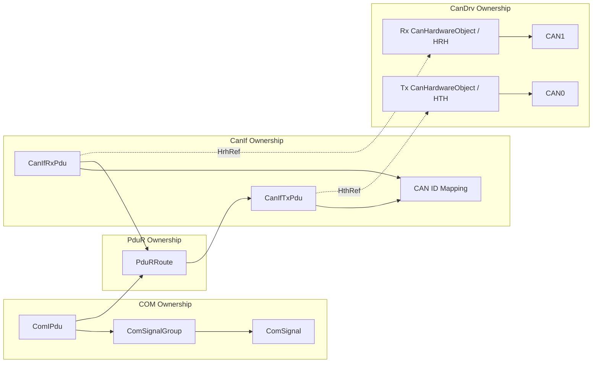
```mermaid
flowchart LR
    subgraph COM["COM Ownership"]
        SIG["ComSignal"]
        SG["ComSignalGroup"]
        IPDU["ComIPdu"]
        SG --> SIG
        IPDU --> SG
    end

    subgraph PDUR["PduR Ownership"]
        ROUTE["PduRRoute"]
    end

    subgraph CANIF["CanIf Ownership"]
        TX["CanIfTxPdu"]
        RX["CanIfRxPdu"]
        CANID["CAN ID Mapping"]
        TX --> CANID
        RX --> CANID
    end

    subgraph CANDRV["CanDrv Ownership"]
        HOHTX["Tx CanHardwareObject / HTH"]
        HOHRX["Rx CanHardwareObject / HRH"]
        C0["CAN0"]
        C1["CAN1"]
        HOHTX --> C0
        HOHRX --> C1
    end

    IPDU --> ROUTE
    ROUTE --> TX
    RX --> ROUTE
    TX -. HthRef .-> HOHTX
    RX -. HrhRef .-> HOHRX
```

---

## 6. Building Block View

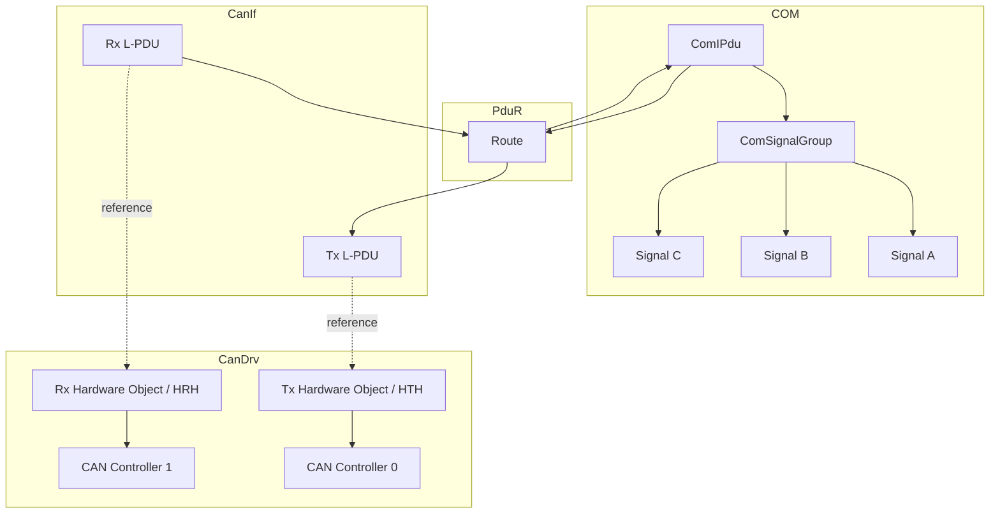
```mermaid
flowchart TB
    subgraph COM["COM"]
        IPDU["ComIPdu"]
        SG["ComSignalGroup"]
        S1["Signal A"]
        S2["Signal B"]
        S3["Signal C"]
        IPDU --> SG
        SG --> S1
        SG --> S2
        SG --> S3
    end

    subgraph PDUR["PduR"]
        ROUTE["Route"]
    end

    subgraph CANIF["CanIf"]
        TX["Tx L-PDU"]
        RX["Rx L-PDU"]
    end

    subgraph CANDRV["CanDrv"]
        HTH["Tx Hardware Object / HTH"]
        HRH["Rx Hardware Object / HRH"]
        C0["CAN Controller 0"]
        C1["CAN Controller 1"]
        HTH --> C0
        HRH --> C1
    end

    IPDU --> ROUTE
    ROUTE --> TX
    RX --> ROUTE
    ROUTE --> IPDU
    TX -. reference .-> HTH
    RX -. reference .-> HRH
```

---

## 7. Signal Slot Model

```text
MSB                                      LSB
┌───────────────────────────────────────────┐
│             Payload               │ U     │
└───────────────────────────────────────────┘
                                          bit0
```

Mandatory rules:

```text
SlotStartBit % 8 == 0
SlotLength % 8 == 0
PayloadBitLength = SlotLength - 1
```

| Slot Length | Payload Capacity | Update Bit |
|---:|---:|---:|
| 8 bit | 7 bit | 1 bit |
| 16 bit | 15 bit | 1 bit |
| 24 bit | 23 bit | 1 bit |
| 32 bit | 31 bit | 1 bit |

---

## 8. Signal Configuration

```yaml
signals:
  - name: VehicleSpeed
    id: 0
    data_type: uint16
    slot_start_bit: 0
    slot_length: 16

  - name: Gear
    id: 1
    data_type: uint8
    slot_start_bit: 16
    slot_length: 8

  - name: AliveCounter
    id: 2
    data_type: uint8
    slot_start_bit: 24
    slot_length: 8
```

Derived values:

```text
UpdateBitOffset = 0
PayloadLength   = SlotLength - 1
```

---

## 9. Signal Group Model

```yaml
signal_groups:
  - name: VehicleStatusGroup
    id: 0
    signals:
      - VehicleSpeed
      - Gear
      - AliveCounter
```

Relationship:

```text
Signal → Signal Group → I-PDU
```

A Signal does not need a direct `IPduRef`.

---

## 10. I-PDU Model

```yaml
ipdus:
  - name: VehicleStatusPdu
    id: 0
    global_pdu_id: 0x0010
    direction: tx
    length: 8
    signal_group: VehicleStatusGroup
    period_ms: 10
    initial_offset_ms: 1
    max_retries: 3
```

An I-PDU shall contain at least:

```text
PduId
GlobalPduId
Direction
Length
SignalGroupRef
TransmissionPeriod
InitialOffset
MaxRetries
RuntimeBuffer
```

`PduId` is a module-local handle. `GlobalPduId` is the system-wide identity used for cross-layer correlation and tracing.

---

## 11. COM Tx Runtime State

Each Tx I-PDU shall have:

```c
typedef struct
{
    uint16 counter;
    boolean pending;
    uint8 retry_count;
} Com_TxIpduRuntimeType;
```

```text
counter     = time until next nominal transmission occurrence
pending     = this I-PDU shall be transmitted as soon as possible
retry_count = number of retries already consumed after the initial failed attempt
```

`max_retries` is configuration, not runtime state.

The initial attempt is not counted as a retry.

```text
max_retries = 3
→ 1 initial attempt + 3 retries
→ maximum 4 total attempts for one pending occurrence
```

---

## 12. COM Main Function Timing

Part 1 uses:

```text
Com_MainFunctionTx() period = 1 ms
```

Every Tx I-PDU period and initial offset shall be an integer multiple of this base tick.

Example:

| I-PDU | Period | Initial Offset |
|---|---:|---:|
| VehicleStatus | 10 ms | 1 ms |
| EngineStatus | 20 ms | 5 ms |
| ClimateStatus | 50 ms | 12 ms |
| DiagnosticStatus | 100 ms | 25 ms |

`initial_offset_ms` is used to statically distribute I-PDU transmission times.

---

## 13. I-PDU Scheduling Model

Runtime/configuration values:

```text
periodTicks
initialOffsetTicks
counter
pending
retryCount
maxRetries
```

Initialization:

```text
counter = initialOffsetTicks
pending = FALSE
retryCount = 0
```

On each `Com_MainFunctionTx()` call:

1. Decrement `counter` if greater than zero.
2. If `counter` reaches zero:
   - if the I-PDU is not already pending, set `pending = TRUE` and reset `retry_count = 0`;
   - reload `counter = periodTicks` regardless of retry state.
3. If the I-PDU is pending, attempt transmission exactly once.
4. On `E_OK`: clear `pending`, reset `retry_count`, and clear Update Bits.
5. On failure with retry budget left: increment `retry_count` and keep `pending = TRUE`.
6. On failure after all retries are consumed: drop only the current occurrence, clear `pending`, reset `retry_count`, and keep Update Bits set.
7. Continue processing the next I-PDU regardless of the result.

Conceptual implementation:

```c
void Com_MainFunctionTx(void)
{
    for (PduIdType id = 0; id < COM_NUM_TX_IPDU; id++)
    {
        if (Runtime[id].counter > 0U)
        {
            Runtime[id].counter--;
        }

        if (Runtime[id].counter == 0U)
        {
            if (Runtime[id].pending == FALSE)
            {
                Runtime[id].pending = TRUE;
                Runtime[id].retry_count = 0U;
            }

            Runtime[id].counter = Config[id].periodTicks;
        }

        if (Runtime[id].pending == TRUE)
        {
            if (Com_TransmitIPdu(id) == E_OK)
            {
                Runtime[id].pending = FALSE;
                Runtime[id].retry_count = 0U;
                Com_ClearUpdateBits(id);
            }
            else if (Runtime[id].retry_count < Config[id].maxRetries)
            {
                Runtime[id].retry_count++;
            }
            else
            {
                Runtime[id].pending = FALSE;
                Runtime[id].retry_count = 0U;
                Com_ReportTxDrop(id);
                /* Update Bits remain set. */
            }
        }
    }
}
```

---

## 14. COM Dynamic Behavior Requirements

### COM-DYN-01 — Base Tick

`Com_MainFunctionTx()` shall execute every 1 ms.

### COM-DYN-02 — Period and Offset

Each Tx I-PDU shall define:

```text
period_ms
initial_offset_ms
```

Both shall be integer multiples of the COM MainFunction period.

### COM-DYN-03 — Become Pending

When an I-PDU reaches its nominal transmission occurrence:

```text
pending = TRUE
```

### COM-DYN-04 — Early Retry

A pending I-PDU shall be retried at the **next `Com_MainFunctionTx()` invocation**, not at the next I-PDU period.

```text
t = 10 ms → due → CAN_BUSY
t = 11 ms → retry
t = 12 ms → retry if still busy
```

### COM-DYN-05 — Non-blocking Retry

A failed transmission attempt shall not block processing of other I-PDUs.

Forbidden:

```c
while (Can_Write(...) == CAN_BUSY)
{
}
```

Required behavior:

```text
PDU0 → BUSY → remains pending
PDU1 → still processed
PDU2 → still processed
```

### COM-DYN-06 — Static Processing Order

I-PDUs shall be processed in static configuration order.

No priority, round-robin, or fairness scheduler is required.

### COM-DYN-07 — Latest Value Wins

Multiple missed periodic occurrences shall not create multiple queued transmissions.

If an I-PDU is already pending, another period expiration keeps:

```text
pending = TRUE
```

The COM buffer continues to accept new Signal values. The latest buffer state is transmitted when the request is accepted.

### COM-DYN-08 — No Schedule Drift

A `CAN_BUSY` condition shall not shift the nominal periodic schedule.

```text
Period = 10 ms
Nominal occurrences = 10, 20, 30, 40, ...
```

If the first request is accepted at 12 ms, the next nominal occurrence remains 20 ms, not 22 ms.

### COM-DYN-09 — Bounded Retry

Each Tx I-PDU shall define `max_retries`.

The initial transmission attempt is not counted as a retry.

```text
max_retries = 3
→ 1 initial attempt + 3 retries
→ maximum 4 total attempts
```

### COM-DYN-10 — Drop Current Occurrence

If the initial attempt and all configured retries fail, the current transmission occurrence shall be dropped.

```text
pending = FALSE
retry_count = 0
```

The I-PDU remains enabled and returns to normal periodic scheduling at the next nominal occurrence.

> Drop one transmission occurrence, not the I-PDU.

### COM-DYN-11 — Preserve Latest Data After Drop

Dropping an occurrence shall not clear Signal Update Bits.

The COM buffer remains valid and may continue to receive newer Signal values. At the next nominal occurrence, the latest current COM buffer shall be used.

---

## 15. `Com_SendSignal()` Behavior

```text
SignalId
   ↓
SignalConfig
   ↓
SignalGroup
   ↓
I-PDU
   ↓
check value range
   ↓
EncodedSignal = (Value << 1) | 1
   ↓
write Signal Slot
```

`Com_SendSignal()` shall not directly trigger CAN transmission.

---

## 16. Update Bit Clear Policy

Part 1 uses:

> Clear Update Bits after the lower communication stack accepts the transmission request.

If:

```text
PduR_ComTransmit() == E_OK
```

COM shall clear bit 0 of all Signal Slots belonging to the I-PDU.

Payload data shall remain unchanged.

If the lower layer returns `E_NOT_OK`, Update Bits remain set.

If the current occurrence is dropped after exhausting `max_retries`, Update Bits also remain set. A dropped occurrence is not a successful transmission.

---

## 17. PduR Model

```yaml
pdur_routes:
  - name: VehicleStatusRoute
    global_pdu_id: 0x0010

    source:
      module: COM
      pdu_ref: VehicleStatusPdu

    destination:
      module: CANIF
      pdu_ref: VehicleStatusTx
```

For mandatory **Direct CAN Binding**, PduR routes using local PDU handles:

```text
Source local PDU handle
        ↓
PduR route
        ↓
Destination local PDU handle
```

`GlobalPduId` provides one canonical system identity for configuration correlation, logging, debug, and trace. It does not have to be passed unchanged through every runtime API.

Direct CAN Binding uses:

```text
GlobalPduId ↔ CanIf L-PDU ↔ CAN ID
```

Because this mapping is one-to-one, PduR does not need to inspect payload data to identify the message.

PduR shall not understand Signal, Signal Slot, Update Bit, HTH, HRH, or Controller information.

### Optional Multiplexed Global PDU Extension

A later/advanced extension may allow several Global PDU IDs to share one CAN channel:

```text
GlobalPduId A ─┐
GlobalPduId B ─┼─→ Generic CanIf L-PDU → one CAN ID
GlobalPduId C ─┘
```

In this mode, `GlobalPduId` becomes explicit on wire.

The Global-PDU mapping/demultiplexing behavior is considered an **internal PduR responsibility**, not a separate AUTOSAR-like module.

```text
Rx:
Generic CanIf Rx L-PDU
        ↓
PduR Global PDU Demux
        ↓ extract GlobalPduId
GlobalPduId → local route handle
        ↓
COM
```

```text
Tx:
COM / local route
        ↓
PduR Global PDU Mapping
        ↓ add GlobalPduId
Generic CanIf Tx L-PDU
```

This multiplexed mode is not mandatory to implement in Part 1.

---

## 18. CanIf Tx L-PDU Model

```yaml
canif_tx_pdus:
  - name: VehicleStatusTx
    id: 0
    can_id: 0x321
    hth_ref: HthCan1Tx
```

CanIf resolves:

```text
TxPduId → CAN ID + HTH
```

For Direct CAN Binding, generated/system configuration also provides:

```text
GlobalPduId ↔ TxPduId ↔ CAN ID
```

This allows the same logical identity to appear in cross-layer trace/debug information without adding `GlobalPduId` bytes to the CAN payload.

CanIf does not own the HTH.

---

## 19. CanDrv Tx Hardware Object Model

```yaml
can_hw_objects:
  - name: HthCan1Tx
    object_id: 2
    type: transmit
    controller_ref: CAN1
```

```text
HTH 2 → Tx CanHardwareObject → CAN1
```

When CanIf calls:

```c
Can_Write(HTH_2, &CanPdu);
```

CanDrv resolves the corresponding Controller and physical Tx resource.

---

## 20. Multiple Controller Model

```text
CanDrv
│
├── CAN0
│   ├── HTH 0
│   └── HRH 1
│
└── CAN1
    ├── HTH 2
    └── HRH 3
```

Since HOH IDs are unique within the CanDrv instance:

```text
HTH / HRH → CanHardwareObject → Controller
```

is uniquely resolvable.

---

## 21. Training Rx Interface

Part 1 uses:

```c
void CanIf_RxIndication(
    Can_HwHandleType Hrh,
    const Can_RxPduType *RxPdu
);
```

Example:

```c
typedef struct
{
    Can_IdType      CanId;
    PduLengthType   Length;
    uint8           *DataPtr;
} Can_RxPduType;
```

Meaning:

```text
Hrh                = which Rx Hardware Object?
RxPdu.CanId        = which CAN identifier?
DataPtr + Length   = what payload?
```

---

## 22. CanDrv Rx Hardware Object Model

```yaml
can_hw_objects:
  - name: HrhCan0Basic
    object_id: 1
    type: receive
    controller_ref: CAN0

  - name: HrhCan1Basic
    object_id: 3
    type: receive
    controller_ref: CAN1
```

Therefore:

```text
HRH 1 → CAN0
HRH 3 → CAN1
```

No separate `ControllerId` parameter is required in the training API.

---

## 23. BasicCAN Rx Identification

```text
HRH 3 / CAN1
│
├── CAN ID 0x100 → RxPduA
├── CAN ID 0x200 → RxPduB
└── CAN ID 0x321 → VehicleStatusRx
```

CanIf lookup:

```text
HRH + CAN ID → Rx L-PDU
```

---

## 24. CanIf Rx L-PDU Model

```yaml
canif_rx_pdus:
  - name: VehicleStatusRx
    id: 0
    can_id: 0x321
    hrh_ref: HrhCan1Basic
```

CanIf owns the CAN-specific Rx mapping:

```text
HRH + CAN ID → Rx L-PDU
```

For Direct CAN Binding:

```text
HRH + CAN ID
      ↓
CanIf Rx L-PDU
      ↓ configuration mapping
GlobalPduId
```

Therefore `GlobalPduId` is recoverable for trace/debug even though it is not serialized on the CAN wire.

CanDrv owns the referenced HRH and Controller relationship.

---

## 25. `CAN_BUSY` Behavior

If:

```text
Can_Write() == CAN_BUSY
```

then CanIf returns `E_NOT_OK` and PduR propagates the failure upward.

COM shall:

```text
keep Update Bits
keep pending = TRUE
retry at next Com_MainFunctionTx()
continue processing other I-PDUs
```

Each failed attempt consumes retry budget according to `max_retries`.

If the retry budget is exhausted:

```text
drop current transmission occurrence
pending = FALSE
retry_count = 0
keep Update Bits
wait for the next nominal period
```

The I-PDU itself is not disabled.

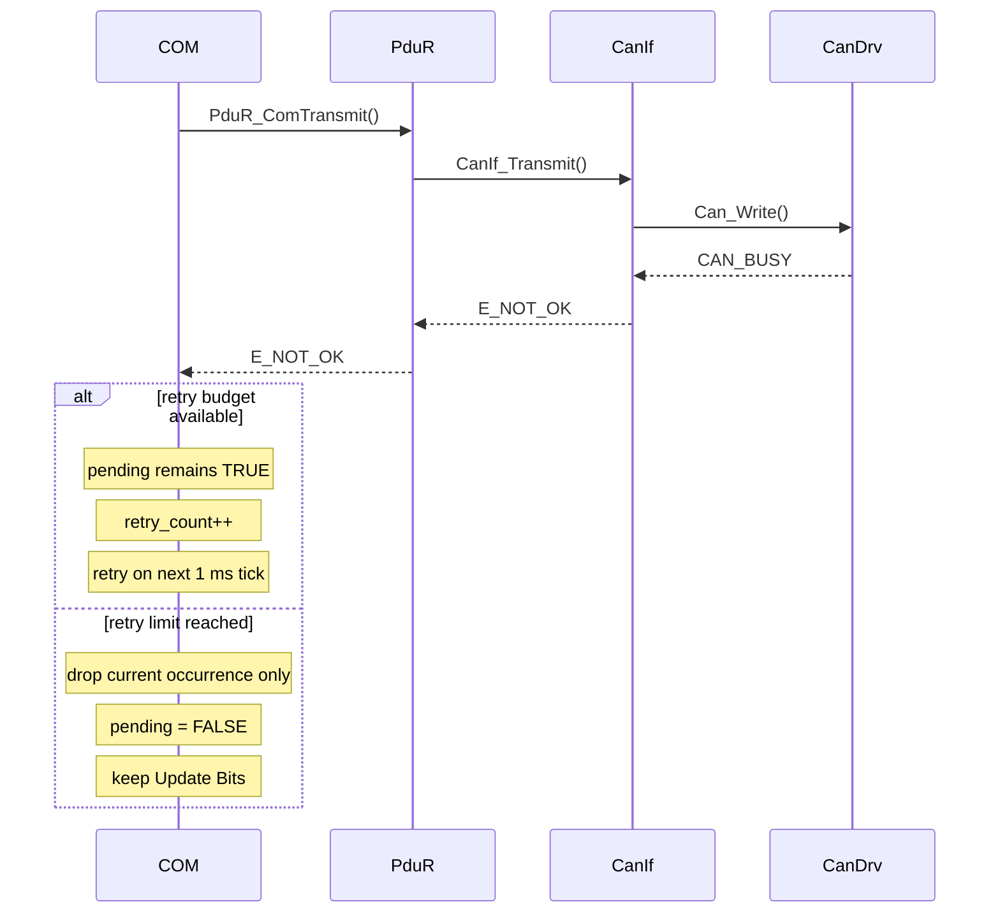
```mermaid
sequenceDiagram
    participant COM
    participant PduR
    participant CanIf
    participant CanDrv

    COM->>PduR: PduR_ComTransmit()
    PduR->>CanIf: CanIf_Transmit()
    CanIf->>CanDrv: Can_Write()

    CanDrv-->>CanIf: CAN_BUSY
    CanIf-->>PduR: E_NOT_OK
    PduR-->>COM: E_NOT_OK

    alt retry budget available
        Note over COM: pending remains TRUE
        Note over COM: retry_count++
        Note over COM: retry on next 1 ms tick
    else retry limit reached
        Note over COM: drop current occurrence only
        Note over COM: pending = FALSE
        Note over COM: keep Update Bits
    end
```

---

## 26. CAN Driver Main Function

If the training CAN Driver uses polling for Tx completion:

```text
Can_MainFunction_Write()
```

shall detect completed Tx requests.

```text
Can_Write()
   ↓
request accepted
   ↓
hardware transmitting
   ↓
Can_MainFunction_Write()
   ↓
Tx complete detected
   ↓
CanIf_TxConfirmation()
```

Important:

```text
Can_Write() accepted ≠ physical Tx completed
TxConfirmation      ≠ remote acknowledgement
```

---

## 27. Recommended 1 ms Main Loop Order

For a polling-based CAN Driver:

```text
1 ms scheduler tick
   │
   ├── Can_MainFunction_Write()
   ├── Can_MainFunction_Read()    // if Rx polling is used
   └── Com_MainFunctionTx()
```

This allows completed CAN Tx resources to be released before COM retries pending I-PDUs.

---

## 28. Tx Dynamic State

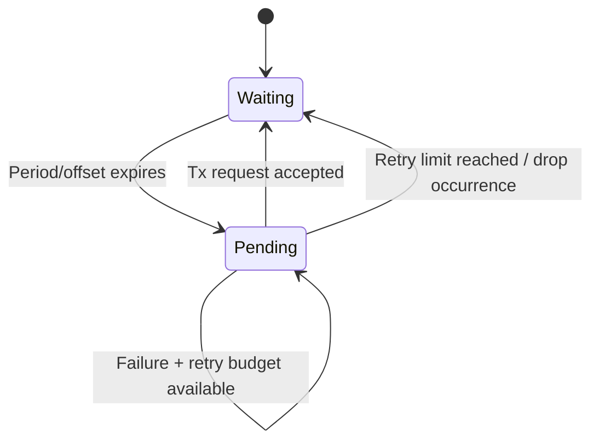
```mermaid
stateDiagram-v2
    [*] --> Waiting

    Waiting --> Pending : Period/offset expires
    Pending --> Waiting : Tx request accepted
    Pending --> Pending : Failure + retry budget available
    Pending --> Waiting : Retry limit reached / drop occurrence
```

`Pending` means:

> This I-PDU shall be transmitted as soon as possible.

There is no persistent `Dropped` state. A drop is an event: the current occurrence is abandoned and the I-PDU returns to `Waiting`.

No queued occurrences are created.

---

## 29. CAN Hardware Tx State

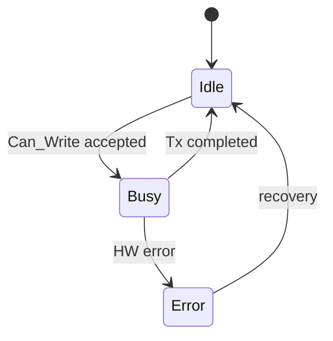
```mermaid
stateDiagram-v2
    [*] --> Idle
    Idle --> Busy : Can_Write accepted
    Busy --> Idle : Tx completed
    Busy --> Error : HW error
    Error --> Idle : recovery
```

COM scheduling state and CAN hardware state are independent.

---

## 30. Complete Tx Runtime View

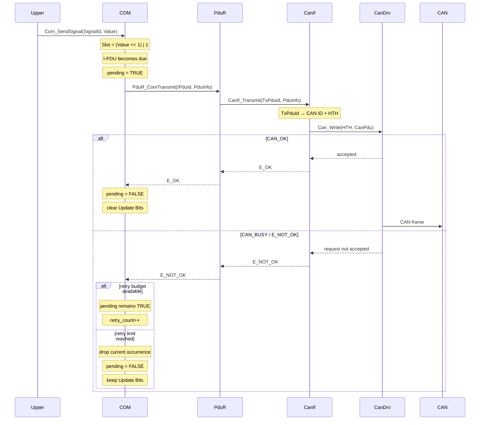
```mermaid
sequenceDiagram
    participant Upper
    participant COM
    participant PduR
    participant CanIf
    participant CanDrv
    participant CAN

    Upper->>COM: Com_SendSignal(SignalId, Value)
    Note over COM: Slot = (Value << 1) | 1

    Note over COM: I-PDU becomes due
    Note over COM: pending = TRUE

    COM->>PduR: PduR_ComTransmit(IPduId, PduInfo)
    PduR->>CanIf: CanIf_Transmit(TxPduId, PduInfo)
    Note over CanIf: TxPduId → CAN ID + HTH
    CanIf->>CanDrv: Can_Write(HTH, CanPdu)

    alt CAN_OK
        CanDrv-->>CanIf: accepted
        CanIf-->>PduR: E_OK
        PduR-->>COM: E_OK
        Note over COM: pending = FALSE
        Note over COM: clear Update Bits
        CanDrv->>CAN: CAN frame
    else CAN_BUSY / E_NOT_OK
        CanDrv-->>CanIf: request not accepted
        CanIf-->>PduR: E_NOT_OK
        PduR-->>COM: E_NOT_OK
        alt retry budget available
            Note over COM: pending remains TRUE
            Note over COM: retry_count++
        else retry limit reached
            Note over COM: drop current occurrence
            Note over COM: pending = FALSE
            Note over COM: keep Update Bits
        end
    end
```

---

## 31. Complete Rx Runtime View

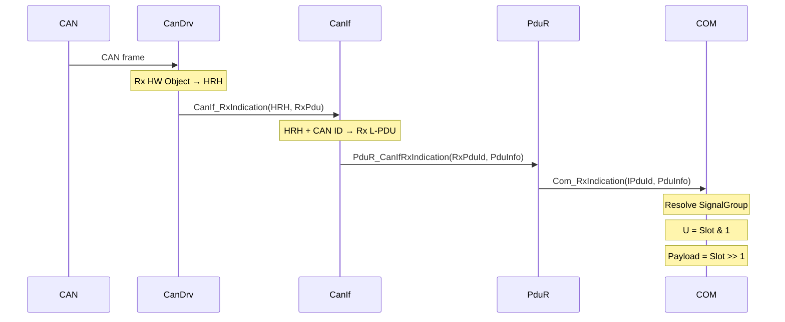
```mermaid
sequenceDiagram
    participant CAN
    participant CanDrv
    participant CanIf
    participant PduR
    participant COM

    CAN->>CanDrv: CAN frame
    Note over CanDrv: Rx HW Object → HRH
    CanDrv->>CanIf: CanIf_RxIndication(HRH, RxPdu)
    Note over CanIf: HRH + CAN ID → Rx L-PDU
    CanIf->>PduR: PduR_CanIfRxIndication(RxPduId, PduInfo)
    PduR->>COM: Com_RxIndication(IPduId, PduInfo)
    Note over COM: Resolve SignalGroup
    Note over COM: U = Slot & 1
    Note over COM: Payload = Slot >> 1
```

---

## 32. Tx vs Rx Mapping

```text
TX = logical → hardware
RX = hardware/network → logical
```

Tx:

```text
Tx L-PDU → CAN ID + HTH → CanDrv → Controller
```

Rx:

```text
Controller/HW → HRH + CAN ID → CanIf → Rx L-PDU
```

---

## 33. HOH Namespace Rule

`CanObjectId` / HOH shall be unique within one CanDrv instance.

HTH and HRH share the same ID range.

Valid:

```text
CAN0
├── HTH 0
└── HRH 1

CAN1
├── HTH 2
└── HRH 3
```

This allows:

```text
HOH → unique CanHardwareObject → unique Controller
```

---

## 34. Static Model View

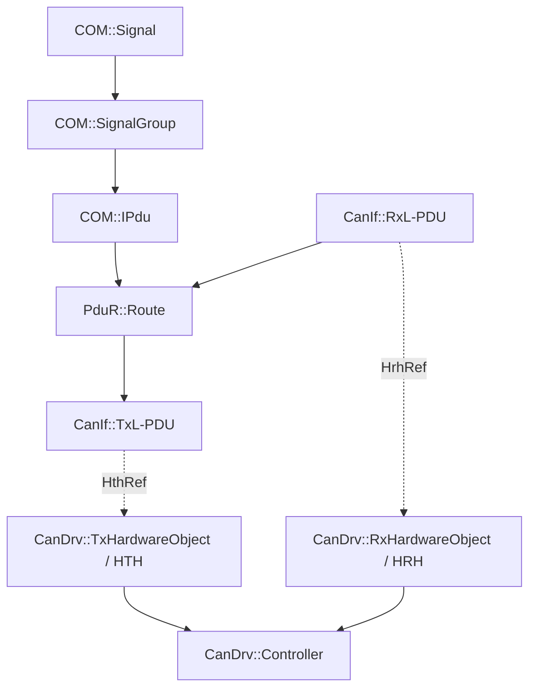
```mermaid
flowchart TD
    SIG["COM::Signal"]
    SG["COM::SignalGroup"]
    IPDU["COM::IPdu"]
    ROUTE["PduR::Route"]
    TX["CanIf::TxL-PDU"]
    RX["CanIf::RxL-PDU"]
    HTH["CanDrv::TxHardwareObject / HTH"]
    HRH["CanDrv::RxHardwareObject / HRH"]
    CTRL["CanDrv::Controller"]

    SIG --> SG
    SG --> IPDU
    IPDU --> ROUTE
    ROUTE --> TX
    RX --> ROUTE
    TX -. HthRef .-> HTH
    RX -. HrhRef .-> HRH
    HTH --> CTRL
    HRH --> CTRL
```

Dotted arrows represent cross-module references, not ownership.

---

## 35. Runtime Object vs Configuration Object

### Configuration Objects

```text
ComSignal
ComSignalGroup
ComIPdu
PduRRoute
CanIfTxPdu
CanIfRxPdu
CanHardwareObject
CanController
```

### Runtime Objects / Parameters

```text
PduInfoType
Can_PduType
Can_RxPduType
TxPduId
RxPduId
HTH
HRH
Com_TxIpduRuntimeType
```

---

## 36. Model Validation Requirements

### COM

- `SlotStartBit % 8 == 0`
- `SlotLength % 8 == 0`
- `SlotLength >= 8`
- Signal Slots shall not overlap.
- Signal Slots shall remain within I-PDU length.
- Signal value shall fit within `SlotLength - 1` payload bits.

### Signal Group

- A Signal Group shall not be empty.
- One Signal shall belong to only one Signal Group.
- One Signal Group shall belong to only one I-PDU.

### I-PDU

- An I-PDU shall contain exactly one Signal Group.
- Every I-PDU shall have one `GlobalPduId`.
- `GlobalPduId` shall be unique within the complete system communication model.
- Tx I-PDU period shall be valid.
- `period_ms` shall be a multiple of the COM MainFunction period.
- `initial_offset_ms` shall be a multiple of the COM MainFunction period.
- `max_retries` shall be a non-negative integer supported by the runtime counter type.

### PduR

- Source PDU shall exist.
- Destination PDU shall exist.
- Each route shall be traceable to exactly one `GlobalPduId`.
- In mandatory Direct CAN Binding, one `GlobalPduId` shall resolve to exactly one CanIf L-PDU/CAN ID mapping.

### CanIf Tx

- CAN ID shall be valid.
- `HthRef` shall exist.
- Referenced Hardware Object shall be Tx type.

### CanIf Rx

- CAN ID shall be valid.
- `HrhRef` shall exist.
- Referenced Hardware Object shall be Rx type.
- `HRH + CAN ID` shall uniquely identify one Rx L-PDU.

### CanDrv

- `CanObjectId` shall be unique in one CanDrv instance.
- HTH and HRH shall share one common ID range.
- Every Hardware Object shall reference exactly one Controller.
- HOH shall uniquely resolve a Hardware Object and Controller.

---

## 37. Training Model vs AUTOSAR Classic

| Topic | Part 1 Training Model | AUTOSAR Classic |
|---|---|---|
| Signal hierarchy | Signal → Signal Group → I-PDU | More general |
| I-PDU contents | Exactly 1 Signal Group | Not restricted this way |
| Signal representation | Byte-aligned Signal Slot | Flexible bit-level mapping |
| Update Bit | bit0 of Signal Slot | Configurable |
| Slot Start | Byte aligned | Flexible |
| Slot Length | Multiple of 8 | Flexible |
| Tx Mode | PERIODIC only | Multiple Tx modes |
| I-PDU scheduling | Period + InitialOffset | Richer configuration |
| Global logical identity | Mandatory system-wide `GlobalPduId` for model/trace | AUTOSAR uses configured PDU identities/handles; no identical training rule is required |
| Direct CAN optimization | `GlobalPduId ↔ L-PDU ↔ CAN ID`; Global ID implicit on wire | CAN configuration can identify PDUs without a generic global-ID payload header |
| Multiplexed Global PDU mode | Optional architecture extension; PduR may add/strip GlobalPduId | Not the Part 1 AUTOSAR baseline |
| Retry | next COM MainFunction tick | More complete stack behavior possible |
| Retry limit | bounded by `max_retries`; current occurrence may be dropped | Depends on configured modules/features |
| Missed periods | coalesced | Depends on configured behavior |
| Scheduler order | static config order | Not limited to this training policy |
| CanIf Tx mapping | CAN ID + HTH ref | More general configuration |
| CanHardwareObject owner | CanDrv | CanDrv |
| Controller owner | CanDrv | CanDrv |
| Multiple Controllers | Supported | Supported |
| Tx Controller selection | HTH → Controller | Same core concept |
| Training Rx API | `RxIndication(HRH, RxPdu)` | `Can_HwType + PduInfoType` |
| Rx Controller identity | derived from unique HRH | explicit ControllerId available |
| Rx CAN ID | `RxPdu.CanId` | `Can_HwType.CanId` |
| BasicCAN lookup | `HRH + CAN ID → L-PDU` | Same core concept |
| CanIf Tx buffering | Not supported | May be supported |
| CanTp | Out of scope | Supported |
| Deadline monitoring | Out of scope | Supported |

---

## 38. Required Deliverables

1. Signal model.
2. Signal Slot model.
3. Signal Group model.
4. I-PDU model including `GlobalPduId`.
5. Direct CAN Binding map: `GlobalPduId ↔ CanIf L-PDU ↔ CAN ID`.
6. I-PDU period, initial offset, and `max_retries` configuration.
7. COM Tx runtime state model including `retry_count`.
8. PduR route model.
9. CanIf Tx L-PDU model.
10. CanIf Rx L-PDU model.
11. CanDrv Hardware Object model.
12. Multiple Controller model.
13. Configuration Ownership View.
14. Building Block View.
15. Tx Dynamic Behavior View.
16. Rx Runtime View.
17. `CAN_BUSY` bounded retry and drop behavior.
18. End-to-End Tx/Rx Trace View using `GlobalPduId`.
19. Validation report.

---

## 39. Acceptance Criteria

Students shall be able to explain:

```text
Who owns ComSignal?
Who owns ComIPdu?
Who owns CanIfTxPdu?
Who owns CAN ID mapping?
Who owns HTH/HRH?
Who owns CanController?
Why does CanIf reference HTH but not own it?
How does HTH identify the Tx Controller?
How does HRH identify the Rx Controller?
Why is ControllerId not required in the training API?
Why does HRH + CAN ID identify an Rx L-PDU?
Why does Com_SendSignal() not directly transmit?
Why is I-PDU the scheduling unit?
What is the difference between GlobalPduId and module-local PduId handles?
Why can GlobalPduId be implicit on the CAN wire in Direct CAN Binding?
How can HRH + CAN ID be mapped back to GlobalPduId for tracing?
Why is retry performed at the next MainFunction tick?
Why must retry be non-blocking?
Why is retry bounded by max_retries?
What exactly is dropped when the retry limit is reached?
Why are Update Bits preserved when an occurrence is dropped?
Why do missed occurrences not create a queue?
Why does CAN_BUSY not shift the nominal periodic schedule?
```

Tx shall resolve:

```text
Signal
 ↓
Signal Group
 ↓
I-PDU
 ↓
PduR
 ↓
CanIf Tx L-PDU
 ↓
CAN ID + HTH
 ↓
CanDrv Hardware Object
 ↓
Controller
```

Rx shall resolve:

```text
Controller
 ↓
Rx Hardware Object / HRH
 ↓
HRH + CAN ID
 ↓
CanIf Rx L-PDU
 ↓
PduR
 ↓
I-PDU
 ↓
Signal Group
 ↓
Signal
```

---

## 40. Architecture Summary

```text
                STATIC OWNERSHIP

COM
├── Signal
├── SignalGroup
└── I-PDU
       │
       ▼
PduR
└── Route
       │
       ▼
CanIf
├── Tx L-PDU ────────┐
├── Rx L-PDU ───────┐│
└── CAN ID Mapping  ││
                     ││ refs
                     ▼▼
CanDrv
├── HTH / Tx HW Object
├── HRH / Rx HW Object
└── Controllers
```

Dynamic Tx:

```text
Com_SendSignal()
      ↓
update current COM buffer
      ↓
I-PDU nominal time reached
      ↓
pending = TRUE
      ↓
try once per Com_MainFunctionTx()
      │
      ├── E_OK
      │     ↓
      │   pending = FALSE
      │   clear Update Bits
      │
      └── BUSY / E_NOT_OK
            ↓
          keep pending
          retry next 1 ms tick
```

Global identity policy:

```text
GlobalPduId
=
CANONICAL SYSTEM-WIDE PDU IDENTITY
```

```text
Mandatory Direct CAN Binding
=
GlobalPduId ↔ CanIf L-PDU ↔ CAN ID
```

```text
GlobalPduId is implicit on the CAN wire in Direct Binding
but remains available through configuration for trace/debug.
```

Core dynamic policy:

```text
EARLY RETRY
+
NON-BLOCKING
+
BOUNDED RETRY
+
DROP CURRENT OCCURRENCE AFTER RETRY LIMIT
+
LATEST VALUE WINS
+
NO SCHEDULE DRIFT
```
```

---

<a id="cantpstudentguide(1)md"></a>
## 📄 File: `CanTp_Student_Guide (1).md`

**Chức năng / Mô tả:** Cẩm nang hướng dẫn chuyên sâu ISO 15765-2 CanTp: SF, FF, CF, FC, timeouts N_As, N_Bs, N_Cr và STmin  
**Đường dẫn tương đối:** `CanTp_Student_Guide (1).md`  
**Kích thước:** 62,044 bytes (60.6 KB) | **Số dòng:** 1,047 dòng

```markdown
# CanTp — Hướng dẫn triển khai đầy đủ (Phase 1–3)

**Phiên bản:** Student Implementation Guide v2.0 · **Đối tượng:** nhóm đã hoàn thành COM/PduR/CanIf/CanDrv Part 1 · **Trạng thái:** tài liệu giao bài tổng hợp theo Architecture Baseline v1.0 đã duyệt.  
**Cách sử dụng:** đọc mục 1–7 trước khi code, triển khai theo mục 8 (Phase 1) → mục 9 (Phase 2) → mục 10 (Phase 3), nghiệm thu theo mục 11. **Chỉ có ba phase, không có Phase 4 trong phạm vi bài này.**

> Đây là **tài liệu dành cho đào tạo**, mô phỏng những nguyên lý của CAN transport, không phải thư viện ISO-TP/AUTOSAR production-ready. Những đoạn C là *pseudo-C/khung interface* cần điều chỉnh với `Std_Types.h`, `PduInfoType`, quy ước ID và driver Part 1 đã có; không được coi là source code có thể build nguyên xi.

## 0. Bức tranh tổng thể: ba phase, một sản phẩm

| Phase | Xây dựng | Test phải đạt | Khi nào làm |
|---|---|---|---|
| **1 — Happy path** | SF, FF/CF, FC(CTS), SN, BS, STmin, Rx queue, hoàn tất N-SDU | **T01–T03** | Đầu tiên, bắt buộc |
| **2 — Retry & Timeout** | Retry Data/FC khi CanIf từ chối; `N_As/N_Ar/N_Bs/N_Cr`; abort và late confirmation | **T04–T08, T13**; chạy lại T01–T03 | Sau khi Phase 1 pass |
| **3 — Defensive behavior** | Sai SN/length, queue đầy, OVFLW, replacement cùng connection, bảo vệ FC pending | **T09–T12, T14**; regression tất cả | Sau Phase 2 |

T01–T14 là **14 test đã duyệt**; không bổ sung phase hoặc protocol mới. Nếu sát deadline: nộp Phase 1 với log rõ ràng, triển khai Phase 2 tiếp theo, ghi trung thực phần Phase 3 chưa hoàn tất; không ghi PASS khi chưa có evidence.

### 0.1 Định nghĩa thành công

- `CanTp_Transmit(...) == E_OK` **chỉ có nghĩa request được nhận**, không phải CAN message đã truyền xong.
- `CanTp_TxConfirmation(dataNPduId)` từ CanIf: **một Data frame** (SF/FF/CF) được xác nhận cục bộ.
- `PduR_CanTpTxConfirmation(txNSduId, result)` từ CanTp lên PduR: **toàn bộ N-SDU** đã hoàn tất hoặc abort, **một lần** cho mỗi Tx request được chấp nhận.
- `PduR_CanTpRxIndication(rxNSduId, E_OK)` chỉ phát **sau khi Application queue slot ở READY**.
- Không có Application ACK/NACK: `TxConfirmation(E_OK)` không chứng minh Application bên kia đã đọc hoặc xử lý block.

---

## 1. Kiến trúc & mapping: đừng nhầm N-SDU với N-PDU

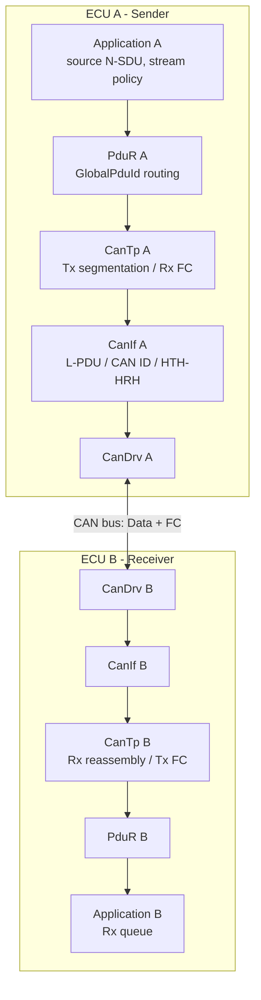
```mermaid
flowchart TB
    subgraph EA[ECU A - Sender]
      AA[Application A\nsource N-SDU, stream policy] --> PA[PduR A\nGlobalPduId routing]
      PA --> TA[CanTp A\nTx segmentation / Rx FC]
      TA --> IA[CanIf A\nL-PDU / CAN ID / HTH-HRH]
      IA --> DA[CanDrv A]
    end
    subgraph EB[ECU B - Receiver]
      DB[CanDrv B] --> IB[CanIf B]
      IB --> TB[CanTp B\nRx reassembly / Tx FC]
      TB --> PB[PduR B]
      PB --> AB[Application B\nRx queue]
    end
    DA <-->|CAN bus: Data + FC| DB
```

**Large-message path:** `App → PduR → CanTp → CanIf → CanDrv → CAN` và chiều ngược lại. **Không truyền payload lớn qua COM**, COM scheduling 1 ms của Part 1 vẫn độc lập. PduR **không** thêm một full-message buffer hay adapter module mới.

### 1.1 Ví dụ mapping một dedicated connection

| Ý nghĩa | ECU A | ECU B |
|---|---|---|
| Data (SF/FF/CF) | Tx Data N-PDU → CanIf Tx L-PDU → CAN ID ví dụ `0x650` | CAN ID `0x650` → CanIf Rx L-PDU → Rx Data N-PDU |
| Flow Control | CAN ID ví dụ `0x658` → CanIf Rx L-PDU → Rx FC N-PDU | Tx FC N-PDU → CanIf Tx L-PDU → CAN ID `0x658` |
| Application | App Tx GlobalPduId → PduR route → Tx N-SDU ID | Rx N-SDU ID → PduR route → App Rx GlobalPduId |

`0x650`, `0x658` là **CAN ID minh họa**, không phải cấu hình bắt buộc. ID của `GlobalPduId`, N-SDU, N-PDU và L-PDU nằm ở **namespace khác nhau**, không được giả định số nguyên giống nhau. **Một Data Tx N-PDU** dùng chung cho FF và tất cả CF; **FC dùng N-PDU riêng**. Part 2 dùng GlobalPduId *implicit*, **không đóng gói GlobalPduId lên CAN payload**.

### 1.2 Configuration tối thiểu

```c
#define CANTP_MAX_NSDU        62U
#define CANTP_CHUNK_CAPACITY  64U
#define CANTP_FRAME_LENGTH     8U
#define CANTP_BS               4U
#define CANTP_STMIN_MS         5U
#define CANTP_MAX_RETRIES      3U  /* số RETRY, không tính initial */
#define CANTP_N_AS_MS        100U
#define CANTP_N_AR_MS        100U
#define CANTP_N_BS_MS        100U
#define CANTP_N_CR_MS        100U
```

- Classic CAN, Normal Addressing, **mọi CanTp N-PDU dài đúng 8 byte**; TX pad `00`; RX bỏ qua *giá trị* padding và chỉ copy số byte payload thực.
- CanIf kiểm tra `Length == 8` **chỉ với L-PDU đã map cho CanTp**, không áp ràng buộc này cho mọi COM PDU.
- SF: 1–7 byte; FF: 8–62 byte; mỗi CF tối đa 7 byte. Không cần truyền N-SDU >62 hay refill chunk.
- BS=4, STmin=5 ms cố định. Sender chỉ chấp nhận CTS có đúng BS/STmin này; OVFLW thì abort. Không triển khai FC(WAIT).
- Task/polling tick 1 ms. Các timer dùng cấu hình 100 ms **riêng ý nghĩa**, mặc dù có thể dùng một deadline cho mỗi state không chồng nhau.

---

## 2. Wire format và cách tự tính frame

Mỗi frame phát ra có 8 byte; cột PCI là các byte đầu của payload CAN trong Normal Addressing.

| Frame | Cấu trúc | Giải thích |
|---|---|---|
| SF | `[0x0L, D0..D(L-1), padding]` | `L=1..7`; 1 byte PCI |
| FF | `[0x10 \| ((L>>8)&0x0F), L&0xFF, D0..D5]` | `FF_DL` **12-bit** trải trên hai byte PCI |
| CF | `[0x20 \| SN, data≤7, padding]` | SN bốn bit; bắt đầu 1, modulo 16, **không reset sau FC** |
| FC CTS | `30 04 05 00 00 00 00 00` | FS=0, BS=4, STmin=5 ms |
| FC OVFLW | `32 00 00 00 00 00 00 00` | FS=2, receiver từ chối FF; byte còn lại trong ví dụ mock bằng 0 |

**Cách tính FF:** N-SDU dài 62 (`0x003E`) → byte 0 `0x10`, byte 1 `0x3E`, không được chỉ lưu độ dài trong một byte khi viết công thức. `FF_DL=8..62` mới là phân mảnh hợp lệ ở bài này.

**Ví dụ SF 5 byte** (`D=00 01 02 03 04`):

```text
CAN Data: 05 00 01 02 03 04 00 00
          ^^ length=5       ^^ ^^ padding
```

**Ví dụ FF của N-SDU 20 byte:** PCI `10 14`, rồi sáu byte `00 01 02 03 04 05`. Receiver lấy `20` từ `FF_DL`, **không** lấy `DLC=8` làm tổng message length.

**Ví dụ CF cuối chỉ còn 2 byte:** `2N DD DD 00 00 00 00 00`. Receiver phải dùng `min(7, totalLength - receivedLength)`, không append cả 7 byte padding.

---

## 3. Memory ownership & queue: ai cấp phát, ai được sửa?

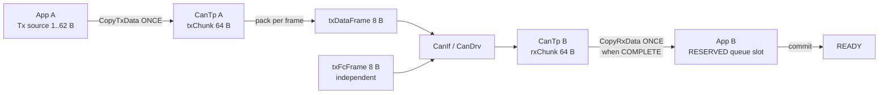
```mermaid
flowchart LR
   AS[App A\nTx source 1..62 B] -->|CopyTxData ONCE| TC[CanTp A\ntxChunk 64 B]
   TC -->|pack per frame| DF[txDataFrame 8 B]
   DF --> CI[CanIf / CanDrv]
   CI --> RC[CanTp B\nrxChunk 64 B]
   RC -->|CopyRxData ONCE\nwhen COMPLETE| AQ[App B\nRESERVED queue slot]
   AQ -->|commit| READY[READY]
   FC[txFcFrame 8 B\nindependent] --> CI
```

| Buffer/flag | Owner | Khi nào được thay đổi? |
|---|---|---|
| Application Tx source | App A | Giữ nguyên đến final Tx success; nếu failure giữ lại để App tự quyết định retry. |
| `txChunkBuffer[64]` | CanTp A | Snapshot **một lần** cho N-SDU 1..62; không refill. |
| `txDataFrame[8]` | CanTp A | Build **một lần/frame**; bất biến qua các lần CanIf trả E_NOT_OK và lúc đang chờ confirmation. |
| `rxChunkBuffer[64]` | CanTp B | Nhận FF 6 B và append CF, chỉ nội bộ, không flush ở ranh giới BS. |
| Application Rx queue slot | App B | `FREE → RESERVED → READY` chỉ khi N-SDU hoàn chỉnh; lỗi `RESERVED → FREE`. |
| `txFcFrame[8]` | CanTp B | Buffer riêng cho CTS/OVFLW; không ghi đè nếu FC đang pending. |
| `txPduPending` / `fcTxPending` | CanTp | TRUE khi CanIf đã accept Data/FC nhưng chưa có matching confirmation. **Độc lập** logical session state. |

**PduR chỉ route và chuyển tiếp các buffer callbacks, không giữ bản copy full N-SDU.** `CopyRxData` một lần ở cuối, `CopyTxData` một lần ở đầu. Với SF, reserve/copy/READY có thể xảy ra trong một lần xử lý SF, không có FC.

Ví dụ queue hai slot:

```text
Trước FF:       slot0=READY   slot1=FREE
FF valid:       slot0=READY   slot1=RESERVED  (chỉ lưu FF vào rxChunk)
CF1..CF7:      slot0=READY   slot1=RESERVED  (App KHÔNG đọc partial)
CF final:      CopyRxData(62) -> slot1=READY -> RxIndication(E_OK)
Sai SN ở CF7:   slot1=FREE -> RxIndication(E_NOT_OK); slot0 không đổi
```

Chỉ một nơi được release reservation khi lỗi, ví dụ trong nhánh App/PduR được kích bởi `RxIndication(E_NOT_OK)`; **không release lại trong CanTp nếu callback đã release**.

---

## 4. API names, direction và contract bắt buộc

**Chữ ký gợi ý dành cho mock**, giữ type/header Part 1 nếu đã có; đừng tạo `Std_ReturnType`, `PduInfoType` phiên bản thứ hai. Các prototype callback là interface đào tạo, **không khẳng định giống nguyên văn AUTOSAR production**.

```c
/* App -> PduR: use the project's existing entry, e.g. */
Std_ReturnType PduR_Transmit(PduIdType appTxGlobalPduId,
                             const PduInfoType *request);

/* PduR -> CanTp: return E_OK = request accepted, NOT final success. */
Std_ReturnType CanTp_Transmit(PduIdType txNSduId,
                               const PduInfoType *request);

/* CanTp -> PduR -> App: ONE snapshot, exactly length bytes. */
BufReq_ReturnType PduR_CanTpCopyTxData(PduIdType txNSduId,
                                       uint8 *dst,
                                       PduLengthType length);

/* CanTp -> PduR -> App: ONE final result per ACCEPTED Tx request. */
void PduR_CanTpTxConfirmation(PduIdType txNSduId,
                               Std_ReturnType result);

/* CanTp -> PduR -> App: reserve one Rx queue slot. */
BufReq_ReturnType PduR_CanTpStartOfReception(PduIdType rxNSduId,
                                              PduLengthType totalLength);

/* CanTp -> PduR -> App: ONE complete N-SDU copy. */
BufReq_ReturnType PduR_CanTpCopyRxData(PduIdType rxNSduId,
                                        const uint8 *completeData,
                                        PduLengthType length);

/* CanTp -> PduR -> App: ONE final result per started Rx session. */
void PduR_CanTpRxIndication(PduIdType rxNSduId,
                             Std_ReturnType result);

/* CanIf -> CanTp: upper-layer N-PDU handle configured per Data/FC. */
void CanTp_RxIndication(PduIdType rxNPduId,
                         const PduInfoType *frame);
void CanTp_TxConfirmation(PduIdType txNPduId);

/* CanTp -> CanIf: Data or FC L-PDU handle; accepted != confirmed. */
Std_ReturnType CanIf_Transmit(PduIdType txLPduId,
                               const PduInfoType *frame);

void CanTp_MainFunction(void);  /* scheduling tick = 1 ms */
```

### 4.1 Mỗi API phải làm gì?

| API | Hành vi đúng | Sai lầm phổ biến |
|---|---|---|
| `CanTp_Transmit` | Reject ngay nếu len ngoài 1..62, active hoặc Data N-PDU locked; accepted request đi qua snapshot. | Trả `E_OK` nghĩa đã gửi hết. |
| `PduR_CanTpCopyTxData` | App copy chính xác `length` byte vào `txChunk`; một lần/N-SDU. | CanTp trỏ thẳng vào App buffer rồi App thay đổi. |
| `CanIf_Transmit` | Trả `E_OK`: *accepted* → pending TRUE, start `N_As`/`N_Ar`. | Commit offset/SN tại đây. |
| `CanTp_TxConfirmation` | Phân biệt **Data Tx N-PDU** và **FC Tx N-PDU**; giải quyết matching pending, gọi handler phù hợp. | Nhầm confirmation từng CF với final N-SDU. |
| `PduR_CanTpTxConfirmation` | Forward kết quả **một N-SDU** về đúng App/global route, một lần. | PduR tự retry hoặc tự chia CF. |
| `PduR_CanTpStartOfReception` | Reserve slot nếu đủ capacity; dùng cho FF (và primitive tương tự cho SF). | Đưa queue slot READY ngay sau FF. |
| `PduR_CanTpCopyRxData` | Copy **full complete** message vào reserved slot, set READY trước khi trả success. | Copy từng CF hoặc copy padding. |
| `PduR_CanTpRxIndication` | Inform final Rx success/failure; failure release reserved slot đúng một lần. | Báo E_OK trước khi slot READY. |

**Ranh giới return/callback:** reject *trước accept* → `CanTp_Transmit` trả `E_NOT_OK`, **không có final callback**. Sau khi request được accept, nếu snapshot/segmentation/retry/timeout lỗi → một `PduR_CanTpTxConfirmation(E_NOT_OK)`. Tương tự Rx chỉ báo final cho session đã bắt đầu, không gửi `RxIndication` cho SF/FF rác bị discard hoặc OVFLW standalone không mở session.

### 4.2 Minh họa vì sao cần hai confirmation

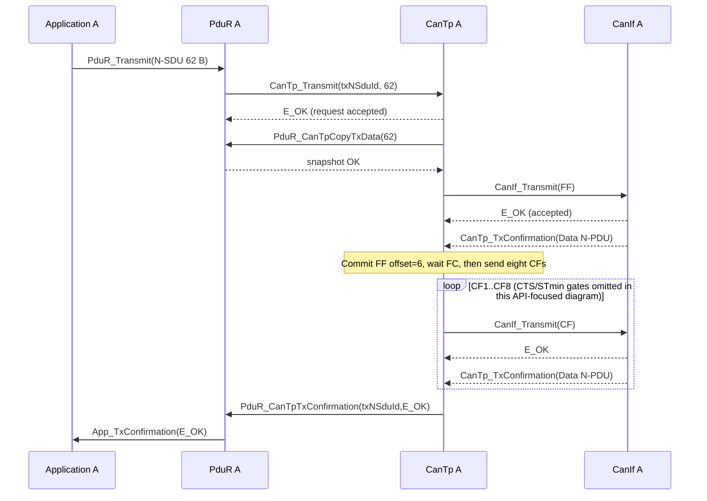
```mermaid
sequenceDiagram
    participant AppA as Application A
    participant PA as PduR A
    participant TA as CanTp A
    participant CA as CanIf A
    AppA->>PA: PduR_Transmit(N-SDU 62 B)
    PA->>TA: CanTp_Transmit(txNSduId, 62)
    TA-->>PA: E_OK (request accepted)
    TA->>PA: PduR_CanTpCopyTxData(62)
    PA-->>TA: snapshot OK
    TA->>CA: CanIf_Transmit(FF)
    CA-->>TA: E_OK (accepted)
    CA-->>TA: CanTp_TxConfirmation(Data N-PDU)
    Note over TA: Commit FF offset=6, wait FC, then send eight CFs
    loop CF1..CF8 (CTS/STmin gates omitted in this API-focused diagram)
        TA->>CA: CanIf_Transmit(CF)
        CA-->>TA: E_OK
        CA-->>TA: CanTp_TxConfirmation(Data N-PDU)
    end
    TA->>PA: PduR_CanTpTxConfirmation(txNSduId,E_OK)
    PA->>AppA: App_TxConfirmation(E_OK)
```

Tổng cộng **9 Data frame confirmations** cho FF+8 CF, nhưng **một** final `PduR_CanTpTxConfirmation` cho N-SDU. `App_TxConfirmation` là **callback App mock do nhóm đặt tên nhất quán**, không phải API bắt buộc cố định tên theo AUTOSAR.

---

## 5. Runtime data và state: đủ field, tránh overengineering

```c
typedef enum {
    TX_IDLE, TX_PREPARE, TX_REQUEST_TX,
    TX_WAIT_CONFIRM, TX_WAIT_FC, TX_WAIT_STMIN
} CanTp_TxState;

typedef enum {
    RX_IDLE, RX_FC_PENDING, RX_WAIT_CF
} CanTp_RxState;

typedef struct {
    CanTp_TxState state;
    uint8 txChunkBuffer[64];
    uint8 txDataFrame[8];
    PduLengthType totalLength;
    PduLengthType txOffset;      /* số byte Data đã TX CONFIRMED */
    uint8 nextSN;                /* CF đầu = 1; wrap modulo 16 */
    uint8 blockCount;            /* CF confirmed từ CTS gần nhất */
    uint8 retryCount;            /* đã thực hiện bao nhiêu retries sau initial */
    bool txPduPending;           /* Data accepted, chưa confirm */
    bool resultReported;         /* chống double final callback */
    bool priorCfExists;
    uint32 lastCfConfirmedMs;    /* STmin; KHÔNG reset khi CTS đến */
    uint32 dataAttemptDueMs;
    uint32 txTimerStartMs;       /* N_As hoặc N_Bs tùy state */
    uint8 preparedPayloadBytes;  /* commit SAU confirmation */
    uint8 preparedFrameType;     /* SF/FF/CF cho confirmation handler */
} CanTp_TxRuntime;

typedef struct {
    CanTp_RxState state;
    uint8 rxChunkBuffer[64];
    uint8 txFcFrame[8];
    PduLengthType totalLength, receivedLength;
    uint8 expectedSN;           /* reset 1 khi bắt đầu FF mới */
    uint8 blockCount;           /* số CF nhận trong block hiện tại */
    uint8 fcRetryCount;
    bool queueSlotReserved;
    bool fcRequestActive;       /* FC chờ request/retry/confirmation */
    bool fcTxPending;           /* FC accepted, chưa confirm; độc lập session */
    bool resultReported;
    uint32 fcAttemptDueMs, fcAcceptedAtMs, rxCrStartMs;
} CanTp_RxRuntime;
```

Đây là **field gợi ý**, không yêu cầu copy nguyên struct nếu Part 1 đã có abstraction phù hợp. `txPduPending` và `fcTxPending` không được tự động xóa khi `state=IDLE`. FC(OVFLW) có thể sở hữu `txFcFrame` khi **không có Rx session**.

**Pseudocode helper nên tách:** `CanTp_PrepareDataFrame()`, `CanTp_HandleDataTxConfirmation()`, `CanTp_AbortTx(reason)`, `CanTp_CompleteRx()`, `CanTp_AbortRx(reason)`, `CanTp_RequestFc()`, `CanTp_HandleFcTxConfirmation()`. Đây là chia việc để code dễ đọc, không phải thêm public API.

### 5.1 Main-loop contract

```c
void Scheduler_1ms(void)
{
    Can_MainFunction_Write();  /* dispatch local TxConfirmations FIRST */
    Can_MainFunction_Read();   /* dispatch received frames second */
    CanTp_MainFunction();      /* timeouts, retries, STmin eligible */
    Com_MainFunctionTx();      /* Part 1: independent COM scheduling */
}
```

- Đây là thứ tự polling mock đã chốt. Nếu event confirmation tới trong cùng tick timeout thì dispatch event trước khi xét timeout; không xử lý timeout cũ đã được stop.
- `CanTp_MainFunction()` không được gửi nhiều request retries cho cùng frame trong một tick.
- **Không suy ra thứ tự callback toàn cục giữa hai ECU.** Event timeline trong sequence diagram là logic dependency, không chứng minh receiver thành công trước sender hay ngược lại.

---

## 6. State machine đã chốt: Tx 6 state, Rx 3 state

### 6.1 Tx v1.1: snapshot / abort / complete là action, không phải state

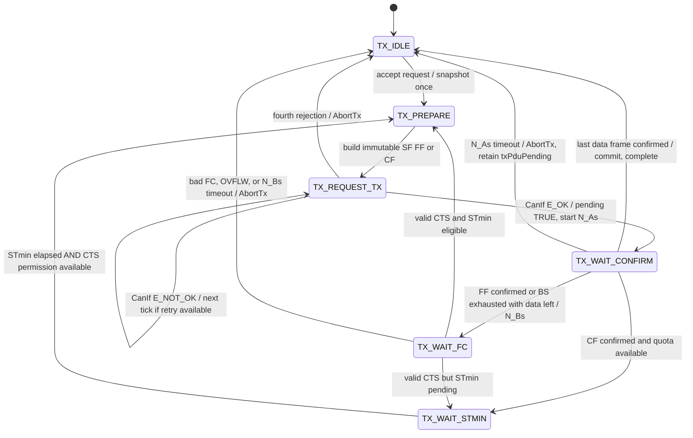
```mermaid
stateDiagram-v2
    [*] --> TX_IDLE
    TX_IDLE --> TX_PREPARE: accept request / snapshot once
    TX_PREPARE --> TX_REQUEST_TX: build immutable SF FF or CF
    TX_REQUEST_TX --> TX_REQUEST_TX: CanIf E_NOT_OK / next tick if retry available
    TX_REQUEST_TX --> TX_WAIT_CONFIRM: CanIf E_OK / pending TRUE, start N_As
    TX_REQUEST_TX --> TX_IDLE: fourth rejection / AbortTx
    TX_WAIT_CONFIRM --> TX_IDLE: last data frame confirmed / commit, complete
    TX_WAIT_CONFIRM --> TX_WAIT_FC: FF confirmed or BS exhausted with data left / N_Bs
    TX_WAIT_CONFIRM --> TX_WAIT_STMIN: CF confirmed and quota available
    TX_WAIT_CONFIRM --> TX_IDLE: N_As timeout / AbortTx, retain txPduPending
    TX_WAIT_FC --> TX_PREPARE: valid CTS and STmin eligible
    TX_WAIT_FC --> TX_WAIT_STMIN: valid CTS but STmin pending
    TX_WAIT_FC --> TX_IDLE: bad FC, OVFLW, or N_Bs timeout / AbortTx
    TX_WAIT_STMIN --> TX_PREPARE: STmin elapsed AND CTS permission available
```

**Guard quan trọng:** TX_WAIT_STMIN chỉ vào TX_PREPARE nếu *đã có FC permission*. Với CF1 sau FF chỉ cần CTS (không lấy FF TxConfirmation làm mốc STmin). Với CF5 sau CF4 cần **cả CTS2 và `lastCfConfirmedMs+5`**. Nếu session đã abort thì late Data confirmation chỉ clear pending, không commit offset hoặc phát final thành công.

**Sau matching Data confirmation**, xử lý theo thứ tự: (1) commit prepared bytes & SN; (2) nếu đủ `totalLength` thì complete; (3) nếu FF hoặc vừa xác nhận CF thứ tư mà còn data thì vào WAIT_FC; (4) còn quota thì chờ STmin hoặc gửi CF. **Không gửi FC thứ ba sau CF8 khi N-SDU 62 B kết thúc.**

### 6.2 Rx v1.0: ba state cho reassembly, FC ownership riêng

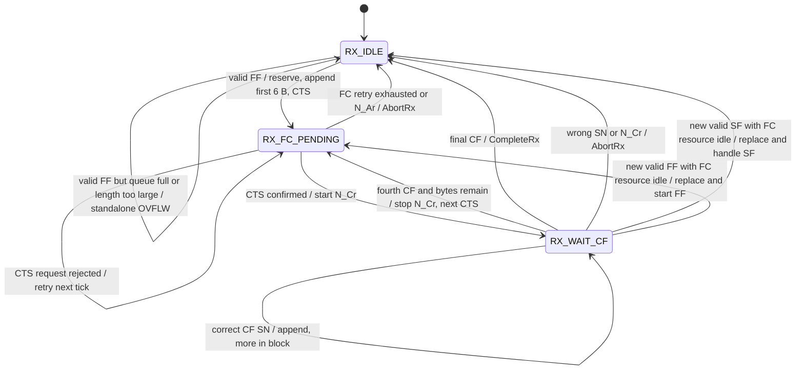
```mermaid
stateDiagram-v2
    [*] --> RX_IDLE
    RX_IDLE --> RX_IDLE: valid SF / reserve, full copy, READY, notify OK
    RX_IDLE --> RX_FC_PENDING: valid FF / reserve, append first 6 B, CTS
    RX_IDLE --> RX_IDLE: malformed SF/FF / discard
    RX_IDLE --> RX_IDLE: valid FF but queue full or length too large / standalone OVFLW
    RX_FC_PENDING --> RX_FC_PENDING: CTS request rejected / retry next tick
    RX_FC_PENDING --> RX_WAIT_CF: CTS confirmed / start N_Cr
    RX_FC_PENDING --> RX_IDLE: FC retry exhausted or N_Ar / AbortRx
    RX_WAIT_CF --> RX_WAIT_CF: correct CF SN / append, more in block
    RX_WAIT_CF --> RX_FC_PENDING: fourth CF and bytes remain / stop N_Cr, next CTS
    RX_WAIT_CF --> RX_IDLE: final CF / CompleteRx
    RX_WAIT_CF --> RX_IDLE: wrong SN or N_Cr / AbortRx
    RX_WAIT_CF --> RX_IDLE: new valid SF with FC resource idle / replace and handle SF
    RX_WAIT_CF --> RX_FC_PENDING: new valid FF with FC resource idle / replace and start FF
```

**Đừng hiểu sai sơ đồ:** `RX_IDLE` vẫn có thể có standalone FC(OVFLW) đang gửi; state `RX_FC_PENDING` dành cho **active Rx session và CTS**, nhưng `fcRequestActive/fcTxPending` sống riêng để bảo vệ `txFcFrame` ngay cả khi không có session. `N_Cr` chỉ chạy sau CTS local confirmation, sau mỗi CF hợp lệ nếu còn chờ CF trong cùng block; dừng khi đang cấp CTS tiếp hoặc hoàn tất.

### 6.3 Sequence: FF + 2 block, N-SDU 62 B

```mermaid
sequenceDiagram
    participant AA as App A
    participant PA as PduR A
    participant TA as CanTp A
    participant NET as CanIf/CanDrv/CAN
    participant TB as CanTp B
    participant PB as PduR B
    participant AB as App B
    AA->>PA: Transmit(62-byte N-SDU)
    PA->>TA: CanTp_Transmit(62)
    TA-->>PA: E_OK = accepted
    TA->>PA: CopyTxData(62) ONCE
    PA-->>TA: snapshot OK
    TA->>NET: FF 10 3E + D0..D5
    Note over TA,TB: FF TxConfirmation and RxIndication have no fixed cross-ECU order
    NET-->>TA: local FF TxConfirmation / offset=6, WAIT_FC
    NET->>TB: FF RxIndication
    TB->>PB: StartOfReception(62)
    PB->>AB: reserve queue slot
    AB-->>PB: RESERVED
    TB->>NET: FC1 30 04 05 ...
    NET-->>TB: local FC confirmation / start N_Cr
    NET->>TA: FC1 received / grant 4 CF
    loop CF1..CF4, obey inter-CF STmin
        TA->>NET: CanIf_Transmit(CF)
        NET-->>TA: local CF TxConfirmation / commit offset and SN
        NET->>TB: CF RxIndication / check SN, append only real bytes
    end
    Note over TA,TB: Tx and Rx respective progress after CF4 = 34 bytes
    TB->>NET: FC2 30 04 05 ...
    NET-->>TB: local FC confirmation / restart N_Cr
    NET->>TA: FC2 received / grant 4 CF, preserve STmin timestamp
    loop CF5..CF7
        TA->>NET: CF after both gates
        NET-->>TA: CF TxConfirmation / commit
        NET->>TB: CF RxIndication / append
    end
    TA->>NET: CF8 final
    Note over TA,TB: Final local completions are independent, neither ECU completion orders the other
    par Receiver completion
        NET->>TB: final CF received, rxLength=62
        TB->>PB: CopyRxData(62) ONCE
        PB->>AB: copy, mark RESERVED -> READY
        PB-->>TB: BUFREQ_OK
        TB->>PB: RxIndication(E_OK)
    and Sender completion
        NET-->>TA: final CF TxConfirmation, txOffset=62
        TA->>PA: TxConfirmation(E_OK) ONCE
        PA->>AA: App final result E_OK
    end
    Note over AA,AB: No FC3, no Application ACK, sender E_OK is local only
```

Sơ đồ mô tả quan hệ logic, **không ép thứ tự callback FF/CF xuyên hai ECU**. Việc FC1 nhận quá sớm so với FF confirmation ở sender không có session ID riêng; baseline không xây dựng recovery phức tạp cho race này. Trong fixture happy path phải log thứ tự thực tế; không khẳng định kiến trúc bảo đảm thứ tự toàn mạng.

---

## 7. Frame vectors: học sinh phải tự dựng và đối chiếu từng byte

Dùng payload tăng dần `D[i]=i` (hex), khởi tạo queue sạch. Data CAN ID ví dụ `0x650`, FC CAN ID ví dụ `0x658`.

### T01 — 5-byte SF

```text
App payload: 00 01 02 03 04
SF:          05 00 01 02 03 04 00 00
```

**Expected:** một Data frame, 0 FC, một `CopyTxData(5)`, một `CopyRxData(5)`, Rx slot READY chứa **đúng 5 byte**, một final Tx E_OK và một Rx E_OK. `00 00` cuối là padding, **không** có trong Rx message.

### T02 — 20-byte segmented message

```text
App payload: 00 01 02 ... 13  (20 bytes)
FF :         10 14 00 01 02 03 04 05
FC1:         30 04 05 00 00 00 00 00
CF1:         21 06 07 08 09 0A 0B 0C
CF2:         22 0D 0E 0F 10 11 12 13
```

**Giải thích tính toán:** FF mang 6, còn 14 → `ceil(14/7)=2` CF; vì <4 CF nên **không cần FC2**. Confirmed `txOffset`: `6 → 13 → 20`. Rx chỉ copy một lần `20` byte sau CF2; không copy từng CF.

### T03 — 62-byte segmented message

```text
App payload: 00 01 02 ... 3D (62 bytes)
FF : 10 3E 00 01 02 03 04 05
FC1: 30 04 05 00 00 00 00 00
CF1: 21 06 07 08 09 0A 0B 0C
CF2: 22 0D 0E 0F 10 11 12 13
CF3: 23 14 15 16 17 18 19 1A
CF4: 24 1B 1C 1D 1E 1F 20 21
FC2: 30 04 05 00 00 00 00 00
CF5: 25 22 23 24 25 26 27 28
CF6: 26 29 2A 2B 2C 2D 2E 2F
CF7: 27 30 31 32 33 34 35 36
CF8: 28 37 38 39 3A 3B 3C 3D
```

| Frame confirmed / received | FF | CF1 | CF2 | CF3 | CF4 | CF5 | CF6 | CF7 | CF8 |
|---|---:|---:|---:|---:|---:|---:|---:|---:|---:|
| Byte count ở **từng ECU sau event tương ứng** | 6 | 13 | 20 | 27 | 34 | 41 | 48 | 55 | 62 |

**Tính toán:** 62−6=56; 56/7=8 CF; BS4 → hai CTS, một sau FF và một sau CF4; **không có CTS thứ ba** khi CF8 cũng vừa đủ 4 CF vì N-SDU đã hoàn thành. `nextSN` sau CF8 confirmed là 9 (nếu giữ field đến cleanup), không reset sau FC2. SN chỉ wrap 15→0 khi message dài đủ; giới hạn 62 B hiện tại không chạm wrap, nhưng rule vẫn giữ.

### 7.1 Boundary sanity examples (không tạo test gate mới)

- SF dài 7: `07 D0 D1 D2 D3 D4 D5 D6`, **không** FC.
- FF dài 8: FF6, còn 2 → CF1 `[21 D6 D7 00 00 00 00 00]`, **một** CTS.
- FF dài 60: FF6 + 7 CF×7 + CF8 5 byte; padding hai byte cuối CF8; check `min(7, remaining)`.
- Malformed: `SF_DL=0`, `FF_DL=5` bị discard, không ảnh hưởng Rx session đang hoạt động.

---
## 8. Phase 1 — Hướng dẫn code HAPPY PATH theo thứ tự

**Gate:** T01–T03. Phase 1 làm trước retry/timeout; mock có thể cho CanIf luôn trả E_OK và callback đúng hạn, nhưng cách quản lý offset, ownership và state **phải đúng từ đầu** để Phase 2 không phải viết lại.

### Item P1.1 — Kết nối các route từ App đến CanIf

1. Tạo cấu hình `AppTxGlobalPduId → PduR Tx route → CanTp TxNSduId` và chiều nhận tương ứng.
2. Cấu hình `TxDataNPduId → CanIf Tx LPduId` cùng CAN ID Data; cấu hình riêng Tx FC / Rx FC N-PDU.
3. CanIf RxIndication tra CAN ID/L-PDU để gọi `CanTp_RxIndication(rxNPduId, pduInfo)`; `CanTp_TxConfirmation(txNPduId)` cũng route theo đúng Data hoặc FC N-PDU, **không dựa vào số nguyên ngẫu nhiên trùng nhau**.
4. Assert `Length == 8` cho CanTp-mapped L-PDUs tại CanIf. Không thay đổi rule chiều dài COM của Part 1.

**Debug dễ nhất:** log `GlobalId, NSduId, NPduId, LPduId, CAN ID` ở đầu mỗi API. Nếu nhận FC nhưng handler đọc thành Data TxConfirmation, kiểm tra lại mapping N-PDU, không sửa SN logic.

### Item P1.2 — Tx accept và snapshot N-SDU

```c
Std_ReturnType CanTp_Transmit(PduIdType txNSduId,
                               const PduInfoType *request)
{
    if (request == NULL_PTR || request->SduLength < 1U ||
        request->SduLength > CANTP_MAX_NSDU ||
        tx.state != TX_IDLE || tx.txPduPending) {
        return E_NOT_OK; /* rejected BEFORE accept: NO final callback */
    }

    /* Session is now accepted. Initialize counters, lengths and flags. */
    tx.totalLength = request->SduLength;
    tx.txOffset = 0U;
    tx.nextSN = 1U;
    tx.blockCount = 0U;
    tx.resultReported = false;
    tx.state = TX_PREPARE;

    if (PduR_CanTpCopyTxData(txNSduId, tx.txChunkBuffer,
                              tx.totalLength) != BUFREQ_OK) {
        CanTp_AbortTx(REASON_COPY_FAILED); /* final E_NOT_OK ONCE */
        return E_OK; /* accepted request; failure delivered via callback */
    }
    /* Build first SF or FF; MainFunction requests it, or schedule by policy. */
    CanTp_PrepareDataFrame();
    return E_OK;
}
```

Đây chỉ là khung về **thời điểm accept**; trong code thực tế, tránh tạo callback bất ngờ *đồng bộ ngay trong `CanTp_Transmit`* nếu tầng App không hỗ trợ callback re-entrant. Có thể đặt snapshot vào `CanTp_MainFunction()` tick kế tiếp sau khi accept, với cùng semantics: callback cuối đúng một lần. **Không** thay đổi nghĩa `CanTp_Transmit E_OK` thành “gửi thành công”.

**Ví dụ 20 B:** App source có `00..13`, `CopyTxData(20)` copy đủ 20 byte sang `txChunkBuffer[0..19]`. App giữ nguyên source. `txOffset` ban đầu 0 mặc dù snapshot đã chứa đủ 20 byte: offset này đếm **bytes đã confirmed trên CAN**, không phải bytes đã copy.

### Item P1.3 — Đóng gói SF/FF/CF với một hàm duy nhất

```c
void CanTp_PrepareDataFrame(void)
{
    PduLengthType left = tx.totalLength - tx.txOffset;
    uint8 payloadLen;
    memset(tx.txDataFrame, 0, 8U); /* always pad Tx to DLC 8 */

    if (tx.totalLength <= 7U) {
        tx.txDataFrame[0] = (uint8)tx.totalLength;
        memcpy(&tx.txDataFrame[1], tx.txChunkBuffer, tx.totalLength);
        payloadLen = (uint8)tx.totalLength;
        tx.preparedFrameType = FRAME_SF;
    } else if (tx.txOffset == 0U) {
        tx.txDataFrame[0] = 0x10U | ((tx.totalLength >> 8U) & 0x0FU);
        tx.txDataFrame[1] = (uint8)(tx.totalLength & 0xFFU);
        memcpy(&tx.txDataFrame[2], tx.txChunkBuffer, 6U);
        payloadLen = 6U;
        tx.preparedFrameType = FRAME_FF;
    } else {
        payloadLen = (uint8)((left < 7U) ? left : 7U);
        tx.txDataFrame[0] = 0x20U | (tx.nextSN & 0x0FU);
        memcpy(&tx.txDataFrame[1], &tx.txChunkBuffer[tx.txOffset], payloadLen);
        tx.preparedFrameType = FRAME_CF;
    }
    tx.preparedPayloadBytes = payloadLen;
    tx.retryCount = 0U;              /* reset ONLY for a different frame */
    tx.state = TX_REQUEST_TX;
}
```

**Chú ý:** `memcpy` chỉ lấy bytes thực. Với N-SDU 60 B, CF cuối có 5 bytes thực + 2 padding; `preparedPayloadBytes=5`, không phải 7. Không sửa `txOffset` hay `nextSN` trong hàm prepare. Kiểm tra buffer bounds dựa trên `totalLength ≤62`.

### Item P1.4 — Phát Data và COMMIT sau matching TxConfirmation

```c
/* TX_REQUEST_TX: Phase 1 fixture always returns E_OK. */
if (CanIf_Transmit(txDataLPduId, &dataPduInfo) == E_OK) {
    tx.txPduPending = true;
    tx.state = TX_WAIT_CONFIRM;
    /* Phase 2 starts N_As at this exact event. */
}

/* Called ONLY for Data Tx N-PDU. */
void CanTp_OnDataTxConfirmation(void)
{
    if (!tx.txPduPending) return;       /* unexpected duplicate */
    tx.txPduPending = false;
    if (tx.state != TX_WAIT_CONFIRM) return; /* late after abort */

    tx.txOffset += tx.preparedPayloadBytes;
    if (tx.preparedFrameType == FRAME_CF) {
        tx.nextSN = (tx.nextSN + 1U) & 0x0FU;
        ++tx.blockCount;
        tx.priorCfExists = true;
        tx.lastCfConfirmedMs = nowMs;  /* STmin starts HERE */
    }
    if (tx.txOffset == tx.totalLength) { CanTp_CompleteTx(); return; }
    if (tx.preparedFrameType == FRAME_FF || tx.blockCount == CANTP_BS) {
        tx.state = TX_WAIT_FC;         /* Phase 2 starts N_Bs HERE */
        return;
    }
    tx.state = TX_WAIT_STMIN;
}
```

**Không được commit khi `CanIf_Transmit` trả E_OK.** Ví dụ CF3 trước local confirmation: `txOffset=20`, `nextSN=3`, `blockCount=2`. Sau matching confirmation: `27, 4, 3`. `CanTp_CompleteTx()` báo `PduR_CanTpTxConfirmation(E_OK)` một lần, cleanup session, không tạo Application ACK.

### Item P1.5 — Rx SF và FF: validate rồi mới reserve

1. Kiểm tra CanIf đã lọc length 8, đọc high nibble `PCI[0] & 0xF0`.
2. SF: `length = frame[0]&0x0F`; chỉ nhận 1..7. Nếu queue đủ chỗ, reserve, copy `frame[1..length]`, set READY, RxIndication(E_OK). SF không đòi FC.
3. FF: `total = ((frame[0]&0x0F)<<8)|frame[1]`; nếu 8..62 và queue còn chỗ thì `StartOfReception(total)`, reserve slot, copy **6 bytes** từ `frame[2..7]` vào `rxChunk[0..5]`, `receivedLength=6`, `expectedSN=1`, `blockCount=0`, prepare CTS.
4. Phase 3 xử lý queue đầy và FF oversized bằng OVFLW, malformed bằng discard; **không để** những trường hợp đó vô tình được nhận như FF bình thường.

```c
/* Pseudocode; use real config route and queue API. */
if (isFF && totalLength >= 8U && totalLength <= 62U) {
    if (PduR_CanTpStartOfReception(rxNSduId, totalLength) != BUFREQ_OK) {
        /* Phase 3: FC(OVFLW) when no capacity; no active Rx session. */
        return;
    }
    rx.queueSlotReserved = true;
    memcpy(rx.rxChunkBuffer, &frame->SduDataPtr[2], 6U);
    rx.receivedLength = 6U;
    rx.expectedSN = 1U;
    rx.blockCount = 0U;
    CanTp_RequestFc(FC_CTS);
    rx.state = RX_FC_PENDING;
}
```

**Ví dụ 62 B:** FF `10 3E 00..05` → slot RESERVED, `receivedLength=6`. App chưa được nhìn 6 byte này. Sau FC1 local confirmation mới vào `RX_WAIT_CF`.

### Item P1.6 — FC(CTS) và điều kiện gửi CF

Receiver build FC1 **đúng** `30 04 05 00 00 00 00 00`, phát qua **FC Tx N-PDU → FC L-PDU**. CanIf `E_OK` = accepted. Sau local FC TxConfirmation, clear pending, vào `RX_WAIT_CF`; Phase 2 khởi động `N_Cr` tại đây.

Sender nhận FC qua **Rx FC N-PDU**, chỉ cho đi tiếp nếu `FS=CTS`, `BS=4`, `STmin=5`. Cấp tối đa 4 CF cho block. Nếu đang WAIT_FC thì dừng `N_Bs` (Phase 2). Nếu CF trước đã confirmed, điều kiện STmin vẫn đang chạy độc lập; CTS **không** reset đồng hồ. CF1 sau FF không cần STmin từ FF.

```c
/* Simplified eligibility predicate: tested before preparing next CF. */
bool CanSendNextCf(uint32 now)
{
    bool hasPermission = (tx.blockCount < CANTP_BS) && tx.fcPermissionGranted;
    bool timeReady = !tx.priorCfExists ||
                     ((uint32)(now - tx.lastCfConfirmedMs) >= CANTP_STMIN_MS);
    return hasPermission && timeReady;
}
```

**Lưu ý về `blockCount`:** ví dụ lưu số CF confirmed từ CTS gần nhất, reset về 0 khi CTS được accept hợp lệ. `fcPermissionGranted` là flag minh họa, có thể suy ra từ state/CTS grant trong implementation; cần tránh bug: đặt `blockCount=0` sau CTS2 nhưng vẫn để `priorCfExists=true` và không sửa `lastCfConfirmedMs`.

### Item P1.7 — Rx CF và completion một lần

```c
/* Only when RX_WAIT_CF, after CanIf DLC filter. */
uint8 sn = frame->SduDataPtr[0] & 0x0FU;
if (sn != rx.expectedSN) {
    CanTp_AbortRx(REASON_WRONG_SN); /* Phase 3 explicitly tests this */
    return;
}
PduLengthType remain = rx.totalLength - rx.receivedLength;
uint8 realBytes = (uint8)((remain < 7U) ? remain : 7U);
memcpy(&rx.rxChunkBuffer[rx.receivedLength], &frame->SduDataPtr[1], realBytes);
rx.receivedLength += realBytes;
rx.expectedSN = (rx.expectedSN + 1U) & 0x0FU;
++rx.blockCount;

if (rx.receivedLength == rx.totalLength) {
    CanTp_CompleteRx();       /* FIRST: no extra CTS even if blockCount==4 */
} else if (rx.blockCount == CANTP_BS) {
    CanTp_RequestFc(FC_CTS);  /* stop N_Cr until CTS confirmed */
    rx.state = RX_FC_PENDING;
} else {
    /* Phase 2: restart N_Cr after valid CF, waiting for next one. */
}
```

`CanTp_CompleteRx()` phải gọi `PduR_CanTpCopyRxData(rxNSduId, rx.rxChunkBuffer, rx.totalLength)` **đúng một lần**. App copy vào RESERVED slot, set READY **trước khi** callback trả `BUFREQ_OK`, rồi CanTp gọi `PduR_CanTpRxIndication(E_OK)`. Nếu copy thất bại, abort → release reserved slot → báo Rx `E_NOT_OK`; không được READY partial message.

### Phase 1 — Checklist debug trước khi chuyển Phase 2

- [ ] T01 SF 5 B: đúng 8 byte, không FC, queue payload 5 B.
- [ ] T02 20 B: FF+2 CF, đúng 1 CTS, offset 6→13→20.
- [ ] T03 62 B: FF+8 CF, đúng 2 CTS; CF4→CTS2→CF5; không CTS3.
- [ ] Tx `CopyTxData()` 1 lần; Rx `CopyRxData()` 1 lần mỗi N-SDU thành công; không có buffer refill.
- [ ] Tx offset/SN chỉ commit sau confirmation; App Rx slot READY trước final Rx E_OK.
- [ ] API names và mapping Data/FC N-PDU kiểm tra được qua log; COM Part 1 vẫn chạy bình thường.

---

## 9. Phase 2 — Retry, bốn timer, abort và late confirmation

**Gate:** T04–T08, T13, cộng regression T01–T03. Không bắt học sinh thực hiện queue-full, OVFLW hoặc replacement T09–T12/T14 ở Phase 2, nhưng đã có flag bảo vệ FC để Phase 3 không phải đổi kiến trúc.

### Item P2.1 — Retry một frame khi CanIf E_NOT_OK

**Policy mock kế thừa COM:** initial attempt + **tối đa 3 lần retry**, 1 attempt/frame/tick. Chỉ retry nếu `CanIf_Transmit(frame) == E_NOT_OK`. Giữ nguyên **tám byte** N-PDU, `txOffset`, `nextSN` và `blockCount` qua tất cả attempts. Hết 4 rejection → abort **toàn bộ N-SDU**, không chỉ drop frame hiện tại. App tự chọn có retry N-SDU mới từ FF hay không; không đặt số lần App retry cố định.

```c
/* In TX_REQUEST_TX, called no more than once per eligible 1-ms tick. */
if (now >= tx.dataAttemptDueMs) {       /* use wrap-safe scheduling in real code */
    Std_ReturnType ret = CanIf_Transmit(txDataLPduId, &dataPduInfo);
    if (ret == E_OK) {
        tx.txPduPending = true;
        tx.txTimerStartMs = now;        /* start N_As */
        tx.state = TX_WAIT_CONFIRM;
    } else if (tx.retryCount < 3U) {
        ++tx.retryCount;
        tx.dataAttemptDueMs = now + 1U;
    } else {
        CanTp_AbortTx(REASON_DATA_RETRY_EXHAUSTED);
    }
}
```

**Ví dụ T05, CF3 N-SDU 62 B:** `txOffset=20`, `nextSN=3`, frame `23 14 15 16 17 18 19 1A`.

```text
Tick t    request #1 -> E_NOT_OK | frame identical | offset=20, SN=3
Tick t+1  request #2 -> E_NOT_OK | frame identical | offset=20, SN=3
Tick t+2  request #3 -> E_OK     | start N_As   | offset STILL 20
Later matching Data TxConfirmation    | offset=27, nextSN=4, blockCount=3
```

**Ví dụ T06:** thêm request thứ tư ở `t+3 → E_NOT_OK` → abort, final `E_NOT_OK` **một lần**, không gửi CF4, App giữ source. Lưu ý `retryCount=3` nghĩa đã có ba retries, tổng attempts **4**; không mắc lỗi off-by-one.

**FC retry tương tự:** dùng `txFcFrame[8]` và `fcRetryCount` riêng; hết attempts cho CTS của active Rx → abort Rx/release slot. FC(OVFLW) standalone thất bại thì cleanup thao tác FC, **không phát RxIndication của một session chưa từng tồn tại**.

### Item P2.2 — Dùng đồng hồ monotonic 1 ms, bốn timer KHÁC NGHĨA

```c
/* Safe for unsigned short intervals with modulo counter arithmetic. */
static bool HasElapsed(uint32 nowMs, uint32 startMs, uint32 durationMs)
{
    return ((uint32)(nowMs - startMs) >= durationMs);
}
```

| Timer | Start chính xác khi nào? | Stop/reset | Khi >=100 ms và chưa có event |
|---|---|---|---|
| **N_As** | `CanIf_Transmit(Data)==E_OK` | matching Data TxConfirmation | Abort Tx, final E_NOT_OK một lần, **giữ `txPduPending=true`** |
| **N_Ar** | `CanIf_Transmit(FC)==E_OK` | matching FC TxConfirmation | Abort active Rx/release slot; **giữ `fcTxPending=true`**; không retransmit FC đã accept |
| **N_Bs** | FF TxConfirmed hoặc CF thứ 4 TxConfirmed **mà còn data** | CTS hợp lệ hoặc abort | Abort Tx; App quyết định retry N-SDU từ FF |
| **N_Cr** | FC(CTS) local TxConfirmed | CF hợp lệ → restart nếu tiếp tục chờ CF trong cùng block; stop để gửi FC mới / complete / abort | Abort Rx, release RESERVED, final Rx E_NOT_OK một lần |

**STmin không phải một trong bốn timeout.** Nó là gate 5 ms kể từ **CF TxConfirmation trước**, bao gồm CF4→CF5 qua FC2. Không có STmin tính từ FF cho CF1. `N_Bs` và STmin có thể đồng thời ảnh hưởng eligibility nhưng **FC không reset STmin**.

**Timeline N_Bs (T07):**

```text
t=200 ms: FF local TxConfirmation -> WAIT_FC; N_Bs start=200.
t=299 ms: elapsed=99 -> KHÔNG timeout.
t=300 ms: elapsed=100 -> nếu chưa nhận CTS hợp lệ, AbortTx(E_NOT_OK).
Nếu CTS được dispatch trong Can_MainFunction_Read ở cùng tick t=300,
handle CTS trước CanTp_MainFunction để stop timer; không bắn timeout cũ.
```

**Timeline N_Cr (T08):** CTS local confirmed ở t=100 → N_Cr starts; CF1 hợp lệ đến t=120 → start lại ở 120; CF2 vắng đến t=220 → abort, queue `RESERVED→FREE`, không có message READY.

**N_Ar ví dụ:** CTS được CanIf accept lúc t=40, không có matching FC confirmation tại t=140 → abort Rx/release reservation nhưng `fcTxPending=TRUE`. Late FC confirmation tại t=150 chỉ clear flag; **không** tái tạo session hay vào `RX_WAIT_CF`.

### Item P2.3 — `N_As` timeout: session abort KHÁC resource release

```mermaid
sequenceDiagram
    participant App as Application
    participant TP as CanTp Tx
    participant IF as CanIf/CanDrv
    App->>TP: New Tx N-SDU request accepted
    TP->>IF: CF3 CanIf_Transmit
    IF-->>TP: E_OK (frame accepted)
    Note over TP: txPduPending=true, N_As starts
    Note over TP: 100 ms pass, no local confirmation
    TP->>App: via PduR: TxConfirmation(E_NOT_OK) once
    Note over TP: TX_IDLE, txPduPending still TRUE
    App->>TP: Retry N-SDU from FF
    TP-->>App: E_NOT_OK (request rejected, NO final callback)
    IF-->>TP: Old CF3 TxConfirmation arrives late
    Note over TP: clear txPduPending, discard old event
    App->>TP: Retry request again if App chooses
    TP-->>App: E_OK (can accept if idle and PDU available)
```

Không gửi lại CF3 sau `CanIf E_OK` dù thiếu confirmation; không tự clear pending do timer thứ hai. Nếu confirmation vĩnh viễn không tới, cần **external lower-layer recovery đã xác nhận mailbox trống**, không bắt học sinh viết abort mailbox/controller reset. T13 chứng minh flag và callback count, không yêu cầu sửa driver.

### Item P2.4 — Một abort helper Tx và Rx, chống double notification

```c
void CanTp_AbortTx(TxAbortReason reason)
{
    if (tx.state == TX_IDLE) return; /* no active accepted Tx session */
    if (!tx.resultReported) {
        tx.resultReported = true;
        PduR_CanTpTxConfirmation(txNsduId, E_NOT_OK);
    }
    tx.state = TX_IDLE;
    /* Clear logical timers and fields as needed, BUT DO NOT blindly
       clear txPduPending if an accepted Data frame is outstanding. */
}

void CanTp_AbortRx(RxAbortReason reason)
{
    if (rx.state == RX_IDLE) return; /* standalone OVFLW has no Rx session */
    if (!rx.resultReported) {
        rx.resultReported = true;
        PduR_CanTpRxIndication(rxNsduId, E_NOT_OK);
        /* PduR/App failure callback releases RESERVED slot exactly once. */
    }
    rx.state = RX_IDLE;
    rx.queueSlotReserved = false; /* mirror owner state after release */
    /* DO NOT blindly clear fcTxPending / overwrite txFcFrame. */
}
```

**Lưu ý pseudo-code:** Đặt callback và state cleanup theo quy tắc chống callback re-entrancy của project. Nếu App/PduR giải phóng slot qua `RxIndication(E_NOT_OK)`, CanTp chỉ đồng bộ flag; **không giải phóng lần hai**. `CopyTxData`/`CopyRxData` lỗi → abort ngay, không retry copy. Với `CanTp_Transmit` bị reject trước accept thì **không gọi** `AbortTx`, không gửi final callback.

### Item P2.5 — FC ownership & confirmation handler

```text
Prepare CTS / OVFLW in txFcFrame[8] ONCE
   -> FC CanIf_Transmit E_NOT_OK: retry next tick, at most 3 retries
   -> FC CanIf_Transmit E_OK: fcTxPending=TRUE, N_Ar starts
         -> matching FC TxConfirmation: clear pending;
              CTS + matching active Rx session => RX_WAIT_CF, start N_Cr
              OVFLW standalone => release FC operation, stay RX_IDLE
              session already aborted => clear pending only
         -> N_Ar timeout: abort active Rx if any; keep pending lock
```

Định tuyến FC TxConfirmation **theo Tx FC N-PDU ID**, không theo CAN ID Data hoặc `txDataFrame`. `fcRequestActive` có thể TRUE ngay từ giai đoạn request retry khi `fcTxPending` chưa TRUE; cần bảo vệ frame trong cả hai thời kỳ. Không ghi đè `txFcFrame` cho CTS mới nếu FC cũ vẫn unresolved.

### Phase 2 — Checklist debug

- [ ] T04: `nextCF_CanIfRequestMs - priorCF_TxConfirmationMs >= 5 ms` cho **tất cả CF liền kề**, kể cả CF4→CF5.
- [ ] T05: ba attempts CF3 ở ba ticks liên tiếp, 8 bytes giống nhau, offset/SN không commit sớm.
- [ ] T06: bốn rejected attempts → một Tx E_NOT_OK, không CF4, CanTp không retry cả N-SDU.
- [ ] T07: N_Bs expire đúng mốc; không CF khi chưa CTS.
- [ ] T08: N_Cr expire, release queue slot, không READY partial.
- [ ] T13: N_As expire → final fail một lần, reject Tx mới khi pending, late callback unlock mà không báo E_OK.
- [ ] FC retry và N_Ar check phụ: giữ `fcTxPending` đúng, không retransmit accepted FC, không double Rx final.
- [ ] Regression T01–T03 vẫn PASS với timeout/retry enabled.

---

## 10. Phase 3 — Defensive behavior (không phải Phase 4)

**Gate:** T09–T12, T14, cộng regression toàn bộ trước đó. Không phát triển retransmission app-level ACK, FC(WAIT), mailbox reset hay transport cho N-SDU >62.

### Item P3.1 — Kiểm tra PCI/length và padding

**Validation order:** CanIf chỉ giao CanTp length đúng 8; sau đó CanTp đọc frame type và các PCI fields. Các frame invalid **không thay thế Rx session cũ**.

| Input | Rx reaction | Ví dụ |
|---|---|---|
| SF_DL=0 | Discard, không reserve; không reset active Rx | `00 ...` |
| SF_DL=1..7 | SF hợp lệ; xử lý reserve/copy/READY nếu queue còn chỗ | `03 AA BB CC 00...` |
| FF_DL<8 | Discard, không CTS, không thay thế | `10 05 ...` |
| FF_DL=8..62 | FF định dạng hợp lệ; xử lý slot và replacement | `10 3E ...` |
| FF_DL>62 | FC(OVFLW), không reserve/session mới khi RX_IDLE | `10 64 ...` (100 B) |
| CanTp L-PDU `Length != 8` | CanIf reject | L-PDU CAN TP riêng, không ảnh hưởng COM |

**Padding:** Tx padding `00`; Rx không yêu cầu Rx padding phải 0 (chỉ ignore), `realBytes=min(7, remaining)` cho CF cuối. Nếu FF_DL=60, Rx nhận CF8 chỉ 5 data bytes, không copy hai padding bytes cuối.

### Item P3.2 — Queue full: SF khác FF

```mermaid
flowchart TB
    IN[Incoming valid SF or FF] --> KIND{Frame type?}
    KIND -->|SF| QS{Free slot?}
    QS -->|yes| SOK[Reserve -> copy SF -> READY -> Rx E_OK]
    QS -->|no| SD[Discard SF; NO FC; preserve READY slots]
    KIND -->|FF| QF{Length <=62 and free slot?}
    QF -->|yes| FOK[Reserve -> rxChunk 6 B -> CTS -> wait CF]
    QF -->|no| OV[No reservation/session -> FC OVFLW]
```

**T10 ví dụ:** queue có hai slot `READY/READY`, receiver nhận FF length62, `StartOfReception` báo no capacity → không tạo Rx session, không thay READY slots, phát `32 00 00 00 00 00 00 00` qua FC Tx N-PDU. Sender nhận OVFLW → abort và final Tx E_NOT_OK; **không** có Rx final callback nếu receiver chưa mở session.

**T11 ví dụ:** RX_IDLE, FF `[10 64 ...]` khai báo 100 B >62 → OVFLW, không reserve slot. Nếu đang có active session, frame oversized không được xem là **valid replacement** để vô tình abort session cũ; phạm vi T11 dùng RX_IDLE.

**Queue full SF:** discard SF, không tạo FC vì SF không có cơ chế FC. Nếu nhận SF hợp lệ khi active Rx đang chờ CF, thực hiện logic replacement trước (abort/release reserved old slot) rồi kiểm tra capacity mới; nếu vẫn đầy thì discard SF. Không làm ảnh hưởng những slot đã READY.

### Item P3.3 — Wrong SN: abort ngay trước append

**T09 ví dụ:** FF + CF1 + CF2 đã được append, `expectedSN=3`, `receivedLength=20`. Receiver nhận CF với PCI `0x24` (SN=4) thay vì `0x23`.

```text
Check SN (4 != 3) → AbortRx immediately → reserved slot FREE
                                  → RxIndication(E_NOT_OK) ONCE
                                  → NO append, NO CopyRxData, NO READY
```

`expectedSN` reset về 1 **chỉ khi bắt đầu FF N-SDU mới**. Nó không reset sau FC1/FC2. Trong bài max62 chỉ thấy SN1..8; vẫn viết `(sn+1)&0x0F` để đúng quy tắc modulo16.

### Item P3.4 — New valid SF/FF replaces Rx session hiện tại

**B10/B11 đã duyệt:** Valid new FF hoặc SF trên cùng connection thay thế Rx session đang hoạt động: abort old, release old queue reservation, thông báo old Rx E_NOT_OK một lần, rồi khởi tạo new N-SDU. Malformed SF/FF không thay thế. **Successful replacement chỉ test khi FC resource idle**, không bắt xử lý peer synchronization nếu FC cũ in-flight.

**T14 timeline mẫu:**

```text
Old session: FF20 -> CTS confirmed -> CF1 and CF2 received
             RX_WAIT_CF, receivedLength=20, expectedSN=3,
             old slot=RESERVED; fcTxPending=FALSE.
New FF62 arrives on SAME connection:
    1. validate new FF length (8..62)
    2. AbortRx(old), one old E_NOT_OK; release old reserved slot
    3. reserve new queue slot
    4. rxChunk[0..5] = NEW FF payload, receivedLength=6, expectedSN=1
    5. send NEW CTS; finish new CF1..CF8
Expected: exactly ONE new READY message with new payload; no mixing bytes.
```

T14 gốc có thể inject khi đang chờ CF3 thay vì CF2; logic không đổi. Với SF mới tương tự, sau abort old thì reserve/copy full SF/READY, **không phát CTS**. Nếu không đủ capacity sau khi giải phóng old slot, áp quy tắc queue full tương ứng.

### Item P3.5 — FC pending khi không có Rx session

Ví dụ FF62 bị queue-full → `FC(OVFLW)` được CanIf accept → `fcTxPending=true`, Rx state **vẫn RX_IDLE**. Trước confirmation, một FF khác tới: **không được overwrite `txFcFrame`** chỉ vì `RX_IDLE`. `fcRequestActive` bảo vệ cả giai đoạn frame đang đợi retry trước acceptance.

Nếu `N_Ar` timeout, không có Rx session để phát RxIndication; giữ pending cho đến late FC confirmation / external verified recovery. Late FC confirmation không tạo Rx session mới.

**Giới hạn cần ghi rõ:** B10/B11 quy định replacement ở mức logical Rx, nhưng khi CTS cũ đã in-flight, không có session ID on-wire để receiver chắc chắn peer không diễn giải CTS cũ cho session mới. Baseline **không bảo đảm successful replacement trong trường hợp này**. Bảo vệ buffer và pending là bắt buộc; không thêm cancel mailbox hay session ID. T14 chỉ yêu cầu successful replacement khi `fcTxPending==false` và FC request cũ đã giải quyết.

### Item P3.6 — FC invalid ở sender

- Sender nhận FC(CTS) `30 04 05 ...` → cấp block mới.
- Sender nhận FC(CTS) có BS khác 4 hoặc STmin khác 5 → abort Tx E_NOT_OK.
- Sender nhận FC(OVFLW) `32 ...` → abort Tx E_NOT_OK.
- FS không được hỗ trợ → error/abort; **không** bổ sung FC(WAIT) vào bài.

**Một điểm triển khai:** Sender chỉ xử lý FC của connection đang chờ FC; nhận FC không thuộc active Tx waiting window không được tự tạo hoặc đánh thức một Tx session khác.

### Phase 3 — Checklist debug

- [ ] T09 wrong SN abort trước append; reserved slot release một lần.
- [ ] T10 queue full FF → OVFLW, no Rx session, READY slots intact, Sender abort.
- [ ] T11 FF 100 B → OVFLW, no reserve; malformed short FF discard without replacement.
- [ ] T12 Rx CopyRxData(62) đúng một lần, READY trước RxIndication(E_OK), không copy padding.
- [ ] T14 valid FF replaces active Rx khi `fcTxPending=false`, old failure một lần, new session sạch và hoàn thành.
- [ ] SF full discard không FC; malformed SF_DL0 discard; FC CTS sai BS/STmin abort.
- [ ] `fcTxPending` giữ nguyên qua abort/IDLE đến khi matching confirmation hoặc verified recovery.
- [ ] Regression tất cả T01–T13 vẫn PASS; không bổ sung phase tiếp theo.

---
## 11. Acceptance Test Matrix T01–T14: cách chạy, expected, evidence

**Fixture khuyến nghị:** hai ECU S32K144 hoặc bus simulation xác định được thứ tự event; queue App có hai slot, mỗi slot ≥62 B; fault injection stub cho `CanIf_Transmit()`, callback suppression/delay, CF SN corruption, FC suppression và queue saturation. Stub để test **không phải feature bắt buộc của production code**. Reset fixture/session giữa các test độc lập; log timestamp độ phân giải ≤1 ms.

**Mỗi test chỉ PASS nếu dữ liệu, frame, state/queue và số callback đều đúng.** Dùng CAN IDs thực tế từ config (ví dụ minh họa Data=0x650, FC=0x658).

| ID | Phase | Setup / kích thích | Kết quả bắt buộc | Evidence cần nộp |
|---|---:|---|---|---|
| **T01** | 1 | Send payload `00..04` | Một SF `05 00 01 02 03 04 00 00`; 0 FC; Rx READY 5 B; 1 Tx/Rx E_OK | Frame trace, queue dump, callback counts |
| **T02** | 1 | Send 20 B `00..13` | FF+2 CF+1 CTS; offset 6/13/20; Rx copy 20 B một lần | 4 wire frames, app payload compare |
| **T03** | 1 | Send 62 B `00..3D` | FF+8 CF+2 CTS; không FC3; Tx snapshot/Rx copy mỗi loại 1 lần | 11 wire frames, offset log, full payload compare |
| **T04** | 2 | T03, log mỗi CF confirmation + next CF request | Từng pair CF liên tiếp có delta ≥5 ms, **kể cả CF4→CF5**; CTS gate đúng | Tick trace cho CF1–CF8 + hai CTS |
| **T05** | 2 | CF3: E_NOT_OK, E_NOT_OK, E_OK | Attempts t,t+1,t+2; bytes bất biến; offset=20/SN=3 trước confirmation; sau đó 27/4 | 3 request logs và confirmation log |
| **T06** | 2 | CF3: bốn E_NOT_OK | Đúng 4 requests; final Tx E_NOT_OK một lần; không CF4, không App retry tự động | Log attempt #1–#4 và callback count |
| **T07** | 2 | Sau FF confirmation, block CTS cho đến ≥100 ms | N_Bs abort; không CF; một Tx E_NOT_OK | Timer start/expiry tick, 0 CF |
| **T08** | 2 | CTS confirmed, nhận CF1 rồi chặn CF2 ≥100 ms | N_Cr abort; RESERVED→FREE; một Rx E_NOT_OK, 0 READY partial | Queue transition, timer tick, callback |
| **T09** | 3 | Rx đang expect SN=3, inject SN=4 | Abort Rx ngay trước append, release slot, một Rx E_NOT_OK | expectedSN, injected PCI, queue bytes/status |
| **T10** | 3 | Queue 2/2 READY, inject FF62 | No reserve/session, OVFLW `32...`; sender abort E_NOT_OK; READY cũ nguyên | Queue snapshot trước/sau, FC trace, sender result |
| **T11** | 3 | RX_IDLE, FF khai báo 100 B | OVFLW; không reserve/session, không deliver App | PCI `10 64`, FC trace, queue snapshot |
| **T12** | 3 | T03 + instrument App callbacks | SoR một lần, CopyRxData(62) **một lần**, READY trước RxIndication(E_OK), không padding | Ordered event log với queue state |
| **T13** | 2 | CF3 CanIf E_OK nhưng trì hoãn local confirmation >100 ms; sau đó trả late callback | Một Tx E_NOT_OK ở timeout; Data N-PDU locked; reject request mới không final; late callback unlock không double success | Timestamp, pending flag, reject, callback count |
| **T14** | 3 | RX_WAIT_CF, FC resource idle; inject FF mới hợp lệ | Old Rx E_NOT_OK + release; new session reserve và hoàn tất; không trộn payload | Old/new payload traces, slot transitions, result counts |

**T03 có 11 frame trên CAN bus = 9 Data + 2 FC.** Nếu chỉ log chiều Data sẽ thấy 9 frame, không được kết luận thiếu hai FC. T02 tổng 4 frame = 3 Data + 1 FC.

### 11.1 Bốn quy trình test lỗi mẫu chi tiết

**T05 — Data retry (tính bất biến):** chuẩn bị T03 đến khi FF/CF1/CF2 được locally confirmed; assert `txOffset=20`, `nextSN=3`; inject CanIf reject CF3 hai lần rồi accept lần thứ ba. So sánh `memcmp(frameAttempt1, frameAttempt2, 8)==0` và lần 3; assert offset/SN vẫn 20/3 **cho đến** TxConfirmation thứ ba. Sau callback assert 27/4; truyền tiếp đến success.

**T08 — N_Cr (không leak queue):** FF62 được nhận → App slot1 RESERVED; CTS1 confirmed → N_Cr start. Inject CF1 valid → receiver 13 B, start N_Cr lại; chặn CF2 đến timeout. Check App slot1 FREE; slot0 READY cũ vẫn nguyên; `CopyRxData` chưa từng gọi; Rx E_NOT_OK đúng một lần. Sender có thể không biết lỗi này ngay vì không có App ACK.

**T10 — OVFLW (no Rx session):** set slot0/slot1 READY; trigger sender FF62; receiver không reserve được, build `32 00 ...` và dùng FC Tx N-PDU. Khi sender nhận OVFLW, abort N-SDU; receiver không phát RxIndication(E_NOT_OK) nếu không có session. Nếu FC bị CanIf reject, test thêm retry FC riêng, không sửa frame bytes.

**T13 — late confirmation (lifecycle):** receiver/sender fixture xử lý bình thường tới CF3. `CanIf_Transmit(CF3)=E_OK`, giữ Data confirmation. Sau N_As timeout, assert `TX_IDLE`, `txPduPending=true`, final E_NOT_OK count=1. App gọi `CanTp_Transmit` → return E_NOT_OK, không final callback mới. Deliver old confirmation → pending=false, state vẫn IDLE, count vẫn 1; App có thể tạo request mới tùy chính sách riêng.

### 11.2 Checks phụ (không thêm acceptance gate)

Những kiểm tra này chứng minh implementation của chính các yêu cầu đã chốt:

- FC request bị từ chối bốn lần → abort active Rx; `N_Ar` sau accepted FC bị mất confirmation → pending FC vẫn locked; late callback không tái tạo Rx session.
- `SF_DL=0`, `FF_DL=5` discard, không thay thế session cũ; SF7, FF8 boundary; Rx bỏ qua padding.
- Queue full SF → discard không FC; FC CTS có BS≠4 hoặc STmin≠5 → Sender abort; OVFLW → abort; không viết FC(WAIT).
- New valid SF thay thế Rx đang WAIT_CF khi FC resource idle; old reservation được release một lần.
- App request Tx khi session đang active hoặc Data N-PDU locked → reject E_NOT_OK **không final callback**.
- `CopyTxData`/`CopyRxData` trả lỗi → abort đúng một lần; `CopyRxData` failure không tạo READY.

### 11.3 Test report template (copy cho T01..T14)

```markdown
### Txx — <test title>
- Phase / environment (hardware or mock):
- Config / PDU mapping / CAN IDs:
- App payload + queue state BEFORE:
- Injection (if any) + exact tick:
- Expected wire frames and state transitions:
- Actual 8-byte frame trace:
- Actual offset, SN, BS, pending, timer and queue logs:
- Expected final callback count / actual callback count:
- Payload byte comparison / padding behavior:
- Result: PASS / FAIL
- Evidence file or screenshot reference:
```

**Ví dụ log tối thiểu:**

```text
[t=0200] A CanTp DATA_CONF FF txOffset=6 SN=1 state=WAIT_FC N_Bs_start=200
[t=0202] B CanTp FC_CONF CTS rxLen=6 state=WAIT_CF N_Cr_start=202
[t=0204] A CanTp FC_RX CTS BS=4 STmin=5 blockCount=0
[t=0205] A CanIf TX_REQ Data CAN=0x650 data=[21 06 07 08 09 0A 0B 0C] E_OK
[t=0206] A CanTp DATA_CONF CF1 txOffset=13 SN=2 STmin_start=206
[t=0211] A CanIf TX_REQ CF2 (delta=5 ms, meets STmin)
```

Đây là **timeline giả lập minh họa**; timestamp thực tế tùy bus scheduler. Không hardcode giờ ví dụ vào unit test. Dùng log thực để chứng minh `nextReq−previousLocalConfirm≥5`.

---

## 12. Checklist nộp bài, Definition of Done và giới hạn trung thực

### 12.1 Thứ tự commit/code khuyến nghị

| Commit | Công việc | Bằng chứng |
|---|---|---|
| C1 | Config routes & SF, queue reserve/copy/READY | T01 |
| C2 | FF, CTS, CF, SN và một block | T02 |
| C3 | Hai block, STmin, N-SDU 62 B | T03 + chuẩn bị log T04 |
| C4 | Data retry, N_As/N_Bs và abort | T05, T06, T07, T13 |
| C5 | FC retry, N_Ar; N_Cr và release slot | T08 + FC phụ |
| C6 | Queue-full/OVFLW, malformed, wrong SN, replacement | T09–T12, T14 |
| C7 | Full regression và test report | T01–T14 |

### 12.2 Files học sinh phải nộp

1. **Code và static config:** CanTp + thay đổi PduR/CanIf và Application queue integration; không phá COM Part 1.
2. **Architecture Mermaid:** Tx 6 states, Rx 3 states, sequence FF+2 FC+8 CF, kèm memory ownership một trang nếu cần; sơ đồ phản ánh code thật.
3. **Test report:** từng T01–T14 có input, expected, actual, log/trace và PASS/FAIL; các phase chưa làm ghi NOT RUN, **không ghi PASS giả**.
4. **Limitations:** liệt kê dưới đây và chỉ rõ phần đã implement/chưa implement.

### 12.3 Definition of Done theo phase

- **Phase 1:** T01–T03 PASS; exact bytes; đúng CAN frame/FC counts; copy Tx/Rx mỗi loại một lần; đúng callback final; queue không thấy partial.
- **Phase 2:** T04–T08, T13 PASS + Phase 1 regression; retry không đổi frame; offset/SN commit sau matching confirmation; timeout đúng mốc; pending guard không double callback.
- **Phase 3 / Part 2 baseline hoàn tất:** T09–T12, T14 PASS + regression toàn bộ; invalid/queue-full/replacement không phá READY; FC pending vẫn được bảo vệ.

### 12.4 Những gì KHÔNG phải implement

- Không có **Phase 4** trong assignment này. Bài demo ứng dụng hoặc hướng đồ án tốt nghiệp là các dự án mở rộng *sau* baseline, không phải gate Phase 4.
- Không hỗ trợ N-SDU>62, chunk refill, dynamic allocation hay nhiều pending CanTp Tx request queue.
- Không FC(WAIT), không Application ACK/NACK, không bảo đảm receiver App nhận block chỉ từ sender E_OK.
- Không mailbox abort/restart; accepted Data/FC thiếu confirmation mãi thì PDU unavailable đến khi external verified recovery.
- Không bảo đảm full end-to-end session replacement khi FC cũ vẫn in-flight; T14 kiểm thử khi FC resource idle. Không thêm FC session identifier hay tự hủy mailbox.
- Không explicit GlobalPduId on-wire/shared-connection multiplexing trong Part 2A; COM stack không bị kéo vào CanTp scheduling.
- Không claim AUTOSAR/ISO-TP compliance đầy đủ từ mock assignment này.

**Ghi nhớ cuối:** `CanIf E_OK` = một *frame request được chấp nhận*; `CanTp_TxConfirmation(Data)` = một *frame locally confirmed*; `PduR_CanTpTxConfirmation(E_OK)` = một *N-SDU locally complete*; Rx READY = **Application đã có trọn N-SDU**, nhưng không có end-to-end Application ACK.

---
```

---
