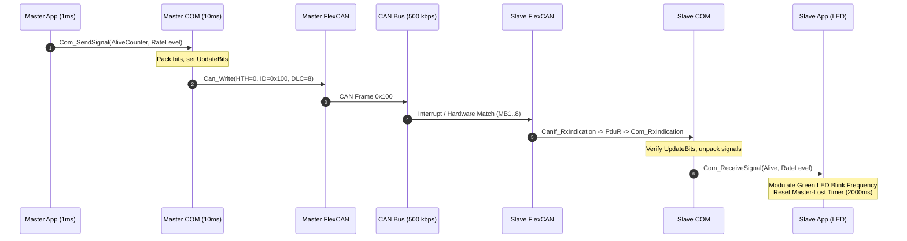
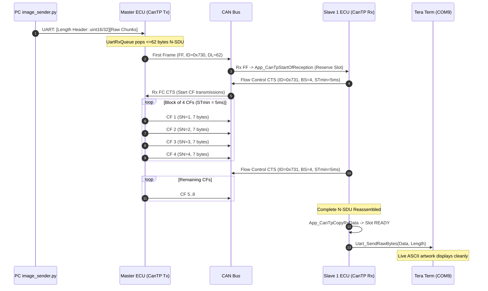

# System Architecture Specification
## AUTOSAR-like COM Stack & ISO 15765-2 CanTP
**Project:** Communication Stack on NXP S32K144  
**Author:** QUYENNM8  
**Target:** 3 ECUs (1 Master + 2 Slaves) on CAN Bus 500 kbps  

---

## 1. Executive Summary & System Overview

This project implements a lightweight, modular, and standards-compliant **AUTOSAR Communication Stack (COM Stack)** and **ISO 15765-2 Transport Protocol (CanTP)** running on bare-metal **NXP S32K144 (ARM Cortex-M4F)** evaluation boards.

The system demonstrates a distributed automotive electronic network with three functional capabilities:
1. **Network KeepAlive & Dynamic Clock Modulation (Master $\to$ Slaves)**:
   - Master reads an on-board analog potentiometer (ADC0) to calculate a dynamic rate level ($0 \dots 6$).
   - Master broadcasts a periodic KeepAlive message (`CAN ID 0x100`) containing an incrementing 7-bit `AliveCounter` and `KeepAliveRateLevel`.
   - Slaves receive KeepAlive, synchronize their hardware green LED blinking frequency accordingly, and supervise communication deadlines ($2000\text{ ms}$ timeout).
2. **Slave Health & Diagnostic Status Monitoring (Slaves $\to$ Master)**:
   - Slave 1 periodically transmits `Slave1Status` (`CAN ID 0x201`, $500\text{ ms}$).
   - Slave 2 periodically transmits `Slave2Status` (`CAN ID 0x202`, $500\text{ ms}$).
   - Status reports either `0 (NORMAL)` or `1 (MASTER_LOST)`.
   - Master monitors both slaves and reports online count via its diagnostic interface.
3. **Large-Payload ASCII Image Streaming via CanTP (PC $\to$ Master $\to$ Slave 1 $\to$ PC)**:
   - PC sends large ASCII artwork files (up to $130\text{ KB}$) over UART (`115200 8N1`) to Master.
   - Master fragments the data stream into $\le 62\text{-byte}$ N-SDUs via `UartRxQueue`.
   - CanTP segments each N-SDU into First Frames (FF) and Consecutive Frames (CF) with Flow Control (FC CTS, BlockSize=4, STmin=5 ms).
   - Slave 1 reassembles the N-SDUs and streams the raw ASCII characters out to its dedicated UART display terminal in real time.

```
                      +---------------------------------------+
                      |               HOST PC                 |
                      |  python image_sender.py (COM11)       |
                      +-------------------+-------------------+
                                          | UART 115200 8N1
                                          v
+-----------------------------------------------------------------------------------+
| MASTER ECU (Node 1 - Role 1)                                                     |
|                                                                                   |
|  +----------------+    +----------------+    +----------------+                   |
|  | ADC0 / Potenti |    | UartRxQueue    |    | Slave Monitor  |                   |
|  | KeepAlive Gen  |    | (8 KB RingBuf) |    | (Offline 2000m)|                   |
|  +--------+-------+    +--------+-------+    +--------^-------+                   |
|           |                     |                     |                           |
|  +--------v-------+    +--------v-------+             |                           |
|  | COM Module     |    | CanTP Module   |             |                           |
|  | (Signals/IPDUs)|    | (ISO 15765-2)  |             |                           |
|  +--------+-------+    +--------+-------+             |                           |
|           |                     |                     |                           |
|           +-----------+---------+                     |                           |
|                       |                               |                           |
|              +--------v-------+                       |                           |
|              | PduR Module    |-----------------------+                           |
|              +--------+-------+                                                   |
|                       |                                                           |
|              +--------v-------+                                                   |
|              | CanIf Module   |                                                   |
|              +--------+-------+                                                   |
|                       |                                                           |
|              +--------v-------+                                                   |
|              | FlexCAN Driver | (SOSC 8 MHz, 16 Tq, 500 kbps, MB0 Tx, MB1..8 Rx)  |
+-----------------------+-----------------------------------------------------------+
                        |
                        | CAN Bus (CAN_H / CAN_L, 500 kbps, 12V Transceiver PHY)
       +----------------+----------------+
       |                                 |
+------v-----------------------+  +------v-----------------------+
| SLAVE 1 ECU (Node 2 - Role 2)|  | SLAVE 2 ECU (Node 3 - Role 0)|
|                              |  |                              |
|  - KeepAlive Rx (0x100)      |  |  - KeepAlive Rx (0x100)      |
|  - Green LED PWM Modulation  |  |  - Green LED PWM Modulation  |
|  - Red LED Master-Lost Alert |  |  - Red LED Master-Lost Alert |
|  - Status Tx (0x201, 500ms)  |  |  - Status Tx (0x202, 500ms)  |
|  - CanTP Rx (0x730/0x731)    |  |  - No CanTP Participation    |
|  - Raw Image -> UART Tx      |  +------------------------------+
+--------------+---------------+
               | UART 115200 8N1
               v
     +-------------------+
     | PC Display Screen |
     | (Tera Term COM9)  |
     +-------------------+
```

---

## 2. Layered Software Architecture (AUTOSAR Model)

The architecture rigorously maintains standardized AUTOSAR layering and separation of concerns:

```
+---------------------------------------------------------------------------+
|                          APPLICATION LAYER (App)                          |
|  App.c, App_Task_1ms, App_Task_10ms, Role.c, UartRxQueue.c                |
+---------------------------------------------------------------------------+
       | Signals / Pointers                | N-SDU Data & Confirmation
       v                                   v
+-----------------------------+     +---------------------------------------+
|          COM LAYER          |     |              CANTP LAYER              |
| Com.c, Com_Cfg.c            |     | CanTp.c, CanTp_Cfg.h                  |
| - Signal Packing/Unpacking  |     | - ISO 15765-2 Segmentation/Reassembly|
| - Update-Bit Handling       |     | - Flow Control Pacing (BS, STmin)     |
| - Tx Scheduling (10ms/500ms)|     | - Multi-Timer Supervision (N_As/Bs/Cr)|
| - Timeout Supervision       |     | - Snapshot Buffering & Retry Engine   |
+-----------------------------+     +---------------------------------------+
       | I-PDUs                            | N-PDUs
       +--------------------+--------------+
                            |
                            v
+---------------------------------------------------------------------------+
|                        PDU ROUTER LAYER (PduR)                            |
| PduR.c, PduR_Cfg.c                                                        |
| - Zero-copy dispatch: COM <-> CanIf, CanTP <-> CanIf, CanTP <-> App      |
+---------------------------------------------------------------------------+
                            | L-PDUs
                            v
+---------------------------------------------------------------------------+
|                      CAN INTERFACE LAYER (CanIf)                          |
| CanIf.c, CanIf_Cfg.c                                                      |
| - Hardware Transmit Handle (HTH) & Hardware Receive Handle (HRH) mapping  |
| - Upper-layer PDU ID to CAN ID translation (0x100, 0x201, 0x202, 0x730...) |
| - Controller state & Transmit Confirmation routing                        |
+---------------------------------------------------------------------------+
                            | Can_PduType
                            v
+---------------------------------------------------------------------------+
|                         CAN DRIVER (CanDrv)                               |
| Can.c, Can_Cfg.c                                                          |
| - NXP FlexCAN peripheral bare-metal register access                       |
| - External SOSC 8 MHz crystal clock source (500 kbps, 16 Tq)             |
| - 8-Mailbox Hardware Rx Buffer (MB1..MB8) to prevent packet overrun      |
| - MB0 Transmit with Stuck-Mailbox abort & Bus-Off automatic recovery      |
+---------------------------------------------------------------------------+
                            | Physical Registers
                            v
+---------------------------------------------------------------------------+
|                 MICROCONTROLLER & BOARD HARDWARE (MCAL)                   |
| S32K144 ARM Cortex-M4F, SCG (Clock Gen), LPUART1, ADC0, SBC UJA1169 PHY   |
+---------------------------------------------------------------------------+
```

---

## 3. Communication Matrix & Signal Mapping

All messages use **CAN Classic Standard Frames (11-bit ID)** with **fixed DLC = 8 bytes** and standard AUTOSAR little-endian / byte-aligned signal packing.

| Message Name | CAN ID | Direction | Cycle | DLC | Signals Packed | Description |
|---|---|---|---|---|---|---|
| **KeepAlive** | `0x100` | Master $\to$ Slaves | $10\text{ ms}$ | 8 | `AliveCounter` (7b, bit 0)<br>`KeepAliveRateLevel` (3b, bit 8) | Master heartbeat modulated by ADC potentiometer |
| **Slave1Status** | `0x201` | Slave 1 $\to$ Master | $500\text{ ms}$ | 8 | `Slave1Status` (2b, bit 0) | $0=\text{NORMAL}$, $1=\text{MASTER\_LOST}$ |
| **Slave2Status** | `0x202` | Slave 2 $\to$ Master | $500\text{ ms}$ | 8 | `Slave2Status` (2b, bit 0) | $0=\text{NORMAL}$, $1=\text{MASTER\_LOST}$ |
| **CanTp Data** | `0x730` | Master $\to$ Slave 1 | Event | 8 | PCI (SF/FF/CF) + Raw payload | ISO 15765-2 image chunk segmented data frames |
| **CanTp FC** | `0x731` | Slave 1 $\to$ Master | Event | 8 | PCI (FC) + BS + STmin | ISO 15765-2 Flow Control frames (`CTS`, `OVFLW`) |

### Detailed Signal Specification

#### 1. KeepAlive (`0x100`, DLC=8)
```
Byte 0: [ UB0 | AliveCounter (bits 6..0) ]
        - bit 7: UpdateBit for AliveCounter
        - bit 6..0: AliveCounter (0..127 rolling counter)
Byte 1: [ Reserved (bits 7..4) | UB1 (bit 3) | KeepAliveRateLevel (bits 2..0) ]
        - bit 3: UpdateBit for KeepAliveRateLevel
        - bit 2..0: RateLevel (0..6 dynamic level from ADC potentiometer)
Byte 2..7: Unused (padded with 0x00)
```

#### 2. Slave1Status (`0x201`, DLC=8) & Slave2Status (`0x202`, DLC=8)
```
Byte 0: [ Reserved (bits 7..3) | UB (bit 2) | Status (bits 1..0) ]
        - bit 2: UpdateBit for Status
        - bit 1..0: Status (0 = NORMAL, 1 = MASTER_LOST)
Byte 1..7: Unused (padded with 0x00)
```

---

## 4. Component Details & Design Principles

### 4.1 CAN Driver (`Can.c`, `Can.h`)
- **Clock Source Selection**:
  - Uses **SOSCDIV2_CLK (8 MHz external crystal oscillator)**.
  - Bit timing configuration:
    $$\text{PRESDIV} = 0 \implies \text{Clock} = 8\text{ MHz}$$
    $$\text{SYNC\_SEG} = 1\text{ Tq}, \quad \text{PROPSEG} = 7\text{ Tq}, \quad \text{PSEG1} = 6\text{ Tq}, \quad \text{PSEG2} = 2\text{ Tq}, \quad \text{RJW} = 1\text{ Tq}$$
    $$\text{Total Time Quanta} = 1 + 7 + 6 + 2 = 16\text{ Tq}$$
    $$\text{Bit Rate} = \frac{8\text{ MHz}}{16\text{ Tq}} = 500.000\text{ kbps} \quad (\text{Zero PPM error})$$
- **8-Mailbox Hardware Rx Buffer Architecture**:
  - Configures **MB1 through MB8** as active receive mailboxes (`CODE = 0x4 EMPTY`).
  - All 8 mailboxes use individual wildcard masking (`RXIMR = 0x00000000`).
  - FlexCAN hardware automatically routes rapidly arriving frames to consecutive empty mailboxes.
  - Prevents packet drops during high-speed Consecutive Frame bursts ($ST_{\min} = 5\text{ ms}$).
- **Fault Handling & Auto-Recovery**:
  - **Stuck MB0 Abort**: If transmit mailbox MB0 remains busy without ACK for $>50\text{ ms}$, driver aborts MB0 back to `INACTIVE (0x8)` and notifies `CanIf_TxConfirmation` so upper layers never hang.
  - **Bus-Off Auto-Recovery**: Automatically clears `BOFFINT`, re-arms MB0 and MB1..MB8 upon detecting bus-off recovery.
- **Reentrancy Protection**:
  - `Can_MainFunction_Read()` features a recursion guard (`s_canReadInProgress`) to prevent reentrant driver polling while streaming bytes via UART.

### 4.2 CAN Interface (`CanIf.c`, `CanIf.h`)
- Implements hardware transmit handle (`HTH = 0`) and receive handle (`HRH = 1`).
- Translates lower-layer CAN IDs into upper-layer PDU IDs using constant lookup tables `CanIfTxPdu` and `CanIfRxPdu`.
- Role-based frame filtering:
  - Role 1 (Master) ignores incoming Data frames (`0x730`).
  - Role 2 (Slave 1) ignores incoming Flow Control frames (`0x731`).
- Validates frame DLC against configured expectations before passing to PduR.

### 4.3 PDU Router (`PduR.c`, `PduR.h`)
- Zero-copy routing table `PduRRoute`:
  - Routes 0–2: COM Tx $\to$ CanIf
  - Routes 3–5: CanIf Rx $\to$ COM
  - Routes 6–7: CanTP Tx $\to$ CanIf (`0x730` Data, `0x731` FC)
  - Routes 8–9: CanIf Rx $\to$ CanTP (`0x730` Data, `0x731` FC)
- Provides standard AUTOSAR buffer request interfaces: `PduR_CanTpCopyTxData`, `PduR_CanTpTxConfirmation`, `PduR_CanTpStartOfReception`, `PduR_CanTpCopyRxData`, `PduR_CanTpRxIndication`.

### 4.4 COM Stack (`Com.c`, `Com.h`)
- **Signal Unpacking/Packing**: Bit-exact bitwise shifting with Update-Bit validation.
- **Transmission Scheduling**:
  - Periodic cyclic scheduling with configurable period offsets.
  - Event-triggered transmission support with minimum delay timers.
- **Deadline Monitoring**:
  - Tracks $2000\text{ ms}$ silence on incoming KeepAlive. Transitions to `MASTER_LOST` state upon expiration.
- **Dynamic Stream Suppression**:
  - Calls `App_IsImageStreamingActive()` to mute repetitive terminal logging during active CanTP transfers, preserving full UART bandwidth for image transmission.

### 4.5 ISO 15765-2 Transport Protocol (`CanTp.c`, `CanTp.h`)
- **Wire Format Conformance**:
  - Single Frame (SF, $\le 7$ bytes): PCI `0x0L` + payload.
  - First Frame (FF, $8 \dots 62$ bytes): PCI `0x10 | (DL >> 8)` + `DL & 0xFF` + 6 bytes payload.
  - Consecutive Frame (CF): PCI `0x20 | (SN & 0x0F)` + up to 7 bytes payload. Sequence Number starts at 1, modulo 16, does not reset across FC blocks.
  - Flow Control (FC): PCI `0x30 | FS` + BlockSize + STmin. Supports `FS=0 (CTS)` and `FS=2 (OVFLW)`.
- **Configured Timing Constraints**:
  - $BS = 4$ (Flow Control every 4 CFs)
  - $ST_{\min} = 5\text{ ms}$ (Inter-frame spacing)
  - $N\_As = 100\text{ ms}$ (Tx frame confirmation timeout)
  - $N\_Ar = 100\text{ ms}$ (Rx FC confirmation timeout)
  - $N\_Bs = 100\text{ ms}$ (Tx wait for FC timeout)
  - $N\_Cr = 100\text{ ms}$ (Rx wait for CF timeout)
- **Snapshot Buffer & Retry Strategy**:
  - Sender takes an immutable snapshot of each chunk buffer upon `CanTp_Transmit()`.
  - Performs 1 initial transmission + up to 3 retries on CanIf busy rejection.
  - Standalone FC(OVFLW) transmission when receiver queue is exhausted without corrupting active sessions.

### 4.6 Application Layer (`App.c`, `Role.c`, `UartRxQueue.c`)
- **Master Image Sender**:
  - Buffers up to 8 KB of raw UART stream data into a circular ring buffer (`UartRxQueue`).
  - Supports standard 16-bit length headers (`[uint16_LE]`) and extended 32-bit headers (`0xFFFF` marker + `uint32_LE`) for large files up to 130 KB.
  - Pops chunks of $\le 62\text{ bytes}$ into CanTP.
- **Slave Image Receiver**:
  - Reassembles N-SDUs via `App_CanTpCopyRxData`.
  - Non-blocking UART output: `Uart_SendRawBytes()` interleaves hardware transmitter checks with `Can_MainFunction_Read()` and `Can_MainFunction_Write()` to ensure zero CAN starvation.
  - Pure stream channel: Mutes debug trace logs (`Trace_SetEnabled(FALSE)`) on Slave 1 to ensure terminal receives 100% clean ASCII artwork.
- **Role Detection Engine**:
  - Reads hardware push buttons (PTC12 / PTC13).
  - Defaults to **Role 1 (Master)** if neither button is pressed.
  - Allows UART terminal override within a fast 1.5-second boot window.

---

## 5. Sequence Diagrams

### 5.1 KeepAlive Transmission & Reception


### 5.2 CanTP Segmented Image Transfer Sequence


---

## 6. Execution Scheduling & Timing Budget

The system operates under a deterministic bare-metal tick-based cooperative scheduler driven by `SysTick` at **1 ms period**:

| Task Name | Period | Execution Context | Execution Budget | Description |
|---|---|---|---|---|
| `Can_MainFunction_Write()` | $1\text{ ms}$ | Foreground Loop | $< 15\ \mu\text{s}$ | Checks MB0 Tx completion flag, handles timeouts |
| `Can_MainFunction_Read()` | $1\text{ ms}$ | Foreground Loop | $< 35\ \mu\text{s}$ | Polls MB1..MB8 Rx flags, dispatches to CanIf |
| `Com_MainFunction_Rx()` | $1\text{ ms}$ | Foreground Loop | $< 25\ \mu\text{s}$ | Unpacks received I-PDUs, validates UpdateBits |
| `CanTp_MainFunction()` | $1\text{ ms}$ | Foreground Loop | $< 40\ \mu\text{s}$ | Manages ISO-TP timers ($N\_As, N\_Bs, N\_Cr$), triggers CFs |
| `Com_MainFunction_Tx()` | $1\text{ ms}$ | Foreground Loop | $< 30\ \mu\text{s}$ | Schedules cyclic and triggered COM transmissions |
| `UartRxQueue_Poll()` | $1\text{ ms}$ + Idle | Foreground Loop | $< 20\ \mu\text{s}$ | Non-blocking drain of LPUART1 Rx hardware FIFO |
| `App_Task_1ms()` | $1\text{ ms}$ | Foreground Loop | $< 50\ \mu\text{s}$ | Reads ADC0, modulates LED blink, drains image queue |
| `App_Task_10ms()` | $10\text{ ms}$ | Foreground Loop | $< 60\ \mu\text{s}$ | Triggers KeepAlive COM broadcast, monitors offline slaves |
| `Trace_Flush()` | Idle Loop | Background Loop | Non-blocking | Flushes up to 64 bytes of ring buffer to LPUART1 Tx |

**Total foreground worst-case execution time:** $< 275\ \mu\text{s}$ per $1000\ \mu\text{s}$ tick (**CPU load $< 28\%$**), ensuring complete real-time headroom.
