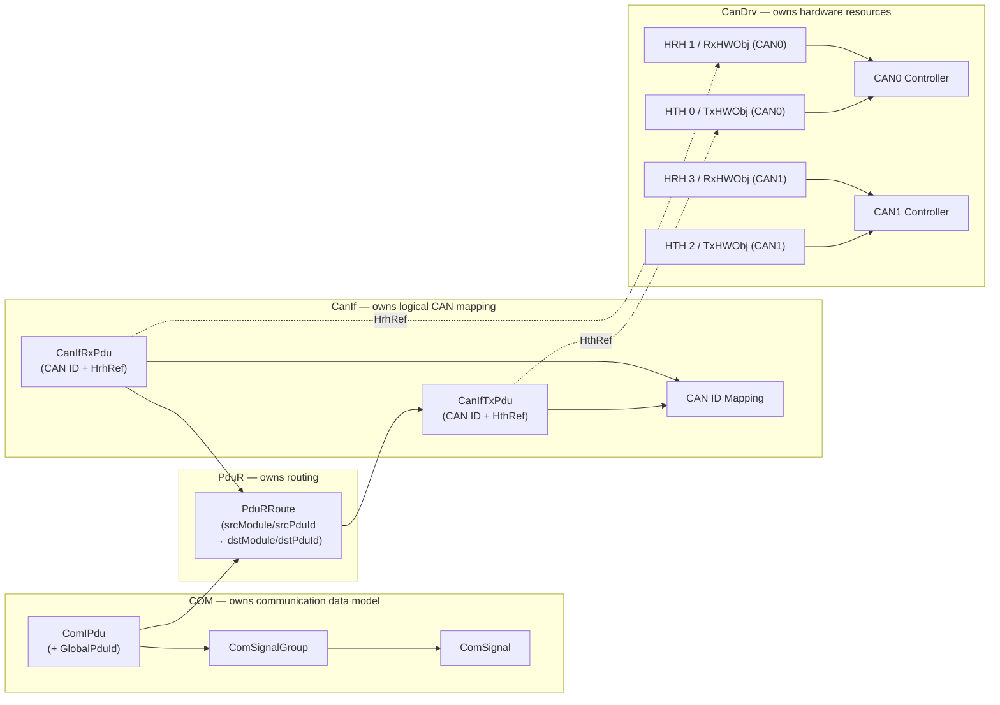
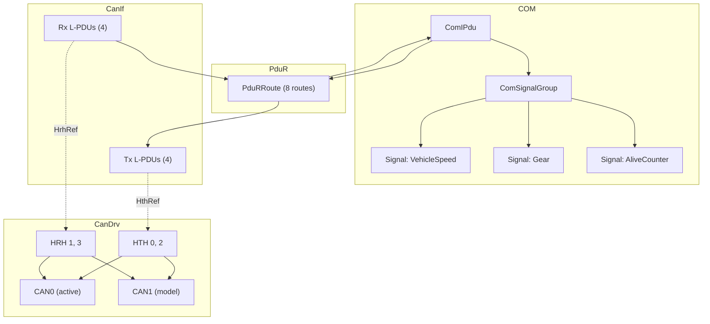
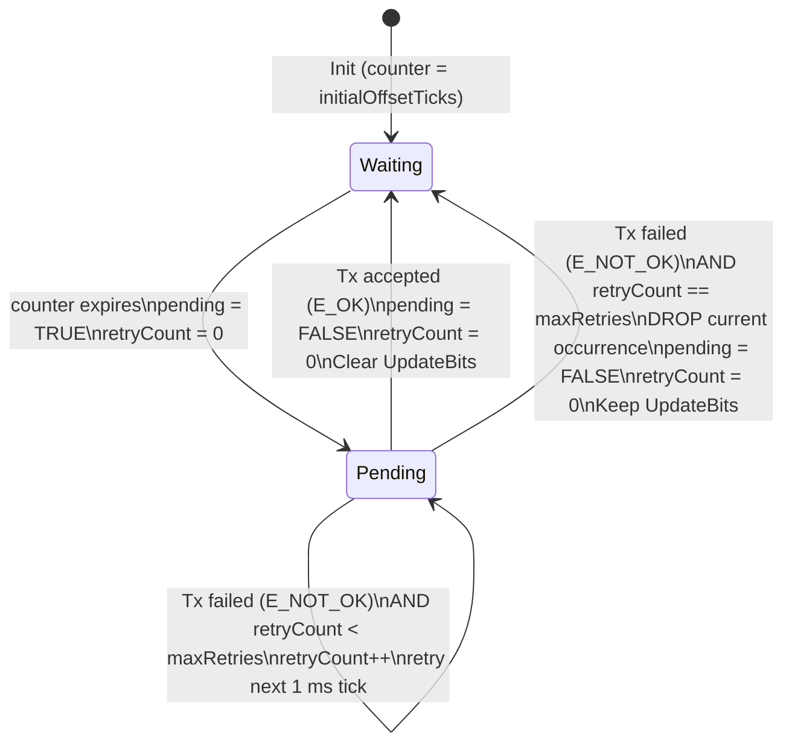
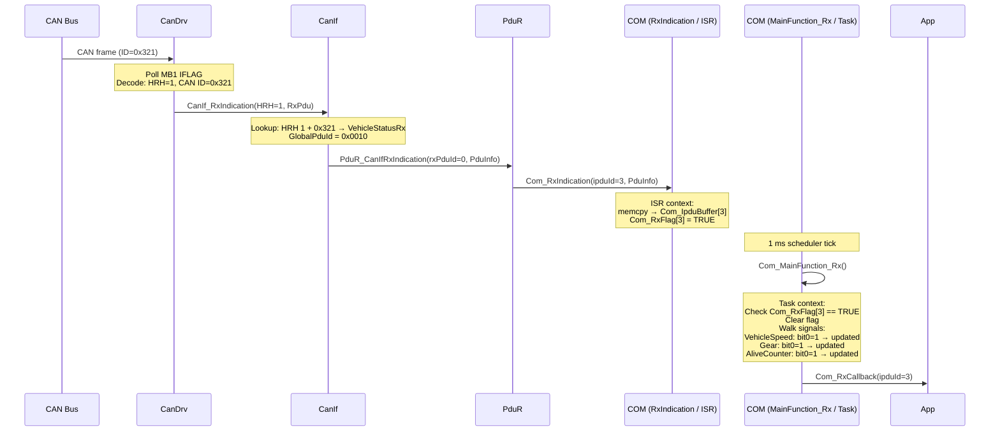
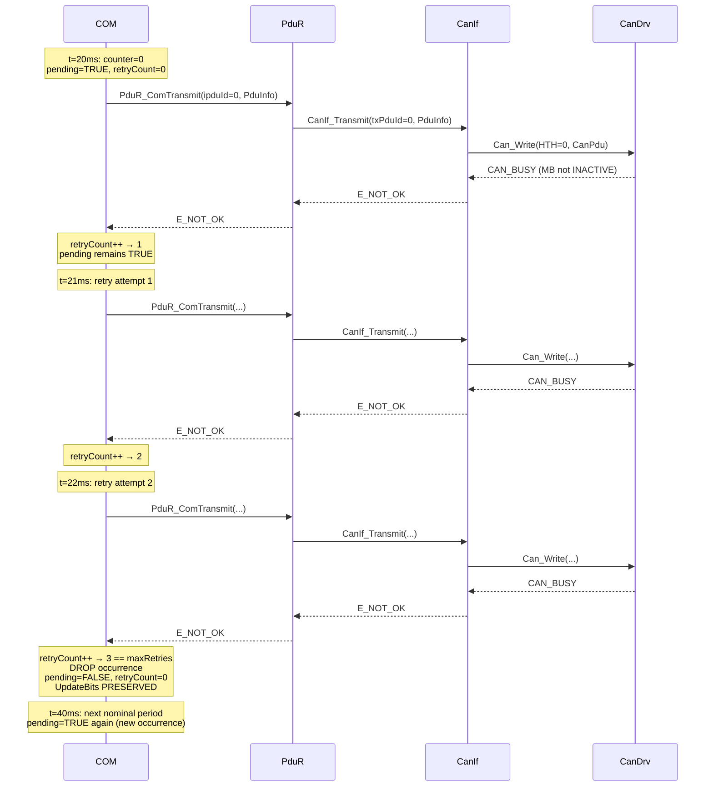

# Part 1 — Required Deliverables

Tài liệu này trình bày đầy đủ **19 deliverables** theo §38 của `assignment_part1_com_signal.md`.

---

## Deliverable 1 — Signal Model

Mỗi Signal là một **update unit** được mã hoá trong một Signal Slot byte-aligned.

| SignalId | Name | DataType | SlotStartBit | SlotLength | PayloadBits | Group |
|---|---|---|---|---|---|---|
| 0 | VehicleSpeed | uint16 | 0 | 16 | 15 | VehicleStatusTx |
| 1 | Gear | uint8 | 16 | 8 | 7 | VehicleStatusTx |
| 2 | AliveCounter | uint8 | 24 | 8 | 7 | VehicleStatusTx |
| 3 | EngineRPM | uint16 | 0 | 16 | 15 | EngineStatusTx |
| 4 | EngineTemp | uint8 | 16 | 8 | 7 | EngineStatusTx |
| 5 | ThrottlePos | uint8 | 24 | 8 | 7 | EngineStatusTx |
| 6 | DoorState | uint8 | 0 | 8 | 7 | BodyStatusTx |
| 7 | LightState | uint8 | 8 | 8 | 7 | BodyStatusTx |

---

## Deliverable 2 — Signal Slot Model

```text
bit N-1                          bit 1  bit 0
┌────────────────────────────────────┬───┐
│          Signal Payload            │ U │
└────────────────────────────────────┴───┘
                                       ↑
                                    UpdateBit (LSB)
```

Encoding / Decoding:

```text
Encode:  EncodedSignal = (Payload << 1) | 1
Decode:  UpdateBit     = EncodedSignal & 1
         Payload       = EncodedSignal >> 1
```

| SlotLength | PayloadBits | UpdateBit | Example (VehicleSpeed=0x1234) |
|---|---|---|---|
| 8 bit | 7 bit | bit 0 | — |
| 16 bit | 15 bit | bit 0 | Encoded = 0x2469, LE: [0x69, 0x24] |
| 24 bit | 23 bit | bit 0 | — |
| 32 bit | 31 bit | bit 0 | — |

Slot placement constraints:

```text
SlotStartBit % 8 == 0   (byte-aligned start)
SlotLength   % 8 == 0   (whole bytes)
SlotLength   >= 8       (minimum 1 byte)
(SlotStartBit + SlotLength) <= 64   (fit inside 8-byte I-PDU)
Signal value <= 2^(SlotLength-1) - 1  (fit in payload bits)
```

---

## Deliverable 3 — Signal Group Model

```text
Signal Group = GROUPING / PACKING UNIT
```

| GroupId | Name | Signals | I-PDU |
|---|---|---|---|
| 0 | VehicleStatusTx | VehicleSpeed, Gear, AliveCounter | VehicleStatusPdu (TX) |
| 1 | EngineStatusTx | EngineRPM, EngineTemp, ThrottlePos | EngineStatusPdu (TX) |
| 2 | BodyStatusTx | DoorState, LightState | BodyStatusPdu (TX) |
| 3 | VehicleStatusRx | RxVehicleSpeed, RxGear, RxAliveCounter | VehicleStatusPdu (RX) |
| 4 | EngineStatusRx | RxEngineRPM, RxEngineTemp, RxThrottlePos | EngineStatusPdu (RX) |
| 5 | BodyStatusRx | RxDoorState, RxLightState | BodyStatusPdu (RX) |

Rules:
- One Signal belongs to exactly one Signal Group.
- One Signal Group belongs to exactly one I-PDU.
- A Signal Group shall not be empty.

---

## Deliverable 4 — I-PDU Model including GlobalPduId

```text
I-PDU = SCHEDULING / TRANSMISSION UNIT
```

| IPduId | Name | GlobalPduId | Dir | Period (ticks) | Offset (ticks) | MaxRetries | Length |
|---|---|---|---|---|---|---|---|
| 0 | VehicleStatusPdu | 0x0010 | TX | 20 | 1 | 3 | 4 B |
| 1 | EngineStatusPdu | 0x0011 | TX | 20 | 3 | 3 | 4 B |
| 2 | BodyStatusPdu | 0x0012 | TX | 30 | 5 | 3 | 2 B |
| 3 | VehicleStatusPdu | 0x0010 | RX | — | — | — | 4 B |
| 4 | EngineStatusPdu | 0x0011 | RX | — | — | — | 4 B |
| 5 | BodyStatusPdu | 0x0012 | RX | — | — | — | 2 B |

`GlobalPduId` = system-wide canonical identity. It is **not** a module-local handle.

---

## Deliverable 5 — Direct CAN Binding Map

```text
Mandatory rule: 1 GlobalPduId ↔ 1 CanIf L-PDU ↔ 1 CAN ID
```

| GlobalPduId | CanIf TxPduId | CAN ID (Tx) | CanIf RxPduId | CAN ID (Rx) | HOH (Tx/Rx) |
|---|---|---|---|---|---|
| 0x0010 | 0 | 0x321 | 0 | 0x321 | HTH 0 / HRH 1 |
| 0x0011 | 1 | 0x322 | 1 | 0x322 | HTH 0 / HRH 1 |
| 0x0012 | 2 | 0x323 | 2 | 0x323 | HTH 0 / HRH 1 |

Because the mapping is 1-to-1, `GlobalPduId` is **implicit on the CAN wire** and consumes **zero** payload bytes. The CAN ID alone identifies the logical message.

---

## Deliverable 6 — Period, Initial Offset, and max_retries Configuration

| I-PDU | Period | Initial Offset | max_retries | Total max attempts |
|---|---|---|---|---|
| VehicleStatusPdu (TX) | 20 ms | 1 ms | 3 | 4 (1 initial + 3 retries) |
| EngineStatusPdu (TX) | 20 ms | 3 ms | 3 | 4 |
| BodyStatusPdu (TX) | 30 ms | 5 ms | 3 | 4 |

`Com_MainFunctionTx()` period = **1 ms** (base tick).

Initial offsets stagger the first transmissions to avoid simultaneous bus load bursts.

---

## Deliverable 7 — COM Tx Runtime State Model

```c
/* Per Tx I-PDU runtime state (Com.c) */
uint16  Com_TimerTicks[MAX_IPDUS];   /* ticks until next nominal occurrence */
boolean Com_IsPending[MAX_IPDUS];    /* this PDU has a pending Tx request   */
uint8   Com_RetryCount[MAX_IPDUS];   /* retry attempts consumed so far      */
```

Initialisation:

```text
counter    = initialOffsetTicks
pending    = FALSE
retryCount = 0
```

State transitions (see Deliverable 15 for state diagram):

```text
On counter == 0 AND pending == FALSE  → pending = TRUE,  retryCount = 0
On counter == 0 AND pending == TRUE   → pending unchanged (Latest Value Wins)
On Tx E_OK                            → pending = FALSE, retryCount = 0, clear UpdateBits
On Tx E_NOT_OK AND retryCount < max   → retryCount++,   pending = TRUE
On Tx E_NOT_OK AND retryCount == max  → pending = FALSE, retryCount = 0 (DROP), keep UpdateBits
```

`max_retries` is a configuration constant, not runtime state.
Initial attempt is NOT counted as a retry.
`max_retries = 3` → 1 initial + 3 retries = **4 total attempts**.

---

## Deliverable 8 — PduR Route Model

```yaml
PduR routes (PduR_Cfg.c — 8 routes total):

  TX routes (COM → CanIf):
    Route 0: globalPduId=0x0010  srcModule=COM    srcPduId=0  dstModule=CANIF  dstPduId=0
    Route 1: globalPduId=0x0011  srcModule=COM    srcPduId=1  dstModule=CANIF  dstPduId=1
    Route 2: globalPduId=0x0012  srcModule=COM    srcPduId=2  dstModule=CANIF  dstPduId=2

  RX routes (CanIf → COM):
    Route 3: globalPduId=0x0010  srcModule=CANIF  srcPduId=0  dstModule=COM    dstPduId=3
    Route 4: globalPduId=0x0011  srcModule=CANIF  srcPduId=1  dstModule=COM    dstPduId=4
    Route 5: globalPduId=0x0012  srcModule=CANIF  srcPduId=2  dstModule=COM    dstPduId=5

  CanTP routes:
    Route 6: globalPduId=0x0730  srcModule=CANTP  srcPduId=3  dstModule=CANIF  dstPduId=3  (CanTP Tx)
    Route 7: globalPduId=0x0730  srcModule=CANIF  srcPduId=3  dstModule=CANTP  dstPduId=3  (CanTP Rx)
```

PduR uses **local handle routing** only. It does NOT inspect payload, Signal data, Update Bits, HTH, HRH, or CAN Controller information.

---

## Deliverable 9 — CanIf Tx L-PDU Model

```yaml
canif_tx_pdus:
  - name: VehicleStatusTx  id: 0  can_id: 0x321  hth_ref: HTH_0  global_pdu_id: 0x0010  dlc: 8
  - name: EngineStatusTx   id: 1  can_id: 0x322  hth_ref: HTH_0  global_pdu_id: 0x0011  dlc: 8
  - name: BodyStatusTx     id: 2  can_id: 0x323  hth_ref: HTH_0  global_pdu_id: 0x0012  dlc: 8
  - name: CanTpTx          id: 3  can_id: 0x730  hth_ref: HTH_0  global_pdu_id: 0x0730  dlc: 8
```

Tx resolution:

```text
TxPduId  →  CAN ID + HTH  →  Can_Write(HTH, CanPdu)
```

CanIf owns the CAN ID mapping. CanIf references HTH but does NOT own it (CanDrv owns HTH).

---

## Deliverable 10 — CanIf Rx L-PDU Model

```yaml
canif_rx_pdus:
  - name: VehicleStatusRx  id: 0  can_id: 0x321  hrh_ref: HRH_1  global_pdu_id: 0x0010  upper_pdu_id: 3
  - name: EngineStatusRx   id: 1  can_id: 0x322  hrh_ref: HRH_1  global_pdu_id: 0x0011  upper_pdu_id: 4
  - name: BodyStatusRx     id: 2  can_id: 0x323  hrh_ref: HRH_1  global_pdu_id: 0x0012  upper_pdu_id: 5
  - name: CanTpRx          id: 3  can_id: 0x731  hrh_ref: HRH_1  global_pdu_id: 0x0730  upper_pdu_id: 3
```

Rx lookup key:

```text
HRH + CAN ID  →  Rx L-PDU  →  GlobalPduId (traceable, not serialised on wire)
```

Example: HRH 1 + CAN ID 0x321 → VehicleStatusRx → GlobalPduId 0x0010.

---

## Deliverable 11 — CanDrv Hardware Object Model

```yaml
can_hw_objects:
  - name: HthCan0Tx   hohId: 0  type: transmit  controller: CAN0  mb: 0
  - name: HrhCan0Rx   hohId: 1  type: receive   controller: CAN0  mb: 1
  - name: HthCan1Tx   hohId: 2  type: transmit  controller: CAN1  mb: 0  # model only
  - name: HrhCan1Rx   hohId: 3  type: receive   controller: CAN1  mb: 1  # model only
```

Lookup:

```text
HTH → CanHardwareObject → Controller → physical Tx resource
HRH → CanHardwareObject → Controller → physical Rx resource
```

HOH IDs are unique within the CanDrv instance — HOH alone is sufficient to identify the Controller. No separate `ControllerId` parameter is needed in the training Tx or Rx API.

---

## Deliverable 12 — Multiple Controller Model

```text
CanDrv (S32K144)
│
├── CAN0  (active — physically wired on EVB)
│   ├── HTH 0  →  MB 0  (Tx)
│   └── HRH 1  →  MB 1  (Rx, BasicCAN, mask = 0 / accept-all)
│
└── CAN1  (config model — not initialised at runtime on this target)
    ├── HTH 2  →  MB 0  (Tx)  ← declared in Can_Cfg.c for model completeness
    └── HRH 3  →  MB 1  (Rx)  ← declared in Can_Cfg.c for model completeness
```

Key property: HOH IDs 0–3 are unique across the entire CanDrv instance. Therefore:

```text
HOH  →  unique CanHardwareObject  →  unique Controller
```

is always resolvable without a separate `ControllerId` argument.

`Can_Write(HTH=2, ...)` returns `CAN_NOT_OK` with a trace warning because CAN1 is not initialised on this hardware target.

---

## Deliverable 13 — Configuration Ownership View



> **Rule**: A module may *reference* an object owned by another module but does not *own* it.
> CanIf references HTH/HRH — CanDrv owns them.

---

## Deliverable 14 — Building Block View



---

## Deliverable 15 — Tx Dynamic Behavior View (State Diagram)



Key policies:
- **Early Retry**: retry at next `Com_MainFunctionTx()` tick (not next period)
- **Non-blocking**: BUSY on PDU_0 does not block PDU_1 or PDU_2
- **No Schedule Drift**: `counter = periodTicks` reloads unconditionally
- **Latest Value Wins**: second period expiry while pending → keep pending, no queue
- **Drop = drop one occurrence, not the I-PDU**

---

## Deliverable 16 — Rx Runtime View (Sequence Diagram)



---

## Deliverable 17 — CAN_BUSY Bounded Retry and Drop Behavior



---

## Deliverable 18 — End-to-End Tx/Rx Trace View using GlobalPduId

### Tx Trace — VehicleSpeed = 100 km/h

```text
[APP]     Com_SendSignal(signalId=0, value=100)
          → Encode: (100 << 1) | 1 = 0xC9
          → Com_IpduBuffer[0][0] = 0xC9 (LE byte 0)
          → Com_IpduBuffer[0][1] = 0x00 (LE byte 1)

[COM]     t=21ms: Com_MainFunctionTx()
          IPduId=0, GlobalPduId=0x0010, pending=TRUE
          [COM] TX gpdu=0010 ok

[PduR]    PduR_ComTransmit(srcPduId=0)
          Route: GlobalPduId=0x0010, COM → CANIF, dstPduId=0
          [PduR] fwd TX 0x0010

[CanIf]   CanIf_Transmit(txPduId=0)
          TxPduId=0 → CAN ID=0x321, HTH=0, DLC=8
          [CanIf] TX id=321 hth=0

[CanDrv]  Can_Write(HTH=0, CanPdu{id=0x321, len=8, sdu=[0xC9,0x00,0x00,0x00,0x00,0x00,0x00,0x00]})
          MB0 CODE → 0xC (TX DATA)
          → CAN frame transmitted on bus

[COM]     pending=FALSE, UpdateBits cleared
          Com_IpduBuffer[0][0] = 0xC8  (payload intact, bit0 cleared)
```

### Rx Trace — CAN frame arrives ID=0x321

```text
[CanDrv]  Can_MainFunction_Read(): IFLAG1 bit 1 set
          MB1 read: id_reg=0x321, DLC=8, data=[0xC9,0x00,0x00,0x00,...]
          TIMER read → MB1 unlocked, CODE → EMPTY (re-arm)
          CanIf_RxIndication(HRH=1, RxPdu{id=0x321, len=8})

[CanIf]   CanIf_RxIndication: lookup HRH=1 + 0x321 → VehicleStatusRx (rxPduId=0)
          GlobalPduId=0x0010  (traceable, not on wire)
          [CanIf] RX id=321 hrh=1
          PduR_CanIfRxIndication(rxPduId=0, PduInfo)

[PduR]    PduR_CanIfRxIndication: srcModule=CANIF, srcPduId=0
          Route: GlobalPduId=0x0010, dstPduId=3
          [PduR] fwd RX 0x0010
          Com_RxIndication(ipduId=3, PduInfo)

[COM/ISR] Com_RxIndication(ipduId=3):
          memcpy → Com_IpduBuffer[3] = [0xC9, 0x00, ...]
          Com_RxFlag[3] = TRUE
          [COM] RxInd pdu=3 len=8 flag set

[COM/Task] Com_MainFunction_Rx() — next 1ms tick:
          RxFlag[3] == TRUE → clear flag
          Signal VehicleSpeed (slot 0-15, LE):
            encoded = 0x00C9, UpdateBit = 0xC9 & 1 = 1 → NEW DATA
            payload = 0x00C9 >> 1 = 0x0064 = 100
          Signal Gear (slot 16-23): UpdateBit check...
          Com_RxCallback(ipduId=3) → App notified
```

### Cross-layer trace correlation table

| Layer | Handle used | GlobalPduId |
|---|---|---|
| COM | IPduId = 0 (TX) / 3 (RX) | 0x0010 |
| PduR | srcPduId = 0 (COM→), dstPduId = 0 (→CanIf) | 0x0010 |
| CanIf | TxPduId = 0 / RxPduId = 0 | 0x0010 |
| CanDrv | HTH = 0 (Tx) / HRH = 1 (Rx) | 0x0010 (via config) |
| CAN wire | CAN ID = 0x321 | **implicit** (not serialised) |

---

## Deliverable 19 — Validation Report

`Com_ValidateConfig()` runs at startup (called in `App_Init()` or can be called manually).

### Rules checked

| Rule | Check | Status |
|---|---|---|
| SlotStartBit % 8 == 0 | All 16 signals | ✅ PASS |
| SlotLength % 8 == 0 | All 16 signals | ✅ PASS |
| SlotLength >= 8 | All 16 signals | ✅ PASS |
| Slot within PDU (≤64 bits) | All 16 signals | ✅ PASS |
| DataType fits PayloadBits | uint8↔7b, uint16↔15b | ✅ PASS |
| No slot overlap within group | All 6 groups | ✅ PASS |
| Signal Group non-empty | All 6 groups | ✅ PASS |
| Tx I-PDU period > 0 | 3 Tx PDUs | ✅ PASS |
| GlobalPduId unique (Tx) | 0x0010, 0x0011, 0x0012 | ✅ PASS |

### Validation output (trace log at startup)

```text
[SYS] Platform init complete
[SYS] BSW init complete
[APP] Com_ValidateConfig() → E_OK
```

### HOH namespace validation (manual)

```text
HOH 0: type=TRANSMIT, controllerId=0  → CAN0 Tx ✅
HOH 1: type=RECEIVE,  controllerId=0  → CAN0 Rx ✅
HOH 2: type=TRANSMIT, controllerId=1  → CAN1 Tx ✅ (model only)
HOH 3: type=RECEIVE,  controllerId=1  → CAN1 Rx ✅ (model only)
All HOH IDs unique within CanDrv instance: ✅
HTH and HRH share one ID namespace (0–3): ✅
```

### Direct CAN Binding validation (manual)

```text
GlobalPduId 0x0010 ↔ CanIfTxPdu[0] ↔ CAN ID 0x321 : 1-to-1 ✅
GlobalPduId 0x0011 ↔ CanIfTxPdu[1] ↔ CAN ID 0x322 : 1-to-1 ✅
GlobalPduId 0x0012 ↔ CanIfTxPdu[2] ↔ CAN ID 0x323 : 1-to-1 ✅
GlobalPduId not serialised into CAN payload         : ✅
```

---

## Summary — Assignment §38 Checklist

| # | Deliverable | Location |
|---|---|---|
| 1 | Signal model | §D1 above + `Com_Cfg.c` |
| 2 | Signal Slot model | §D2 above + `Com.c:pack_signal()` |
| 3 | Signal Group model | §D3 above + `Com_Cfg.c` |
| 4 | I-PDU model + GlobalPduId | §D4 above + `Com_Cfg.c` |
| 5 | Direct CAN Binding map | §D5 above + `CanIf_Cfg.c` |
| 6 | Period / Offset / max_retries config | §D6 above + `Com_Cfg.c` |
| 7 | COM Tx runtime state + retry_count | §D7 above + `Com.c` |
| 8 | PduR route model | §D8 above + `PduR_Cfg.c` |
| 9 | CanIf Tx L-PDU model | §D9 above + `CanIf_Cfg.c` |
| 10 | CanIf Rx L-PDU model | §D10 above + `CanIf_Cfg.c` |
| 11 | CanDrv Hardware Object model | §D11 above + `Can_Cfg.c` |
| 12 | Multiple Controller model | §D12 above + `Can_Cfg.c` (`CAN_NUM_CONTROLLERS=2`) |
| 13 | Configuration Ownership View | §D13 above (Mermaid) |
| 14 | Building Block View | §D14 above (Mermaid) |
| 15 | Tx Dynamic Behavior View | §D15 above (stateDiagram) |
| 16 | Rx Runtime View | §D16 above (sequenceDiagram) |
| 17 | CAN_BUSY bounded retry & drop | §D17 above (sequenceDiagram) |
| 18 | End-to-End Tx/Rx Trace View | §D18 above |
| 19 | Validation report | §D19 above |
